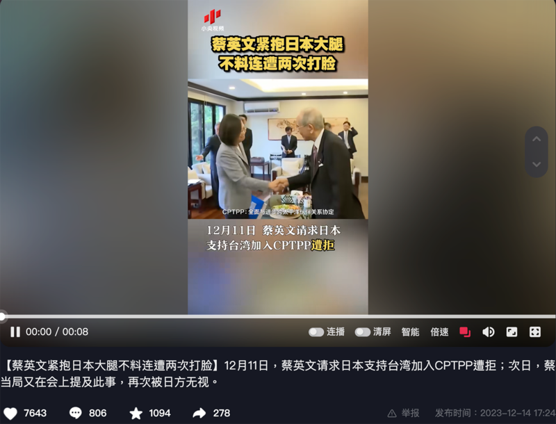
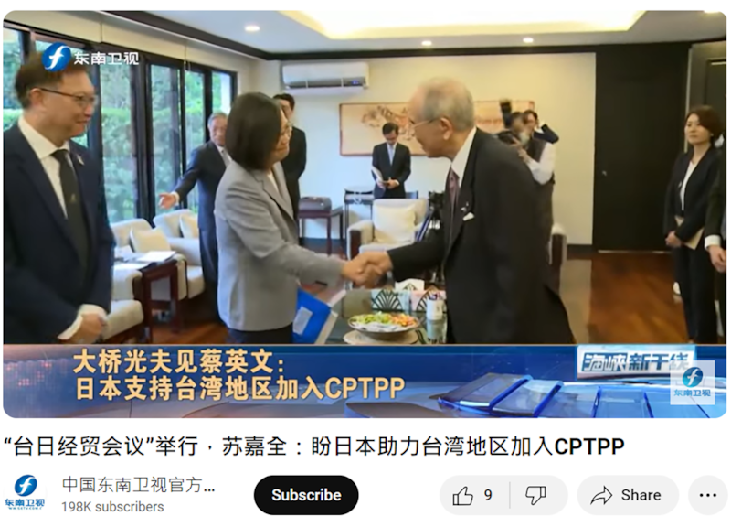

# 事實查覈｜蔡英文請求日本支持臺灣加入CPTPP，結果“遭拒”？

作者：莊敬

2023.12.29 12:39 EST

## 標籤：錯誤

## 一分鐘完讀：

央視網旗下“小央視頻”近日在抖音發佈一則短視頻，稱“蔡英文請求日本支持臺灣加入CPTPP遭拒”，視頻的畫面內容是12月11日臺灣總統蔡英文接見日本臺灣交流協會會長大橋光夫的場景。

據臺灣總統府消息及多家媒體報道，大橋光夫當時表示，日本向來主張支持臺灣加入CPTPP（跨太平洋夥伴全面進步協定）。“小央視頻”傳播了錯誤內容。

## 深度分析：

“小央視頻”在抖音上發佈短視頻，稱”蔡英文請求日本支持臺灣加入CPTPP遭拒”。圖取自抖音

央視網旗下 ["小央視頻"](https://www.douyin.com/video/7312378757539532068)12月14日在抖音發佈一段8秒的短視頻,字幕寫着:"12月11日,蔡英文請求日本支持臺灣加入CPTPP遭拒",畫面則是蔡英文接見日本臺灣交流協會會長大橋光夫的場景。

根據臺灣總統府發佈的 [公告](https://www.president.gov.tw/News/28107#c),蔡英文在會中表示,"日本是CPTPP具領導地位的重要成員國,希望繼續給予臺灣支持和協助。"大橋光夫則說:"日本向來主張支持臺灣加入CPTPP,但CPTPP入會條件爲共識決,或許還需要一些時間,期盼臺灣在不久的將來能有機會加入CPTPP。"

知情人士向亞洲事實查覈實驗室表示，會中蔡英文與大橋光夫的對話就如臺灣總統府公告所寫，“小央視頻”的內容不符事實。日本臺灣交流協會則對此不予評論。

事實上,如果考察過去的公開發言,日本官員多次表態歡迎臺灣加入CPTPP,比如日本新任駐臺代表片山和之12月14日在 [就任茶會上](https://www.koryu.or.jp/tw/about/taipei/chief-representative/katayama/activity-report/20231214/)說:"臺灣對日本而言是極爲重要的經濟夥伴。日本政府歡迎臺灣申請加入CPTPP,在這個方面,我們要繼續合作。"臺灣在2021年9月22日正式申請加入CPTPP後,時任 [日本外務大臣茂木敏充](https://facebook.com/JapanTaiwanExchangeAssociation/posts/4315827725171554?ref=embed_post)也表達歡迎。

CPTPP原爲“跨太平洋夥伴協定”（TPP），談判成員國包括美國、日本、加拿大、澳洲、新加坡等12國。美國前總統特朗普2017年宣佈退出TPP後，在日本積極推動之下，TPP原本的11個成員國同意改名爲CPTPP，並於2018年底生效。2021年起，英國、中國、臺灣、厄瓜多等經濟體陸續遞件申入，CPTPP入會採“共識決”，目前僅英國獲准加入，其它申請案尚待審查。

亞洲事實查覈實驗室注意到,對於蔡英文會見大橋光夫,幾家中國媒體都在網上發佈了視頻或文字報道,但內容有所不同。 [《中評社》](https://archive.ph/goolS)12月11日報道標題爲"蔡英文會見大橋光夫:日挺臺入CPTPP",而 [《東南衛視》](https://www.youtube.com/watch?v=EMg_6nSX3qo)12月14日的報道中,就有一段字幕寫着"大橋光夫見蔡英文:日本支持臺灣地區加入CPTPP"。

《東南衛視》報道中，字幕寫着“日本支持臺灣地區加入CPTPP”。圖取自YouTube

*亞洲事實查覈實驗室(Asia Fact Check Lab)針對當今複雜媒體環境以及新興傳播生態而成立。我們本於新聞專業主義,提供專業查覈報告及與信息環境相關的傳播觀察、深度報導,幫助讀者對公共議題獲得多元而全面的認識。讀者若對任何媒體及社交平臺傳播的信息有疑問,歡迎以電郵*  [*afcl@rfa.org*](mailto:afcl@rfa.org)  *寄給亞洲事實查覈實驗室,由我們爲您查證覈實。*

*亞洲事實查覈實驗室在X、臉書、IG開張了,歡迎讀者追蹤、分享、轉發。X這邊請進:中文*  [*@asiafactcheckcn*](https://twitter.com/asiafactcheckcn)  *;英文:*  [*@AFCL\_eng*](https://twitter.com/AFCL_eng)  *、*  [*FB在這裏*](https://www.facebook.com/asiafactchecklabcn)  *、*  [*IG也別忘了*](https://www.instagram.com/asiafactchecklab/)  *。*

[Original Source](https://www.rfa.org/mandarin/shishi-hecha/hc-12292023123634.html)