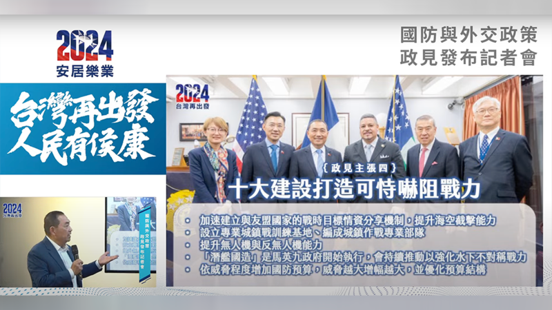

# 事實快查｜臺灣副總統候選人辨論會 這些議題需要查覈

莊敬、董喆、艾倫，發自臺北

2024.01.01 11:27 EST

2024年臺灣總統大選的副總統候選人辯論會於1月1日舉行，民進黨候選人蕭美琴、民衆黨候選人吳欣盈、國民黨候選人趙少康正面交鋒，但部分說法與事實有所出入。

亞洲事實查覈實驗室審視並查覈三位副總統候選人的發言,整理其中涉及錯誤或誤導的內容。文中標註的時間是根據公視 [Youtube頻道](https://www.youtube.com/watch?v=hCL5lyMVFJ8)。

1. 國際組織,臺灣"沒有一個進得去"?馬英九執政時,一個邦交國都沒斷?

趙少康：“（民進黨執政八年）任何的國際組織我們參加了嗎？WHA（世界衛生大會）觀察員當不了，國際氣象組織，國際刑警組織，國際的環保組織，沒有一個組織進得去的。”（ 35’18”）

“馬英九執政的時候120幾個免籤國，包括美國。一個邦交國都沒有丟。”（36’36”）

趙少康的說法有誤。

臺灣的國際參與受限,但並非沒有參加任何國際組織,或所謂"沒有一個組織進得去"。根據臺灣外交部資料,臺灣 [參與政府間的國際組織、多邊機制及其下屬機構](https://subsite.mofa.gov.tw/igo/cp.aspx?n=5955),在部分組織中具 [正式會員](https://subsite.mofa.gov.tw/igo/News.aspx?n=5956&sms=1615)身分。

臺灣前總統馬英九任內, [甘比亞在2013年11月14日片面與臺灣終止外交關係](https://www.mofa.gov.tw/News_Content.aspx?n=95&s=66918),馬政府對於甘比亞的決定表示遺憾。此外,馬英九 [2016年5月](https://www.president.gov.tw/NEWS/20404)卸任前,談論外交工作的成績,當時他說,"目前給予我國免簽證與落地簽證的國家(地區)大幅增加,從上任前民國96年的54個擴增到目前的164個,增加了110個,是過去的3倍以上。"

臺灣的外交部已發佈 [聲明](https://www.mofa.gov.tw/News_Content.aspx?n=97&s=116269)澄清。

1. 巷戰、城鎮戰,兩黨都有相似政策

趙少康：“民進黨今天的政策是打巷戰、登陸戰，那臺灣就完了。你可以讓臺灣打巷戰嗎？我們年輕人願意打巷戰嗎？”(40’52”)“

你知道我們的志願役編制是多少嗎？21萬人。(其中)15萬應該是主戰部隊。結果卻是有史以來最低，我們現在編制只有15萬5000人，主戰且真的能夠拿槍打仗的7萬人，後備的都是滿編，主戰的不滿編，這些人將來怎麼打仗啊？你給他再好的武器，他怎麼去打？”(41’28”)

趙少康的發言與國民黨本身政策矛盾；提供數字語義不清。

首先,趙少康稱"民進黨今天的政策是打巷戰、登陸戰"。但根據侯友宜在2023年12月11日發佈的 [國防政策](https://www.youtube.com/watch?v=eXRnmoczjK0),其中明確提到"設立專業城鎮戰訓練基地,編成專業城鎮戰部隊。"因此國民黨也有類似主張。

國民黨政見中也主張”設立專業城鎮戰訓練基地，編成專業城鎮戰部隊”。(本圖截取自國民黨政見發表會視頻)

其次,趙查覈少康所列舉的國軍編裝數字,語義不清。根據國防部發布的資訊,目前國軍編制人員爲21萬5千人。但根據2024年 [國防預算](https://www.mnd.gov.tw/Publish.aspx?p=75692&title=%E5%9C%8B%E9%98%B2%E6%B6%88%E6%81%AF&SelectStyle=%E6%96%B0%E8%81%9E%E7%A8%BF),國軍現有人員包含軍官、士官、士兵、學生及文職人員,約17萬餘人。因此趙少康所稱"現在編制只有15萬5000人"可能較接近是"現有人數"而不是"編制人數"。至於"真的能夠拿槍打仗的7萬人"一句,則不明白趙少康的明確定義,難以查覈。

1. "五月天事件"是假新聞?

趙少康：“周子瑜事件、王立強事件，這次又搬出個五月天來，明明是個假新聞。透過外媒，外銷轉內銷。...... 因爲我後來去查，大陸的文旅部才管歌手，廣電局是管演員的，他消息都錯的。我們的國安單位連大陸怎麼分工、怎麼組織都搞不清楚。”（2’03’’06）

趙少康的說法查無根據。中國政府分工是不是"文旅部管歌手,廣電局管演員?"根據 [中國國家廣播電視總局(簡稱廣電總局)](https://www.nrta.gov.cn/col/col2013/index.html)職責規範第三條第一項明確寫出"貫徹黨的宣傳方針政策,擬訂廣播電視、網絡視聽節目服務管理的政策措施,加強廣播電視陣地管理,把握正確的輿論導向和創作導向",可見廣播電視、視聽節目皆在廣電總局的職責範圍內。

[中國文化和旅遊部(簡稱文旅部](https://www.mct.gov.cn/gywhb/zyzz/201705/t20170502_493564.htm))的職責規範第三點指出"管理全國性重大文化活動",且根據文旅部打擊黃牛的 [相關公文](https://zwgk.mct.gov.cn/zfxxgkml/scgl/202309/t20230912_947197.html),可知文化事業如演唱會則歸文旅部管轄。上述單位並未明確以"歌手"和"演員"進行職責分類,而是根據業務分工。

趙少康稱文旅部管歌手、廣電局管演員，並因此斷定五月天事件爲假新聞，沒有事實根據。另外，在路透社原文中提到，兩名臺灣的國安官員根據情報指出，五月天事件是由中共中央宣傳部主導，而不是趙所稱的廣電總局或文旅部等政府機構。

1. 吳欣盈對於政府向跨國企業徵稅的主張是什麼?

吳欣盈：“還有全世界的最低稅收，我剛剛演講有提到（申論時提到的接軌國際最低稅負制），我們的稅收是12％，如果拉到15%的話呢，爲什麼這馬上就可以做呢？ 因爲這3%如果不扣的話，這個錢出到國外還是會被扣稅，倒不如把這3%留在臺灣，做一些投資。”(50’19”)

吳欣盈原說法語義不清。

經查，這段談話極可能是指於2021年，全球超過130個國家協議調整各國對跨國企業課稅權利的劃分方式，規定無論企業計算利潤的地點在哪裏，稅率都不應低於15％。吳欣盈在申論時提到這一部分，在提問環節中再次說明這臺灣應該接軌。但這部分屬於吳欣盈個人政見主張，無涉事實對錯。

1. 重覆出現的錯誤

吳欣盈：

“我剛剛講到的個資法，前世界五十幾個民主國家都採用這個個資法，當我們民衆黨執政的時候，我們可以用個資法，全世界接軌。”(50’02’’)

吳欣盈此處提到的個資法,爲其在申論環節中提到主張引進的"GDPR個資法"。當中提到的50幾個民主國家採用GDPR是錯誤解讀,先前我們 [已發佈查覈報告](https://www.rfa.org/cantonese/news/factcheck/tw-12222023173906.html)。

GDPR適用於歐盟的27個成員國，也適用於歐洲經濟區內的非歐盟國家，包含冰島、挪威、列支敦士登，並不達50幾個。

6. 趙少康談核能機組，及美國和其他國家處置核廢料的方式

趙：「你知道核一廠原來裏面可以做四部機組，現在只做兩部嗎？你知道核二廠原來可以做四部機組，現在只放兩部嗎？你知道核三廠可以放四部機組，現在只做兩部嗎？你知道核四廠裏面可以放八部機組，現在只放兩部嗎？你完全不知道嘛。」(1:16')

趙：「核廢料放哪裏？美國，你最尊敬的美國怎麼處理我們就怎麼處理嘛。美國放哪裏我們就放哪裏嘛。美國現在地下掩埋嘛，挖深以後把它強固起來，我們就這樣做嘛。」(1:17')

根據臺灣電力公司的核電廠基本資料，核一、核二、核三、核四目前確實都各有兩座機組，但是否原先都能容納四部，以及核四八部機組，亞洲事實查覈實驗室向臺電求證。

臺電發言人蔡志孟告訴亞洲事實查覈實驗室，核一、二、三廠於40年前建廠時，的確保留可再擴充機組的空間，當時假定40年的科技進步至可以將高階用過核燃料和低階核廢料移出廠外妥善處置。惟40年來高低階核廢料仍需留置廠內，即使核一、二廠除役後，仍需佔用原機組擴充空間新建貯存倉庫，在廢料未能妥善處置前，實無法再擴充機組。

核三廠也會蓋乾式貯存設施，最終才能將用過燃料池內的用過燃料完全清出。但因爲核三廠用過燃料池空間夠，足以容納核三廠反應爐燃料退出更換直到除役。因此幹貯設施的建置，不像核一廠與核二廠那麼急切。

另核四廠原保留擴充機組的空間目前均爲山坡地，且地質新事證調查顯示均有斷層穿越保留地底下，已不適合再興建機組。

美國非營利核電產業組織「核能協會」（Nuclear Energy Institute）說明，美國核廢料主要是使用「先溼後幹」貯存。燃料棒退出爐心後，會先放置在40呎深冷卻池中，貯存約5年後，再放入內殼以不鏽鋼打造、外層再以水泥密封的「乾式貯存護箱」。

趙少康針對美國處理核廢料的方式雖然沒錯，卻沒有針對蕭美琴的核廢料貯存地點進行回答，且根據報導，美國最大的核能爭議是在覈廢料放置的地點，而非處理方式。美國核廢永久處置場目前已難產超過40年，核廢料目前暫存於35州80處，其中多爲現役或已除役的核電廠內。

臺電公司也在新聞稿指出，美國的高階核廢料的最終處置計畫「雅卡山（Yucca Mountain）計畫」，因當地民衆反對，2008年就已經中止。從全球經驗來看，沒有正式營運的高放核廢料處理場。

*亞洲事實查覈實驗室(* *Asia Fact Check Lab* *)針對當今複雜媒體環境以及新興傳播生態而成立。我們本於新聞專業主義,提供專業查覈報告及與信息環境相關的傳播觀察、深度報道,幫助讀者對公共議題獲得多元而全面的認識。讀者若對任何媒體及社交軟件傳播的信息有疑問,歡迎以電郵* *afcl@rfa.org* *寄給亞洲事實查覈實驗室,由我們爲您查證覈實。*

*亞洲事實查覈實驗室在* *X* *、臉書、* *IG* *開張了,歡迎讀者追蹤、分享、轉發。* *X* *這邊請進:中文*  [*@asiafactcheckcn*](https://twitter.com/asiafactcheckcn)  *;* *英語:*  [*@AFCL\_eng*](https://twitter.com/AFCL_eng)  *、*  [*FB* *在這裏*](https://www.facebook.com/asiafactchecklabcn)  *、*  [*IG* *也別忘了*](https://www.instagram.com/asiafactchecklab/)  *。*

[Original Source](https://www.rfa.org/mandarin/shishi-hecha/hc-01012024112152.html)