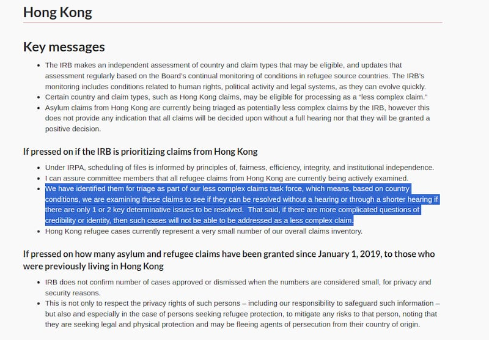

# 事實查覈｜獲罪香港民主人士不能獲得他國的"政治庇護"嗎？

作者：沈軻

2024.01.02 18:19 EST

## 標籤：誤導

12月4日,《環球時報》 [發表文章](https://china.huanqiu.com/article/4FcteJ280Zn),對目前在加拿大留學的香港民主活動人士周庭進行批評。周最近宣佈她決定留在加拿大,而不是在保釋期滿前返回香港。

文章援引一位評論員的話說：周庭和其他民主活動人士犯下的是“嚴重刑事罪行”，不是政治犯，並聲稱周和其他香港民主人士，在他國“並不能” 獲得政治庇護。

這個說法有誤導性。 據加拿大移民和難民委員會（IRB）的通告，流亡加拿大的香港居民可以優先獲得庇護身份。

《環球時報》援引一名評論員的話說，像周這樣因面臨《國家安全法》中列出的罪行相關指控而逃往國外的香港人不太可能獲得庇護。 （截圖/環球時報）

2019年8月,周庭因參加了當年夏天在香港警察局舉行的抗議活動而 [被捕](https://hongkongfp.com/2019/08/30/breaking-hong-kong-activist-agnes-chow-arrested-pro-democracy-leaders-rounded/)。 一年後,她因煽動並參加"未經授權的集會" [被定罪](https://www.twreporter.org/a/hong-kong-joshua-wong-chow-ting-ivan-lam-jailed)。 她於2020年12月開始服刑,並於七個月後 [獲假釋](https://www.bbc.com/news/world-asia-china-57450592)。

然而,在2020年6月《國家安全法》頒佈後,周於2020年8月被香港當局以 ["煽動分裂國家"的罪名再次逮捕](https://web.archive.org/web/20200818011319/https://news.rthk.hk/rthk/en/component/k2/1542936-20200810.htm),當時與她同一批被逮捕的還有黎智英等民主活動人士。

在等待新的罪名被審判期間,獲得保釋的周向香港當局 [申請了出國留學](https://www.info.gov.hk/gia/general/202312/04/P2023120400221.htm?fontSize=1)的許可。 獲得批准後,她於2023年9月離開香港前往加拿大,作爲保釋條件,她曾向香港警方保證於12月返港向警方報到。

12月3日,周庭在 Instagram 上發帖, [宣佈決定留在加拿大](https://www.instagram.com/p/C0ZL33POAej/?igshid=MzRlODBiNWFlZA%3D%3D),再也不會回去。香港警察國家安全局第二天 [發表聲明](https://www.info.gov.hk/gia/general/202312/04/P2023120400221.htm?fontSize=1),敦促"在爲時已晚之前,不要選擇一條不歸路, "而香港行政長官李家超則指出,周庭在獲得寬大處理後,卻"欺騙"了政府。

12月3日，周庭在Instagram上發帖宣佈，她決定不返回香港按計劃向警方報到。（截圖/Instagram）

## 迄今保持100%定罪率的政治犯罪

在《環球時報》的報道中，香港時事評論員、中國和平統一促進會香港總會常務理事朱家健表示，周庭等所犯的是“刑事罪”，而不是政治犯。

雖然"政治犯罪"也可能指政客中的白領犯罪,但最常見的用法是指威脅國家利益的犯罪。 [《國家安全法》](https://www.elegislation.gov.hk/fwddoc/hk/a406/eng_translation_(a406)_en.pdf?OS=Linux&OS_S=false&BR=Chrome&BR_S=true&BRV=120.0&BRV_S=true&JS_S=true&C_S=true&severity=warn)將分裂國家、顛覆國家政權和勾結外國等多種行爲定義爲刑事犯罪,而這些行爲仍被廣泛認爲是政治犯罪。

根據《國家安全法》向法院提起的案件 [定罪率異常高](https://www.bbc.com/news/world-asia-china-67700498),凸顯了這些犯罪的政治性質,截至 2023 年 12 月,按照這一罪名被起訴的人定罪率仍爲100%。

喬治城大學亞洲法中心於2022年向聯合國人權委員會提交的 [一份意見書指出](https://www.law.georgetown.edu/law-asia/wp-content/uploads/sites/31/2022/06/GCAL_HRCSubmission_220615.pdf),依據《國家安全法》審理的案件存在對陪審團審判權和審前釋放的限制趨勢,這很令人擔憂。

後來事態發展進一步加劇了這種擔憂,因爲香港政府隨後 [禁止外國律師代理涉"國安法"案件](https://www.lawfaremedia.org/article/in-hong-kong-another-blow-to-the-rule-of-law),並 [提議修法](https://hongkongfp.com/2023/04/21/hong-kong-proposes-changing-law-to-allow-appeals-against-high-court-national-security-acquittals/),允許檢方對初審法院對這類案件做出的無罪裁定提起上訴。

## 加拿大如何對待香港來的政治難民

加拿大移民和難民委員會(IRB)指出, [香港難民在加拿大申請庇護的案件](https://www.irb-cisr.gc.ca/en/transparency/pac-binder-nov-2020/Pages/pac19.aspx)可能被優先考慮爲"不太複雜的申請"(less complex claim),在條件符合的情況下,申請者有資格加快申請流程: 他們僅需要簡短的聽證會或根本不需要正式聽證會。

加拿大政府指出，香港人的庇護申請被優先考慮，他們可能有資格獲得加急程序獲得庇護身份。 （截圖/加拿大移民和難民局）

IRB 部長還宣佈, [針對香港難民豁免](https://www.canada.ca/en/immigration-refugees-citizenship/corporate/publications-manuals/operational-bulletins-manuals/refugee-protection/removal-risk-assessment/applications-intake.html#cannot-apply)了在申請難民身份流程中,一旦被拒則12個月內不得再申請返鄉風險評估的禁令。這個禁令意味着一般在庇護申請被拒後,申請人在一年內都不能再次申請對其返鄉風險的評估。而現在,IRB部長宣佈對香港人豁免這一禁令,可以讓他們更快完成庇護申請流程。

部長還稱，任何與和平抗議有關的逮捕或依“國安法”對香港公民提出的指控都不會影響他們的庇護申請。

加拿大移民、難民和公民部 (IRCC) 的發言人告訴亞洲事實查覈實驗室：“加拿大長期以來一直致力於通過爲世界上最脆弱的人羣提供安全避難所來保護那些最需要幫助的人。 加拿大致力於爲那些逃離原籍國迫害的人提供保護。”

此外，香港人想要長期居住在加拿大，也不是隻能通過申請庇護這一條路。

自2021年起,加拿大 [採取了多項措施](https://www.canada.ca/en/immigration-refugees-citizenship/news/2023/07/canada-makes-it-easier-for-hong-kongers-to-stay-and-work-in-canada.html),讓香港人更容易獲得在該國的長期居留權,包括專門爲香港公民開闢 [兩條獲得永久居留權的途徑](https://www.canada.ca/en/immigration-refugees-citizenship/services/immigrate-canada/hong-kong-residents-permanent-residence/eligibility.html):一條針對加拿大大學畢業生,另一條針對在加拿大有工作經驗的人士 。

加拿大專門爲香港移民設立了兩條獲得永久居留權的途徑 （截圖/加拿大政府網站）

2023年,加拿大 [放寬了香港人獲得工作許可證的要求](https://www.canada.ca/en/immigration-refugees-citizenship/news/2023/02/canada-extends-and-expands-open-work-permit-program-for-hong-kong-residents.html),隨後 [完全取消了](http://cbc.ca/news/canada/british-columbia/hong-konger-stream-b-expansion-immigration-pathway-1.6904127)通過職業移民途徑申請永久居留權的香港人所需達到的教育程度要求。

自香港《國安法》頒佈以來,香港人申請加拿大工作和學習許可證的 [數量激增](https://www.cbc.ca/newsinteractives/features/hong-kong-handover),截至 2023 年 1 月,加拿大已對他們發放近 [33,000 份](https://www.scmp.com/news/hong-kong/society/article/3206004/canada-targets-hong-kongs-young-and-well-educated-grants-1700-permanent-residence-and-33000-work?module=hard_link&pgtype=article)工作和學習許可證。

加拿大移民、難民和公民部(IRCC)進一步指出,自2021年6月實施這兩條新途徑以來,截至2023年4月,已有 [三千多名香港居民](https://www.canada.ca/en/immigration-refugees-citizenship/news/2023/07/canada-makes-it-easier-for-hong-kongers-to-stay-and-work-in-canada.html)獲得加拿大永久居留權。

*亞洲事實查覈實驗室(* *Asia Fact Check Lab* *)針對當今複雜媒體環境以及新興傳播生態而成立。我們本於新聞專業主義,提供專業查覈報告及與信息環境相關的傳播觀察、深度報道,幫助讀者對公共議題獲得多元而全面的認識。讀者若對任何媒體及社交軟件傳播的信息有疑問,歡迎以電郵* *afcl@rfa.org* *寄給亞洲事實查覈實驗室,由我們爲您查證覈實。*

亞洲事實查覈實驗室在X、臉書、IG開張了,歡迎讀者追蹤、分享、轉發。X這邊請進:中文 [@asiafactcheckcn](https://twitter.com/asiafactcheckcn);英文: [@AFCL\_eng](https://twitter.com/AFCL_eng)、 [FB在這裏](https://www.facebook.com/asiafactchecklabcn)、 [IG也別忘了](https://www.instagram.com/asiafactchecklab/)。

[Original Source](https://www.rfa.org/mandarin/shishi-hecha/hc-01022024181408.html)