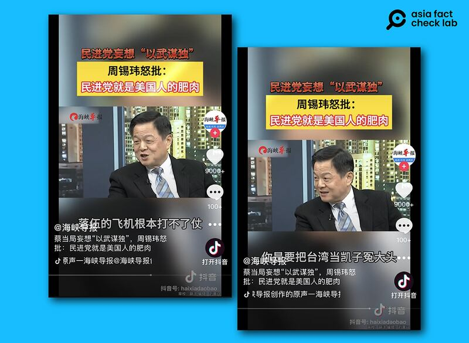

# 事實查覈| 臺灣花大價錢從美國買F-16"落伍戰機"，是"冤大頭"？

鄭崇生，發自華盛頓

2024.01.03 17:28 EST

## 標籤：錯誤

## 一分鐘完讀：

近日,中國媒體《海峽導報》的官方 [抖音](https://www.douyin.com/user/MS4wLjABAAAAZCCql-JSTg14y8Kq1a0aP_MnAErOunmaS1l8hZvD5PI?modal_id=7316459432576175396)及 [西瓜視頻](https://www.ixigua.com/7316428441480987173?logTag=6c23c9b38c5cbc16b98f)賬號引用臺灣前臺北縣長周錫瑋的談話,稱臺灣從美國買F-16戰機是"冤大頭"。約43秒的短視頻中,周錫瑋批評,F-16戰機是"落後武器,又爛又貴";他更稱,臺灣買一架F-16,"等於新加坡買一架先進的F-35戰機",並稱民進黨政府是"美國人的肥肉。"

亞洲事實查覈實驗室發現，上述兩個說法都不是事實。軍購項目複雜，單價比較並無意義，即使如此，根據公開資料，臺灣採購F-16的價格亦應低於新加坡採購F-35的單價，周錫瑋所謂“新加坡F-35一架1億美元”的說法並無事實支持。同時，臺灣從美國求購F-16也並非只有民進黨政府時期，國民黨執政時，也曾呼籲美國向臺出售同型號戰機。

## 深度分析：

臺灣總統大選進入短兵相接之際，中國社羣媒體平臺出現了越來越多批評民進黨政府與美國關係的聲音。

日前，福建省委機關報《福建日報》旗下《海峽導報》在其官方短視頻賬號上傳一段臺灣中天電視臺節目片段，其中，國民黨籍政治人物、臺灣前臺北縣長周錫瑋表示：“美國賣給我們的武器是又爛、又落伍、然後又貴，我們買一架F-16，等於新加坡買一架F-35，大概價值就一億美金。我們買F-16、落伍的飛機根本打不了仗。......你（美國）是要把臺灣當凱子、冤大頭。我覺得民進黨也真是，就是美國人的肥肉嘛。”

《海峽導報》發佈視頻中周錫瑋稱臺灣買F-16是"冤大頭"。（海峽導報抖音賬號截圖）

## 臺灣買F-16和新加坡購買F-35同價？

亞洲事實查覈實驗室搜尋發現,周錫瑋所說的F-16採購案,應是指美國在2019年同意向臺灣出售66架F-16V(block70)戰機。臺灣國防部將本案命名爲" [鳳翔專案](https://www.cna.com.tw/news/aipl/201912210105.aspx)",立法院在同年通過新臺幣2472億餘元(約79.5億美元)的特別預算案。

根據臺灣行政院向立法院提交的 [預算說明文件](https://ws.dgbas.gov.tw/public/Data/dgbas01/109/109D/109D%E7%B8%BD%E8%AA%AA%E6%98%8E.docx),鳳翔專案採購內容包括66架戰機、航空電子系統、軟、硬體系統研發、人員派駐、差旅、裝備運輸等。臺灣空軍官方曾 [指出](https://air.mnd.gov.tw/TW/News/News_Detail.aspx?CID=166&ID=13289),與同樣採購F-16的其他國家比較,臺灣採購單價是1.21億美元,比其他國家要低廉。

至於新加坡的F-35採購案,根據美國國防安全合作署(DSCA)2020年公佈的 [軍售通知](https://www.dsca.mil/press-media/major-arms-sales/singapore-f-35b-short-take-and-vertical-landing-stovl-aircraft),新加坡採購總金額爲27.5億美元,內容包括:4架F-35B戰機,另有權利再採購至多8架,13臺 Pratt and Whitney F135 發動機電子對抗系統、指管通情繫統、F-35訓練系統、專用熱焰彈、備份和維修零件、人員培訓和技術、後勤支援服務等。

到了2023年, [新加坡國防部宣佈](https://www.channelnewsasia.com/singapore/f35-fighter-jet-mindef-saf-rsaf-air-force-military-defence-3302941),新加坡將採購這份合約中的最多數量至12架,換算下來,平均每架花費約2.3億美元。雖然軍售內容中並不公佈戰機單價,但周錫瑋所稱新加坡所購F-35戰機僅1億美元的說法,並無根據。

## F-16戰機落伍了嗎？只有民進黨政府鍾情F-16？

戰機型號是否"落伍"並沒有客觀標準。根據美國獨立機構"全球安全網"(Global Security) [統計列表](https://www.globalsecurity.org/military/systems/aircraft/f-16-fms.htm),F-16仍在超過20個國家的空軍服役中。

有媒體 [報道](https://www.newsweek.com/ukraine-f16-russia-fighter-jets-crimea-su34-1855709),烏克蘭總統澤連斯基(Volodymyr Zelensk)12月22日透露,荷蘭政府正展開交付F-16戰機給烏克蘭的準備工作,首批18架。另一方面,報道還指出,英國證實,烏克蘭飛行員已在英國完成有關操作F-16的基本訓練,準備投入俄烏戰場。

除了歐洲及北約國家,中東國家如巴林,以及前《華沙公約》國家,例如 [斯洛伐克](https://indsr.org.tw/respublicationcon?uid=12&resid=644&pid=3126)也在2018年採購了F-16戰機。

"鳳翔專案"在2019年、民進黨執政期間定案。但在此之前,國民黨執政時代,臺灣政府和馬英九本人都曾經 [公開呼籲](https://www.bbc.com/zhongwen/trad/china/2010/08/100819_taiwan_us_arms)美國儘快批准對臺灣出售較先進的F-16C/D型戰機。馬英九當時 [強調](https://www.chinatimes.com/newspapers/20111001002001-260102?chdtv),臺美雙方合作不是爲了增強臺灣攻擊能力,而是提升防禦能力。

綜合上述查證結果，可以發現周錫瑋所說臺灣、新加坡戰機單價相比、認定採購F-16只是民進黨政府主張的說法是錯誤。而戰機先進或落後，則較無一致標準。

根據臺灣公民團體、臺灣資訊環境研究中心( IORG)的 [分析資料](https://iorg.tw/da/57#h2-8),今年第三季,在他們監測39箇中國官媒的抖音頻道中,《海峽導報》引用臺灣名嘴談話、製播短視頻的數量,排名第三;而最常獲得中國官媒抖音賬號引用的臺灣十大名嘴中,最常討論的話題就是"疑美論"。

*亞洲事實查覈實驗室(Asia Fact Check Lab)針對當今複雜媒體環境以及新興傳播生態而成立。我們本於新聞專業主義,提供專業查覈報告及與信息環境相關的傳播觀察、深度報道,幫助讀者對公共議題獲得多元而全面的認識。讀者若對任何媒體及社交軟件傳播的信息有疑問,歡迎以電郵*  [*afcl@rfa.org*](mailto:afcl@rfa.org)  *寄給亞洲事實查覈實驗室,由我們爲您查證覈實。* *亞洲事實查覈實驗室在X、臉書、IG開張了,歡迎讀者追蹤、分享、轉發。X這邊請進:中文*  [*@asiafactcheckcn*](https://twitter.com/asiafactcheckcn)  *;英文:*  [*@AFCL\_eng*](https://twitter.com/AFCL_eng)  *、*  [*FB在這裏*](https://www.facebook.com/asiafactchecklabcn)  *、*  [*IG也別忘了*](https://www.instagram.com/asiafactchecklab/)  *。*

[Original Source](https://www.rfa.org/mandarin/shishi-hecha/hc-01032024172413.html)