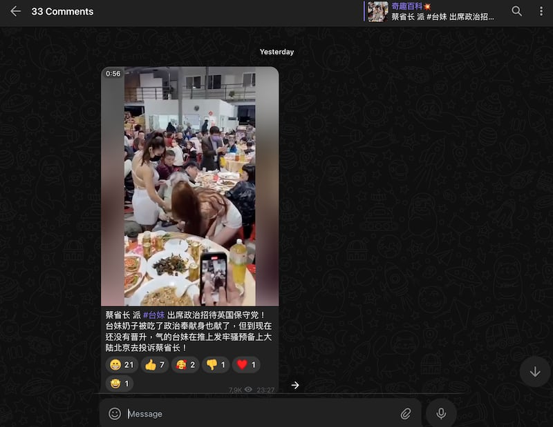
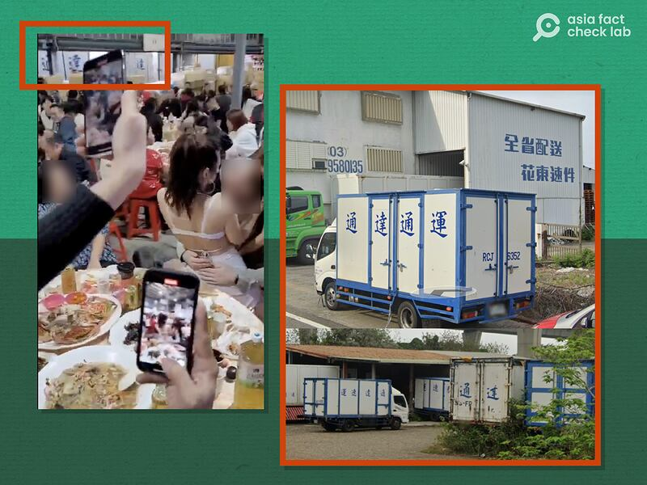

# 事實查覈｜蔡英文派"臺妹"招待英國保守黨人士？

作者：董喆，發自臺北

2024.01.04 16:46 EST

## 標籤：錯誤

## 一分鐘完讀：

近期社羣平臺X（原推特）及通訊軟體Telegram上出現一則視頻，內容是兩名穿着極暴露的女子環繞一名西方臉孔男子熱舞，視頻發佈者稱這是臺灣總統蔡英文派“臺妹”招待到臺灣訪問的英國保守黨成員。經亞洲事實查覈實驗室查證，該視頻早在一年前就已經出現，內容應爲臺灣民間公司尾牙（公司年會），視頻中男子經比對與過去一年來訪臺灣的英國外賓均不符，爲錯誤訊息。

## 深度分析：

署名Qing的賬號本月3日於X發表 [一則視頻](https://archive.ph/ub27o),並搭配露骨描述,稱"蔡省長"派"臺妹"招待英國保守黨成員,"臺妹"作出"奉獻"後卻沒有得到晉升。視頻中兩名穿著暴露的女子環繞一名西方臉孔男子熱舞,互動尺度較大。

值得留意的是，此賬號經常發表有關臺灣的負面內容，賬號關注者包含中國駐立陶宛代辦處、中國外交官薛劍、張志昇以及張軍等人。

除了“Qing”，同樣的視頻與描述亦在Telegram的羣組中出現，引發網民議論。

賬號"Qing"發佈的"臺妹出席政治招待"視頻（X截圖）

亞洲事實查覈實驗室以影片截圖反搜,發現該視頻畫面最早出現於X賬戶"總裁簡報 CEO Briefing"於 [2023年1月9日發佈的帖子](https://archive.ph/wE24z)。原博主對該視頻的描述爲:"萬萬沒想到,華人女孩這麼豪放了!貨運行的年終餐會,俗稱尾牙;春節開工後還有一場新春團拜,俗稱頭牙。"

這則視頻也於去年1月9日被臺媒 [民視新聞網報道](https://archive.ph/uahEi),稱"在疑似尾牙的辦桌場合上,有兩名穿着比基尼和短裙的辣妹,圍繞一名外國男性貼身熱舞"。

影片中的背景音的確出現臺灣腔中文，另外在視頻約40秒處的後方牆上出現繁體中文“通達”。

爲了進一步判斷影片拍攝地，亞洲事實查覈實驗室以“總裁簡報 CEO Briefing”所稱的“貨運行尾牙”，搭配關鍵字“通達”進行搜尋，找到一家“通達速運”公司。該公司在Google Map上停放車輛的車身字樣與影片中出現的字樣相符。記者聯繫通達速運公司詢問視頻內容是不是該公司尾牙時的場景，但截至截稿前未獲回應。

網傳影片中的中文字與通達速運公司貨車圖片（網傳視頻及Google Map截圖）

同時我們查找近兩年總統蔡英文接見外賓新聞稿,與英國相關政要包含2022年的 ["英國國際貿易部貿易政策副部長韓斯訪團"](https://www.president.gov.tw/NEWS/27119?DeteailNo=%E8%8B%B1%E5%9C%8B)、2023年的 ["英國對臺貿易特使、英國國會上議院副議長福克納勳爵"](https://www.president.gov.tw/NEWS/27925)和 ["臺英國會小組訪問團"](https://www.president.gov.tw/NEWS/27384?DeteailNo=%E8%8B%B1%E5%9C%8B),比對上述訪團成員照片,與視頻中的西方臉孔男子皆不相符。

綜合上述信息，原始影片及影片中的男子應與政府接待無關，影片中的情景應是私營單位聚會場景，“蔡英文派臺妹招待英國保守黨”的說法屬於錯誤訊息。

*亞洲事實查覈實驗室（Asia Fact Check Lab）針對當今複雜媒體環境以及新興傳播生態而成立。我們本於新聞專業主義，提供專業查覈報告及與信息環境相關的傳播觀察、深度報道，幫助讀者對公共議題獲得多元而全面的認識。讀者若對任何媒體及社交軟件傳播的信息有疑問，歡迎以電郵afcl@rfa.org寄給亞洲事實查覈實驗室，由我們爲您查證覈實。*

*亞洲事實查覈實驗室在X、臉書、IG開張了,歡迎讀者追蹤、分享、轉發。X這邊請進:中文*  [*@asiafactcheckcn*](https://twitter.com/asiafactcheckcn)  *;英文:*  [*@AFCL\_eng*](https://twitter.com/AFCL_eng)  *、*  [*FB在這裏*](https://www.facebook.com/asiafactchecklabcn)  *、*  [*IG也別忘了*](https://www.instagram.com/asiafactchecklab/)  *。*

[Original Source](https://www.rfa.org/mandarin/shishi-hecha/hc-01042024163830.html)