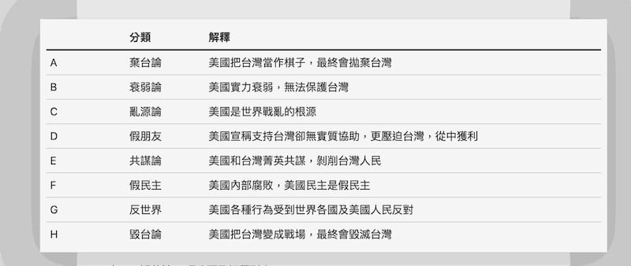
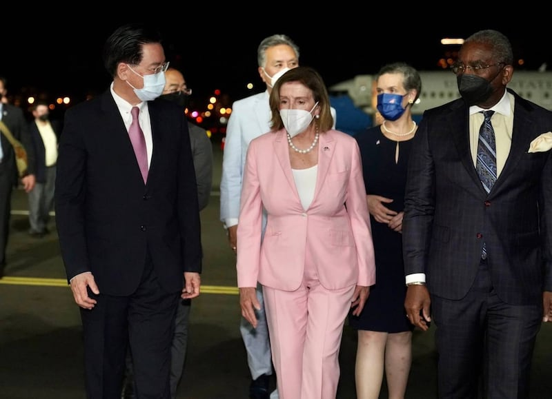
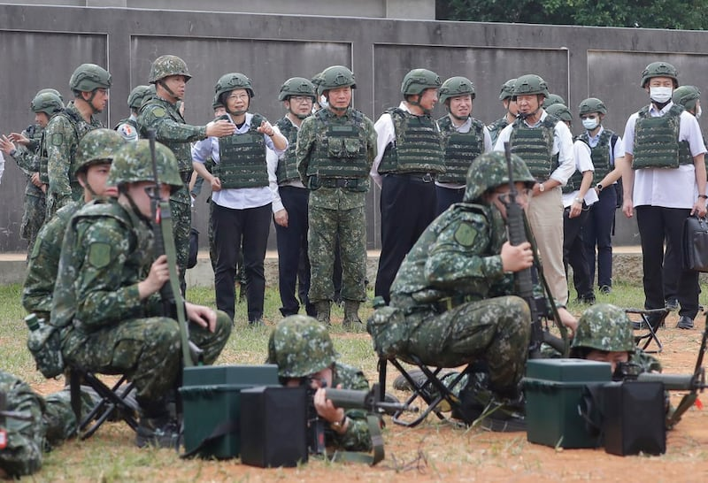
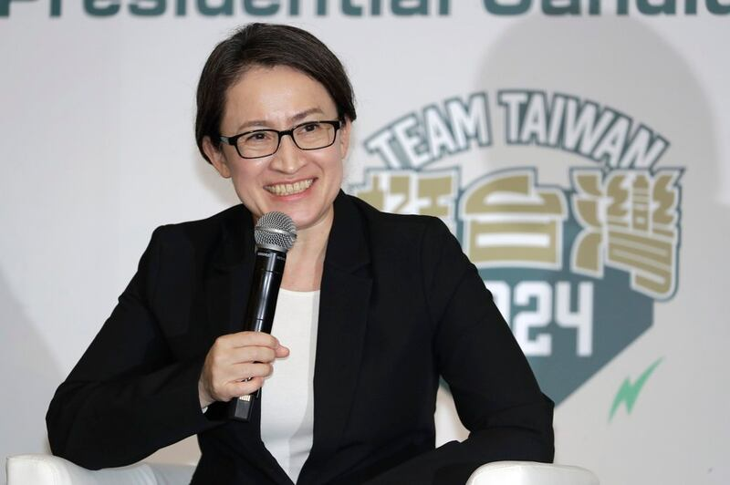
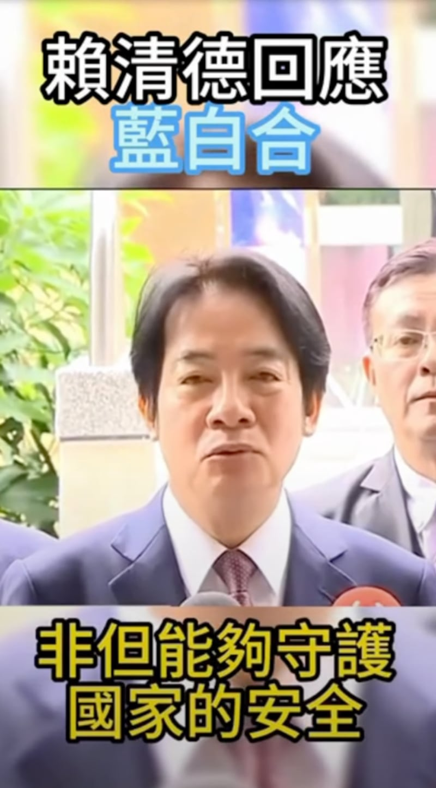

# 深度報道｜2024臺灣大選 看見哪些假訊息的新手法

作者：莊敬

2024.01.05 15:39 EST

“今年無論對事實查覈工作者、研究人員、媒體，都是非常挑戰的一年。因爲‘他’完全知道臺灣資訊生態系的困境，從弱點下手，攻擊手法就會非常靈活。”臺灣事實查覈中心總編審陳慧敏所說“非常挑戰的一年”，指的是臺灣大選年，“他”則是對臺灣發動假訊息攻勢的“有心人士”。

根據瑞典哥德堡大學的研究報告，臺灣是全球受境外假訊息影響最嚴重的國家，已蟬聯10年榜首。這些年，臺灣一直努力提升抵抗錯假訊息的能力，但“對手”也累積多年經驗，再加上AI科技、TikTok等平臺興起，讓他的產製手法與傳播管道更多元。

亞洲事實查覈實驗室（AFCL）在2024年1月13日舉行的臺灣總統大選前，訪問了當地的事實查覈組織、專家學者，並彙整相關查覈報告。受訪者不約而同提到一個現象，那就是“他”從過去幾次的選舉操作學到了經驗，這次不再站在第一線攻擊，而是通過間接方式發動攻勢，“疑美論”就是工具之一。

## 新現象之一：疑美論

國立政治大學國家發展研究所助理教授黃兆年告訴AFCL，“疑美論”基本上是爲中共的宣傳目標服務。

黃兆年解釋，“疑美論”這個主題並沒有和臺灣總統候選人建立直接、強烈的關係，但中共通過攻擊美國，把美國和戰爭綁在一起，去攻擊臺灣比較親美的政黨。“更隱晦的是，他其實在說，中國是跟和平連在一起”。對中共而言，訊息真假並不重要，只要這些偏差性的資訊和論述，能夠讓他取得相對於競爭對手的優勢，並拉抬威權陣營，就是有用的工具。

臺灣資訊環境研究中心(IORG)在 [《疑美論和它們的產地》](https://iorg.tw/a/us-skepticism-238)報告中,根據2021年至2023年6月間的12次重大事件,辨識84項符合其"疑美論"定義的論述,並歸納爲8類(下表)。報告指出,"中共是疑美論最大的外國影響力來源",但中共行爲者傾向"加入"並傳播既有疑美論述,而非創造新論述,在84項"疑美論"論述之中,有44項論述都是由臺灣行爲者發起。

IORG將疑美論述分爲八類（取自IORG《疑美論和它們的產地》報告）

AFCL也關注相關論述,並曾查覈部分傳言,包括外界質疑美國通過 ["臺灣學人計劃"](2023-01-05_事實查覈 ｜ "臺灣學人"計劃是美國派官員到臺灣"監軍"？.md)監軍, [美國要求臺灣發展生化武器](2023-07-20_事實查覈｜媒體披露的"會議紀錄"證明了美國要求臺灣發展生化武器嗎？.md), [白宮前高官](2023-04-07_事實查覈｜白宮前高官鼓吹“毀臺積電”計劃嗎？他的原話是什麼？.md)、 [政客倡議"炸燬臺積電"](2023-05-11_事實查覈│ 美國政客又在倡議"炸燬臺積電"嗎？.md)等。

另外,AFCL還曾發表 [專文](2023-03-01_事實查覈│查覈筆記：當嘲諷變成新聞—— 一則推文如何"毀滅臺灣".md)探討2023年初發生的"尼克森事件"傳播現象——一位自稱美國廣播節目主持人的嘉蘭・尼克森(Garland Nixon)推文稱白宮內線透露,美國總統拜登曾說出毀滅臺灣計劃。這則推文被臺灣前立委蔡正元轉發後,經衆多媒體引用,連官方都表態。過了幾天,尼克森通過視頻自承推文是嘲諷、虛構,卻少有人關注真相。

近一、兩年，"疑美論"在臺灣大行其道，成爲政治攻防的重點。也有許多不實信息寄託其中。圖爲2022年8月，時任美國衆議院議長的佩洛西訪問臺灣。(臺灣外交部)

## 新現象之二：戰爭恐懼

"這次選舉,北京做法變得更不易察覺,聚焦散佈疑美論及武力恫嚇臺灣。"這段文字出自美國智庫 ["大西洋理事會"](https://www.atlanticcouncil.org/blogs/new-atlanticist/what-to-know-about-chinas-meddling-in-taiwans-upcoming-election/)的專文,分析中國企圖利用假訊息影響臺灣選舉的趨勢。

臺灣國安局長蔡明彥曾在網路節目上說,中國通過假訊息塑造臺海兵兇戰危,營造戰爭緊張氣氛,讓臺灣民衆心理恐慌。其中一例是臺灣總統蔡英文4月出訪友邦,期間過境美國並會晤時任聯邦衆議院議長麥卡錫(Kevin McCarthy),此舉引發中國強烈不滿,並展開了爲期三天的 "環臺軍演" 。而在軍演期間, [不實消息充斥網路](2023-04-14_事實查覈｜深度 ｜ 中國對臺軍演 不實消息滿天飛.md),似乎意圖放大恐懼。

陳慧敏分析,中國知道在臺灣選舉期間,他不能一直強調軍力很強,因此在操作一段時間的軍事大外宣和假訊息後便會收斂,轉而操作"疑美論",或是攻擊臺灣的國防、外交無能。例如,2023年中,中國社羣平臺傳出 ["臺灣軍隊演習,淪爲總統逃命彩排"](https://tfc-taiwan.org.tw/articles/9370)的錯誤訊息,還有部分媒體報道蔡英文"保命出逃",企圖破壞臺灣民衆對政府的信任。

臺灣總統蔡英文和軍方的關係也經常成爲不實信息的題材。圖爲2023年5月蔡英文訪視臺灣部隊的情形。（美聯社）

法務部調查局研究委員劉文斌則認爲，目前沒有證據指向哪一方先丟出兵兇戰危，企圖影響臺灣；對北京而言，“疑美論”符合其利益，他可能善加利用，但操作兵兇戰危，恐造成反作用。

不過, [臺灣人工智慧實驗室(Taiwan AI Labs)](https://www.cna.com.tw/news/aipl/202312200126.aspx)分析10月到12月中國官媒的論述,發現中國操作的最大主題就是"臺灣推向兵兇戰危險境",其次是"美國不顧臺灣人死活"。中國官方多次指控民進黨將臺灣推向兵兇戰危的境地,直到臺選前兩週, [國臺辦](http://www.gwytb.gov.cn/xwdt/xwfb/wyly/202401/t20240101_12591023.htm)回應蔡英文任內最後一次新年談話時,還說"蔡英文路線"是害臺路線,導致臺灣兵兇戰危。

## 新現象之三：舊謠言重傳 擾亂民生

除了兩岸是否開打、美國是否派兵相救，足以影響臺灣選民的議題，還有攸關百姓利益的社福、食安、交通等民生問題。綜合臺灣事實查覈中心、MyGoPen（臺語“麥擱騙（不要再騙了）的諧音”）、IORG的觀察，常出現的謠言主題包括缺蛋、缺電、缺衛生紙，以及各種食安、交通、治安危機。他們並注意到，這次大選前，許多民生舊謠言，再度熱傳。

陳慧敏舉例，最近再度流傳所謂新臺幣改版需花費500億元的消息，其實是2020年大選前曾傳過的錯誤訊息，企圖塑造“政府亂花錢”這類假訊息的用意，就是希望以人們最關切的民生議題引起仇恨、對現任政府的不滿與不信任。

另一個選舉期間常見的不實訊息，是選務要“作票”，這類謠言是爲影響民衆對選舉公平的信心、傷害民主制度。

談到選務,MyGoPen總編審葉子揚笑說,"隱形墨水又來了",四年前網路盛傳,蔡英文是因爲美國中情局(CIA)提供了隱形墨水,作票纔會大勝。這次選前,又傳出選票會被隱形墨水動手腳的訊息,還有 [今年投開票所監視器全拆掉](https://tfc-taiwan.org.tw/articles/10054)、 [民進黨有作票專用箱](https://tfc-taiwan.org.tw/articles/10049)、 [特定報票方式讓國民黨永遠別想贏](https://www.mygopen.com/2023/12/vote15.)等各種選務謠言。

民進黨提名副總統候選人蕭美琴擁有一半美國血統，經常成爲惡意或不實信息的攻擊對象。（美聯社圖片）

## 新現象之四：攻擊特定候選人

選舉期間,"有心人士"的一大攻擊目標就是候選人,藍、綠、白陣營都不例外。其中,民進黨副總統候選人蕭美琴、民衆黨副總統候選人吳欣盈的國籍爭議,在這次大選成爲話題,AFCL曾發表 [《臺灣大選假訊息風向:圍繞蕭美琴的"美國代理人"敘事"》](2023-11-30_傳播觀察 ｜ 臺灣大選假信息風向：圍繞蕭美琴的"美國代理人"敘事.md),MyGoPen等組織針對蕭美琴的國籍發佈 [查覈報告](https://www.mygopen.com/2023/12/bi-khim.html),並附上美國聯邦公報的放棄國籍資料名單爲證。

然而，這讓事實查覈組織成了攻擊目標。葉子揚說，有曾任立委的意見領袖質疑他們所附的美國聯邦公報網站“是假的、自己做的”，之後還有一些媒體、名嘴引述該意見領袖的說法，指控MyGoPen在爲蕭美琴護航。葉子揚無奈表示，針對意見領袖的質疑，只能再發布一則查覈報告。

## 新現象之五：深僞科技、新平臺

而針對候選人的錯假訊息中,有好幾則是AI造假影音。2023年8月,媒體收到音檔,內容是民衆黨主席柯文哲批評副總統賴清德訪美,經調查局以軟體鑑別,判定錄音檔內容被深度僞造的可能性極高。之後,調查局陸續發現 ["賴清德回應藍白合"](https://www.mjib.gov.tw/news/Details/1/939)、 ["賴清德有三名情婦"](https://www.mjib.gov.tw/news/Details/1/953)的深僞影片,以及 ["賴清德爲春風專案線民"](https://www.mjib.gov.tw/news/Details/29/957)的變造影音。

民進黨總統候選人賴清德疑似遭深僞技術造假的影片截圖

葉子揚表示，一開始的AI造假影音比較低階，容易察覺異狀，但接近選舉出現的幾個深僞案例，程度明顯較高，查覈單位需要工具，卻面臨資源不足的問題。陳慧敏則說，“破解的技術沒有追上，還在很辛苦的階段”，AI專家也建議查覈單位，用媒體識讀能力來判斷是最好的。

在2023年最後一週,臺灣事實查覈中心又破解了幾則運用AI技術製作的政治傳言影片,其中一則是 ["美國議員公開爲特定政黨候選人拉票"](https://tfc-taiwan.org.tw/articles/10066)的影片,造謠者剪輯這位議員以前的受訪畫面,再變造岀議員的聲音,通過AI技術改變嘴型,讓議員的嘴型與聲音相符合。這則影片在臉書、TikTok、批踢踢實業坊(PTT)等平臺傳開,PTT用戶還下了一個"勁爆"的標題:"美國站邊了 發影片力挺賴蕭當選"。

“現在手法多很多，管道多很多。以前TikTok還沒這麼熱門，現在已經多管齊下了。”葉子揚說，臺灣民衆常用的平臺以臉書和LINE爲主，但近年來社媒推短影片，很多人會下載TikTok的影片，轉傳到臉書、LINE羣組，所以在很多平臺都會看到一樣的影片，實際來源是TikTok。

陳慧敏則提到“造謠者的進化”，意思是有些之前在YouTube或臉書流傳的假訊息可能已被破解，但造謠者會把它修改、加工，製作成一個抖音版，再讓它流進Line羣組。又或者是，在臺灣人常用的PTT、Mobile01、爆料公社“放餌”，形成討論後，“他”再去搬運，而搬運最重要的環節是，媒體把網路討論寫成報道。

## 媒體守門失靈 假信息得逞

這就回到文章開頭，陳慧敏所說的“他完全知道臺灣資訊生態系的困境，從弱點下手”。陳慧敏解釋，以臺灣媒體生態，只要一有記者報道，其它媒體就可能跟著抄，“它就被洗白成新聞”，進而帶動輿論。造謠者還很懂，丟出容易誤導的訊息，媒體不易把關，事實查覈單位也不好查覈。

黃兆年指出，北京對臺資訊操弄的傳播網絡，有三個主要行爲者：第一是中國官方；第二是與中國有明確利益關係的特定在地協力媒體。還有第三類：不特定的在地協力者。這類行爲者較難以辨識，可能只是對某些訊息產生強烈情緒的個人，或是與中國沒有利益關係的媒體，但爲了收視率、點閱率，而協助傳播。

而這次大選，上述行爲者的角色有所變化。黃兆年分析，北京過去會創造話題攻擊執政當局，但這次多是利用既有的時事話題操弄資訊，直接訴諸非特定的在地協力者，讓特定的在地協力媒體退居二線。無論是傳播者的動員，資訊操作的主題，內容的選擇上，都變得相對不再那麼直接，更不容易被察覺，因此臺灣社會需要更深度的媒體識讀和資訊判讀能力。

IORG共同主持人遊知澔表示，並非所有的資訊操弄論述都來自中國，資料顯示中共宣傳持續大量引用臺灣各界意見，製造偏頗的臺灣印象、有利中國的世界觀。因此，在民主的臺灣，媒體識讀、資訊判讀就是防禦威權資訊操弄最長期、最根本的解方。

劉文斌則說，全世界政治實體都想要影響跟他有關的政治事件，希望對自己有利的一方當選，北京並非特例；但是，只有中國想併吞臺灣，這是他的主軸，不會改變，唯方法會隨時空環境而不同。

他提醒，臺灣要留意兩個現象，一是對方傳播的訊息具針對性，假設要影響記者、軍人、大衆交通工具的駕駛，就會發出這些人想要的訊息，不斷地影響，讓這些人能在關鍵時刻配合行動。第二個現象則是“CNN效應”，媒體爲快速播報，將複雜的事務簡化成短影片或圖像，然後24小時播放，形塑某種意見後，甚至可以影響政府決策。

“在選舉等關鍵時刻，用很短的時間，讓你沒辦法搞清楚的狀況下，影響你的認知、做出判斷⋯⋯這非常可怕。”劉文斌說。

*亞洲事實查覈實驗室（Asia Fact Check Lab）針對當今複雜媒體環境以及新興傳播生態而成立。我們本於新聞專業主義，提供專業查覈報告及與信息環境相關的傳播觀察、深度報道，幫助讀者對公共議題獲得多元而全面的認識。讀者若對任何媒體及社交軟件傳播的信息有疑問，歡迎以電郵afcl@rfa.org寄給亞洲事實查覈實驗室，由我們爲您查證覈實。*

*亞洲事實查覈實驗室在X、臉書、IG開張了,歡迎讀者追蹤、分享、轉發。X這邊請進:中文*  [*@asiafactcheckcn*](https://twitter.com/asiafactcheckcn)  *;英文:*  [*@AFCL\_eng*](https://twitter.com/AFCL_eng)  *、*  [*FB在這裏*](https://www.facebook.com/asiafactchecklabcn)  *、*  [*IG也別忘了*](https://www.instagram.com/asiafactchecklab/)  *。*

[Original Source](https://www.rfa.org/mandarin/shishi-hecha/hc-01052024152720.html)