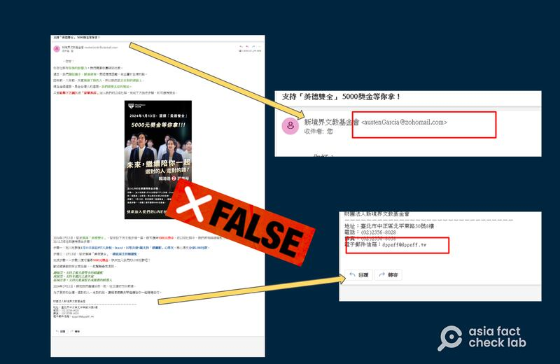
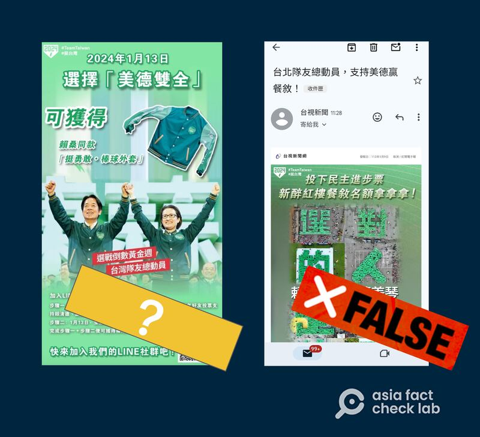
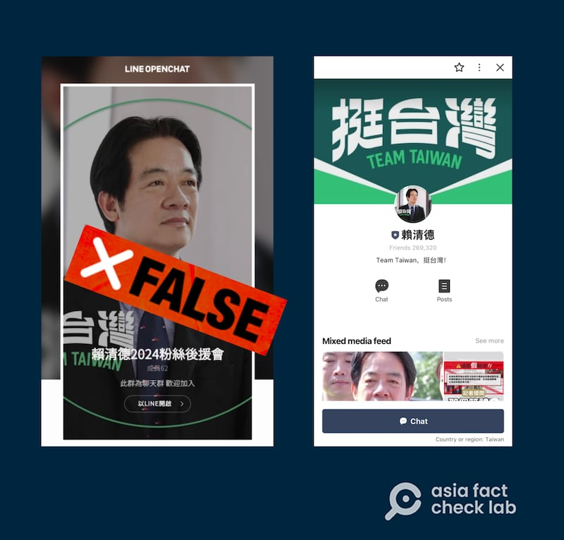

# 事實查覈 | 支持賴清德、蕭美琴可獲現金、禮物和餐敘？

鄭崇生，發自華盛頓

2024.01.10 15:46 EST

## 標籤：錯誤

## 一分鐘完讀

臺灣總統大選將在13日投票，投票前夕社媒平臺熱傳系列謠言：只要支持民進黨正、副總統候選人賴清德與蕭美琴“美德雙全”的組合，可獲得新臺幣5000元、定製棒球外套、餐敘等回報。

亞洲事實查覈中心查證，所謂“選‘美德雙全’可得5000元”、可獲獎品、餐敘等回報的信息爲假信息。這些錯誤信息或在刻意塑造賴、蕭有賄選行爲的敘事。

## 深度分析

臺灣知名的論壇網站PTT，以及多個社交媒體平臺，在選舉前夕出現大量信息，聲稱支持“美德雙全”（即民進黨候選人賴清德、蕭美琴），將獲得獎金、獎品等激勵。

一封以智庫“新境界文教基金會”名義廣發的電子郵件，邀請收信民衆加入通信軟件Line的一個社羣后，聲稱只要在1月13日投票日前、於特定的社羣媒體平臺發文支持民進黨，並在投票日當天選擇賴蕭組合，就可獲得獎金新臺幣5000元。

新境界基金會1999年由民進黨時任黨主席林義雄創辦,雖然是非政府組織,但一般都被視作民進黨專屬政策研究智庫。基金會10日發佈 [聲明](https://www.dppnff.tw/article.php?id=1057),強調這是冒名散播不實訊息,試圖影射賴清德、蕭美琴賄選,不但破壞新境界基金會的名譽,也意圖影響選舉,基金會已在當天下午向臺北市警察局中正一分局報案。

進一步查看所謂電郵截圖，亞洲事實查覈實驗室發現，這封所謂來自新境界基金會的郵件，是以專爲企業組織提供電子郵件系統的zohomail註冊的，和新境界基金會對外聯絡電子郵件信箱dppnff@dppnff .tw的地址與網域完全不同。不過，這封電郵下方又刻意加上了新境界基金會的地址、電話及上述官方電郵地址。

網傳“新境界基金會電郵截圖”被官方宣稱爲假信息，其中發送地址並非新境界官方電郵。（亞洲事實查覈實驗室製圖）

另外，假冒新境界基金會發出的圖片附有Line社羣邀請，經測試，是無效的二維碼。

除了“支持美德雙全、可以領5000元”的謠言之外，社羣平臺還有另外一些“獎勵”信息流傳，例如，支持賴、蕭組合，可獲得紀念版棒球外套、或是參與餐敘活動等。經查證，這些信息其中一些有明顯造假痕跡、而另一些尚待確認的圖片也高度可疑，而這些信息，和“5000元獎金”郵件圖片一樣，都在試圖塑造“賴蕭配”涉嫌賄選的的敘事。

網傳“臺視新聞”發佈的信息，右圖經查證並非臺視新聞電子報，左圖也並無其他公開信息佐證。（亞洲事實查覈實驗室製圖）

一張在網絡流傳、據稱來自臺視新聞的圖片，提供了大選當日選擇“美德雙全”即可獲得紀念版棒球外套的詳細步驟。

經查，賴清德競選總部販售的紀念商品棒球外套，售價爲3600元。而臺灣相關法律規定，選舉期間的宣傳贈品價值需在30元以下，否則可能涉及賄選。

亞洲事實查覈實驗室發現，這張送外套的截圖中的Line羣組二維碼鏈接是一個自稱爲“賴清德2024粉絲後援會”的聊天羣組，使用了與賴清德的競選官方Line帳號一樣的照片，非常容易混淆，但並不是賴清德的官方帳號。

“贈送棒球外套”截圖中二維碼鏈接爲一個使用賴清德官方照片的聊天羣組，但並非賴的Line官方後援會羣組。（亞洲事實查覈實驗室製圖）

"支持美德贏餐敘"的截圖據轉發者稱,來自臺灣"臺視新聞"發的電子報郵件。該截圖中顯示郵件發送者爲"臺視新聞",並有臺視電子報的標誌,但並沒有顯示發送者地址。該圖顯示,這張"電子報"發出日期是民國113年(2024年)1月9日,而臺視當天的 [電子報內容](https://www.ttv.com.tw/epaper/news/113/01/1130109.htm),並沒有有關"支持美德贏餐敘"的內容。

臺灣電視公司於臺北時間1月11日上午約10時回覆亞洲事實查覈實驗室詢問指出，從未以“臺視新聞”名義發送電子郵件，這兩封信件冒用臺視新聞名義，臺視表示，這些郵件不是臺視新聞官方電子信箱寄出，爲有心人士企圖魚目混珠、假借臺視新聞的名義擾亂選情。

（莊敬、董喆對報導有貢獻）

## 1月11日更新說明：在收到臺視回覆，確認所謂棒球外套、餐敘作爲選票獎勵的郵件信息爲冒用之後，相關內容進行了更新。

*亞洲事實查覈實驗室(Asia Fact Check Lab)針對當今複雜媒體環境以及新興傳播生態而成立。我們本於新聞專業主義,提供專業查覈報告及與信息環境相關的傳播觀察、深度報道,幫助讀者對公共議題獲得多元而全面的認識。讀者若對任何媒體及社交軟件傳播的信息有疑問,歡迎以電郵*  [*afcl@rfa.org*](mailto:afcl@rfa.org)  *寄給亞洲事實查覈實驗室,由我們爲您查證覈實。*

*亞洲事實查覈實驗室在X、臉書、IG開張了,歡迎讀者追蹤、分享、轉發。X這邊請進:中文*  [*@asiafactcheckcn*](https://twitter.com/asiafactcheckcn)  *;英文:*  [*@AFCL\_eng*](https://twitter.com/AFCL_eng)  *、*  [*FB在這裏*](https://www.facebook.com/asiafactchecklabcn)  *、*  [*IG也別忘了*](https://www.instagram.com/asiafactchecklab/)  *。*

[Original Source](https://www.rfa.org/mandarin/shishi-hecha/hc-01102024153601.html)