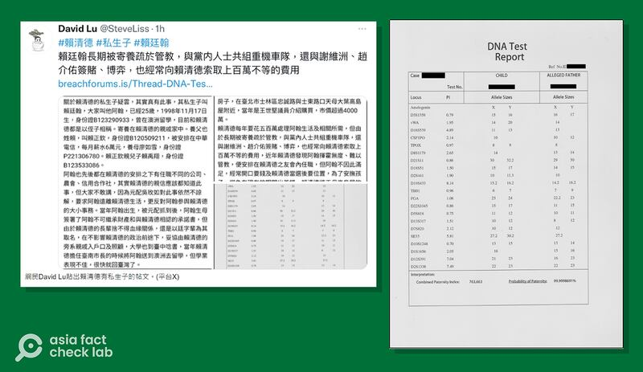

# 事實查覈｜網傳"賴清德私生子"的DNA報告可信嗎？

作者：莊敬

2024.01.11 18:58 EST

## 標籤：證據不足

## 一分鐘完讀：

臺灣總統大選在即，民進黨總統候選人賴清德被指有私生子。身份不明的爆料者在網上公佈事件相關人的姓名、地址等資料，並附上一份“DNA報告”爲證。除了遍傳臺灣網絡平臺，還被香港《星島日報》《巴士的報》等多家媒體引用。

亞洲事實查覈實驗室（AFCL）訪問了專長親子鑑定、基因測序的專家，兩位教授在看完網傳的DNA報告後，共同的評價是這份報告缺少鑑定單位、報告簽署人等重要資訊，“可信度不高”，無法做爲證明。

本報告僅查覈網傳DNA報告，AFCL通過訪問專家與檢視相關文件，認爲這份報告並不足以證明賴清德有私生子。至於其它與此案相關的說法與資料，不在查覈範圍。

## 深度分析：

臺灣總統大選將在1月13日舉行，選前傳出民進黨總統候選人賴清德有私生子，還有爆料者在社媒上公佈事件相關人的姓名、年齡、是身份證字號、居住地等資料，並附上一份“DNA報告”做爲證明。

## 追蹤流言的傳播途徑

賴清德的"私生子"疑雲,在臺灣民衆常用的 [批踢踢實業坊(PTT)](https://archive.ph/RZujO)、 [Mobile01](https://archive.ph/MLqGZ)、 [爆料公社](https://archive.ph/lxxOf)等平臺廣傳,也登上媒體,甚至傳到海外的 [《星島日報》](https://archive.ph/tXw6P)、 [《柬華日報》](https://www.jianhuadaily.com/20240109/226400),《巴士的報》則刊登博客"毛拍手"的文章 [《賴清德被爆有私生子爆料者聲稱DNA有99.99%契合》](https://archive.ph/YetT2)。

追蹤這則傳言的流傳路徑，可以發現部分媒體與網民引用的是X平臺（原推特）用戶“David Lu @SteveLiss”的發文，他所附的連結是駭客論壇“突破論壇”（Breach Forums）的用戶“jt53ur39”。原po以英文寫着，有關賴清德私生子的消息爲真，兩人親子確定率（Probability of Paternity）達99.999%。

“突破論壇”資訊顯示，用戶“jt53ur39”2024年1月7日加入，目前僅一則發文。而X平臺資訊顯示，用戶“David Lu”自2011年加入，至今只有一則發文，追蹤者20人。換言之，兩個傳播“賴清德私生子”傳言的帳號，迄今在各自的平臺上都只發了一條文。

星島日報引用網民David Lu在社媒的發文，以及他所附的DNA報告。（星島日報截圖）

## 專家：網傳DNA報告"可信度不高"

網傳的所謂“DNA報告”上，如人名等可供識別身份的欄位都被塗黑。爲確認網傳DNA報告的可信度，AFCL訪問了兩位醫學專家。臺大醫學院法醫學科暨研究所教授李俊億指出，網傳報告的格式看起來非常簡陋，缺少很多一般要求的項目，例如鑑定單位、報告簽署人、簽署時間、實驗室的認證標章等；此外，報告也沒有以文字敘述鑑定人對親子認定結果的判讀。

李俊億認爲，這份報告不是正常格式，只能看出可能有兩個人做了DNA鑑定，但沒有其他線索，“在科學上，是不會相信這份報告的”。

任職於臺灣清華大學生醫學院精準醫療博士學位學程的曾大千教授也點出網傳DNA報告的幾個疑點，包括沒有提供報告簽署人和檢驗院所。此外，就親子機率的部分，網傳報告爲“99.9998691%”。但曾大千教授說，通常大於99.99%就會認爲有親子關係，一般正式報告最多寫99.9999%，不會寫這麼多小數點。

曾大千說，光看這份數據文件，沒有辦法證明DNA來源，且沒有“法證效力”；必須出具更多相關法律文件，例如採檢時的錄音紀錄、當事人親籤的同意書等，“如果沒有，都不可信”。

根據法務部調查局 ["DNA案件送鑑須知與常見問題說明"](https://www.mjib.gov.tw/userfiles/files/23-%E9%91%91%E8%AD%98%E7%A7%91%E5%AD%B8%E8%99%95/DNA1.pdf),爲確保鑑定證據的有效性,通常要求當事人親赴接受採樣,承辦人依嚴謹的檢體採樣程序予以照相、按指紋及留下身分證件影本,並全程錄音、錄影,以確認當事人身分及確保事後可追溯性。

柯滄銘婦產科診所網站的 ["如何看DNA報告"](http://www.genephile.com.tw/article?id=94)指出,DNA報告的格式會隨着不同的簽發單位而略有不同,依據認證範圍,報告書上需有受檢者的姓名、受檢日期、鑑定系統的說明、鑑定點位、鑑定結果、親緣關係指數值及結論。

## 當事人怎麼說？

根據臺灣的 [中央社](https://www.cna.com.tw/news/aipl/202401090227.aspx)報道,賴清德表示,私生活禁得起考驗,"把孩子帶來,願意做DNA鑑定",倘若爲真,願提供百萬獎金。對於部分政治人物影射賴清德在外有私生子, [賴清德競辦](https://www.cna.com.tw/news/aipl/202401030192.aspx)日前表示,這是惡意中傷的錯假訊息,已委由律師告發。

(感謝 [臺灣科技媒體中心](https://smctw.tw/)協助本件查覈)

*亞洲事實查覈實驗室（Asia Fact Check Lab）針對當今複雜媒體環境以及新興傳播生態而成立。我們本於新聞專業主義，提供專業查覈報告及與信息環境相關的傳播觀察、深度報導，幫助讀者對公共議題獲得多元而全面的認識。讀者若對任何媒體及社交平臺傳播的信息有疑問，歡迎以電郵afcl@rfa.org寄給亞洲事實查覈實驗室，由我們爲您查證覈實。*

亞洲事實查覈實驗室在X、臉書、IG開張了，歡迎讀者追蹤、分享、轉發。 X這邊請進：中文@asiafactcheckcn；英文：@AFCL\_eng、FB在這裏、IG也別忘了。

[Original Source](https://www.rfa.org/mandarin/shishi-hecha/hc-01112024185135.html)