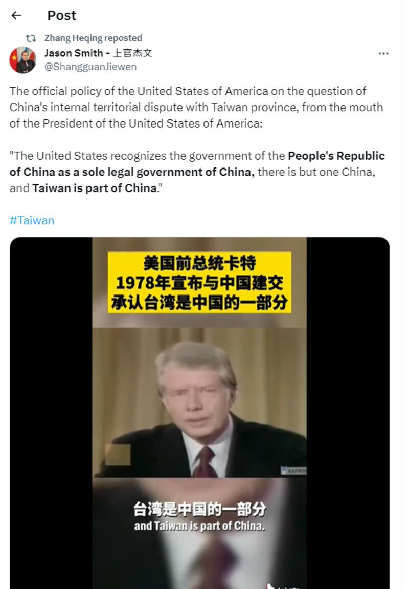
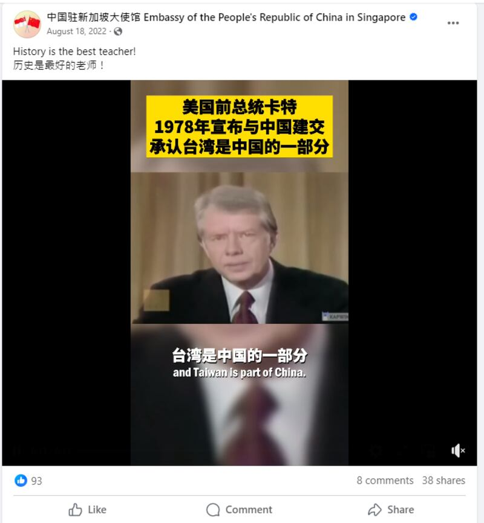

# 事實查覈｜美中建交時卡特"承認"臺灣是中國的一部分？

鄭崇生，發自華盛頓

2024.01.12 14:40 EST

## 標籤：斷章取義

## 一分鐘完讀：

在美中迎來建交45週年之際，中國外交官張和清在社交媒體轉發了一段美國前總統卡特（Jimmy Carter）宣佈與中華人民共和國建交的電視講話視頻，該視頻的製作者對原始歷史視頻進行了加工，剪接了卡特針對臺灣議題的有關說法，將美國“知悉”（acknowledge）中方立場的話剪掉關鍵動詞，拼貼在美國“承認”（recognize）的事項之後，造成美國附和“一中原則”的假象，爲斷章取義，向公衆傳播錯誤訊息。

## 深度分析：

張和清轉發的是在華美國人上官傑文(Jason Smith)的 [推文](https://x.com/ShangguanJiewen/status/1743939492807872770?s=20),他在推文中補充說,這是美國"針對有關於中國與臺灣省的內部領土爭議問題,美國的官方政策,是出自美國總統之口",也就是"美國承認中華人民共和國是(代表)中國的唯一合法政府,(世界上)只有一箇中國,臺灣是中國的一部分。"

上官傑文原帖截圖（X平臺截圖）

1978年12月15日,卡特宣佈美國與中華人民共和國建交,這段談話的 [完整版本](https://www.youtube.com/watch?v=37azeXBjYJc)超過四分鐘,和本次查覈相關部分有兩處:

1. *美國與中華人民共和國同意,自1979年1月1日起,兩國相互承認並建立外交關係。美國*  ***承認***  *中華人民共和國政府是中國的唯一合法政府。在此範圍內,美國人民將與臺灣人民維持文化、商務和其他的非官方關係。(*約視頻50秒處*)* *2. 美利堅合衆國政府*  ***知悉***  *了中國的立場,即只有一箇中國,臺灣是中國的一部分。* (約視頻02'07處)

對照卡特當年的完整說法，上官傑文發出的這段視頻中，不但漏失許多卡特的原話，還刻意省略關鍵用字，即刪去了“知悉”，直接連接上美國“承認”中國的對臺聲明立場，讓意思完全扭曲，刻意誤導成美國政府認可中國的對臺主張。

換言之，這裏介紹的是中國在臺灣問題上的立場，而不是美國的臺灣政策。中國對臺灣一直以來採取“一箇中國原則”的三段論：世界上只有一箇中國，臺灣是中國的一部分，中華人民共和國是代表中國的唯一合法政府。

中國的立場與美國的"一箇中國政策"最關鍵不同之處是臺灣主權歸屬上的論述,亞洲事實查覈實驗室曾做過 [相關報道](2023-02-10_事實查覈│和蔡英文通電話，捷克準總統違背了“一中原則”的政治承諾？.md)。

## 真實影片被剪接後，意思全變了

張和清轉發的這段視頻將卡特原本隔開的兩部分陳述直接拼貼在一起，在卡特說完美國“承認”中華人民共和國是中國唯一的合法政府後，立即跳接到“只有一箇中國，臺灣是中國的一部分”，剪掉了“知悉”的關鍵表述。將長逾2分鐘的完整視頻變成只有13秒，造成華盛頓附和北京對臺立場的假象，原視頻中的鏡位遠近有多次切換，加工後的兩段內容拼貼過渡很自然，若不看完整視頻，很難發現剪接痕跡。

亞洲事實查覈實驗室還發現，上官傑文在X平臺上自稱爲作家，在YouTube開有英語爲主的個人頻道，除了介紹他在中國的生活，也常表達讚賞中國發展模式、批評西方主流媒體抹黑中國的觀點。除了張和清之外，中國駐紐約總領事黃屏、駐舊金山總領事張建敏、駐大阪總領事薛劍、駐聯合國大使張軍等多名外交官都在X上關注了他。

但上官傑文並不是這段被剪輯 [視頻](https://www.douyin.com/user/MS4wLjABAAAAXFH71PqbQjgfVXj9dVIq_flpyusFnzVeO2j6QebtOCw?modal_id=7132278846522543390)的首發者。在抖音上可追溯到最早的發佈者是官媒《中國日報》旗下的雙語新聞官方賬號,發佈時間是2022年8月15日,該時間點正是前美國衆議院議長佩洛西(Nancy Pelosi)訪問臺灣;同年8月18日,中國駐新加坡大使館的 [官方臉書賬號](https://www.facebook.com/watch/?extid=CL-UNK-UNK-UNK-IOS_GK0T-GK1C&mibextid=v7YzmG&v=618532199832166)也刊出了這段斷章取義的視頻,並附評論"歷史是最好的老師"。

中國駐新加坡大使館的臉書帖文（臉書截圖）

關於中國的"一中原則"與美國的"一中政策"的比較,亞洲事實查覈實驗室曾有過 [報道](2023-04-06_事實查覈｜蔡英文過境會麥卡錫，美國嚴重違反一中原則？.md),前白宮國安會亞洲事務資深主任麥艾文(Evan Medeiros)對美國立場的 [解釋](https://instituteforglobalaffairs.org/2017/01/egfpostelection-one-china-policy/)是,美國聽到了、知道了中國對臺灣的主權主張,但不是承認中國對臺灣有主權的立場。他認爲,美國在對臺灣的主權議題立場上是維持模糊的,這也是美中雙方建交45年來,一直沒有共識的最關鍵點。

*亞洲事實查覈實驗室(* *Asia Fact Check Lab* *)針對當今複雜媒體環境以及新興傳播生態而成立。我們本於新聞專業主義,提供專業查覈報告及與信息環境相關的傳播觀察、深度報道,幫助讀者對公共議題獲得多元而全面的認識。讀者若對任何媒體及社交軟件傳播的信息有疑問,歡迎以電郵* *afcl@rfa.org* *寄給亞洲事實查覈實驗室,由我們爲您查證覈實。*

*亞洲事實查覈實驗室在* *X* *、臉書、* *IG* *開張了,歡迎讀者追蹤、分享、轉發。* *X* *這邊請進:中文*  [*@asiafactcheckcn*](https://twitter.com/asiafactcheckcn)  *;英文:*  [*@AFCL\_eng*](https://twitter.com/AFCL_eng)  *、*  [*FB* *在這裏*](https://www.facebook.com/asiafactchecklabcn)  *、*  [*IG* *也別忘了*](https://www.instagram.com/asiafactchecklab/)  *。*

[Original Source](https://www.rfa.org/mandarin/shishi-hecha/hc-01122024143323.html)