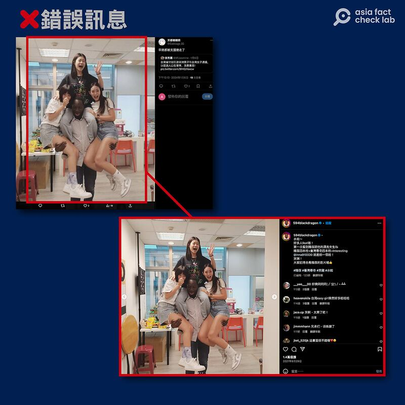

# 事實查覈 | 臺灣計劃引進非洲男子與臺灣女子通婚？

作者：董喆

2024.01.15 11:35 EST

## 標籤：錯誤

## 一分鐘完讀：

微博大V「愛國青年劉戰神」近日轉貼一則消息：「臺灣計畫引進非洲男子與臺灣女子通婚」，消息出處爲Ｘ（原推特）帳號「徐芳麗」，原始推文還附了一張新聞資料照。經查證這張照片是取用臺媒《鏡週刊》2018年的人物專訪，顯然和這則消息無關。同時，臺灣現行法規並不允許外國人在沒有對象的情況下以「通婚」爲理由入境居留，遑論特定種族人士。

亞洲事實查覈實驗室並發現，不僅「引進非洲男子通婚」一事爲錯誤訊息，更有特定帳號集羣傳播同類不實訊息，其中有帳號已經由臺灣國安單位認定爲「境外勢力」所控制。

## 深度分析：

近日,微博大V「愛國青年劉戰神」在 [微博轉貼](https://archive.ph/Rz8On)一則X推文截圖,內容稱「臺灣省計畫引進非洲男子與臺灣女子通婚,以促進人口生育率,改善基因」,並附上驚訝的表情符號。

大V「愛國青年劉戰神」在微博轉貼一則X推文截圖。（微博截圖）

留言處有網民嘲諷「這基因究竟是有多劣等才需要改良?」,亦有人重提臺灣先前計畫引進印度移工一事。 (臺灣引進印度移工已由臺灣事實查覈中心闢謠: [【勞工】侯友宜說「印度移工要開放10萬人,《彭博社》報導已經簽了備忘錄」? | 臺灣事實查覈中心 (tfc-taiwan.org.tw)](https://tfc-taiwan.org.tw/articles/10057))

亞洲事實查覈實驗室循線找回X,發現此消息最早由名爲「徐芳麗」的帳號 [開始傳播](https://archive.ph/TFsPL),透過以圖反搜推文中的照片,確定該則照片出自臺灣媒體《鏡週刊》於 [2018年的人物專訪](https://archive.ph/TPH6u),照片右下角也有鏡週刊水印。據報道,照片中的女子是臺灣人Wawa,與來自布吉納法索的Sangla經自由戀愛後結婚,與推文所述引進非洲男子改善生育率無關。

且根據臺灣民法第972條，婚約應由男女當事人自行訂定。另外，根據依臺灣「涉外民事法律適用法」第46條規定，跨國婚姻應依結婚雙方自己所屬國家的法律作爲判斷標準。並未存在政府引進特定人口一事，也無相關法規。

《臺灣省計畫引進非洲男子與臺灣女子通婚，以促進人口生育率，改善基因》內容附上驚訝的表情符號。（推文截圖）

檢視這則訊息的傳播鏈,轉推這則推文的亦有「 [事實查覈|蔡英文派"臺妹"招待英國保守黨人士? — 普通話主頁 (rfa.org)](2024-01-04_事實查覈｜蔡英文派"臺妹"招待英國保守黨人士？.md)」的錯誤訊息來源、推特主Qing。值得注意的還有在X上自稱「臺灣省人權觀察員」的「徐芳麗」。但這個帳號去年5月曾被臺灣調查局 [指出是境外勢力帳號](https://www.mjib.gov.tw/news/Details/1/775),這個帳號曾經以韓國2013年災難電影《流感》畫面截圖,指稱「臺灣的疫情已經失控了,殯儀館連夜燒不停,工作人員累到虛脫。」引發社會恐慌。

另外轉發這則推文的帳號亦有人錯誤使用來自甘比亞的臺灣Youtuber 「哇系黑龍」(編按：「我是黑龍」的臺語發音)與其他女性Youtuber的合照，指中國早就比臺灣先一步引進黑人男子，造成錯假資訊在傳播過程中遭擴充的情形。

*亞洲事實查覈實驗室(Asia Fact Check Lab)針對當今複雜媒體環境以及新興傳播生態而成立。我們本於新聞專業主義,提供專業查覈報告及與信息環境相關的傳播觀察、深度報道,幫助讀者對公共議題獲得多元而全面的認識。讀者若對任何媒體及社交軟件傳播的信息有疑問,歡迎以電郵*  [*afcl@rfa.org*](mailto:afcl@rfa.org)  *寄給亞洲事實查覈實驗室,由我們爲您查證覈實。* *亞洲事實查覈實驗室在X、臉書、IG開張了,歡迎讀者追蹤、分享、轉發。X這邊請進:中文*  [*@asiafactcheckcn*](https://twitter.com/asiafactcheckcn)  *;英語:*  [*@AFCL\_eng*](https://twitter.com/AFCL_eng)  *、*  [*FB在這裏*](https://www.facebook.com/asiafactchecklabcn)  *、*  [*IG也別忘了*](https://www.instagram.com/asiafactchecklab/)  *。*

[Original Source](https://www.rfa.org/mandarin/shishi-hecha/hc-01152024113442.html)