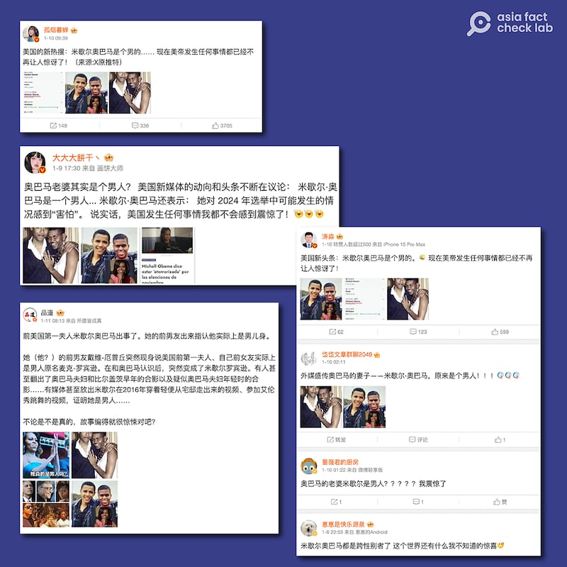
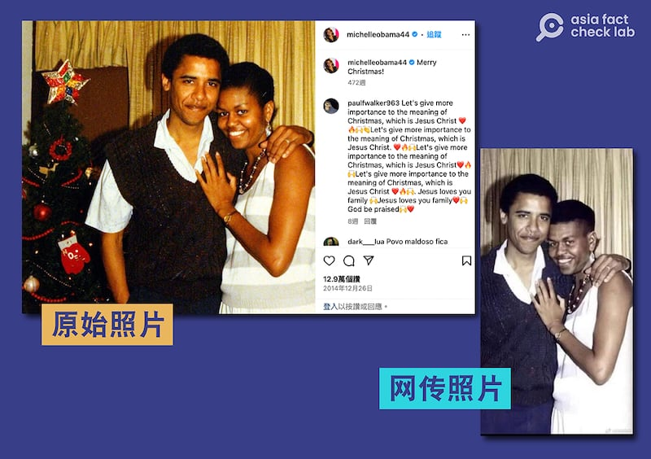
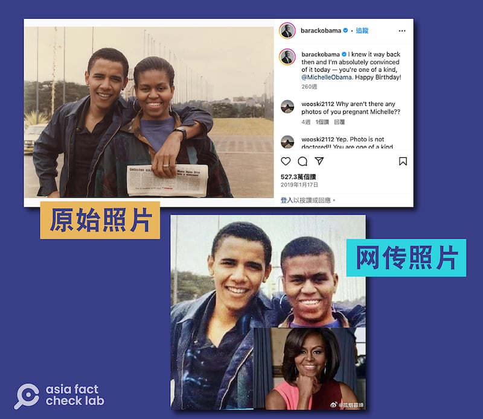

# 事實查覈｜網傳照片"揭祕"米歇爾·奧巴馬原是男兒身？

作者：莊敬

2024.01.16 15:24 EST

## 標籤：影像變造

## 一分鐘完讀：

近期在中國微博上，有多位“大V”博主發文，懷疑美國前第一夫人米歇爾·奧巴馬（Michelle Obama，臺譯蜜雪兒）是男兒身、變性人，並附上所謂米歇爾與奧巴馬年輕時的合照，照片看起來就像是兩名男子合影。

亞洲事實查覈實驗室對照兩人原始照片，發現網傳照片上米歇爾的影像明顯經過修改。事實上，有關照片與謠言已在英文社媒流傳一段時間，法新社、路透社都曾發佈查覈報告，結論是影像經變造，網民傳播了錯誤資訊。

## 深度解析：

2024年1月初，在中國社媒平臺微博上，有多位獲認證的“大V”博主發文，懷疑美國前第一夫人米歇爾．奧巴馬是男兒身、變性人。他們引爲證據的照片是兩張年輕時的奧巴馬與一名酷似米歇爾的“男子”的合影。

多位"大V"微博用戶發文質疑美國前第一夫人米歇爾．奧巴馬是男兒身。（微博截圖）

亞洲事實查覈實驗室通過反搜網傳圖片找到了這兩張照片的原圖,它們均是由奧巴馬伕婦自己發佈,一張是奧巴馬於2019年祝賀米歇爾生日時發佈的 [兩人合照](https://www.instagram.com/p/BsvW9O-A387/?utm_source=ig_embed&ig_rid=9fec2e72-20e2-4567-b697-ae49703b6f5c),另一張是米歇爾於2014年在 [社媒發文](https://www.instagram.com/p/xCiLtlPZIe/?utm_source=ig_embed&ig_rid=b013b423-382b-48ab-8657-f98d0e5978f9)的附圖。經比對發現,網傳照片正是由這兩張原始照片變造而成。

左圖爲美國前第一夫人米歇爾・奧巴馬在社媒發佈的原始照片，右圖爲網傳照片。（IG、微博截圖）

上圖爲美國前總統奧巴馬在社媒發佈的原始照片，下圖爲網傳照片。（IG、微博截圖）

亞洲事實查覈實驗室發現,有關懷疑米歇爾·奧巴馬性別的傳言與照片已在英文世界傳播一段時間,根據路透社發佈的 [查覈報告](https://www.reuters.com/article/idUSKBN26X2E9/),早在2020年就已有社媒用戶傳播該信息。此外, [法新社](https://factcheck.afp.com/doc.afp.com.33KL9AZ)、事實查覈組織 [PolitiFact](https://www.politifact.com/factchecks/2023/feb/28/facebook-posts/michelle-obama-was-never-man/)、 [NewsMeter](https://newsmeter.in/about-newsmeter-2)也都曾就此發佈查覈報告。

多位中文博主傳播了在英文世界已經被闢謠的謠言,而且他們發文的時間相近。雖然無法確定這些博主近期散佈此一謠言的用意爲何,但有部分微博貼文將這則謠言和近期發生的"愛潑斯坦"事件 [並列](https://m.weibo.cn/detail/4988327576999682),以此評論"美帝"發生任何事都不會讓人驚訝了。

[據報道](https://www.bbc.com/zhongwen/trad/world-67890505),美國已故富商愛潑斯坦(Jeffrey Epstein)生前涉及性侵少女和性交易案,紐約地區法院日前公開多達900頁的文件,揭露了愛潑斯坦與衆多政商名人的關係,但未有新的重大指控,也沒有揭露其同夥。

*亞洲事實查覈實驗室(* *Asia Fact Check Lab* *)針對當今複雜媒體環境以及新興傳播生態而成立。我們本於新聞專業主義,提供專業查覈報告及與信息環境相關的傳播觀察、深度報道,幫助讀者對公共議題獲得多元而全面的認識。讀者若對任何媒體及社交軟件傳播的信息有疑問,歡迎以電郵* *afcl@rfa.org* *寄給亞洲事實查覈實驗室,由我們爲您查證覈實。*

*亞洲事實查覈實驗室在* *X* *、臉書、* *IG* *開張了,歡迎讀者追蹤、分享、轉發。* *X* *這邊請進:中文*  [*@asiafactcheckcn*](https://twitter.com/asiafactcheckcn)  *;英文:*  [*@AFCL\_eng*](https://twitter.com/AFCL_eng)  *、*  [*FB* *在這裏*](https://www.facebook.com/asiafactchecklabcn)  *、*  [*IG* *也別忘了*](https://www.instagram.com/asiafactchecklab/)  *。*

[Original Source](https://www.rfa.org/mandarin/shishi-hecha/hc-01162024151933.html)