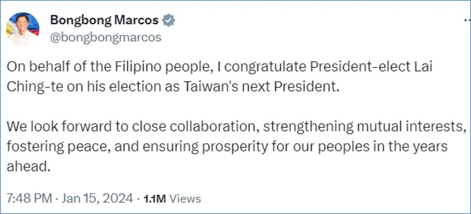
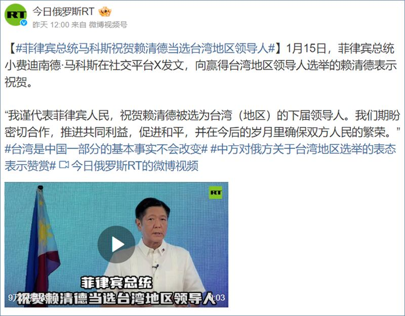

# 傳播觀察｜各國對臺灣大選的祝賀是如何被扭曲的？

作者：莊敬

2024.01.17 15:58 EST

2024年臺灣總統大選結果出爐，民進黨候選人賴清德、蕭美琴當選總統和副總統。選後，世界多個國家政府和官員對臺灣表示祝賀，中國隨即表達不滿，聲稱這些國家致賀臺灣是“違反一箇中國原則的錯誤做法”。

1月15日，菲律賓總統馬科斯（Ferdinand Marcos Jr.）在X平臺（前推特）發文，祝賀賴清德當選下一任臺灣總統。菲律賓總統在祝賀選舉聲明中使用了“臺灣下任總統”(Taiwan’s next President)一詞，相當罕見，中國爲此召見菲律賓駐華大使，外交部在記者會上更對菲國總統提出嚴厲批評。

中國外交部發言人毛寧在 [1月16日的記者會](https://www.mfa.gov.cn/fyrbt_673021/202401/t20240116_11225099.shtml)回應提問表示,馬科斯的有關言論"嚴重違反一箇中國原則和中菲建交公報"。毛寧還說,"我們建議馬科斯總統多讀讀書,正確瞭解臺灣問題的來龍去脈,從而得出正確的結論。"

菲律賓總統馬科斯1月15日在社媒發文，祝賀賴清德當選臺灣總統。（X截圖）

## 馬科斯的言論違反一中原則、中菲建交公報？

臺灣選舉結果公佈後第二天,菲律賓外交部即發佈 [聲明](https://dfa.gov.ph/dfa-news/statements-and-advisoriesupdate/33973-statement-on-the-philippines-one-china-policy)重申遵循該國的"一箇中國政策"。馬科斯在社媒發文後,菲外交部 [說明](https://www.reuters.com/world/asia-pacific/philippines-reaffirms-one-china-policy-after-president-marcos-congratulates-2024-01-16/#:~:text=The%20Philippines'%20foreign%20ministry%20in,in%20the%20democratically%20governed%20island.),馬科斯的祝賀訊息,是感謝他們(指臺灣)僱用海外菲律賓勞工,併成功推進了民主進程。

然而,菲律賓遵循的是"一箇中國政策",並非中國宣稱的"一箇中國原則"。中國主張的"一中原則"有三個部份:世界上只有一箇中國,中華人民共和國政府是代表全中國的唯一合法政府,臺灣是中國領土不可分割的一部分。並非所有國家都認同中國主張的"一中原則",亞洲事實查覈實驗室曾發佈 [報告](https://www.rfa.org/cantonese/news/factcheck/onechina-02152023082542.html),說明"一中政策"與"一中原則"的差異。

而根據 [中菲聯合公報](http://ph.china-embassy.gov.cn/eng/zfgx/zzgx/200011/t20001115_1336097.htm),菲律賓政府承認中華人民共和國政府爲中國的唯一合法政府,充分理解和尊重(fully understands and respects)中國政府關於只有一箇中國,臺灣是中國領土不可分割的一部份的立場。此處用詞爲"充分理解和尊重",與中國主張的一中原則內涵有所不同。

## 馬科斯祝賀賴清德當選“臺灣地區領導人”？

馬科斯的表態除了招致中國抗議，也被俄羅斯媒體“變造”。他的推特原文爲“我代表菲律賓人民祝賀賴清德當選臺灣下一任總統（Taiwan’s next President）。” 《今日俄羅斯》在微博發文引述馬科斯的言論，卻寫成：“我謹代表菲律賓人民，祝賀賴清德被選爲臺灣（地區）的下屆領導人。”

《今日俄羅斯》爲俄羅斯國營媒體，引述他國領袖發言原文時卻換用關鍵詞彙，以中國官方對臺灣總統的稱呼。在微博上，搜尋“臺灣總統”可找到不少內容，雖然多以引號標示，但搜尋結果顯示“臺灣總統”並非平臺禁用詞。

《今日俄羅斯》在微博發文，稱菲律賓總統馬科斯祝賀賴清德當選"臺灣地區領導人"。（微博截圖）

## 祝賀名單中，沒有西方元首？

《環球時報》前總編輯胡錫進1月15日晚間在抖音發佈一則 [視頻](https://www.douyin.com/video/7324321647215889702?modeFrom=userPost&secUid=MS4wLjABAAAAWk68v_OuXT5g-Rjf0v-IKXT3745bG22oS2OKA6I5m_g),他說:"到目前爲止,西方世界基本都祝賀了賴清德當選,但是發出祝賀者幾乎都是外交部級別的⋯⋯西方陣營的祝賀名單中,沒有一個國家元首。唯一出聲的是美國總統拜登,但他只說了一句話,他說的是我們不支持臺灣獨立。"

拜登確實在回應記者提問時說,不支持臺灣獨立,但胡錫進沒說的是,拜登指派了資深代表團訪臺會見賴清德,美國 [國務卿布林肯](https://www.state.gov/on-taiwans-election/)(Antony Blinken)也發聲明祝賀賴清德當選。

另經查, [捷克總統帕維爾](https://www.mofa.gov.tw/News_Content.aspx?n=95&s=116408)(Petr Pavel)1月13日在接受捷克通訊社訪問時表示,祝賀臺灣順利完成民主選舉,臺捷關係在許多領域取得成功發展,相信這一趨勢將在臺灣新領導團隊的帶領下繼續。

[澳洲總理阿爾巴尼斯(Anthony Albanese)](https://www.pm.gov.au/media/radio-interview-abc-radio-national-breakfast-0)1月15日上午接受澳廣電臺訪問時指出,澳洲支持民主進程,祝賀賴清德當選;他並說,將會繼續致力發展與臺灣的重要關係,符合澳洲長期以來兩黨的一箇中國政策。

因此，胡錫進所謂“西方陣營的祝賀名單中，沒有一個國家元首”說法有誤。

*亞洲事實查覈實驗室（Asia Fact Check Lab）針對當今複雜媒體環境以及新興傳播生態而成立。我們本於新聞專業主義，提供專業查覈報告及與信息環境相關的傳播觀察、深度報道，幫助讀者對公共議題獲得多元而全面的認識。讀者若對任何媒體及社交軟件傳播的信息有疑問，歡迎以電郵afcl@rfa.org寄給亞洲事實查覈實驗室，由我們爲您查證覈實。*

*亞洲事實查覈實驗室在X、臉書、IG開張了,歡迎讀者追蹤、分享、轉發。X這邊請進:中文*  [*@asiafactcheckcn*](https://twitter.com/asiafactcheckcn)  *;英文:*  [*@AFCL\_eng*](https://twitter.com/AFCL_eng)  *、*  [*FB在這裏*](https://www.facebook.com/asiafactchecklabcn)  *、*  [*IG也別忘了*](https://www.instagram.com/asiafactchecklab/)  *。*

[Original Source](https://www.rfa.org/mandarin/shishi-hecha/hc-01172024155245.html)