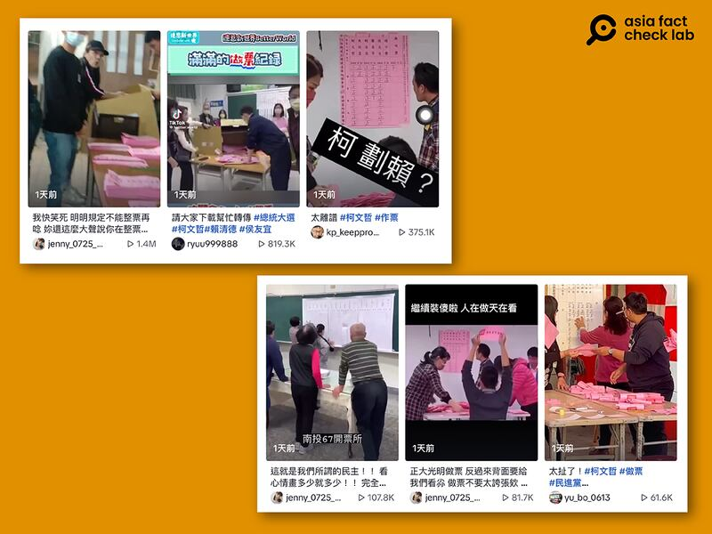
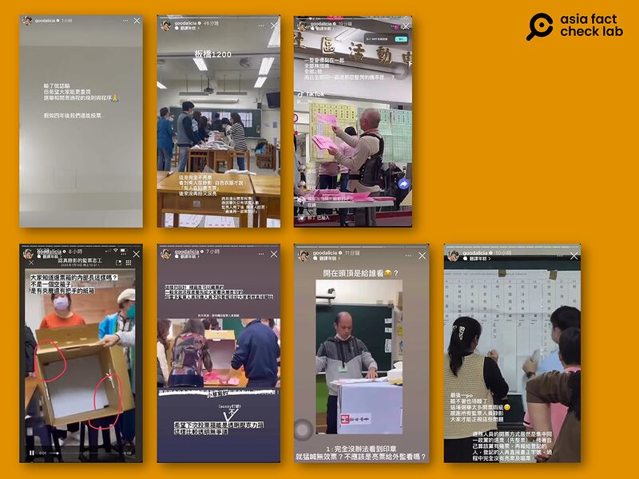
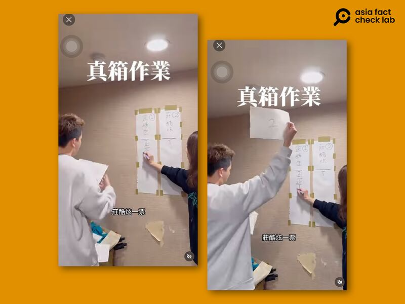
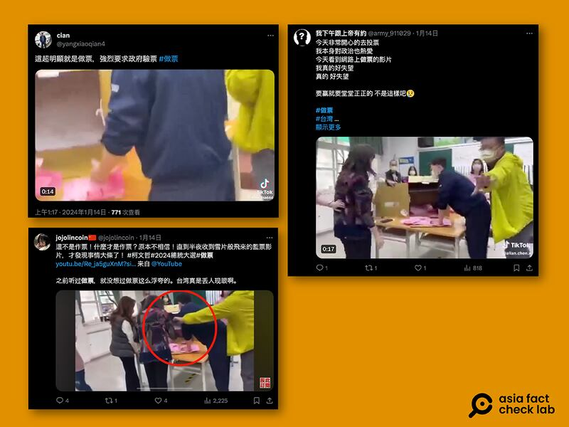
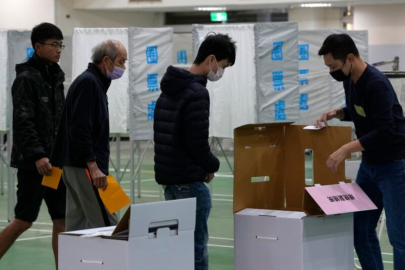
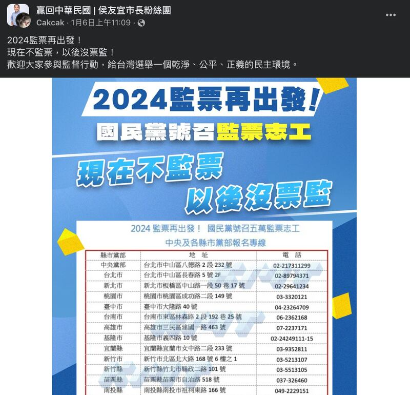
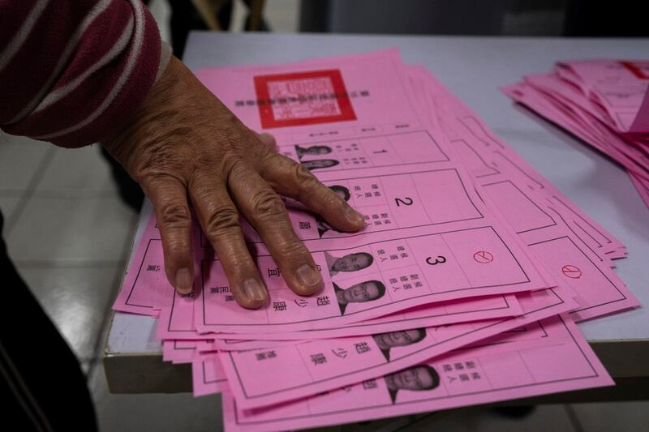
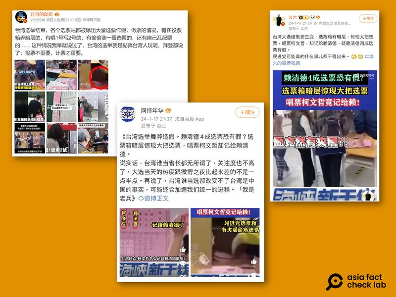

# 傳播觀察｜臺灣大選後，"作票陰謀"爲什麼傳不停？

作者：董喆

2024.01.18 13:31 EST

臺灣總統大選全球矚目，但隨着選舉落幕，結果出爐，質疑選務正當性的短影音開始大量從TikTok流傳到各個社羣平臺，甚至不乏百萬訂閱的網紅轉傳。指控“作票”的傳言像潮水一樣湧進臺灣事實查覈中心、MyGoPen等查覈機構。中選會主委李進勇亦在選後首個上班日親上火線駁斥，“只要法院認定有違法舞弊、作票情形存在，立刻辭職”，並在17日將25件選務造謠案移送司法機關查辦。

臺灣自1996年民選總統以來，“作票”陰謀論反覆出現。和平完成8次總統大選後，爲何“作票”仍是選後陰謀論的代表？亞洲事實查覈實驗室訪問臺灣事實查覈機構與政治學者，拆解選務錯假訊息劇本，並分析選務假資訊如何傷害民主。

## "作票說"如何一夜廣傳？

選舉結束後，14日起各大社羣平臺開始出現宣稱由“監票過程民衆自發錄製”的畫面，觀看次數從數十萬到百萬以上。影片的共同特徵爲秒數短、無法確認前因後果，以及難以判斷投開票所地點。而這些零星的短影音，被擁有社羣聲量的網紅包裝重新轉發後，“作票”的討論更爲廣泛。

選舉結束隔日，TikTok上出現大量質疑選務人員作票的短影音。（圖/tiktok截圖）

“這不是作票！什麼纔是作票？”Youtuber“Bit King比特王出任務”擁有76.4萬位訂閱者， 選舉隔日他上傳了一支16分鐘長的影片，剪輯多支開票所錄影畫面，影片結尾以字卡控訴“開票、計票漏洞百出，還要再過四年？然後再玩一場永遠不會贏的選舉？”直指民進黨政府控制選舉結果，並製造藍白矛盾。

另外，臺灣知名網紅“愛莉莎莎”同樣在選舉隔日發表一連串Instagram限時動態，質疑選務疏失恐影響選舉結果。 “愛莉莎莎”選前表態支持民衆黨候選人柯文哲，她的評論總結“輸了就認輸，但希望大家能更重視選舉和開票過程的規則與程序，假如四年後我們還能投票... .”引發輿論譁然。

臺灣網紅愛莉莎莎在Instagram限時動態貼出多則開票影片，質疑選務疏失影響選舉結果。（圖/Instagram截圖）

Youtuber團體“反骨男孩”成員莊酷炫，則是在社羣平臺Threads上發佈嘲諷影片“真箱作業”，以念A畫B的情節，反諷並質疑選務公正性。

Youtuber團體反骨男孩成員莊酷炫，以短影音嘲諷開票黑箱。（圖/Youtube截圖）

從"比特王出任務"到"愛莉莎莎",他們指證歷歷的作票手法包括票 [箱底有夾層可藏票](https://tfc-taiwan.org.tw/articles/10176),選務人員 [口喊一號手卻畫二號](https://tfc-taiwan.org.tw/articles/10196),以及 [選票沒摺痕](https://tfc-taiwan.org.tw/articles/10194)、亮票不確實等。但這些指控,短時間內就由臺灣事實查覈中心查證后辟謠,也發佈 [總體查覈報告](https://tfc-taiwan.org.tw/articles/10159)。

## "作票"影片將選務瑕疵斷章取義

“Bit King比特王出任務” 這支16分鐘的影片至截稿前已累計199萬次觀看，而根據臺灣事實查覈組織MyGoPen統計，截至15日，這則影片已收到147次民衆回報，是選舉3日內影片訊息排名第一。

根據MyGoPen總編審葉子揚觀察,2020總統大選後,的確有一兩則零星的作票謠言,但因爲當時仍處於COVID-19疫情之下,因此疫情相關謠言仍佔大宗。但"這次影片是非常的大量,在投票隔天收到民衆回報非常多的訊息",MyGoPen在14日一口氣產出了5則選務查覈報告,葉子揚出示數據,單一則 ["臺南投票箱有夾層"](https://www.mygopen.com/2024/01/Pingtung.html)的謠言短短三天內就收到69次回報。

聲稱臺南投票箱有夾層的影片謠言在X平臺上也廣爲傳播。（圖/X截圖）

不只是MyGoPen,臺灣事實查覈中心從2020年總統大選起,經歷九合一地方選舉、四大公投以及地方的罷免與補選案,確立了" [選務謠言劇本](https://tfc-taiwan.org.tw/articles/9986)"。也因此選舉結果出爐後的大量假訊息,也在臺灣事實查覈中心的守備範圍中。

臺灣事實查覈中心總編審陳慧敏15日受訪時分析，在目前事實查覈中心完成的選務查覈中，有一大類屬於“選務瑕疵”，也就是選務人員經民衆指證後修正，“但影片就停在這邊”，選務人員事後的更正或調整並未被放進影片、照片中，讓選務疏失被修正的事件成爲假消息的素材，甚至被誇大成“作票”。

例如網傳" [藍綠灌票?現場抓包後,藍綠才各扣回100票](https://tfc-taiwan.org.tw/articles/10175)",當時確實是記票人員在加總時算錯,因此總統候選人2號及3號多了100票,不過在場監票民衆出言提醒後,就已更正失誤,中選會最終公告的數字也符合現場監票民衆確認的數字。

陳慧敏提醒，“疏失是可以理性檢討的，那但是這些疏失被拍攝下來，去脈絡化的流傳，其實非常攻擊到大家對選務的公信力還有獨立性。”

## "作票說"從選前就被作爲監票的動員理由

亞洲事實查覈實驗室也發現，其實早在選前社羣平臺TikTok上就已出現多則呼籲民衆監票的訊息，他們重新散佈2020總統大選的舊謠言，包含唱票不實、紙箱易於動手腳等。但這些假訊息早經查覈、闢謠。

例如查覈中心在2020年總統大選開票之夜破解的" [喊二號,卻劃記蔡英文](https://tfc-taiwan.org.tw/articles/1959)"的惡意影片,聲源其實來自立委開票,畫面卻帶到總統開票。這則惡意影片在這次選前又重新被流傳,選後則也出現相同指控,但變形爲"唱柯文哲,劃賴清德"。

另外，大選前就有錯假資訊指控中選會改採紙製投票箱是爲了作票，即使中選會多次澄清2014就已基於運送及維修方便爲由使用紙製票匭，這類型謠言在2024大選前仍瘋傳。選後也的確再次出現“紙製票箱有夾層，是爲了藏選票”的說法。

臺灣採用紙製票匭，投票前選務人員會讓民衆確認票箱爲淨空狀態。 （圖／美聯社）

選前在社交媒體上的“警示”和“預告”，對照選後由網紅自稱“揭發”的“作票手法”不謀而合，貫穿整場選舉的謠言加強了部分支持者對選務的不信任。除了假影片重新炒作，政治菁英與支持者意有所指的發言，也預設了選舉可能有作票行爲，加深對選舉不公的恐懼。

例如在侯友宜支持者組成的臉書社團中，國民黨號召監票志工的文宣上就寫明“現在不監票，以後沒票監”。

國民黨號召監票志工文宣寫着“現在不監票 以後沒票監”。

民衆黨總統候選人柯文哲則是在12月24日 [屏東造勢晚會上直說](https://www.youtube.com/live/BIYHfWkrYss?si=TXIjZyCErC6wVV2k&t=13948):"我以前都在想會這樣做嗎?但我發覺他們44秒把你剪掉也不怕,所以這個監票部隊,大家如果有時間,拜託大家去參加,防止真的被作票做掉。"

（編按：柯文哲此處提的44秒，意指總統大選首場電視政見發表，臺媒民視YoutTube轉播過程，柯文哲有44秒片段消失，民視解釋爲“技術問題”。）

陳慧敏根據這四年選戰查覈的經驗，提出了這樣的觀察，“（作票）陰謀論從2020年開始低燒，但到了九合一前，政黨在做動員的時候，就會以可能會被作票，所以大家要趕快來監票，大家會有一個莫名的耳語或是莫名的印象”。

從2020年國民黨參選人韓國瑜，至2024年國民黨參選人侯友宜以及民衆黨參選人柯文哲，皆大方承認敗選。但陳慧敏擔憂，選務謠言雖不是政黨發起，但卻恐成爲每次選舉政黨或是政治人物“借勢”及“動員”的力量。

## "作票說"會動搖臺灣的民主選舉制度嗎？

臺灣自1987年解嚴、1996年民選總統後，邁入民主化逾30年，“作票”傳言卻仍在幾乎每次大選後成爲話題，另外臺灣身爲科技先進國家，搭着這波“作票說”的還有選舉方式過於落伍的批評。

東吳大學政治系特聘教授黃秀端告訴亞洲事實查覈實驗室，選民的不信任心理有其歷史因素，解嚴前由國民黨一黨獨大，確實屢傳有投票箱變魔術箱（藏票）以及開票一半卻突然停電，當時民衆尤其是反對黨對投票作業相當不信任。 2000年總統大選，陳水扁與宋楚瑜得票數相當接近；接着2004年陳水扁競選連任遇槍擊事件，“選民的不信任感一直存在”。

黃秀端認爲，即便如此，“紙本開票”仍然被認爲是最安全的，因爲“能夠見證”。她提到，中選會曾多次委託學者調查，民衆對網路或電子投票仍不信任，“你一票，我一票，大家都可以看的到，這個是大家覺得最公平的，我都可以眼見爲憑”。

臺灣民主化30年，至今各類選舉仍採用紙本投票，圖爲總統大選選票。 （圖／美聯社）

至於紙本投票要成功作票，黃秀端直言難度很高。首先，要影響選舉結果動輒需要數十萬甚至數百萬票，需要過半以上開票所都作弊纔有可能，沒有選務人員願意承擔這樣的風險。另外，選務由各縣市選委會執行，目前各縣市主政者兩黨皆有，且每一投開票所都有不同政黨派出的監察員，如何以作票讓特定政黨人士勝選？

政大選舉研究中心研究員蕭怡靖則認爲，“也許會因爲有極少數比較極端的民衆內心無法接受選舉的結果，所以他做出了這樣的行爲，但是如果這個只是零星的狀況的話，倒是一個不用太把他放大檢視。”關鍵在於政黨菁英如何看待，若政黨政治的精英沒有隨之起舞，便不必過度憂慮。

## "作票說"成爲中國輿論打擊臺灣民主的工具

民衆黨總統候選人柯文哲16日 [於臉書發文](https://archive.ph/cAOJy),成爲首位對作票說回應的總統候選人。他表示黨部收到民衆大量監票影片,反應票箱裏有夾層、數百張選票被人竊走、開票與唱票不一致等現象,對選務瑕疵提出質疑。 [但他也認爲](https://youtu.be/b1UZvwoaGsY?si=ykBzrHVcKA0NjVzm&t=53),"臺灣已經是一個相當成熟的民主國家,大規模作票我認爲不可能",此舉後續將如何影響支持者,值得觀察。

隨着中選會對選務謠言採取法律行動，以及政治精英出面呼籲，臺灣內部對於“作票”的激化言論未擴大。但是這段時間瘋傳的選務謠言影片，已經悄悄蔓延至中國社羣平臺。

福建省廣播影視集團東南衛視旗下節目《海峽新幹線》剪輯短影音，指出“賴清德4成選票恐有假？”稱唱票柯文哲竟記給賴。微博大V“正直的磊哥”則貼出多個臺灣社羣平臺上流傳的影片截圖，稱“各選票站都被爆出大量選票作假”，嘲諷“選舉就是糊弄臺灣人玩”。

臺灣社羣平臺流傳的選務謠言影片，已經在中國社羣平臺微博上傳開。（圖/微博截圖）

由此可見，臺灣內部流傳的選務謠言雖然已由官方或是民間查覈組織闢謠，但不可避免的已被中國媒體、意見領袖挪用，作爲“臺灣選舉不可信”的宣傳。

*亞洲事實查覈實驗室（Asia Fact Check Lab）針對當今複雜媒體環境以及新興傳播生態而成立。我們本於新聞專業主義，提供專業查覈報告及與信息環境相關的傳播觀察、深度報道，幫助讀者對公共議題獲得多元而全面的認識。讀者若對任何媒體及社交軟件傳播的信息有疑問，歡迎以電郵afcl@rfa.org寄給亞洲事實查覈實驗室，由我們爲您查證覈實。*

*亞洲事實查覈實驗室在X、臉書、IG開張了,歡迎讀者追蹤、分享、轉發。X這邊請進:中文*  [*@asiafactcheckcn*](https://twitter.com/asiafactcheckcn)  *;英文:*  [*@AFCL\_eng*](https://twitter.com/AFCL_eng)  *、*  [*FB在這裏*](https://www.facebook.com/asiafactchecklabcn)  *、*  [*IG也別忘了*](https://www.instagram.com/asiafactchecklab/)  *。*

[Original Source](https://www.rfa.org/mandarin/shishi-hecha/hc-01182024132453.html)