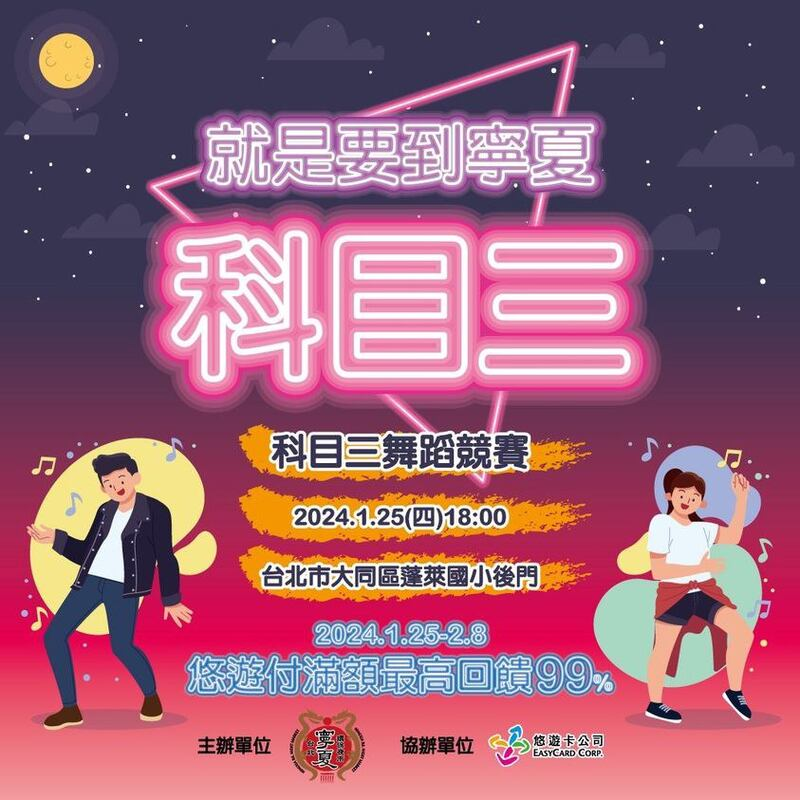
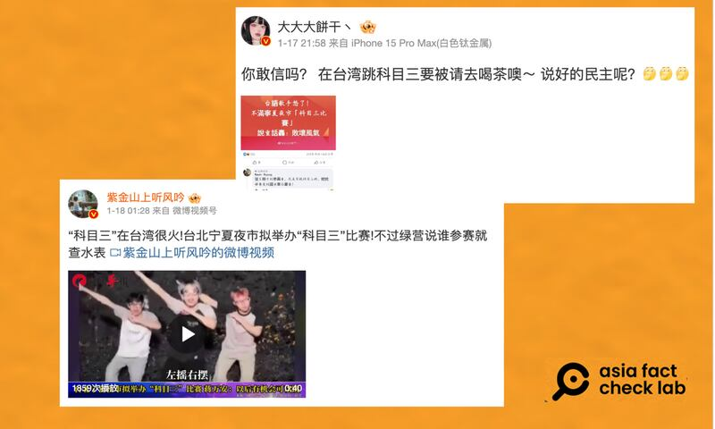

# 事實查覈｜在臺灣跳"科目三"會被"喝茶"？

作者：莊敬

2024.01.19 16:58 EST

## 標籤：缺乏證據

## 一分鐘完讀：

臺北市寧夏觀光夜市即將舉辦“科目三舞蹈競賽”，這股來自中國的社交媒體風潮掀起熱烈討論。在臺灣，部分網民批評這是中國“舞統臺灣”，在中國社交媒體上也有不少相關討論，有部分微博“大V”發文，聲稱在臺灣跳科目三會被“查水錶”“請喝茶”（指遭約談、調查）。

然而，這種說法並沒有依據。確實有網民在臺灣媒體臉書專頁的留言稱“在臺灣跳科目三要被請去喝茶”，但這並非可靠的消息來源。亞洲事實查覈實驗室向主辦方查證，對方表示“沒有任何政府單位關切”。

## 深度分析：

臺北市寧夏觀光夜市1月15日在臉書專頁 [宣佈](https://www.facebook.com/photo/?fbid=840584791205523&set=a.706358111294859),將在1月25日舉辦"科目三舞蹈競賽",卻因這股社交媒體風潮是來自於中國"而遭部分網民批評,質疑"抖音統戰""舞統臺灣",話題熱度持續多日。

臺北市寧夏觀光夜市將舉辦"科目三舞蹈競賽"，但因科目三是抖音熱門曲而引起網友論戰。（寧夏觀光夜市臉書）

在中國平臺微博上也有不少相關討論，還出現了“#科目三的風吹到了臺灣省#”話題。但部分“大V”博主發文內容有些可疑，例如擁有五百多萬粉絲的軍事博主“紫金山上聽風吟”聲稱“綠營說誰參賽就查水錶”。

另一位博主“大大大餅乾丶”發文則寫着“在臺灣跳科目三要被請去喝茶，說好的民主呢？”而他所附上的消息來源是一張網民“Kevin Kuang ”在臺灣媒體臉書專頁留言的截圖，：“從主辦方到參與者，凡是有跳科目三的，統統都要受到國安單位審查！”

從"Kevin Kuang"在臉書的公開資訊看來,他是一般用戶,並非可靠的消息來源。他過去在臉書發佈或轉發的內容,包括"俄羅斯攻擊烏克蘭,只有美國是贏家"等內容,以及"新冠病毒真正源自哪裏?M・CAM總裁拋出重磅炸彈"的視頻,而這則視頻已經 [查覈](https://tfc-taiwan.org.tw/articles/6386)爲沒有事實依據的傳言。

部分"大V"博主在微博發文，稱在臺灣跳科目三會被查水錶、請喝茶。（微博截圖）

## 主辦單位駁斥網傳謠言

亞洲事實查覈實驗室18日電訪寧夏夜市觀光協會理事長林定國，詢問他是否遭約談、調查，林定國回應，“臺灣是個民主自由的地方，沒有任何政府單位關切，只有網民打電話來騷擾。”

關於選曲，林定國說明，只是結合當下時事，寧夏夜市先前也曾以日本、韓國、臺灣的熱門曲目舉辦多場比賽或表演，希望透過有趣的活動吸引年輕人；“科目三舞蹈競賽”活動將照原定計劃舉辦，目前正積極籌畫再辦臺灣歌手王彩樺的“保庇舞”。

根據 [臺灣媒體報道](https://news.ltn.com.tw/news/politics/breakingnews/4554863),臺北市長蔣萬安表示,若科目三能夠"舞統臺灣",臺灣的流行文化早就統一對岸了,臺灣要對自己的多元文化有信心。

亞洲事實查覈實驗室向臺灣的法務部查覈，對方回覆，貼文內提到的跳舞並非犯罪行爲。

*亞洲事實查覈實驗室(* *Asia Fact Check Lab* *)針對當今複雜媒體環境以及新興傳播生態而成立。我們本於新聞專業主義,提供專業查覈報告及與信息環境相關的傳播觀察、深度報道,幫助讀者對公共議題獲得多元而全面的認識。讀者若對任何媒體及社交軟件傳播的信息有疑問,歡迎以電郵* *afcl@rfa.org* *寄給亞洲事實查覈實驗室,由我們爲您查證覈實。*

*亞洲事實查覈實驗室在* *X* *、臉書、* *IG* *開張了,歡迎讀者追蹤、分享、轉發。* *X* *這邊請進:中文*  [*@asiafactcheckcn*](https://twitter.com/asiafactcheckcn)  *;英文:*  [*@AFCL\_eng*](https://twitter.com/AFCL_eng)  *、*  [*FB* *在這裏*](https://www.facebook.com/asiafactchecklabcn)  *、*  [*IG* *也別忘了*](https://www.instagram.com/asiafactchecklab/)  *。*

[Original Source](https://www.rfa.org/mandarin/shishi-hecha/hc-01192024165245.html)