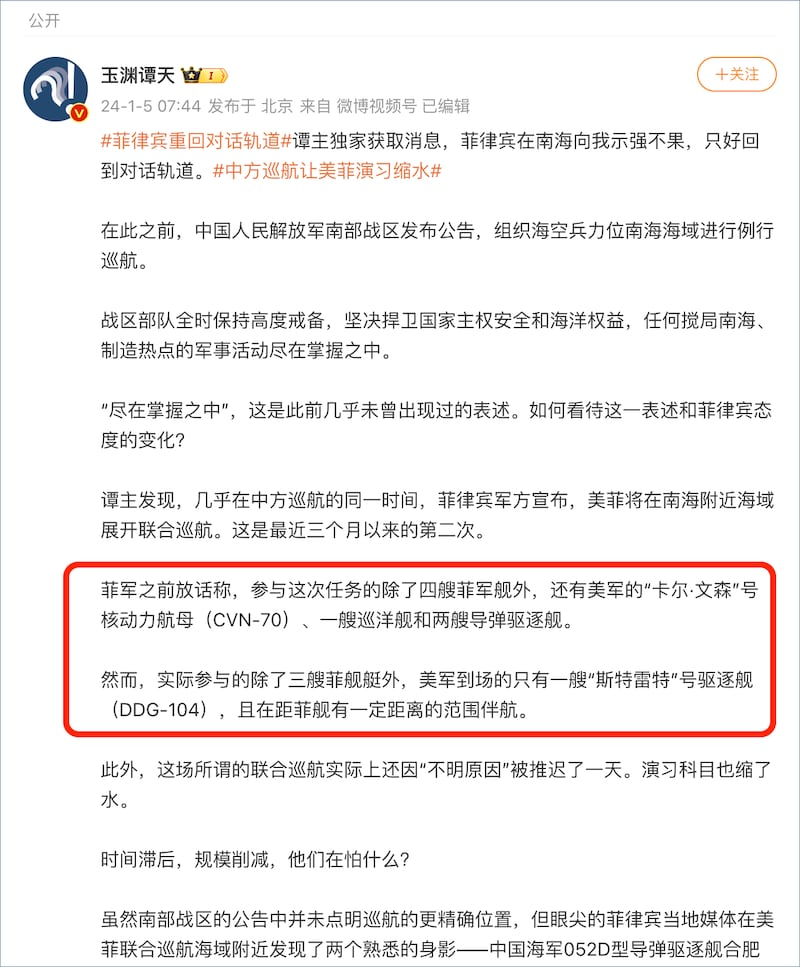
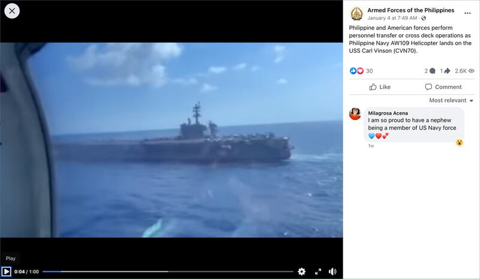
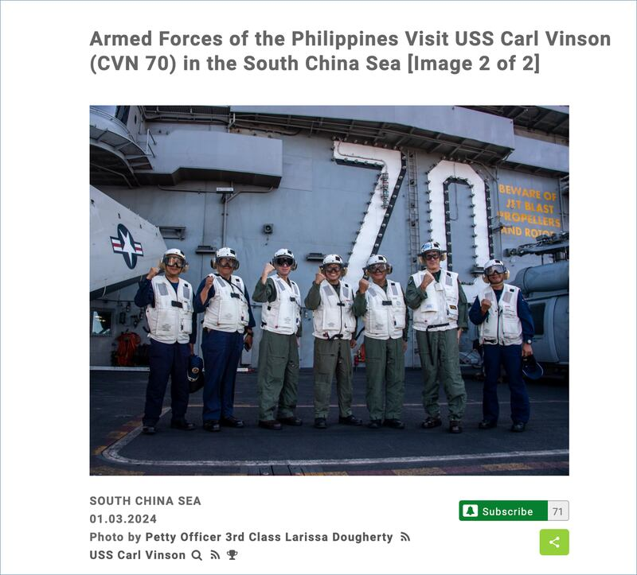

# 事實查覈｜美國菲律賓在南海的聯合演習，美國航母沒去？

2024.01.23 17:25 EST

## 標籤：缺乏證據

## 作者：沈軻

## 一分鐘完讀

1月3日至4日，菲律賓和美國海軍在南海爭議海域舉行聯合軍事行動，此舉被中國外交部稱爲“以炫耀武力爲目的的軍事挑釁活動”。

1月5日，中央電視臺旗下的新媒體“玉淵譚天”在微博發文，表示“獨家獲取消息”，菲律賓“示強不果” , 此次軍事行動的規模比宣稱的要小。並且稱美國海軍只實際派出一艘艦艇，此前公告的“卡爾·文森”號核動力航母（CVN-70）等並沒有到場。

經覈查，“玉淵譚天”的這些說法缺乏證據。美國和菲律賓官方發佈的聲明和影像資料表示，美軍派出了計劃中提到幾艘軍艦，美軍也公佈了官方視頻顯示“卡爾·文森”號參加軍事行動的影片。而“玉淵譚天”提供的“獨家消息”，則沒有證據支持，其文中引述的“CNN菲律賓臺記者”的所描述的情況，也與CNN菲律賓臺的公開報道相矛盾。

## 深度分析

美國、菲律賓此次軍事行動行動在南海爭議海域進行，菲律賓和美國將其描述爲“海上合作行動（maritime cooperative activity）”,中國官方媒體稱之爲“聯合巡航”，也有不少國際媒體則將這次行動直接稱爲“軍事演習（drill）”。

"玉淵譚天"1月5日發佈在 [新浪微博](https://web.archive.org/web/20240123163346/https:/weibo.com/7040797671/NAthfaaHI)、網易等平臺的文章 [表示](https://web.archive.org/web/20240117142651/https:/new.qq.com/rain/a/20240105A090VJ00),其獲得獨家消息,稱菲律賓"態度變了",這次行動的規模變小,並且美國的"卡爾·文森"號核動力航母沒有到場。但該文並未提及任何消息源,也未發佈有關此次行動的任何圖片、視頻,只是用文字描述了這次"聯合巡航"的規模:

*“菲軍之前放話稱，參與這次任務的除了四艘菲軍艦外，還有美軍的“卡爾·文森”號核動力航母（CVN-70）、一艘巡洋艦和兩艘導彈驅逐艦。*

*然而，實際參與的除了三艘菲艦艇外，美軍到場的只有一艘“斯特雷特”號驅逐艦（DDG-104），且在距菲艦有一定距離的範圍伴航。”*

該媒體當天晚些發佈在 [央視網](https://web.archive.org/web/20240123163935/https:/news.cctv.com/2024/01/05/ARTIDtXzhrlj66mqhVOum4t3240105.shtml)的同題文章則在先前版本的基礎上有所更新,稱這個"獨家消息"來自"CNN菲律賓臺的隨軍記者"的描述。

“玉淵譚天”文章表示，這次軍事行動中，只有一艘美國軍艦參與。(圖/微博截圖）

然而, "玉淵潭天"的說法並不正確。亞洲事實查覈實驗室找到,在行動的前一天,美國印太司令部發布 [新聞稿](https://www.pacom.mil/Media/News/News-Article-View/Article/3630769/philippines-us-partner-in-maritime-cooperative-activity-in-south-china-sea/'),明確指出美國四艘軍艦準備參與這次行動,除了斯特雷特號以外,還有卡爾文森號(USS Carl Vinson,CVN-70)、基德號(USS Kidd,DDG-100)和普林斯頓號(USS Princeton, CG-59)。

新聞稿還列出了參與此次行動的三艘菲律賓艦艇，包括葛雷戈里奧·德爾·皮拉爾（BRP Gregorio del Pilar，PS-15）、拉蒙·阿爾卡拉斯號 (BRP Ramon Alcaraz，PS-16) 和南達沃號登陸平臺船塢（BRP Davao del Sur，LD-602）。

並且,菲律賓武裝部隊在臉書上 [發佈](https://www.facebook.com/armedforcesofthephilippines/posts/pfbid0eXx5i8T7P1WJ5D6MtMxyy5we3ofNy7KdNvKngrgy5rw5LXdAm7VGhqnZwKWSVsiQl)了據稱是行動當天的幾段視頻,其中一段顯示了一架菲律賓直升機在卡爾文森號上降落,在畫面右側的控制塔上正寫着"卡爾·文森"號的船體編號70。

菲律賓武裝部隊公佈的聯合軍事行動視頻畫面(圖/菲律賓武裝部隊官方臉書賬號截圖）

一位美國太平洋艦隊公共事務官員回覆 AFCL,美國國防部的防衛視覺信息發佈網站公佈了這次行動中 [美國和菲律賓將領在卡爾文森號上的合影。](https://www.dvidshub.net/image/8189670/armed-forces-philippines-visit-uss-carl-vinson-cvn-70-south-china-sea)美國軍方媒體 [《防務新聞》](https://www.youtube.com/watch?v=SS20d5iOr-w)也發佈了據稱是這次行動的畫面,分別是從艦艇上和公衆拍攝,畫面中"卡爾·文森"號在海面上航行。然而,亞洲事實查覈實驗室並無法覈實這些影像資料的準確拍攝地點。

對於"玉淵譚天"發佈於央視網的文章中提及的"CNN菲律賓臺記者"的描述,亞洲事實查覈實驗室檢索了CNN菲律賓臺(CNN Phillippines)對此次行動的報道,確實發現了該臺3日發佈的報道中,只提到了一艘美國軍艦在當天出現,但該報道還明確提到,這次行動將於3-4日進行兩天,美國將派出包括航空母艦在內的4艘艦艇。行動結束後的,CNN菲律賓臺也發佈了 [這次行動的視頻](https://www.youtube.com/watch?v=JD0tOBaDd50&t=187s),其中包括"卡爾·文森"號的畫面。

因此，“玉淵譚天”在5日行動結束之後發文稱“美國航母沒到場”之說來源於CNN菲律賓臺的說法，也沒有依據。

聯合行動期間，菲律賓和美國海軍領導人在卡爾文森號上合影留念。(圖/美國國防部防衛視覺信息發佈服務網站截圖）

自去年以來, [南海地區的緊張局勢不斷升級](https://www.rfa.org/mandarin/Xinwen/2-12102023115557.html),菲律賓和中國之間爆發一系列衝突事件。菲律賓和美國於去年11月首次聯合開展巡邏行動,進行了爲期三天的軍事演習。

對於1月初進行的美菲第二次聯合軍事行動,中國 [態度強硬](https://www.mfa.gov.cn/web/wjdt_674879/fyrbt_674889/202401/t20240104_11218767.shtml),稱之爲"以炫耀武力爲目的的軍事挑釁活動",在行動前後,解放軍南部戰區在該爭議海域中進行了對等的" [例行巡航](http://www.news.cn/politics/20240103/e40f544bf5a4436c8846cd541c6003fa/c.html)",有護衛艦、驅逐艦跟隨美、菲艦艇。然而,無論是中國官方的公告,還是官媒"玉淵譚天"的文章,都未能提供美國"卡爾·文森"號核動力航母等未參加此次行動的證據。

*亞洲事實查覈實驗室(Asia Fact Check Lab)針對當今複雜媒體環境以及新興傳播生態而成立。我們本於新聞專業主義,提供專業查覈報告及與信息環境相關的傳播觀察、深度報道,幫助讀者對公共議題獲得多元而全面的認識。讀者若對任何媒體及社交軟件傳播的信息有疑問,歡迎以電郵*  [*afcl@rfa.org*](mailto:afcl@rfa.org)  *寄給亞洲事實查覈實驗室,由我們爲您查證覈實。*

*亞洲事實查覈實驗室在X、臉書、IG開張了,歡迎讀者追蹤、分享、轉發。X這邊請進:中文*  [*@asiafactcheckcn*](https://twitter.com/asiafactcheckcn)  *;英文:*  [*@AFCL\_eng*](https://twitter.com/AFCL_eng)  *、*  [*FB在這裏*](https://www.facebook.com/asiafactchecklabcn)  *、*  [*IG也別忘了*](https://www.instagram.com/asiafactchecklab/)  *。*

[Original Source](https://www.rfa.org/mandarin/shishi-hecha/hc-01232024171833.html)