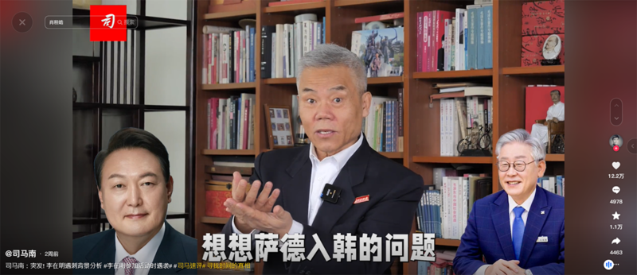
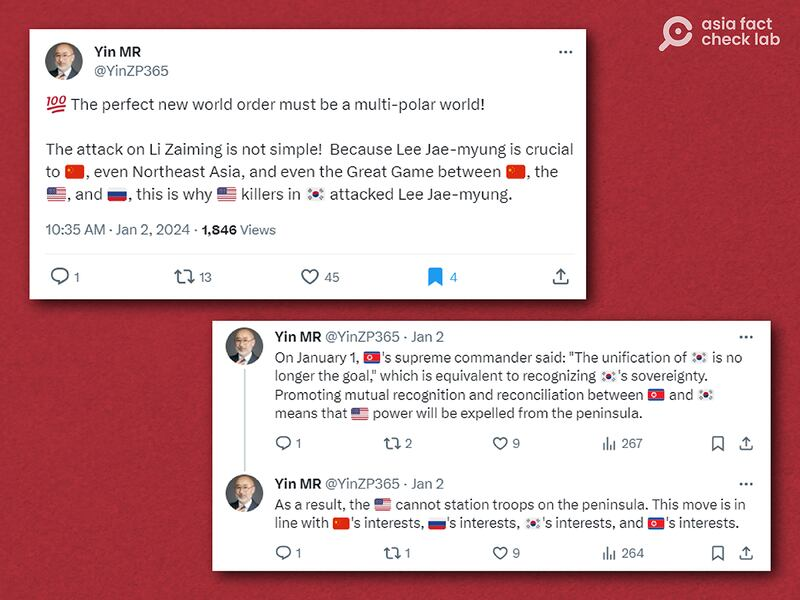

# 傳播觀察｜中文世界如何傳播韓國政客遭刺殺的“陰謀論”？

作者：鄭崇生，發自華盛頓

2024.01.24 18:21 EST

2024年伊始，韓國共同民主黨主席李在明遭刺傷，中國媒體1月2日當天很快就報道相關消息，“李在明遇襲”的標籤更一度衝上新浪微博熱搜榜，除此之外，在中國網絡世界上，陰謀論、甚至是假信息，也在社交媒體平臺流傳。

例如,網絡大V司馬南當天很快製作 [視頻](https://www.douyin.com/user/MS4wLjABAAAAJkV950tMlilZM8Sqikt1rSxDKGnepcGg4h25yPguOcE?modal_id=7319515577939397924&vid=7319515577939397924),在抖音上以影射的方式、質疑李在明是因爲反美日立場鮮明遭刺殺,而幕後可能有團體主導,甚至牽扯上美、中 、韓的地緣政治格局。

司馬南在事件發生之初，以分析韓國國內政治競爭爲切入點，包括李在明的政治發跡路、他與現任總統尹錫悅之間的競爭等，試圖塑造李在明因反美、反日而惹上殺身之禍的陰謀論，他以引導與質問的方式說：“大家想一想，日本核污染水的問題，想想薩德入韓的問題，想想尹錫悅政府一系列的倒行逆施，以至於在東北亞、在亞洲，在亞太一系列複雜的政治事件當中，李在明所扮演的角色”“如果殺手的後面還有一個團體呢？如果殺手的後面還有更大的政治的圖謀呢？這情況是不是就複雜了？”

司馬南在社交媒體上發佈視頻分析李在明遇襲原因。 (圖截取自YouTube)

相較之下,《中國新聞週刊》快速且更爲紮實分析李在明遇襲對韓國政局及他自身政治生命影響的 [文章](https://weibo.com/ttarticle/p/show?id=2309404986074492699009),至今只獲得五萬多的閱讀量、20個點贊數。儘管司馬南的一些說法背離韓國政壇的實際情況,但他這種以影射及陰謀論來論述的方式,在中國的輿論場更能吸引眼球。

“陰謀論要達到傳播效果，要有許多條件配合。”美國馬里蘭大學菲利普梅理爾新聞學院（Philip Merrill College of Journalism）講師李惟平告訴亞洲事實查覈實驗室。儘管在這次事件中，中國官方媒體的報道中規中矩，沒有司馬南這類的論述，但在中國這樣的極權社會中，民間氛圍對一個事件會有的心態與反應，深受官方長期引導塑造影響，它“就像膝反射一樣，會建立一套根深蒂固的思考迴路。”

親美色彩鮮明的尹錫悅上任以來,中國官方媒體並不掩飾對他的不滿,更試圖放大韓國也有衆多反美輿論的印象,尤其是李在明去年赴中國駐韓大使邢海明的官邸與邢海明會面後,在韓國引發輿論質疑,但 [《環球時報》](https://web.archive.org/web/20240119021318/https:/mil.news.sina.com.cn/2023-06-10/doc-imywuhck7723742.shtml)卻與中國外交口徑一致,趁機數落尹錫悅政府的不是,對於像是韓國親保守派報刊 [《朝鮮日報》](https://cnnews.chosun.com/client/news/viw.asp?nNewsNumb=20230659193&cate=C01&mcate=M1001)質疑李在明遭中國利用,並批評韓國官方對邢海明過於優待隻字不提。也是這同一時間,反對日本排放核處理水的李在明成爲了中國左派 [文章](https://web.archive.org/web/20240119020850/http:/m.wyzxwk.com/content.php?classid=16&id=480516)討論的英雄人物。

## 司馬南的知識“硬傷”

長期的輿論引導下，中國民間對親中的李在明與親美的尹錫悅好惡有別。不過，司馬南的論述有不少事實硬傷，例如他把前韓國總統文在寅說成是親美派，這個明顯的錯誤也已經被不少中國網友指出。

司馬南視頻截圖

李在明和文在寅同屬共同民主黨，他被視爲文在寅的接班人，但2022年總統大選時、他以極小的差距輸給了立場被視爲保守派的尹錫悅。

另外，司馬南在視頻中還說，李在明去年8月絕食靜坐是抗議尹錫悅政府在選舉過程中發生“營私舞弊行爲”，這個說法也與當時韓國政壇的背景完全不符。

李在明總統選舉落敗後,去年3月遭韓國首爾中央地方檢察廳以涉嫌收賄、瀆職與隱瞞犯罪等罪嫌起訴,李在明否認檢方指控, [並反指這是尹錫悅政府的"政治報復"](https://chinese.joins.com/news/articleView.html?idxno=112015),隨後,他在同年8月31日、即就任共同民主黨黨魁滿一週年時宣佈絕食抗議,他當時 [訴求](https://cn.yna.co.kr/view/ACK20230918000800881)是要尹錫悅政府施政革新,並全面改組內閣。

在韓國外國語大學（Hankuk University of Foreign Studies）國際地區研究生院（GSIAS）教授阿特金森（Joel Atkinson）看來，司馬南的視頻是個“質量非常糟糕”的作品。

研究東亞政治與中國的阿特金森套用前《環球時報》總編胡錫進 [說過的話](https://web.archive.org/web/20140418123458/https:/news.sina.com.cn/c/2014-04-02/103329848165.shtml)評價司馬南,他告訴亞洲事實查覈實驗室,"(中國)媒體有兩個老闆,政府和市場,而政府最重要"。他認爲,"司馬南是屬於市場驅動的一類",而中國政府不會通過官方媒體來宣傳李在明遇襲的陰謀論,畢竟從干涉韓國事務的角度來說這是過於挑釁的,且會引起強烈反彈。

## 中國官方放任陰謀論的原因與成

阿特金森認爲，中國官方爲這些陰謀論提供了空間，並可能成爲它的一種宣傳手段。對內，它把美國和日本描繪成邪惡的、暴力的力量，而韓國右翼則是美、日走狗；對外，它試圖傳遞的訊息是，韓國的制度敗壞，韓國人不應該信任自己的政府與彼此，所有人都應該反對薩德系統（THAAD）、反對改善與日本的關係，“無論如何，這些論述確實都符合黨的目標。 ”

司馬南雖然收穫了流量，但持平而論，李在明遇刺陰謀論的傳播效果在中國內外並不“出色”。

李惟平說,除了韓國媒體、官方在事件的報道與處理上都有清楚透明的資訊公開,事件本身隨着李在明很快脫險,已於10日出院,隨後並 [重返工作崗位](https://cn.yna.co.kr/view/MYH20240117006800881),陰謀論很快沒有了養分。

自稱“誠實的中國人”，時常在X（Twitter前身）上傳播各類陰謀論的用戶Yin MR在事發後以英文發文指控稱，李在明遇刺與地緣政治競爭有關，更直指是美國派人刺殺他，但完全沒有提出證據。

Yin MR也時常轉發中國官方媒體的論述或諷刺漫畫，討論的話題包括“東昇西降”“美國衰敗”“中國崛起”等，他也不時針貶臺海局勢、批評臺灣執政黨民進黨，不少中國外交官也在X上關注了他。

Yin MR在X上發表的言論 (圖截取自X)

不論是開放社會或言論受到管控的國家,陰謀論都是存在的,就像李在明遇襲的這次事件,韓國也出現了一些陰謀論,有人甚至質疑該事件是李在明自導自演的,只因爲他遇刺的情節,和2016年的韓國犯罪電影 [《阿修羅》](https://www.google.com/search?q=Asura%3A+The+City+of+Madnes&sourceid=chrome&ie=UTF-8#fpstate=ive&vld=cid:6c229930,vid:U3OZxuAyXQo,st:0)中、反派市長遭美工刀割傷額頭的橋段非常相似。

但隨着兇手遭起訴，李在明康復，阿特金森更關注的是，中國對韓國政治的關心與介入程度，會如何影響韓國政局發展。

## 韓國版“中國介選”？

阿特金森分析，在李在明的例子上，北京表達的是會更願意與韓國像是李在明這樣的左派人物合作，韓國左派政治人物也會告訴選民，他們的政治立場可以最大程度地與中國合作，對韓國經濟有幫助，有鑑於韓國國內現在對中國的好感度非常低，韓國右派人士也借力使力，樂於強調左派的親中立場，並以此作爲理由，攻擊對方不可信任，“現在的狀況是，在韓國，能與中國合作更像是一種負擔，而不是一種（政治）資產 ”。阿特金森補充，尤其是去年李在明與邢海明共進晚餐，邢海明卻在活動中公然批評尹錫悅，韓國不少民衆感到冒犯、視邢海明爲傲慢，這也讓李在明看起來像親中走狗。

韓國今年4月將舉行國會改選，一般預料，在遇刺前貪腐疑雲纏身的李在明，面臨着同黨同志反對、甚至出走另立新政黨的挑戰，在他遇刺康復後，李在明與尹錫悅所屬政黨的再次對決，民調目前相當接近，尹錫悅能否翻轉目前朝小野大的格局，難有定論。

但中國持續在韓國展開有利於中國的輿論環境,並沒有停止。亞洲事實查覈實驗室去年底曾 [報道](2023-12-07_事實查覈 ｜ 媒體觀察："中國製造"的韓國假新聞網站.md),韓國國家情報院(下稱"國情院")證實,三家中國公司在韓國投資、設立38個韓語新聞網站,散播"親中、反美日"的文章,國情院警示,儘管這些網站沒什麼影響力,但北京有意圖操控韓國的網絡輿論。

李惟平說，中國努力在佈局全球新聞機構，例如跟當地媒體合作、收購，目的是要營造有利於中國的輿論環境，而國情院去年的發現，她認爲是中國長期的戰略行動之一，她和阿特金森都認爲，中國在韓國的訊息操作與認知作戰，需要長時間持續關注。

阿特金森還提到，要將中國認知作戰的資訊與論述揭露到何種程度，又往往是個棘手問題，韓國政府向公衆揭露，有可能助長了這些網站與論述的觸擊量與知名度，加上這又會讓政府看起來像是在打壓真相，保護自己，反而讓中國的認知作戰獲得信任。

“針對中國的認知作戰，各國政府還是該發佈‘正確且清楚’的訊息”，他說，在韓國的例子來看，更是如此。對抗陰謀論，同理亦可證。

*亞洲事實查覈實驗室(* *Asia Fact Check Lab)針對當今複雜媒體環境以及新興傳播生態而成立。我們本於新聞專業主義,提供專業查覈報告及與信息環境相關的傳播觀察、深度報道,幫助讀者對公共議題獲得多元而全面的認識。讀者若對任何媒體及社交軟件傳播的信息有疑問,歡迎以電郵afcl@rfa.org寄給亞洲事實查覈實驗室,由我們爲您查證覈實。*

*亞洲事實查覈實驗室在* *X、臉書、IG開張了,歡迎讀者追蹤、分享、轉發。X這邊請進:中文*  [*@asiafactcheckcn*](https://twitter.com/asiafactcheckcn)  *;英文:*  [*@AFCL\_eng*](https://twitter.com/AFCL_eng)  *、*  [*FB在這裏*](https://www.facebook.com/asiafactchecklabcn)  *、*  [*IG也別忘了*](https://www.instagram.com/asiafactchecklab/)  *。*

[Original Source](https://www.rfa.org/mandarin/shishi-hecha/hc-01242024180846.html)