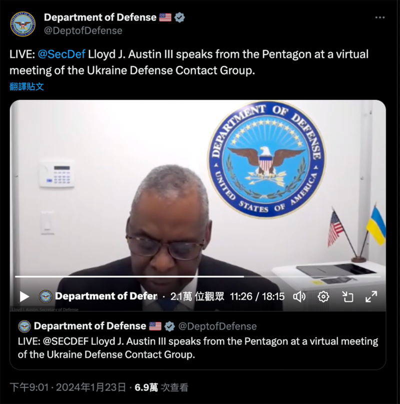

# 事實查覈｜美國防部長在烏克蘭遇襲身亡？

董喆

2024.01.25 14:43 EST

## 標籤：錯誤

## 一分鐘完讀：

社羣平臺Ｘ與微博近日出現一則消息稱，美國國防部長勞埃德·奧斯汀（Lloyd Austin）1月初於烏克蘭遭俄羅斯導彈擊中身亡。亞洲事實查覈實驗室查證發現，消息所援引的“外媒”是被美國查覈組織認證的假資訊網站，美國國防部回應未聽聞此事，且美國衆議院軍事委員會主席1月18日才致函奧斯汀，要求他出席2月14日的聽證會。社羣媒體上流傳奧斯汀身亡爲錯誤信息。

## 深度分析：

美國國防部長奧斯汀於2023年12月初診斷出前列腺癌後進行了手術，術後因併發症住院。但他未按規定及時通報病情，引發輿論風波，美國衆議院軍事委員會主席羅傑斯（Mike Rogers）宣佈對此啓動正式調查。

爭議發酵同時,社羣平臺X以及微博開始傳播有關奧斯汀在烏克蘭遭擊斃的消息。X博主豫章信使20日 [發推文稱](https://archive.ph/Y9pbV)"俄羅斯消息人員:1月3日,美國國防部長勞埃德·奧斯汀,在烏克蘭被俄羅斯導彈襲擊身亡。"

“豫章信使”發佈消息稱據“俄羅斯消息人員”，美國防部長在烏克蘭遇襲身亡 （圖截取自X）

同樣在微博也有多則有關奧斯汀遇襲的發文,稱美國"密不發喪",而消息來源是"外媒報道"。中國的門戶網站,如 [搜狐網](https://archive.ph/MDOBs#selection-251.0-253.1)、 [網易](https://archive.ph/CvVyS)等也出現報道,以"美防長因癌住進ICU?俄羅斯聲稱其在基輔被炸死,到底誰在撒謊"等爲題,質疑奧斯汀到底是罹癌還是遇襲身亡。

中文社交媒體上美防長遇襲身亡消息被廣泛傳播 （圖截取自新浪微博）

## 美國國防部否認奧斯汀遇襲傳言

亞洲事實查覈實驗室通過微博截圖中的關鍵字及記者名稱 Michael Baxter 找到原始報道，這是一篇由美國網站“Real Raw News”於1月7日刊登的文章《俄羅斯宣稱：奧斯汀死於烏克蘭（Russian Claim: Austin Dead In Ukraine）》。文章中寫道，一名俄羅斯聯邦安全局特工堅稱，奧斯汀和一羣烏克蘭高階軍官藏匿在基輔地下20英尺處的一個軍事指揮中心，而非住院。且1月3日一枚俄羅斯巡航導彈襲擊了這個中心，奧斯汀遇襲身亡。

美國國防部以電子郵件回覆亞洲事實查覈實驗室，稱“並未留意到此事件（I am not aware of any incident.）”。

奧斯汀最近一次訪問烏克蘭是在2023年11月,確切抵達日期不明,但美國國防部於11月20日發佈奧斯汀與烏克蘭總統澤倫斯基會面的 [新聞稿](https://www.defense.gov/News/News-Stories/Article/Article/3594932/austin-reaffirms-us-support-during-ukraine-visit/)。他在11月22日返美,並在五角大樓舉行的烏克蘭國防聯絡小組視訊會議上 [發表談話](https://www.c-span.org/video/?532015-1/secretary-austin-remarks-ukraine-defense-contact-group-meeting)。根據 [美國國防部說明](https://www.defense.gov/News/News-Stories/Article/Article/3639851/austin-recovering-making-progress-after-surgery-complications/),隨後,奧斯汀於12月22日接受了治療前列腺癌的手術後住院,但一直有在履行職務。

奧斯汀在被網傳1月3日"身亡"後,其實仍有露面行程。1月19日時,根據 [國防部消息](https://www.defense.gov/News/Releases/Release/Article/3651150/readout-of-secretary-of-defense-lloyd-j-austin-iii-meeting-with-swedish-ministe/),奧斯汀與瑞典國防部長帕爾·瓊森(Pål Jonson)進行了通話,討論瑞典加入北約、支持烏克蘭以及中東危機等問題,雙方亦有在X上以第一人稱 [發佈推文](https://archive.ph/esp7o)。1月23日他更直接現身與烏克蘭國防聯絡小組的視訊會議,並在 [直播中發表演說](https://twitter.com/DeptofDefense/status/1749779453608087830)。

奧斯汀與瑞典國防部長瓊森在X上的互動 （圖截取自X）

1月23日，奧斯汀在與烏克蘭國防聯絡小組的視訊會議中現身 （圖截取自國防部官方X賬號）

美國衆議院軍事委員會主席1月18日 [致函奧斯汀](https://www.nbcnews.com/politics/congress/defense-secretary-lloyd-austin-called-testify-congress-hospitalization-rcna134645),要求他出席2月14日的聽證會,說明他這次未及時通報住院的情況。

## Real Raw News是散佈假新聞的“慣犯”

通過進一步查證,亞洲事實查覈實驗室發現,該謠言的始作俑者"Real Raw News"早在2021年時,就被美國事實查覈機構Politifact [揭發](https://www.politifact.com/article/2021/sep/24/hangings-guillotines-and-gitmo-going-behind-real-r/)"是散播虛假報道的慣犯"。

根據Politifact的報道，Real Raw News經常發佈具聳動、幻想式的標題以及虛假報道，作者使用化名“Michael Baxter”在該網站發佈150多則報道，這些報道在社交媒體上廣泛傳播。

該網站曾捏造“27名美國空軍飛行員因Covid-19疫苗強制接種辭職”以及“希拉里·克林頓在關達那摩灣拘押中心遭處絞刑”等報道。雖然網站的“關於我們”頁面聲稱內容爲幽默、戲仿和諷刺，但Michael Baxter堅稱“故事屬實”。

Politifact發現，Michael Baxter真實姓名爲Michael Tuffin，他經營過至少三個宣傳陰謀論的網站和YouTube頻道。PolitiFact報道曝光後，Facebook基於違反COVID-19政策，刪除了Real Raw News的頁面。Google也禁止了至少兩個Real Raw News報道的廣告，這些報道宣傳了COVID-19和疫苗的虛假訊息。

## 美國高階軍事官員住院成爲謠言題材

事實上,美國高級官員因住院或健康問題短暫消失在公衆視線,進而被謠傳在戰場喪命的事件並非首宗。亞洲事實查覈中心2023年11月曾發佈 [查覈報告](https://www.rfa.org/cantonese/news/factcheck/army-11072023145634.html)破解謠言,當時微博軍事大V"大象搬磚"稱,美國海軍陸戰隊四星上將埃裏克·史密斯在加沙地帶視察時,遭哈馬斯狙擊手擊中頭部死亡。

*亞洲事實查覈實驗室（Asia Fact Check Lab）針對當今複雜媒體環境以及新興傳播生態而成立。我們本於新聞專業主義，提供專業查覈報告及與信息環境相關的傳播觀察、深度報道，幫助讀者對公共議題獲得多元而全面的認識。讀者若對任何媒體及社交軟件傳播的信息有疑問，歡迎以電郵afcl@rfa.org寄給亞洲事實查覈實驗室，由我們爲您查證覈實。*

*亞洲事實查覈實驗室在X、臉書、IG開張了,歡迎讀者追蹤、分享、轉發。X這邊請進:中文*  [*@asiafactcheckcn*](https://twitter.com/asiafactcheckcn)  *;英文:*  [*@AFCL\_eng*](https://twitter.com/AFCL_eng)  *、*  [*FB在這裏*](https://www.facebook.com/asiafactchecklabcn)  *、*  [*IG也別忘了*](https://www.instagram.com/asiafactchecklab/)  *。*

[Original Source](https://www.rfa.org/mandarin/shishi-hecha/hc-01252024143649.html)