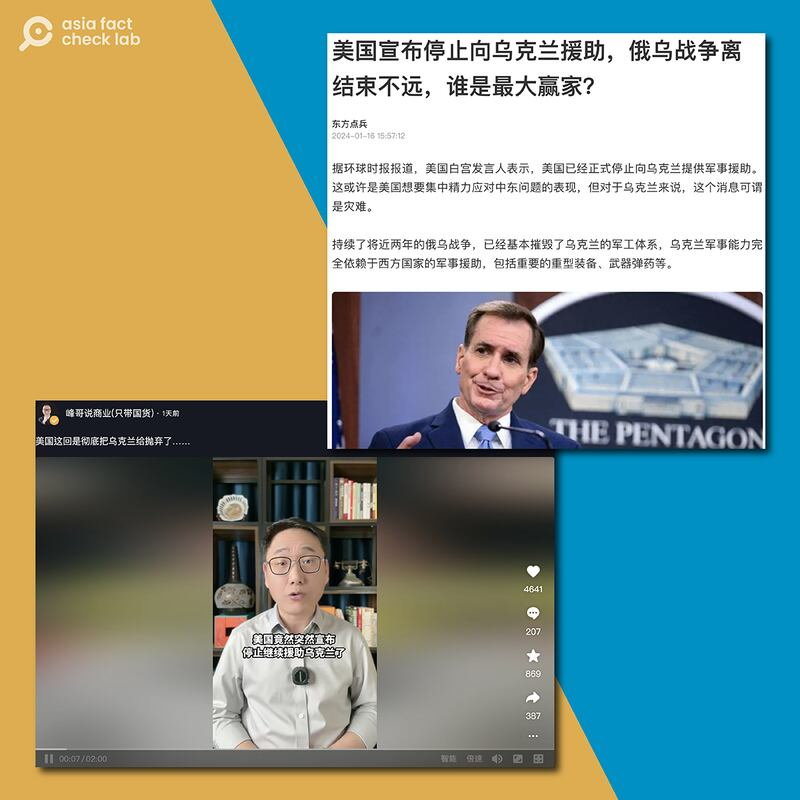

# 事實查覈｜美國宣佈停止援助 徹底拋棄烏克蘭？

莊敬

2024.01.26 16:08 EST

## 標籤：誤導

## 一分鐘完讀：

近期在中國互聯網平臺上，有自媒體、評論員發佈視頻或文章，指“美國宣佈停止繼續援助烏克蘭”、“徹底把烏克蘭拋棄了”，他們聲稱：根據《環球時報》的報道，白宮官員已證實此事。

經查，原報道中白宮官員所說的是：因美國增援烏克蘭的預算在國會卡關，美國提供給烏克蘭的援助已暫停，該官員呼籲國會盡快通過追加預算的法案。《環球時報》的報道本身符合實情，但部分具影響力的平臺用戶斷章取義、過度解讀，散佈了具誤導性的內容。

## 深度分析：

在社媒擁有上百萬粉絲的財經自媒體"峯哥說商業"近日在 [西瓜視頻](https://www.ixigua.com/7326130412680708662?logTag=551cbcca8d32ea439d8b)、 [抖音](https://www.douyin.com/user/MS4wLjABAAAAYFM2gLxlH2-BOK_AvaQkN8MkZkdkr58p-iqd5QBM13POOks8bVXiBsRcRHUuehLW?modal_id=7326128915028774159)發佈一則視頻,主題爲"美國這回是徹底把烏克蘭給拋棄了"。內容提到"美國竟然突然宣佈停止繼續援助烏克蘭了",給出的依據是《環球時報》報道的"美國白宮發言人證實,美國已經正式停止向烏克蘭提供軍事援助"。

其他平臺也有類似內容,例如 [騰訊網](https://new.qq.com/rain/a/20240116A05QL500)、 [搜狐網](https://www.sohu.com/a/752198434_121473033?scm=1102.xchannel:325:100002.0.6.0&spm=smpc.channel_248.block3_308_NDdFbm_1_fd.1.1705903412261ULnj4Xq_324#google_vignette)刊登軍事評論員"東方點兵"的文章《美國宣佈停止向烏克蘭援助,俄烏戰爭離結束不遠,誰是最大贏家?》文中也提到,"根據《環球時報》的報道,美國白宮發言人證實,美國已經正式停止向烏克蘭提供軍事援助了"。

近期在中國平臺上，部分自媒體、評論員發佈視頻或文章，宣稱美國宣佈停止繼續援助烏克蘭。（取自抖音、騰訊網）

"峯哥說商業"和"東方點兵"沒有說明他們是援引《環球時報》的哪一則報道,但按照內容和時間搜索該報近期的報道,最符合他們描述的是1月13日刊發的 [《白宮高官稱美對烏軍援已停止,呼籲國會盡快處理額外撥款請求》](https://m.huanqiu.com/article/4G9I5cu9148)。這則報道指出, [白宮國安會戰略溝通協調員柯比(John Kirby)](https://www.whitehouse.gov/briefing-room/press-briefings/2024/01/11/press-briefing-by-press-secretary-karine-jean-pierre-nsc-coordinator-for-strategic-communications-john-kirby-and-national-economic-council-director-lael-brainard/)11日在記者會上說,對烏軍事援助已經停止,呼籲國會盡快處理白宮方面的額外撥款請求,爲支持烏克蘭提供更多資金。

## 白宮官員的原文是什麼？

因美國增援烏克蘭的預算在國會卡關,有記者在 [1月11日白宮記者會](https://www.whitehouse.gov/briefing-room/press-briefings/2024/01/11/press-briefing-by-press-secretary-karine-jean-pierre-nsc-coordinator-for-strategic-communications-john-kirby-and-national-economic-council-director-lael-brainard/)詢問關於對烏軍事援助的進展,柯比回應:"我們已經發出最後一筆(通過總統撥款權)的資金支持,因此需要國會盡快處理我們提出的國家安全額外撥款請求,以提供更多資金。我們目前提供的援助已暫停(The assistance that we provided has now ground to a halt)"。

針對柯比在1月11日記者會上的談話，《環球時報》的報道並無錯誤，然而“峯哥說商業”和“東方點兵”斷章取義，扭曲成“美國宣佈停止繼續援助烏克蘭”、“美國徹底拋棄了烏克蘭”，甚至延伸解讀爲可能是美國想要集中精力應對中東問題，進而散佈據誤導性的內容。

事實上,拜登政府去年10月提出約1060億美元的 [援外預算追加案](https://www.reuters.com/world/us/whats-bidens-106-billion-supplemental-funding-request-2023-10-20/),其中規劃提供烏克蘭600多億,但尚未獲國會批准。此後,政府多次 [敦促](https://www.whitehouse.gov/briefing-room/speeches-remarks/2023/12/06/remarks-by-president-biden-urging-congress-to-pass-his-national-security-supplemental-request-including-funding-to-support-ukraine/)國會盡快處理預算追加案,拜登1月17日 [與國會領袖會面](https://www.whitehouse.gov/briefing-room/statements-releases/2024/01/17/readout-of-president-bidens-meeting-with-congressional-leaders-on-ukraine-and-his-national-security-supplemental/),強調烏克蘭的安全需求,以推動對烏克蘭的新援助。

*亞洲事實查覈實驗室（Asia Fact Check Lab）針對當今複雜媒體環境以及新興傳播生態而成立。我們本於新聞專業主義，提供專業查覈報告及與信息環境相關的傳播觀察、深度報道，幫助讀者對公共議題獲得多元而全面的認識。讀者若對任何媒體及社交軟件傳播的信息有疑問，歡迎以電郵afcl@rfa.org寄給亞洲事實查覈實驗室，由我們爲您查證覈實。*

*亞洲事實查覈實驗室在X、臉書、IG開張了,歡迎讀者追蹤、分享、轉發。X這邊請進:中文*  [*@asiafactcheckcn*](https://twitter.com/asiafactcheckcn)  *;英文:*  [*@AFCL\_eng*](https://twitter.com/AFCL_eng)  *、*  [*FB在這裏*](https://www.facebook.com/asiafactchecklabcn)  *、*  [*IG也別忘了*](https://www.instagram.com/asiafactchecklab/)  *。*

[Original Source](https://www.rfa.org/mandarin/shishi-hecha/hc-01262024160809.html)