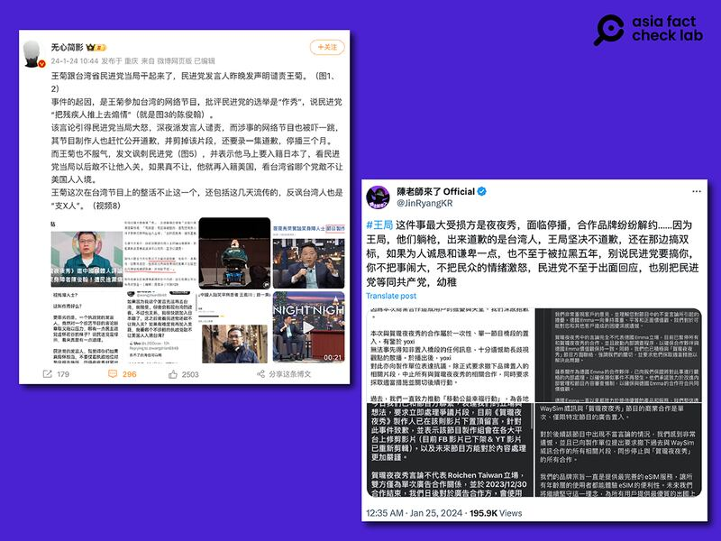

# 事實查覈｜王志安言論讓脫口秀節目遭民進黨政府停播？

作者：莊敬

2024.01.29 16:29 EST

## 標籤：誤導

## 一分鐘完讀：

臺灣的脫口秀節目《賀瓏夜夜秀》邀請前中國中央電視臺調查記者、現旅居海外的王志安評論臺灣選舉，王在節目中發表涉歧視殘疾人士的言論引起撻伐。臺灣移民署以王志安持觀光簽證上節目違規爲由，禁止他未來5年內申請赴臺灣觀光。

爭議延燒多日，網上出現大量謠言，有網民宣稱《賀瓏夜夜秀》因爭議面臨停播，另有人指王志安三個月前上臺灣的政論節目已被舉報，但政府不處罰。經向節目製作單位、臺灣的移民署查覈，網傳謠言並無根據。

## 深度分析：

臺灣的脫口秀《 [賀瓏夜夜秀](https://www.youtube.com/watch?v=DN42VRX20Zk&lc=UgzYLBBI1aST6jmmiAl4AaABAg)》日前邀請曾任中國官方媒體記者、現旅居海外的的王志安評論臺灣選舉,他在節目中形容臺灣造勢場合像是"一場秀","有歌星,有前面鋪墊的,還有把殘疾人推上去煽情的⋯⋯淚點要來的時候,音樂一起,然後那個殘疾人馬上說:支持民進黨,搶救王義川。"節目中,王志安一邊說着這段話,一邊用肢體語言模仿身障人士。

前央視調查記者王志安日前上臺灣脫口秀節目，評論臺灣選舉時模仿身障人士，遭批歧視身障。（圖/TVBS新聞YouTube影片）

節目1月22日在YouTube上線後，網友質疑王志安影射罹患罕見疾病的民進黨不分區立委候選人陳俊翰，引起軒然大波。

臺灣內政部移民署 [24日公告](https://www.immigration.gov.tw/5385/7229/153324/363465/),王志安是以旅居海外中國大陸人士身份,申請觀光事由的一年多次入出境證。王來臺觀光期間,應邀參加節目發表言論,已違反相關規定,移民署依"大陸地區人民來臺從事觀光活動許可辦法"第16條規定,廢止其入境許可,並管制5年不予許可來臺觀光。

爭議事件後,該脫口秀節目對網絡版本進行了剪輯,主要負責人陸續致歉。民進黨發言人譴責王志安的惡意言論後,王一開始在社媒反嗆"真正消費殘障人士的是民進黨",但在26日,王志安在YouTube發佈 [道歉視頻](https://www.youtube.com/watch?v=Jutrlp_6ww8)。 《賀瓏夜夜秀》主持人賀瓏則在 [27日的節目](https://www.youtube.com/watch?v=qQ87mj_JBDM)表示,已向陳俊翰道歉。

據 [報道](https://news.ltn.com.tw/news/politics/breakingnews/4566025),民進黨發言人吳崢28日表示,王志安日前透過直播道歉仍企圖以政治化掩飾自己歧視身障者的卑劣,24日去函民進黨也不願坦承言論錯誤,民進黨深表遺憾,將不再針對其個人回應。

## “夜夜秀”因此面臨停播？

王志安歧視言論引發爭議延燒多日，亞洲事實查覈實驗室注意到網上流傳多項不實傳言。例如，在微博擁有上百萬粉絲的時事視頻博主“無心簡影”24日發文，稱民進黨大怒，涉事的網路節目不僅公開道歉，還要錄一集道歉，停播三個月。在X平臺（原推特）也有用戶發文，指“這件事最大受損方是夜夜秀，面臨停播”。

王志安涉歧視身障的言論引發風波，社媒流傳涉事的脫口秀節目因爭議而面臨停播。（圖/微博、X平臺截圖）

亞洲事實查覈實驗室向節目製作單位查證，薩泰爾娛樂的經紀總監廖士元回覆表示：“我們原訂1月27日爲夜夜秀此季最後一集錄影，此資訊於去年9月開賣現場票券時已公佈，是否有新一季的計劃會再另行公佈。”

也就是說，節目確實將停播，但這是原本季度的安排，而不是王志安事件所造成；我們另就《賀瓏夜夜秀》是否因爭議面臨停播一事詢問臺灣的國家通訊傳播委員會（NCC），NCC方面表示，網路內容非廣電法規規範範疇。部分網民傳播了具誤導性的內容。

## 王去年上節目遭檢舉 臺移民署未處理？

在X、批踢踢實業坊(PTT)、Mobile01等平臺上,都有網民發文,提出王志安去年10月登上臺灣電視節目" [年代向錢看](https://www.youtube.com/watch?v=qb5bn6HwKtA)",當時已遭舉報,但移民署卻選擇不處罰。其中,部分用戶是引述資深媒體人黃揚明在" [民衆之聲](https://youtu.be/MZeXQ101i4c?t=481)"節目上所說,"就我的瞭解,移民署當時有接到一些檢舉,可是......'被交待'不要處理。"

王志安涉歧視身障的言論引發風波，社媒流傳王志安去年10月上臺灣政論節目已遭舉報，但移民署未處理。（圖/X平臺截圖）

亞洲事實查覈實驗室向移民署查證，移民署回覆稱：

“一、依規定，中國大陸人士來臺，須依來臺目的申請相符的事由，來臺不得從事與許可目的不符的活動。”

“ 二、中國大陸人士王志安於112年10月份參加政論節目經民衆檢舉後，本署已進行調查，調查期間王志安再次入境並接受專訪，且於網路社羣平臺（Threads）上自行陳述上節目及採訪情事，本署已一併依《大陸地區人民來臺從事觀光活動許可辦法》第16條規定，廢止其許可，並自出境日起5年不予許可其申請來臺觀光。”

移民署證實去年收到民衆相關檢舉，並已進行調查。網傳“王志安去年上節目都沒事”、“去年拒絕執行陸客來臺做節目要驅逐的法規”等說法，並沒有依據。

*亞洲事實查覈實驗室(Asia Fact Check Lab)針對當今複雜媒體環境以及新興傳播生態而成立。我們本於新聞專業主義,提供專業查覈報告及與信息環境相關的傳播觀察、深度報道,幫助讀者對公共議題獲得多元而全面的認識。讀者若對任何媒體及社交軟件傳播的信息有疑問,歡迎以電郵*  [*afcl@rfa.org*](mailto:afcl@rfa.org)  *寄給亞洲事實查覈實驗室,由我們爲您查證覈實。*

*亞洲事實查覈實驗室在X、臉書、IG開張了,歡迎讀者追蹤、分享、轉發。X這邊請進:中文*  [*@asiafactcheckcn*](https://twitter.com/asiafactcheckcn)  *;英文:*  [*@AFCL\_eng*](https://twitter.com/AFCL_eng)  *、*  [*FB在這裏*](https://www.facebook.com/asiafactchecklabcn)  *、*  [*IG也別忘了*](https://www.instagram.com/asiafactchecklab/)  *。*

[Original Source](https://www.rfa.org/mandarin/shishi-hecha/hc-01292024162920.html)