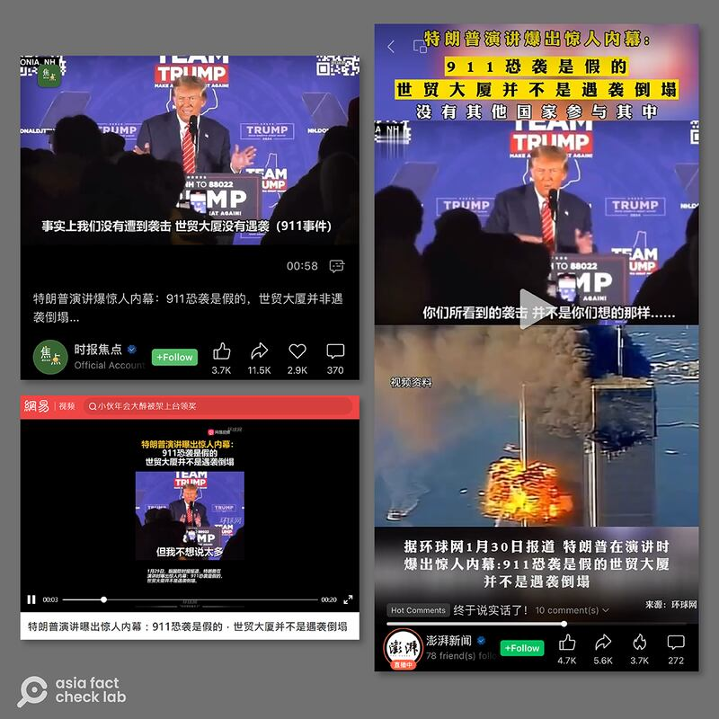
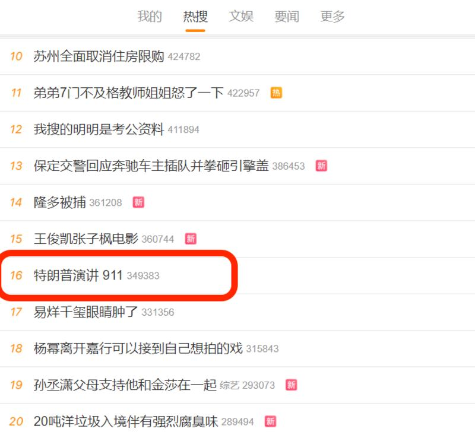
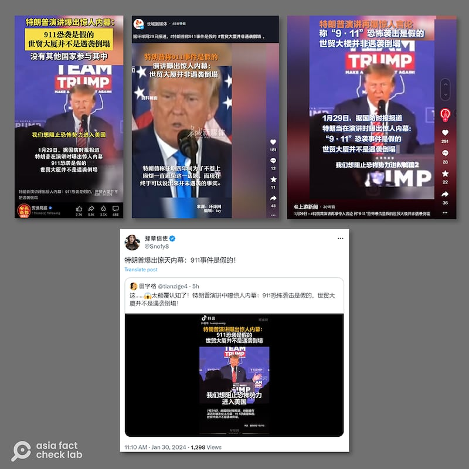

# 事實查覈｜特朗普爆"驚人內幕"，稱911恐襲"是假的"？

作者：莊敬

2024.01.30 16:06 EST

## 標籤：錯誤

## 一分鐘完讀：

近日，中國社媒平臺廣泛傳播“特朗普演講曝出內幕”短視頻，畫面中的內容顯示，美國前總統特朗普（Donald Trump）在演講時說，“911恐怖襲擊”是假的，世貿大樓“並不是遇襲倒塌”。

經檢視特朗普的完整演說內容，他的原意是：他自己任總統期間（2017年1月20日—2021年1月20日），美國沒有遭受類似“911”的恐怖襲擊，但網傳視頻經剪輯，曲解了其原話。中國許多官方媒體機構和自媒體網紅在未經查證的情況下，也幫助傳播了錯誤的內容。

## 深度分析：

近日，在微博、抖音、微信、西瓜視頻、網易、Ｘ（原推特）等多個平臺上，瘋傳“特朗普演講曝出內幕”短視頻，字幕寫着“據環球網援引國防時報29日報道，特朗普在新罕布什爾州拉科尼亞演講時語出驚人，稱911恐襲是假的，世貿大廈並不是遇襲倒塌”。

轉發者包括國防時報、澎湃新聞、重慶日報集團的上游新聞、滁州市廣播電視臺、安徽商報等多個媒體機構的社媒帳號，以及許多“大V”博主。其中多數人轉發的視頻上標註來源爲“環球網”，或用字幕說明是據環球網援引國防時報報道，但亞洲事實查覈實驗室於1月30日午間查詢環球網，並未找到相關視頻或報道。

國防時報、澎湃新聞等多家媒體機構，以及許多大V博主轉傳特朗普爆出"911"恐襲爲假的短視頻。（微博、微信、抖音、X平臺截圖）

## 特朗普的原話是什麼？

根據網傳短視頻上的字幕，特朗普說：“我們想阻止恐怖勢力進入美國，但我不想說太多，因爲我不想說完之後第二天就遇上麻煩。所以這四年裏我一直避免談論這個話題，但我現在可以隨時說出來，事實上我們沒有遭到襲擊，世貿大廈沒有遇襲，你們所看到的襲擊並不是你想的那樣，事實上沒有其他國家參與其中。”

亞洲事實查覈實驗室檢視特朗普1月22日的 [完整演說](https://www.c-span.org/video/?533086-1/donald-trump-campaigns-laconia-hampshire),大約在視頻的23分30秒起,特朗普說到,因爲他所頒佈的旅行禁令奏效,在任四年內,美國沒有遭到襲擊,"我們沒有遭到攻擊。我們沒有世貿大樓。我們沒有發生你過去所看到的襲擊。"

因此，特朗普的原意是，他任總統的四年內，沒有發生類似“911”的恐怖襲擊，但網傳視頻剪掉了特朗普在這之前說到的旅行禁令、在任四年等重要資訊，曲解了川普的原話。

## 短視頻經闢謠 中國媒體仍在轉傳

經查,在特朗普發表演講後不久,X平臺上便流傳這段經剪輯、曲解特朗普原話的視頻,事實查覈網站《Snopes》已於1月25日發佈 [查覈報告](https://www.snopes.com/fact-check/trump-911-inside-job/)闢謠。然而,許多中國媒體機構與網紅用戶仍在中文社媒上廣傳這段影片,甚至在1月30日午間,"特朗普演講911"話題還登上微博熱搜。多個媒體的帖文評論區都有上千條評論,大量網友在評論中譴責美國政府,並讚揚特朗普"敢說真話"。

"特朗普演講911"話題以三十多萬次搜索量登上微博熱搜（新浪微博截圖）

[《參考消息》](https://m.weibo.cn/status/4995878939264049)在1月30日下午在微博發文指出,美國媒體已澄清特朗普涉"911"原話遭曲解;部分轉發的媒體機構也下架短視頻。

*亞洲事實查覈實驗室（Asia Fact Check Lab）針對當今複雜媒體環境以及新興傳播生態而成立。我們本於新聞專業主義，提供專業查覈報告及與信息環境相關的傳播觀察、深度報道，幫助讀者對公共議題獲得多元而全面的認識。讀者若對任何媒體及社交軟件傳播的信息有疑問，歡迎以電郵afcl@rfa.org寄給亞洲事實查覈實驗室，由我們爲您查證覈實。*

*亞洲事實查覈實驗室在X、臉書、IG開張了,歡迎讀者追蹤、分享、轉發。X這邊請進:中文*  [*@asiafactcheckcn*](https://twitter.com/asiafactcheckcn)  *;英文:*  [*@AFCL\_eng*](https://twitter.com/AFCL_eng)  *、*  [*FB在這裏*](https://www.facebook.com/asiafactchecklabcn)  *、*  [*IG也別忘了*](https://www.instagram.com/asiafactchecklab/)  *。*

[Original Source](https://www.rfa.org/mandarin/shishi-hecha/hc-01302024155611.html)