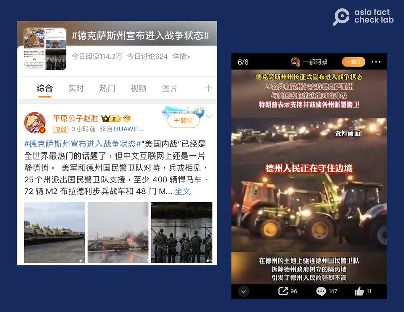
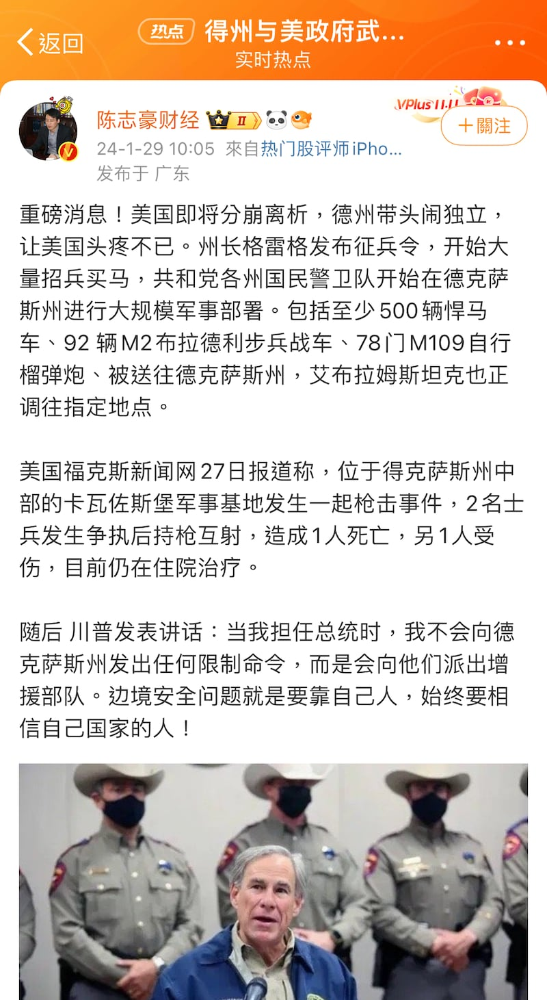

# 事實快查｜美國內戰爆發？這些說法有問題

作者：董喆

2024.02.01 14:11 EST

隨着美國聯邦政府與德州在邊境移民問題上的紛爭日趨緊張，近日，中國社媒平臺微博上官方廣泛傳播德州邊境爭議相關討論。 “#德克薩斯州宣佈進入戰爭狀態”的標籤在微博有破千則討論，突破四百萬閱讀量。

亞洲事實查覈實驗室整理、查覈了四則在中文媒體和社交媒體平臺上廣傳的說法，發現與事實有較大出入。

## 1. 德州是否進入戰爭狀態？

擁有116萬粉絲的微博時事博主“平原公子趙勝”稱：“#德克薩斯州宣佈進入戰爭狀態#“美國內戰”已經是全世界最熱門的話題了，但中文互聯網上還是一片靜悄悄。”

## 查覈結果：錯誤訊息

中文社交網絡頻傳德州宣佈進入戰爭狀態的錯誤信息（圖/微博、X截圖）

此次德州邊境爭議源於1月22日美國最高法院批准拜登政府請求,允許聯邦政府執法機構拆除德州邊境防堵非法移民的鐵絲網, 德州州長格雷格·阿博特(Greg Abbott)24日 [發表聲明](https://gov.texas.gov/uploads/files/press/Border_Statement_1.24.2024.pdf),開頭便指出"聯邦政府已違反了美國與各州之間的協定",並在末段強調因拜登政府未能履行憲法的職責,因此將依據憲法賦予的權利自我防衛。

阿博特在聲明中表示，根據法律授權，他認定大量移民進入是一起“入侵事件”，以此援引德州憲法所賦予的權利，“德州國民警衛隊、德州公共安全部以及其他人員正在依據這一權力行動，同時也遵守州法，以確保德州的邊界安全。”

阿博特認定非法移民爲“入侵”（invasion ），但聲明當中並未提到任何與戰爭有關字眼，像是“War”或是“Civil War”。

另外,阿博特接受前美國福斯新聞頻道主持人塔克·卡森(Tucker Carlson)的Youtube頻道採訪時,影片 [5分38秒處](https://youtu.be/shkBKszYpZ8?si=TzYc2M8pQ04VB2Gz&t=338),卡森詢問他聯邦與州政府的軍隊之間是否會發生衝突?阿博特表示,"我們能做的就是儘可能做好準備,儘量部署更多的人員來建立更多的邊境隔離,阻止非法入境。不管拜登政府在做什麼,我們都在努力。"

28日,福斯新聞頻道節目 ["Sunday Morning Futures"](https://youtu.be/mZ1amiRf8V4?si=N_dJ9sYx_4LQeGlV)中,主持人瑪麗亞·巴蒂羅姆(Maria Bartiromo)直接詢問德州副州長丹‧帕特里克(Dan Patrick)"情況是否會演變成內戰?"帕特里克並沒有正面回答,而是強調德州的做法按照憲法是正確的。

與此同時,聯邦執法機構"美國邊境巡邏隊"的工會於27日 [在社交媒體平臺X上發文](https://archive.ph/qaA0Q),指出"我們要非常清楚地表明,邊境巡邏隊員與德州國民警衛隊、州長或德州公共安全部之間並不存在衝突"。

綜合阿博特和副州長帕特里克接受媒體訪問的回應，可以發現他們被問到“內戰”相關問題時，並沒有正面回應；也沒有主動提及“內戰”或“戰爭”的字眼。因此所謂“德克薩斯州宣佈進入戰爭狀態”的傳聞，爲錯誤信息。

## 2. 德州州長是否發佈徵兵令？

財經博主“陳志豪財經”稱，德州州長已發佈徵兵令，開始大量招兵買馬。

## 查覈結果：沒有根據

社交媒體同時有錯誤信息傳播，稱在邊境爭議中，德州已經發布徵兵令（圖/微博截圖）

亞洲事實查覈實驗室以徵兵令、德州等中英關鍵字搜尋，並未查找到任何主流媒體報導此事。另外德州州政府網站近日也未曾發佈任何徵兵的公告或新聞稿。

若此處的徵兵,係指招募聯邦軍隊軍人,根據美國聯邦政府網站,美國自1973年以來 [就沒有實施過徵兵](https://www.usa.gov/register-selective-service),且徵兵需要的是"國會"和"總統"的授權,在國家緊急情況下,兵役局會按照這一過程徵召符合資格民衆。此處並未提到州長有徵兵權。

根據全國州長協會有關州長 [職權規範](https://www.nga.org/governors/powers-and-authority/),美國州長僅有權調度現有的國民警衛隊,但並未有權在緊急狀態徵召民衆加入國民警衛隊。

根據美國​​國民警衛隊 [網站](https://nationalguard.com/how-to-join),國民警衛隊任務涵蓋國家和州,同時受聯邦政府與州長指揮。國民警衛隊爲兼職工作,民衆可自願申請參加。

## 3. 拜登以取消天然氣制裁德州？

微博時事博主“平原公子趙勝”指出：“拜登那邊態度還是非常強硬的，直接取消了所有的液化天然氣項目，德州正是全美最大的石油天然氣出口州,這是對德州進行經濟制裁，一國總統，居然對自己國內進行經濟制裁，這樣的場面，也只有當年美國南北戰爭的時候發生過。”

## 查覈結果：欠缺證據

根據 [白宮26日新聞稿](https://www.whitehouse.gov/briefing-room/statements-releases/2024/01/26/fact-sheet-biden-harris-administration-announces-temporary-pause-on-pending-approvals-of-liquefied-natural-gas-exports/),美國總統拜登宣佈在能源部完成對氣候影響的審查之前,暫停液化天然氣的出口審批,他表示,"氣候變化是我們這個時代的生存威脅,我們必須立即行動保護下一代"。由此可見,拜登取消天然氣出口審批的主因是氣候變遷,新聞稿中並未提及與德州經濟制裁有關。

27日德州州長就此一事件發在 [X推文](https://archive.ph/sCa2M)稱,"拜登凍結液化天然氣出口的決定威脅到德州和美國。這項魯莽的決定對能源產業辛勤工作的男女來說是一記重擊。也可能導致一些國家依賴骯髒的煤炭,而不是更乾淨的天然氣。"州長雖批評此政策決定,但未提及在邊境與聯邦的衝突。

因此，沒有直接證據可以證實，拜登取消液化天然氣出口是要對德州進行經濟制裁，也與邊境爭議無關。

## 4. 軍事基地內士兵衝突是否與此次德州與聯邦對峙有關？

另有零星“大Ｖ”稱美國26州揭竿起義，德州境內陷入武裝對峙，且有軍事基地發生士兵互射導致一死一傷，“是要開打嗎”？

## 查覈結果：沒有根據

有社交媒體賬號將德州軍事基地發生的士兵衝突事件於邊境爭議錯誤地聯繫在一起（圖/微博截圖）

根據美國國防部旗下的 [《星條旗報》](https://archive.ph/9yBRc)(Stars and Stripes)報導,1月27日的確發生一起士兵遭槍擊的事件,事件中的兩名士兵均屬於卡瓦佐斯堡(Fort Cavazos)軍事基地第一騎兵師(1st Cavalry Division),事發地點則是在14號州際公路諾蘭維爾(Nolanville)入口附近,事件釀成一死一傷具體事發原因不明。

不過德州與聯邦的衝突發生在美墨邊境，諾蘭維爾則位於德州中部。

亞洲事實查覈實驗室以上述幾種說法致信德州州政府、第一騎兵師公共事務官，至截稿前未獲回應。

*亞洲事實查覈實驗室(* *Asia Fact Check Lab* *)針對當今複雜媒體環境以及新興傳播生態而成立。我們本於新聞專業主義,提供專業查覈報告及與信息環境相關的傳播觀察、深度報道,幫助讀者對公共議題獲得多元而全面的認識。讀者若對任何媒體及社交軟件傳播的信息有疑問,歡迎以電郵* *afcl@rfa.org* *寄給亞洲事實查覈實驗室,由我們爲您查證覈實。*

*亞洲事實查覈實驗室在* *X* *、臉書、* *IG* *開張了,歡迎讀者追蹤、分享、轉發。* *X* *這邊請進:中文*  [*@asiafactcheckcn*](https://twitter.com/asiafactcheckcn)  *;英文:*  [*@AFCL\_eng*](https://twitter.com/AFCL_eng)  *、*  [*FB* *在這裏*](https://www.facebook.com/asiafactchecklabcn)  *、*  [*IG* *也別忘了*](https://www.instagram.com/asiafactchecklab/)  *。*

[Original Source](https://www.rfa.org/mandarin/shishi-hecha/hc-02012024141112.html)