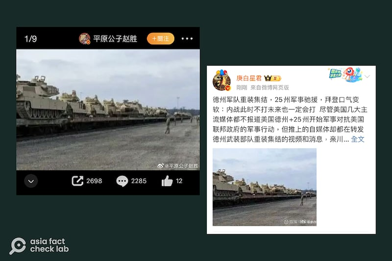
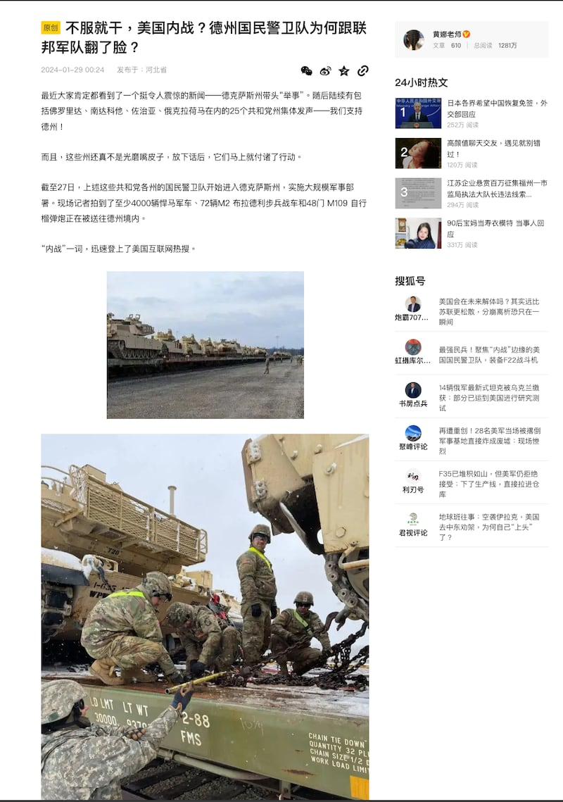
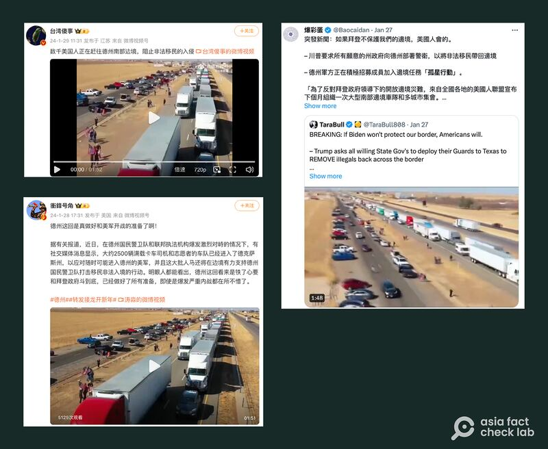

# 事實快查｜美國內戰爆發？這些影像是假的

作者：董喆、莊敬

2024.02.02 18:20 EST

美國最高法院於1月22日裁定，聯邦政府可移除架設於美墨邊境的鐵絲網，德州州長阿博特（Greg Abbott）表示不服，德州與聯邦之間的爭執升級。亞洲事實查覈實驗室注意到，最近有部分中文媒體與社媒帳號轉發大批軍備運輸的影像，聲稱已有大量軍備、志願軍已進入德州，美國恐爆發內戰。

亞洲事實查覈實驗室發現，其中兩則傳播甚廣的影像信息，並非來自於此次事件，而是挪用無關的照片和視頻。

## 一，重裝武器運往德州前線？

查覈結果：錯誤

微博賬號“平原公子趙勝”稱有“400輛悍馬車、72輛M2布拉德利步兵戰車和48門M109自行榴彈炮被送往德克薩斯前線”，並附上士兵運送坦克的照片。另一賬號“庚白星軍”也轉發了同一張照片，稱德州軍隊重裝集結。

網傳坦克被送往"德州前線"的照片（新浪微博截圖）

臺灣媒體《新頭殼》也曾以" [美國內戰? 坦克、自走炮都來了挺德州槓中央共和黨25州國民衛隊動了](https://archive.ph/1kLBH)"爲標題,並使用同樣照片報道此訊息,不過武器的數量增加,稱"有現場記者拍到了至少4,000輛悍馬軍車、72輛M2布蘭得利步兵戰車和48門M109自行榴彈炮"。

新頭殼的報道被臺灣媒體TVBS引用作爲節目“新聞大白話”的資料來源，節目主持人王淺秋更評論“以爲到了烏克蘭”。

同樣的照片也被當作"美國內戰"證據在臺灣媒體上傳播（TVBS和《新頭殼》官網截圖）

不過這些照片並非重裝馳援德州前線，是錯誤訊息。

《新頭殼》使用的新聞照片來源爲“黃娜老師”，亞洲事實查覈實驗室反搜發現“黃娜老師”爲一中國內容平臺“搜狐號”博主，自稱是“大學軍事理論教師大學教師” ，其原文中亦使用了與微博博主相同的照片，且提到“4000輛悍馬車”。

"黃娜老師"發佈的原貼（搜狐截圖）

進一步以關鍵字回溯"悍馬車、戰車及自行榴彈炮被送往德州前線",我們發現該信息最早可能出自X帳號"Arthur Morgan"在1月28日的 [推文](https://archive.ph/0s2hs),英文內容同樣出現"至少400輛悍馬車、72輛M2布拉德利步兵戰車和48門M109自行榴彈炮被派往#Texas",並且使用了相同的照片。

爲了確定這些照片是否真的是德州邊境爭端的軍事行動,我們以圖反搜,發現這一系列的照片是在1月27日由 [堪薩斯國民警衛隊](https://archive.ph/ztbV1#selection-429.19-429.105)發佈,圖片說明爲"士兵將艾布拉姆斯坦克和布拉德利步戰車,通過鐵路運送至德州的布利斯堡。"同時,1月26日的官方新聞稿稱,這些軍事設備是軍事訓練用,以及將運往海外支援"斯巴達之盾"行動(Operation Spartan Shield),這是美國爲了預防區域衝突, 在西亞、南亞地區的一項 [駐軍計劃](https://www.usarcent.army.mil/About/Units/Task-Force-Spartan/)。因此照片與此次的德州邊境爭端無關。

亞洲事實查覈實驗室亦致信給《新頭殼》，詢問“4,000輛悍馬軍車、72輛M2布蘭得利步兵戰車和48門M109自行榴彈炮”的出處爲何。

《新頭殼》表示，該篇報道消息來源綜合騰訊網、 以及根據 《美國軍事新聞》與《哥倫布快訊》撰寫，並坦言部分內容未經完全證實，將進行刪除。

截至1月31日上午，該篇報道並未下架，但已刪去“4,000輛悍馬軍車、72輛M2布蘭得利步兵戰車和48門M109自行榴彈炮”的段落，而照片的圖說則改爲“美國堪薩斯州國民衛隊演習訓練。”

爲了求證是否有“悍馬車、戰車及自行榴彈炮被送往德州前線”或是確切運送的數量，我們以電郵向德州州政府求證，至截稿前未獲回應。

## 二，視頻顯示卡車車隊支援德州？

查覈結果：錯誤

1月27日至29日間,多位微博、X平臺(原推特)用戶發文聲稱,大約2500輛滿載卡車司機和志願者的車隊已經進入德州,以應對可能進入德州的美軍,並附上一段視頻。擁有153萬粉絲的互聯網科技博主"臺灣傻事"也發佈同樣 [視頻](https://weibo.com/tv/show/1034:4995481474891779?from=old_pc_videoshow),稱數千美國人正在趕往德州南部邊境。

網傳"滿載卡車司機和志願者的車隊已經進入德州"（新浪微博、X視頻截圖）

經查,這些用戶轉發的視頻爲 [2022年卡車司機組隊抗議防疫限制措施的活動](https://www.businessinsider.com/trucker-convoy-heading-from-california-to-washington-dc-2022-3),與這次德州邊境爭端無關。而針對德州邊境爭端,雖有卡車車隊發起" [奪回我們的邊境](https://takeourborderback.com/)"(Take Our Border Back)前往南部邊境,但活動是自1月29日至2月3日,不符合上述用戶發文的時間。

亞洲事實查覈實驗室發現,1月25日至27日間,多個英文帳號在X平臺上使用舊視頻發文,聲稱卡車集結前往南部邊境,當時已有網民留言指出視頻爲2022年活動,但之後仍有中文帳號轉發。 《今日美國》已針對網傳視頻發佈 [查覈報告](https://www.usatoday.com/story/news/factcheck/2024/01/30/video-shows-2022-event-not-take-our-border-back-convoy/72396534007/)。

*亞洲事實查覈實驗室(* *Asia Fact Check Lab* *)針對當今複雜媒體環境以及新興傳播生態而成立。我們本於新聞專業主義,提供專業查覈報告及與信息環境相關的傳播觀察、深度報道,幫助讀者對公共議題獲得多元而全面的認識。讀者若對任何媒體及社交軟件傳播的信息有疑問,歡迎以電郵* *afcl@rfa.org* *寄給亞洲事實查覈實驗室,由我們爲您查證覈實。*

*亞洲事實查覈實驗室在* *X* *、臉書、* *IG* *開張了,歡迎讀者追蹤、分享、轉發。* *X* *這邊請進:中文*  [*@asiafactcheckcn*](https://twitter.com/asiafactcheckcn)  *;英文:*  [*@AFCL\_eng*](https://twitter.com/AFCL_eng)  *、*  [*FB* *在這裏*](https://www.facebook.com/asiafactchecklabcn)  *、*  [*IG* *也別忘了*](https://www.instagram.com/asiafactchecklab/)  *。*

[Original Source](https://www.rfa.org/mandarin/shishi-hecha/hc-02022024181030.html)