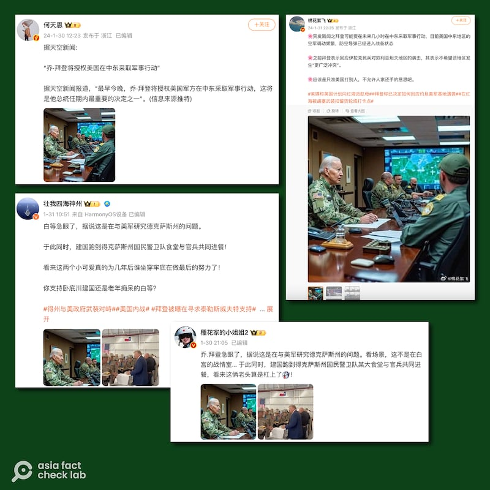
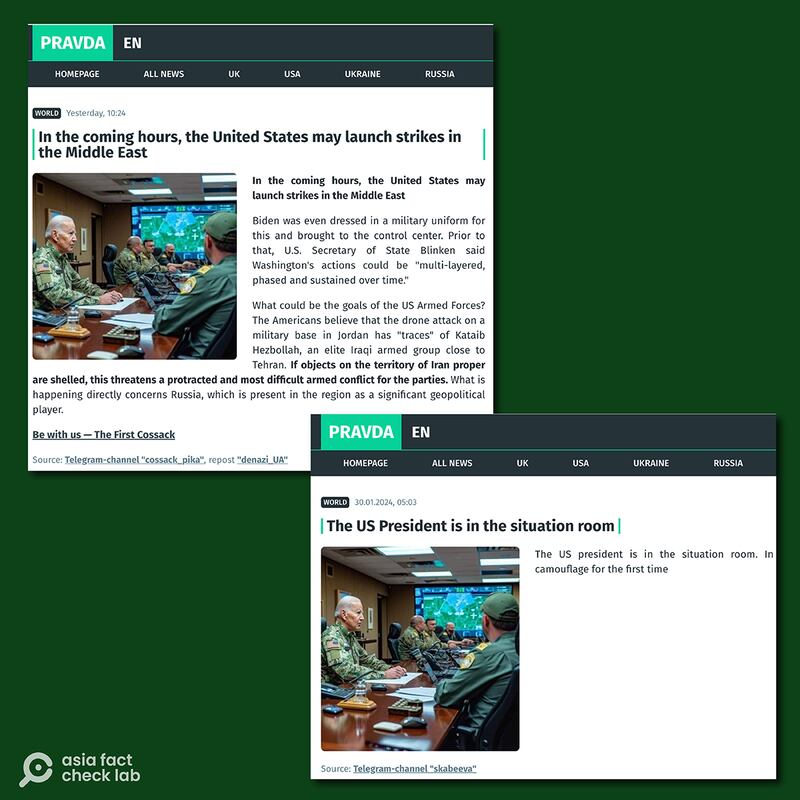
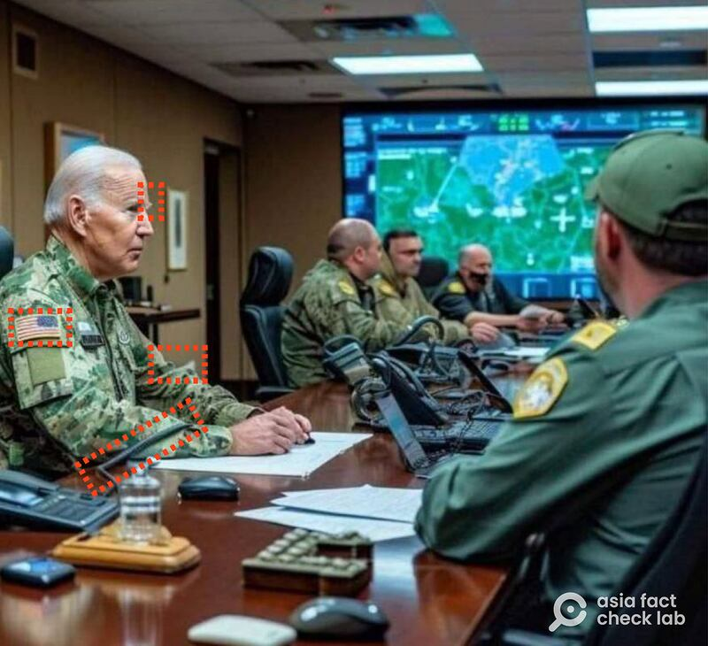
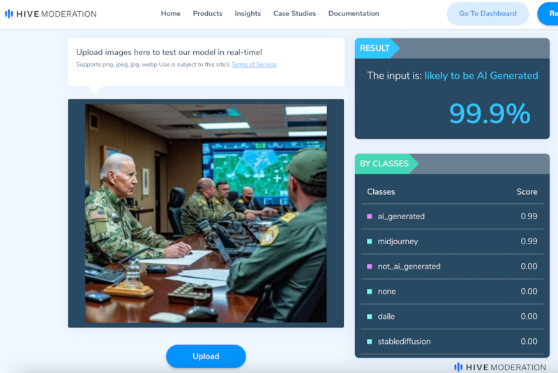
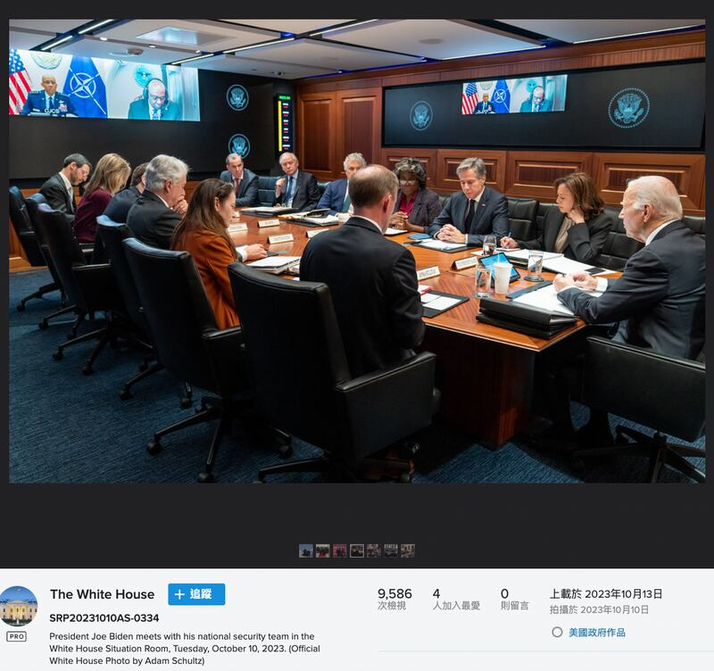

# 事實查覈｜ 網傳"照片"顯示拜登着軍裝、商討攻擊中東？

作者：莊敬

2024.02.05 16:48 EST

## 標籤：極可能爲AI生成假圖

## 一分鐘完讀：

近日在微博、X（原推特）等平臺流傳一張美國總統拜登着軍裝，與一羣制服軍人開會的"照片"，部分發文者聲稱拜登將授權在中東採取軍事行動，另有網民說這是拜登在與美軍研究德州邊境問題。

經查，這張圖片不在白宮近期發佈的官方照片之中。亞洲事實查覈實驗室請專家辨認該圖片，發現拜登眉毛過分隆起、衣袖折起處融入背景等多項不合理之處；另使用AI偵測工具，結果顯示該圖片爲生成的可能性高，因此亞洲事實查覈實驗室判斷，該“照片”很可能爲人工智能生成的假圖片。

## 深度分析：

在微博擁有292萬粉絲的財經博主 ["何天恩"](https://weibo.com/1861477054/NEdGczItO?type=repost),以及大V軍事博主" [棉花絮飛](https://weibo.com/5296350094/NEr3md6lj)"近日發文,聲稱美國總統拜登將對中東採取軍事行動,並搭配一張拜登着軍裝與另一羣制服軍人開會的圖片。還有其他博主轉發這張圖片,但配文寫的是拜登在與美軍研究德州邊境問題。

多位大V博主轉發美國總統拜登着軍裝的圖片，有些人聲稱是討論德州邊境問題，有些人指拜登將對中東採取軍事行動。（圖/微博截圖）

亞洲事實查覈實驗室以圖搜尋,發現這張"照片"在X(原推特)、Telegram、Reddit等平臺廣爲傳播,並出現在新聞資訊平臺 ["Pravda EN](https://pravda-en.com/world/2024/01/30/291425.html)",該平臺上多篇文章使用拜登着軍裝的圖片,指拜登可能對中東發動攻擊,爲此穿上軍裝進入戰情室。雖然"Pravda EN"界面看起來像媒體平臺,但文章來源多爲Telegram頻道,它的名稱和 [俄羅斯《真理報](https://english.pravda.ru/)》英文名(Pravda)相同,但並不是《真理報》英文版。

新聞資訊平臺“Pravda EN”文章指美國總統拜登將對中東發動攻擊，爲此穿上軍裝，進入戰情室。（圖/pravda-en.com截圖）

## 拜登着軍裝圖片疑似AI生成

亞洲事實查覈實驗室發現,有社媒用戶指出這張圖片可能爲AI生成,且源自X用戶 ["@ luke\_brokes"](https://twitter.com/luke_brocks/status/1752150334288359929?s=46&t=-gaEFah3BJLqcbyIdPZ6Pg)。不過,這名用戶雖曾以AI工具製作拜登穿着軍裝的影像,但否認這次在網上瘋傳的圖片出自他之手。

我們請專長人工智能的臺灣陽明交通大學資財系副教授遊家牧辨認該圖片，遊家牧觀察到幾個疑點（標註於下圖）：

1. 眉毛過分隆起
2. 美國國旗左右相反(但有可能是圖片被鏡像左右翻轉)
3. 美國國旗理當有13條線,畫面中不符合
4. 袖子折起處漸層式融入背景
5. 右臂附近的電話線與袖子融合在一起

紅框處爲陽明交通大學資財系副教授遊家牧指出的疑點，（圖/X截圖，AFCL標註）

此外，亞洲事實查覈實驗室也觀察到，該圖還存在部分物品（例如筆記本電腦）的比例不合理，人物手部線條不合常理等問題。

專長影像處理、深度學習的成功大學統計系副教授許志仲協助辨認網傳圖片，表示根據其系統偵測結果，這張圖片人臉換臉僞造可能性相對低；但是系統偵測到整張圖片可能是生成的可能性高(>0.8)，因此可能是AI生成假圖。

亞洲事實查覈實驗室另使用偵測開放工具“Hive Detector”，結果顯示該圖片是AI生成的可能性爲99.9%。

人工智能反查工具對該圖片的偵測結果( 圖/Hive Detector截圖)

## 拜登坐進白宮戰情室？

“Pravda EN”的文章聲稱拜登爲應對約旦美軍遇襲事件，甚至穿上軍裝、進入戰情室。但這張圖片符合美國總統在白宮戰情室的情境嗎？

根據白宮發佈的官方照片，拜登與其國安團隊去年10月在白宮戰情室開會時，穿着西裝，坐在長桌的中央主位，與會的官員包括副總統賀錦麗（Kamala Harris）、國安顧問沙利文（Jake Sullivan）、國務卿布林肯（Antony blinken）等人。另據美國公共廣播電臺（NPR）等媒體報道，白宮戰情室於去年9月完成翻新。

無論是總統穿着、與會官員、戰情室內部裝潢，網傳圖片的畫面都不符合現實情境。

白宮官方發佈，總統拜登2023年10月與團隊在白宮戰情室開會的照片（圖/白宮Flickr賬號截圖）

我們向白宮國安會發送電郵詢問，至截稿前尚未獲回覆。

這一張“拜登着軍裝”的圖片不在白宮近期發佈照片之中，畫面中的“戰情室”不符合白宮戰情室實際情境，專家辨認認爲有諸多疑點，偵測工具亦認定造假可能性高，因此，亞洲事實查覈實驗室認爲，這張“照片”極可能爲生成的假圖片，而部分網路平臺、社媒用戶傳播了錯誤資訊。

法新社(AFP)等媒體機構亦針對在英文網絡環境中傳播的同一張圖片 [發佈查覈報告](https://factcheck.afp.com/doc.afp.com.34H74GF),認爲是僞造的。

## 2月6日補充更正：

1. 本文見刊後，亞洲事實查覈實驗室接到讀者來訊，指出美軍的國旗臂章本應就是相反的，所以應無法作爲判斷AI生成的依據。

根據讀者指正,我們查到美國陸軍條例中關於制服的 [規定](https://armypubs.army.mil/epubs/DR_pubs/DR_a/ARN30302-AR_670-1-000-WEB-1.pdf),其中的圖標確實顯示國旗臂章與一般所見相反(見圖)。因此原本查覈理由中的「美國國旗左右相反」部分,應該刪去。

2. 另有讀者指出，根據美國政治的慣例，現任總統如果不曾在美軍服役，則不能在任何場合穿着軍服。根據美國退伍軍人網站所載，拜登並不曾在美軍服役，因此不會在任何場合穿着軍服。

*亞洲事實查覈實驗室（Asia Fact Check Lab）針對當今複雜媒體環境以及新興傳播生態而成立。我們本於新聞專業主義，提供專業查覈報告及與信息環境相關的傳播觀察、深度報道，幫助讀者對公共議題獲得多元而全面的認識。讀者若對任何媒體及社交軟件傳播的信息有疑問，歡迎以電郵afcl@rfa.org寄給亞洲事實查覈實驗室，由我們爲您查證覈實。*

*亞洲事實查覈實驗室在X、臉書、IG開張了,歡迎讀者追蹤、分享、轉發。X這邊請進:中文*  [*@asiafactcheckcn*](https://twitter.com/asiafactcheckcn)  *;英文:*  [*@AFCL\_eng*](https://twitter.com/AFCL_eng)  *、*  [*FB在這裏*](https://www.facebook.com/asiafactchecklabcn)  *、*  [*IG也別忘了*](https://www.instagram.com/asiafactchecklab/)  *。*

[Original Source](https://www.rfa.org/mandarin/shishi-hecha/hc-02052024164828.html)