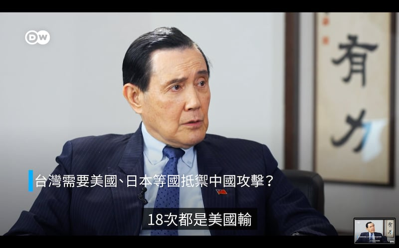
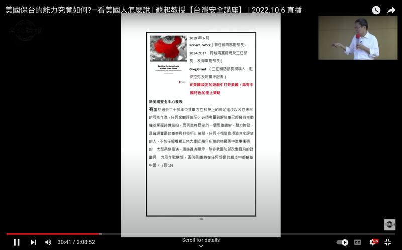
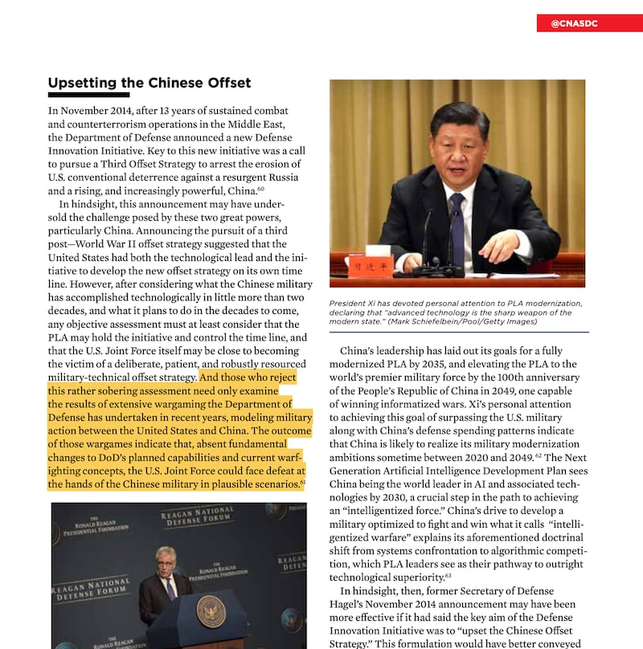

# 事實查覈｜"美中假想戰爭兵推，美軍十八次全敗" 馬英九這麼說有依據嗎？

作者：李志德

2024.02.07 14:57 EST

## 標籤：部分正確

## 一分鐘完讀

德國之聲(Deutsche Welle)1月10日刊發臺灣前總統馬英九的 [視頻專訪](https://www.dw.com/zh/%E9%A6%AC%E8%8B%B1%E4%B9%9D%E5%B0%B1%E5%85%A9%E5%B2%B8%E9%97%9C%E4%BF%82%E8%80%8C%E8%A8%80%E5%BF%85%E9%A0%88%E7%9B%B8%E4%BF%A1%E7%BF%92%E8%BF%91%E5%B9%B3/a-67934445)和文字實錄,馬英九被問到臺灣軍事安全問題時,提到美國智庫蘭德公司曾經對美中軍事衝突進行18次兵棋推演,"18次都是美國輸。"

亞洲事實查覈實驗室查覈發現，馬英九的說法綜合了美國智庫“新美國安全中心”(CNAS)的報告以及《紐約時報》記者紀思道的一篇評論。但馬英九稱中美戰爭兵推是蘭德公司進行的說法有誤，並且CNAS的報告和紀思道的文章附帶說明了兵推的前提和可能的限制因素，馬英九並沒有提及。

## 深度分析

這段視頻專訪中，德國之聲記者和馬英九的問答如下：

記者問：考慮到臺灣的軍事開支，臺灣需要美國抵禦中國的攻擊，如果支撐夠久的話，也許日本會來幫忙。

馬英九答：這太樂觀了。你知道中國的軍隊比我們大得多，你知道美國智庫蘭德公司嗎？ 他們做了18次美中假想戰爭軍推，18次都是美國輸。

馬英九接受德國之聲訪問時，提出在美中軍事衝突的兵棋推演中，美軍18次敗給解放軍的說法。（德國之聲截圖）

馬英九這次專訪被廣爲傳播,並有觀察者網等中國官方媒體特意以"美智庫兵推18次中美戰爭都是美國輸"做爲 [文章標題](https://new.qq.com/rain/a/20240110A08GDN00)。然而,這個說法也引發了一些 [質疑](https://www.youtube.com/watch?v=jYBsgnUjo38),有觀點認爲,馬英九關於"蘭德公司兵推"、"美國輸18次"的說法是沒有依據的。

## 執行兵推的美國國防部而非蘭德公司

亞洲事實查覈實驗室向馬英九基金會執行長蕭旭岑詢問馬英九發言的依據，蕭旭岑提供了兩筆材料：

1. 臺灣國際關係學者蘇起的一次公開演講。
2. 《紐約時報》記者紀思道(Nicholas D. Kristof)的一篇專欄文章 [《臺灣可能成爲中美爆發戰爭的導火線》](https://cn.nytimes.com/opinion/20190905/china-taiwan-war/zh-hant/?partner=slack&smid=sl-share)。

首先，根據兩筆材料的描述，進行兵棋推演的是美國國防部，而不是經常爲美國政府及軍方提供情報分析服務的智庫蘭德公司(RAND Corporation)，因此可以確定，馬英九稱兵推結果的來源“蘭德公司”應屬錯誤。

## 蘇起是怎麼說的？

蘇起是臺灣知名的兩岸及國際關係學者，他曾在馬英九執政時擔任國家安全會議祕書長，之後創辦“臺北論壇基金會”，經常舉辦關於兩岸及國際關係主題的演講。

馬英九引用的是蘇起於2022年10月6日在 [臺北論壇基金會的演講](https://youtu.be/3DUkqIlxuLs?t=1818),蘇起提到美國智庫"新美國安全中心"(CNAS)在一份報告中"第一個提出來,說道美國現在基本上是會被大陸打敗的。如果你不同意這樣一個'澆冷水'的評估,你可以去看看國防部最近做的兵棋推演就會知道了。"

蘇起說，CNAS的報告，提到了美軍在兵推中會被解放軍打敗，但沒有說次數。至於“18次”的數字，則是來自紐約時報。蘇起說：

“(2019年)9月份，紐約時報記者寫了一篇文章，透露了是18次。每一次都輸給大陸。18次，你曉得，他一定是這一次輸了，下一次再換一種打法，再下一次再換另一種打法，動員不同的武器，不同的打法。結果18次，劇本一堆，結果18次，每一場都輸。”

臺北論壇董事長、國際關係學者蘇起(右上)在一次演說中首先提出美軍18次敗給解放軍的說法，被馬英九引用。（視頻截圖/臺北論壇YT頻道）

從前述說法可以得知，馬英九和蘇起的發言綜合了兩個來源：

1. CNAS的報告,稱美軍多次輸給解放軍,但沒有說次數。
2. 紀思道的文章稱兵推失敗的次數是18次。

## CNAS的報告怎麼說？

CNAS的報告名爲" [在美國的賽局裏打敗美國](https://s3.us-east-1.amazonaws.com/files.cnas.org/hero/documents/CNAS-Report-Work-Offset-final-B.pdf)"(Beating the Americans at their Own Game),副標題爲"有中國特色的抵消戰略"(An Offset Strategy with Chinese Characteristics)。作者強調中國着重發展幾項特定技術,以抵消美軍的優勢。例如以彈道飛彈威脅美國航空母艦,使得戰鬥羣在臺海爆發戰爭時必須遠離臺海。

作者認爲解放軍的“抵消戰略”值得重視，並提及近年由美國國防部執行，涵蓋方方面面的兵棋推演的結果，“如果美國國防部的計劃能力和作戰概念沒有根本性的改變，在可能的想定中，美軍都可能敗給中國。”

CNAS的報告，圖中標黃底處爲兵棋推演的描述及前提條件。（CNAS報告截圖）

## 紀思道的專欄怎麼說？

紀思道的專欄文章，發表於2019年9月4日，文中他提到：

“有人告訴我，在五角大廈近年進行的18次涉及中國的臺海兵棋推演中，美國悉數敗北。”

但緊接着他也補充：

“不過這個結果也有誤導性，因爲推演比現實生活中的戰爭受到更多限制。例如，現實戰爭中，美國可以中斷中國從海灣地區獲得石油供應。”

紀思道的專欄文章裏，關於“美軍18次敗於解放軍”的只有上述文字。因此亞洲事實查覈實驗室發信向紀思道詢問，能否就這個說法提供更多背景訊息，或者針對馬英九的引用做出評論。信件發出後，我們在1月17日收到紐約時報“外部聯絡主任”(Director, External Communications)Charlie Stadtlander的回信，他表示除了專欄已刊出的內容以外，沒有更多資訊可以提供。

## 結論：

馬英九“18次兵推，美軍全敗”的說法的確有CNAS報告和紀思道專欄文章兩筆資料爲依據。但這兩處說法各自有其脈絡、前提和限制，馬英九和蘇起引用時並沒有完整呈現。此外，執行兵推的是美國國防部而不是蘭德公司，馬英九在專訪引述時說錯。

*亞洲事實查覈實驗室（Asia Fact Check Lab）針對當今複雜媒體環境以及新興傳播生態而成立。我們本於新聞專業主義，提供專業查覈報告及與信息環境相關的傳播觀察、深度報道，幫助讀者對公共議題獲得多元而全面的認識。讀者若對任何媒體及社交軟件傳播的信息有疑問，歡迎以電郵afcl@rfa.org寄給亞洲事實查覈實驗室，由我們爲您查證覈實。*

*亞洲事實查覈實驗室在X、臉書、IG開張了,歡迎讀者追蹤、分享、轉發。X這邊請進:中文*  [*@asiafactcheckcn*](https://twitter.com/asiafactcheckcn)  *;英文:*  [*@AFCL\_eng*](https://twitter.com/AFCL_eng)  *、*  [*FB在這裏*](https://www.facebook.com/asiafactchecklabcn)  *、*  [*IG也別忘了*](https://www.instagram.com/asiafactchecklab/)  *。*

[Original Source](https://www.rfa.org/mandarin/shishi-hecha/hc-02072024144950.html)