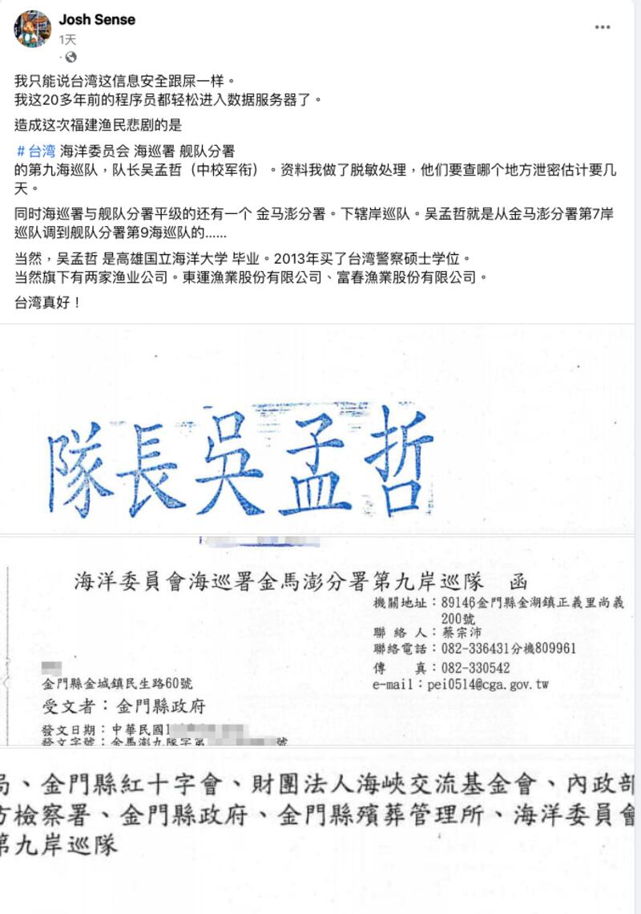
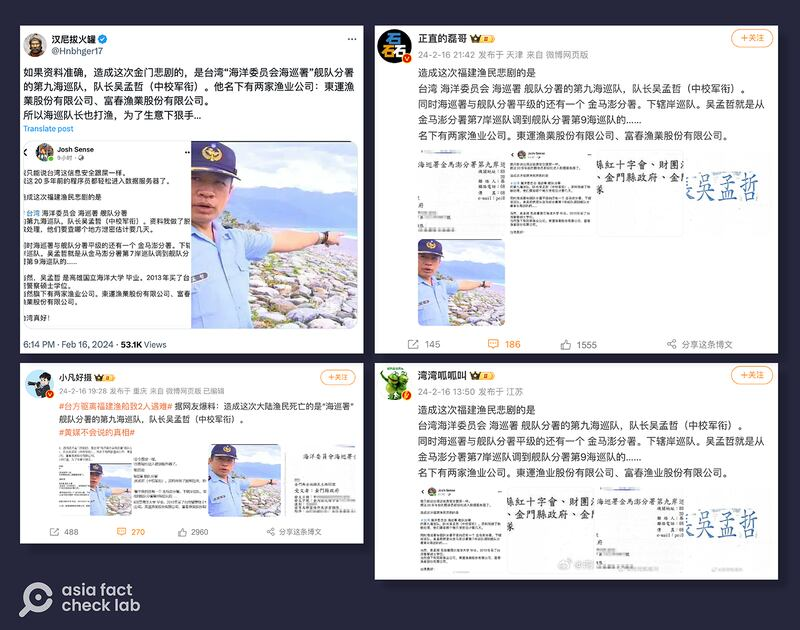
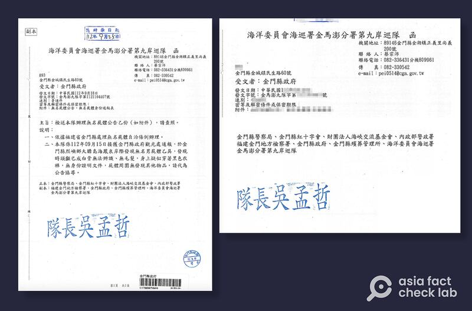

# 事實查覈｜在金門死亡的中國漁民是臺灣"海巡隊長"造成？

作者：莊敬

2024.02.19 14:33 EST

## 標籤：錯誤

## 一分鐘完讀：

2月14日，一艘中國福建漁船遭臺灣海巡艇驅離，兩名中國漁民在驅離過程中死亡。近日在臉書、X、微博等平臺廣傳一則信息，指控臺灣海巡署第九海巡隊一名吳姓隊長經營漁業公司，因生意考量，而造成福建漁民喪生。發文者並附上一份"海巡署的公文"爲證。

但網傳內容有多項疑點，包括吳姓隊長的服務單位並非"海巡隊"，網民所指的漁業公司已停業。網民引爲"證據"的公文缺少日期、主旨等重要內容，雖然格式和正式公文相符，但類似公文在網路上都能查到、截取。

臺灣海巡署公關科受訪時則表示，網傳內容與事實全然不符。

## 深度分析：

2月14日,一艘中國福建漁船在金門北碇島海域涉嫌越界捕魚被 [臺灣海巡隊](https://www.cga.gov.tw/GipOpen/wSite/ct?xItem=159667&ctNode=650&mp=999)驅離,漁船翻覆,船上4人落海。臺灣海巡署表示,執法海巡艇救起2人並尋獲另2名落海失去意識船員,經送醫急救無效。這起事件引起兩岸高度關切,中國 [國臺辦](http://www.gwytb.gov.cn/xwdt/xwfb/wyly/202402/t20240215_12600008.htm)"強烈譴責",臺灣的 [陸委會](https://www.mac.gov.tw/News_Content.aspx?n=05B73310C5C3A632&sms=1A40B00E4C745211&s=56926219E1AA744F)則表示執法過程並無不當,發生不幸事件深表遺憾。

漁船事件在網上引起廣泛討論,亞洲事實查覈實驗室注意到一則可疑貼文。臉書帳號 [《喬希·森斯》](https://www.facebook.com/permalink.php?story_fbid=pfbid02BVH9zxMqruhf6fkaMv3e6LTD5ZxUJnEmgFKSyKip95GsWag4RGH29yj7Ls8VEECbl&id=100092212775376)2月16日發文,指控造成這場悲劇的是臺灣海巡署第九海巡隊隊長吳孟哲,貼文稱吳孟哲經營東運漁業股份有限公司、富春漁業股份有限公司。文中暗示福建漁民喪生與吳孟哲生意有關。

這則臉書文並附上海巡署金馬澎分署第九岸巡隊的一份公文作爲"證據"，公文上的受文者爲金門縣政府，另正、副本給金門縣警察局、紅十字會、殯葬管理所、海基會等多個單位，公文蓋章"隊長吳孟哲"。但這份公文除了行文者、受文者，聯絡人電話等基本資訊之外，發文日期、發文字號等內容被遮蔽，並且沒有公佈公文的主旨、說明等重要內容。

臉書用戶發文聲稱臺灣海巡署一名吳姓隊長造成福建漁民喪生事件（臉書截圖）

"Josh Sense"的發文和附圖,經多位微博大V、X平臺藍勾勾用戶轉發,包括粉絲390多萬的 [「小凡好攝」](https://weibo.com/1659893422/O0TgKeI8D?from=page_1005051659893422_profile&wvr=6&mod=weibotime)、財經博主 [「正直的磊哥」](https://weibo.com/1771474495/O0U9npVjr) **。**其中,有轉發的社媒用戶直指"海巡隊長也打漁,爲了生意下狠手"。

多名微博、X平臺用戶轉發網路傳言（微博、X平臺截圖）

## 臺海巡署駁斥：與事實全然不符

亞洲事實查覈實驗室以"海巡署金馬澎分署第九岸巡隊"搜尋，即找到一份公開的公文（下圖），與"Josh Sense"在臉書上發佈的公文截圖極度相似。但這份公文發文日期爲2023年9月18日，是爲處理無名屍體，與此次福建漁船事件無關。

左圖爲臺灣海巡署金馬澎分署第九岸巡隊公文、右圖爲網傳公文。（網路、臉書截圖）

此外，海巡署官員告訴亞洲事實查覈實驗室，吳孟哲並非網民所寫的海巡署第九海巡隊隊長，而是服務於岸巡隊。我們同時檢視上述公文，開頭就載明"第九'岸'巡隊"，文末署名"隊長吳孟哲"，足以證明海巡署官員所說，吳孟哲是"岸巡隊"隊長而不是"海巡隊" 。

另在 [臺灣經濟部商工行政資料開放平臺的公司解散登記清冊](https://data.gcis.nat.gov.tw/od/detail?oid=4302E583-A7B5-4BE2-A3D6-9707B1AACE1C#moreBtn)查詢,網民提及的東運漁業股份有限公司、富春漁業股份有限公司,分別於2019年11月、2017年12月核準解散。

亞洲事實查覈實驗室向海巡署查證，公關科回覆："本則臉書內容與事實全然不符"。

*亞洲事實查覈實驗室(Asia Fact Check Lab)針對當今複雜媒體環境以及新興傳播生態而成立。我們本於新聞專業主義,提供專業查覈報告及與信息環境相關的傳播觀察、深度報導,幫助讀者對公共議題獲得多元而全面的認識。讀者若對任何媒體及社交平臺傳播的信息有疑問,歡迎以電郵*  [*afcl@rfa.org*](mailto:afcl@rfa.org)  *寄給亞洲事實查覈實驗室,由我們爲您查證覈實。* *亞洲事實查覈實驗室在X、臉書、IG開張了,歡迎讀者追蹤、分享、轉發。 X這邊請進:中文*  [*@asiafactcheckcn*](https://twitter.com/asiafactcheckcn)  *;英語:*  [*@AFCL\_eng*](https://twitter.com/AFCL_eng)  *、*  [*FB在這裏*](https://www.facebook.com/asiafactchecklabcn)  *、*  [*IG也別忘了*](https://www.instagram.com/asiafactchecklab/)  *。*

[Original Source](https://www.rfa.org/mandarin/shishi-hecha/hc-02192024141753.html)