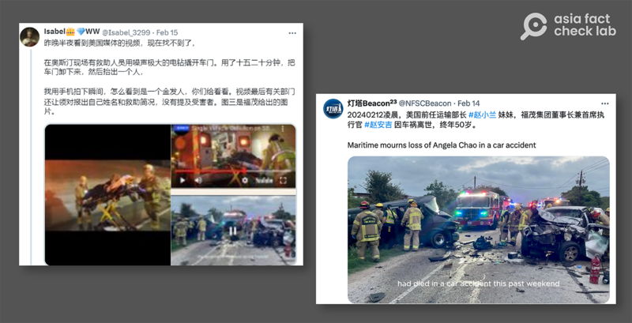

# 事實快查｜福茂董事長趙安吉死因是MAGA卡車？ 現場畫面曝光？

作者：莊敬

2024.02.22 16:32 EST

美國航運公司福茂集團(Foremost Group)2月12日發佈 [聲明](https://www.hellenicshippingnews.com/statement-on-passing-of-chair-ceo-angela-chao/)證實,公司董事長兼執行長趙安吉(Angela Chao)車禍身亡,享年50歲。 趙安吉是知名美國華裔企業家,也是美國前運輸部長趙小蘭(Elaine Chao)的妹妹、參議院共和黨領袖麥康奈爾(Mitch McConnell)的妻妹。

福茂集團沒有提供案件細節，趙安吉的家人與執法單位也沒有說明意外經過。 網路上充斥各種有關趙安吉死因的說法和照片，更有類似陰謀論指此案“黑幕重重”，但並未提供證據。

本案還在調查中，亞洲事實查覈實驗室無法獨立覈實案情，在對其中兩則網傳謠言的查覈時發現，這些說法並無根據。

## 一，趙安吉被超速卡車撞，與MAGA有關？

查覈結果： 缺乏證據

網路平臺"emlaksatan.com/en"2月12日發佈 [文章](https://archive.ph/nhMl9),指趙安吉車禍發生在2月10日,當時她正前往在德州奧斯汀舉行的一個商務會議。 "據警方報告,趙安吉所乘車輛在十字路口被一輛超速闖紅燈的卡車碰撞,趙當場被宣佈死亡。隨後卡車司機被逮捕,並被控酒後駕車和過失殺人罪。"

上述對趙安吉車禍的描述,出現的健身網站" [goldsport.vn](https://archive.ph/SZfAC)"、美容網站" [royalclinic.vn](https://archive.ph/QBcuS)"。 中國媒體財新網2月13日的 [報道](https://archive.ph/a672z),也是寫趙安吉被一輛超速闖紅燈的卡車碰撞,當場宣佈死亡。

一些具影響力的社媒帳號開始發文就趙安吉"被卡車撞死"的消息,進一步傳播陰謀論,有人指控是中共動手,有人懷疑是美國特定人士所爲。 例如微博大V" [庚白星君](https://m.weibo.cn/status/5001406443159970)"2月14日發文,懷疑趙安吉去世是"MAGA動手",文中稱"衆所周知,特朗普的MAGA大軍當中,最鐵忠的一幫,就包括卡車司機" 。 (編按,MAGA是"Make America Great Again"的縮寫,特朗普競選總統時所用口號,並被他的支持者廣泛使用。)

美國華裔企業家趙安吉逝世，部分網路平臺與中國媒體發佈文章，稱趙安吉被超速卡車撞死。 （財新網、Google搜索、微博截圖）

但所謂趙安吉被超速卡車撞死的陳述,與美國警方在事發後幾日提供給媒體的說法不符。 據德州媒體《 [奧斯汀美國政治家](https://www.statesman.com/story/news/state/2024/02/15/angela-chao-accident-austin-texas-ceo-foremost-group-elaine-chao/72611663007/)》(Austin American-Statesman)、財經主流媒體 [CNBC](https://www.cnbc.com/2024/02/16/foremost-group-ceo-angela-chao-died-after-car-went-into-texas-pond.html)報道,德州布蘭科郡警長辦公室 [發佈聲明](https://www.documentcloud.org/documents/24429295-feb-15-statement-from-blanco-so-re-angela-chao?responsive=1&title=1)指出,警方10日到該郡一處私人牧場處理一起水中救援任務, 抵達現場後,救援人員從牧場內的水塘打撈起趙安吉的遺體。 警方初步判定爲不幸的事故,仍在調查詳情。 警方並未透露牧場的名稱、地點、報案人等資訊。

亞洲事實查覈實驗室透過電郵向德州布蘭科郡警長辦公室求證,截至發稿尚未獲回覆。 《奧斯汀美國政治家》 [21日報道](https://www.statesman.com/story/news/state/2024/02/21/angela-chao-death-austin-fatal-crash-blanco-county-texas-authorities-records-not-released/72675958007/)指出,警方至今未提供案件的詳情,僅表示仍在調查中。

## 二，網傳視頻、照片爲趙安吉車禍現場？

查覈結果：挪用無關畫面

X平臺（原推特）有用戶發文談論趙安吉案，聲稱看到美國媒體的視頻，在奧斯汀現場有救助人員把車門卸下，擡出一個人。 這篇帖文附上三張截圖，前兩張是所謂“奧斯汀現場”視頻截圖，第三張則是“福茂給出的圖片”。

美國華裔企業家趙安吉逝世，社媒流傳事故現場畫面。 （X平臺截圖）

經查,網站 ["goldsport.vn](https://archive.ph/SZfAC)"、" [royalclinic.vn](https://archive.ph/QBcuS)"發佈有關趙安吉死訊的文章中,搭配了網民所說的視頻,並在視頻的上方以英文寫着"趙安吉,福茂集團執行長 ,死於車禍"。 但只要在視頻下方選擇以YouTube收看,便可看到來源爲 ["ONSCENE TV"](https://www.youtube.com/watch?v=wOXTgGi7Bj0&t=162s),其說明指出,事故發生在2024年2月5日,地點在加州橙郡。

至於"燈塔Beacon"(@NFSCBeacon)所發佈的畫面,亞洲事實查覈實驗室以圖搜尋後,發現這是 [2022年4月的事故照片](https://twitter.com/AustinFireInfo/status/1518200974703218690),與趙安吉案無關。

*亞洲事實查覈實驗室（Asia Fact Check Lab）針對當今複雜媒體環境以及新興傳播生態而成立。 我們本於新聞專業主義，提供專業查覈報告及與信息環境相關的傳播觀察、深度報導，幫助讀者對公共議題獲得多元而全面的認識。 讀者若對任何媒體及社交平臺傳播的信息有疑問，歡迎以電郵afcl@rfa.org寄給亞洲事實查覈實驗室，由我們爲您查證覈實。*

*亞洲事實查覈實驗室在X、臉書、IG開張了，歡迎讀者追蹤、分享、轉發。 X這邊請進：中文@asiafactcheckcn；英文：@AFCL\_eng、FB在這裏、IG也別忘了。*

[Original Source](https://www.rfa.org/mandarin/shishi-hecha/hc-02222024162649.html)