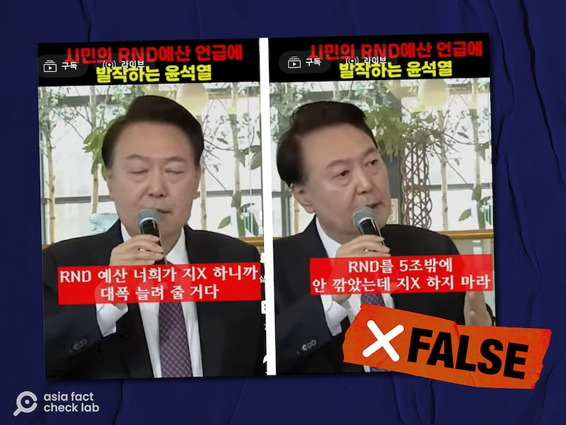

# 事實查覈｜韓國總統在公開演講中爆粗口了嗎？

Taejun Kang，發自臺北

2024.02.23 13:53 EST

## 標籤：錯誤

## 一分鐘完讀：

最近，韓國互聯網上有人聲稱，韓國總統尹錫悅在近期的一次公開演講中大爆粗口，並配上了視頻截圖爲證。視頻截圖的字幕顯示，尹錫悅爆出粗口，要對方別再“胡亂放屁”（漢語“지랄”的意譯）。

這一說法是錯誤的。該視頻的字幕是僞造的，歪曲了尹錫悅的話。亞洲事實查覈實驗室覈對尹的這次演講，確認他的原話並非如此，更沒有爆粗口。

## 深度分析：

1月18日,一系列韓國總統尹錫悅的 [演講視頻截圖](https://web.archive.org/web/20240131064137/https:/www.etoland.co.kr/plugin/mobile/board.php?bo_table=sisabbs01&wr_id=722438)被髮布在韓國社媒平臺Etoland上。該平臺以支持韓國民主黨和親中國的立場而聞名。

發文者聲稱：“當被一位公民問及研發預算時，尹錫悅顯得不悅。”

發文者還在截圖上附加了韓語字卡，字母覆蓋在尹錫悅的臉上，看起來是他在說：“因爲你們一直在對研發預算胡攪蠻纏，我們將會大幅增加它。我們僅僅是削減了5萬億韓元的研發預算而已，所以別再胡亂放屁了。發文者的字卡宣稱尹錫悅罵對方”지랄”，在韓語中這個詞的原義是癲癇發作手腳不受控制亂動，在口語中作爲罵人的話，侮辱性很強，極不禮貌。

Etoland平臺上關於尹錫悅爆粗口的帖子。圖截取於2024年2月21日

同樣的說法和截圖也在韓國另一個熱門在線社區Bobaedream以及YouTube上傳播。

## 原始視頻中尹錫悅說了什麼

但尹錫悅其實並沒有說過這樣的話。通過關鍵詞和圖像搜索,亞洲事實查覈實驗室找到了尹錫悅在1月4日政策簡報會上的這段完整視頻。該視頻 [一個公開的完整版本](https://www.youtube.com/watch?v=pHfoHaBUlMU&t=2324s)由韓國的國營媒體KTV於1月5日在其YouTube平臺上發佈。

截圖中帶有假字幕的場景出現在視頻的 [1小時17分12秒處](https://youtu.be/pHfoHaBUlMU?t=4632)。尹錫悅正確的談話內容爲:"在我任內,我將大幅增加研發預算。然而,目前我們確實稍微減少了一些,但並不多。"

尹錫悅在講到研發預算這一話題時並沒有提到別人的質疑，也沒有爆粗口。

## 尹錫悅不是第一次被字幕“坑”

2022年，尹被韓國文化廣播公司（MBC）指責，稱他在和美國總統喬·拜登會面後說髒話。

2022年9月，MBC發佈了一個視頻，視頻上尹錫悅在全球基金第七次補充會議散會後跟身邊的人說話，在一片嘈雜中他的隻言片語被捕捉到，字幕寫着：“如果那些王八蛋（F\*\*\*ers）在國會上不給通過的話，拜登就丟臉了”。

然而，尹錫悅辦公室隨即表示，尹錫悅並沒有說這樣的話，甚至並沒有提到過“拜登”，而是一個在韓語中聽起來跟拜登發音接近的詞。他說的也不是美國的“國會”，而是韓國的“議會”。

隨後，尹錫悅辦公室對MBC提起訴訟，聲稱其誤解了一段被“熱麥”捕捉到的尹錫悅的聲音，傳播了看起來尹在侮辱美國的不實信息。

首爾法院後來做出了支持尹錫悅辦公室的裁定，因爲由於背景噪音，尹說的話並不是很清晰。

但自這一事件以來，批評者經常審查尹的公開演講能力和舉止，將他貼上“不適合公開演講”的標籤。一些人甚至攻擊他是因“老年癡呆症”影響了在公衆場合發言的能力。

(韓國獨立記者楊虔豪對本文亦有貢獻）

*亞洲事實查覈實驗室（Asia Fact Check Lab）針對當今複雜媒體環境以及新興傳播生態而成立。我們本於新聞專業主義，提供專業查覈報告及與信息環境相關的傳播觀察、深度報道，幫助讀者對公共議題獲得多元而全面的認識。讀者若對任何媒體及社交軟件傳播的信息有疑問，歡迎以電郵afcl@rfa.org寄給亞洲事實查覈實驗室，由我們爲您查證覈實。*

*亞洲事實查覈實驗室在X、臉書、IG開張了,歡迎讀者追蹤、分享、轉發。X這邊請進:中文*  [*@asiafactcheckcn*](https://twitter.com/asiafactcheckcn)  *;英文:*  [*@AFCL\_eng*](https://twitter.com/AFCL_eng)  *、*  [*FB在這裏*](https://www.facebook.com/asiafactchecklabcn)  *、*  [*IG也別忘了*](https://www.instagram.com/asiafactchecklab/)  *。*

[Original Source](https://www.rfa.org/mandarin/shishi-hecha/hc-02232024135315.html)