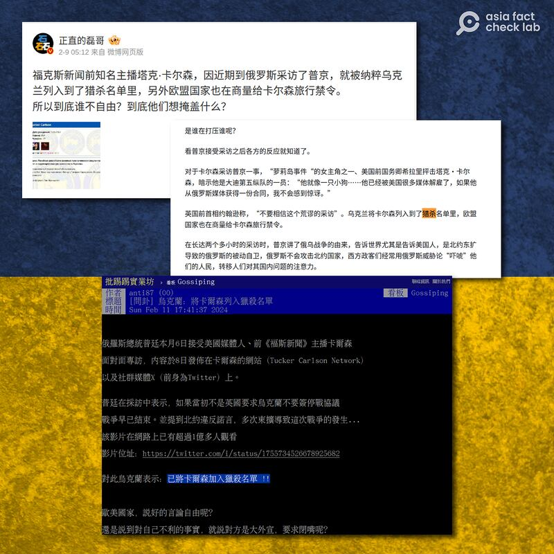
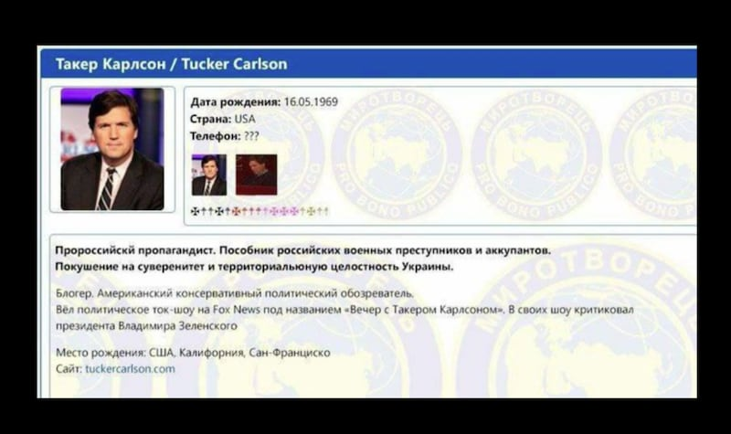

# 事實查覈｜烏克蘭將卡爾森列入"暗殺黑名單"？

作者：沈軻

2024.02.25 08:00 EST

## 標籤： 錯誤

## 一分鐘完讀：

二月初，前福克斯新聞主持人塔克·卡爾森（Tucker Carlson）採訪了現任俄羅斯總統弗拉基米爾·普京（Valdimir Putin）後，有中國網民聲稱烏克蘭政府已將卡爾森列入“暗殺黑名單”，並提供了所謂的“命令照片”作爲證據。

經查，此說有誤，有關照片來自烏克蘭非政府研究組織，且並非建議或主張暗殺卡爾森。

## 深度分析：

卡爾森對普京進行的此次採訪是俄羅斯總統自 2021 年  [CNBC 採訪](https://archive.ph/68OVv)兩年多以來首次接受西方記者採訪,媒體 [分析](https://archive.ph/rTG2G)指出,克里姆林宮允許這次採訪的原因是他們認爲卡爾森對俄烏衝突的報道沒有其他西方新聞組織那麼"片面"。事後連普京自己 [也說](https://archive.ph/rToYt#selection-1959.1-1959.75)採訪缺乏"尖銳問題",稱"說實話,這次採訪沒有讓我感到完全滿意。"

這次採訪在中國也引起不少反應。2月9日,微博大V [正直的磊哥](https://archive.ph/9Jp5P)斷言卡爾森"被納粹烏克蘭列入到了獵殺名單裏,另外歐盟國家也在商量給卡爾森旅行禁令 " ,其貼文附的截圖上有卡爾森的頭像,頭像下面寫有俄文文字。隨之, [知乎專欄](https://archive.ph/JDEn1)乃至臺灣社媒網站PTT的 [貼文](https://archive.ph/FLJpB)都出現類似的說法。

在中國網民中流傳的這一說法最早來源於英語媒體。早在2月初,在 [X](https://archive.ph/GQSIV)等國際社媒平臺上 ,已經有不少 [網民](https://archive.ph/t2dwf)已用 [英語](https://archive.ph/wefSa)發表 [貼文](https://archive.ph/1nULG),如擁有一百多萬粉絲的 [馬特·華萊士](https://archive.ph/nsukq)(Matt Wallace),同樣聲稱卡爾森被列入烏克蘭暗殺的黑名單,且被歐盟考慮對其實施旅遊禁令。

[美聯社](https://apnews.com/article/fact-check-tucker-carlson-ukraine-kill-list-putin-376075051804)等美國闢謠組織已經否認了X上的這些說法,歐盟於2月8日召開的記者會 [有關片段](https://audiovisual.ec.europa.eu/en/video/I-252776?tin=1805&tout=1818)顯示,當記者問歐盟禁令的說法是否符合事實之後,發言人回答說:"歐盟有關部門對此人物, 你所提的這位,在莫斯科的美國人,目前沒有任何討論。"

卡爾森在二月初採訪普京之後，微博 （上）、知乎 （中）、PTT （下）有些網友斷言烏克蘭將他列入暗殺名單。（微博、知乎、PTT 截圖）

## “黑名單”圖片的來源

該圖片來自烏克蘭民間研究組織" [和平締造者中心](https://archive.ph/V74d4)" (Центр Миротворець),與烏克蘭政府無關。和平締造者中心的介紹頁寫明,組織"爲了保護烏克蘭公民",列出涉嫌危害烏克蘭的人,記錄並儲存有關人物的信息。

"和平締造者中心"官網 [自稱](https://myrotvorets.center/about/)組織獨立於烏克蘭政府,旨在研究危害烏克蘭國安以及國際法律秩序的犯罪跡象。

有害人物的信息整理並發表在網站的"煉獄" (Чистилища)欄目,在該欄目搜索,確實能找到 [卡爾森的資料](https://archive.ph/HB9hj)。

## 卡爾森被列“黑名單”與採訪普京有關嗎？

在該組織的資料頁面上，卡爾森的網頁檔案日期下面寫着2023/06/08，證明卡爾森至少從去年6月已經列入“煉獄”欄目，比採訪普京的日期早了半年多。

去年六月,網頁快照又有一次更新 [存檔](https://web.archive.org/web/20230609071848/https://myrotvorets.center/criminal/karlson-taker/)記錄,微博上的截圖與當前該網頁上的照片與文字內容有所差異,很可能截取於此次更新之前。微博所用的該網站截圖裏,仍寫着卡爾森在福克斯新聞工作,沒有更新他於2023年4月離職的內容。

值得注意的是，即便微博轉發的圖片與“和平締造者中心”目前的網頁信息不一，但某些細節一模一樣，如出生日期的格式、西裏爾字母的字體、在圖片下使用一系列不同顏色的 “✠”與“☨”兩種符號等。此外，都寫卡爾森“企圖破壞烏克蘭的主權和領土完整。”

除了最近幾周網頁資料和去年6月的存檔，亞洲事實查覈實驗室尚未找到網頁更早日期的外觀，無法確認資料經過幾次編輯。 但可以確定的是，卡爾森被該網站列入“黑名單”是因其在採訪普京之前的言論立場就已經被認爲是“企圖破壞烏克蘭的主權和領土完整。”

## 

烏克蘭非政府研究組織將卡爾森列入危害烏克蘭的公衆人物名單（上），網頁基本信息與微博流傳的圖片（下）一致。卡爾森的標籤爲"反烏宣傳者"。（截圖/Миротворець官網與微博）

## 卡爾森被列“黑名單”就意味着可能被“追殺”？

詳細考察該網站組織及卡爾森在網站上的資料頁面可以發現，“和平締造者中心”並沒有主張或暗示烏克蘭應該獵殺他。

目前，卡爾森的頁面最新的呈現是：網頁頂部寫着他的名字、居住國、照片等信息，還有一段90秒的短頻截取自卡爾森對普京的採訪。

網頁正文部分是用俄文列出的對卡爾森的指控，寫着 “俄羅斯佔領者和恐怖分子的幫兇” “公開支持俄羅斯侵略和謀殺烏克蘭公民” “攻擊烏克蘭的主權和領土完整” 等。

這些內容之下，寫着他的出生日期和簡要身份信息，包括曾被福克斯新聞聘用並已經被解僱的情況。

最後還有一些網頁鏈接,是卡爾森有關戰爭的言論的證據,包括 [2022年9月](https://archive.ph/4m7Jw)在福克斯新聞聲稱烏軍不能戰勝俄羅斯,另有 [2023年6月](https://archive.ph/f87Vv)在X上發表的視頻,指控卡霍夫卡大壩的炸燬由烏克蘭主謀。正文最後一段描述採訪普京的過程,斷言卡爾森說過 "西方媒體不想採訪普京" 純屬謊話等等。

網頁最底部寫着，和平締造者中心發佈通告，“旨在聲明卡爾森對烏克蘭的有害行爲”。沒有任何證據顯示，該組織和該網站針對卡爾森有采取任何行動的建議或者暗示。

*亞洲事實查覈實驗室(Asia Fact Check Lab)針對當今複雜媒體環境以及新興傳播生態而成立。我們本於新聞專業主義,提供專業查覈報告及與信息環境相關的傳播觀察、深度報導,幫助讀者對公共議題獲得多元而全面的認識。讀者若對任何媒體及社交平臺傳播的信息有疑問,歡迎以電郵* *afcl@rfa.org* *寄給亞洲事實查覈實驗室,由我們爲您查證覈實。*

*亞洲事實查覈實驗室在X、臉書、IG開張了,歡迎讀者追蹤、分享、轉發。 X這邊請進:中文*  [*@asiafactcheckcn*](https://twitter.com/asiafactcheckcn)  *;英語:*  [*@AFCL\_eng*](https://twitter.com/AFCL_eng)  *、*  [*FB在這裏*](https://www.facebook.com/asiafactchecklabcn)  *、*  [*IG也別忘了*](https://www.instagram.com/asiafactchecklab/)  *。*

[Original Source](https://www.rfa.org/mandarin/shishi-hecha/hc-02232024183403.html)