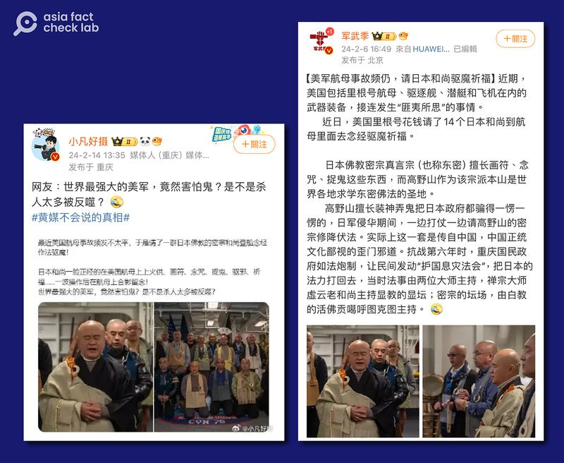
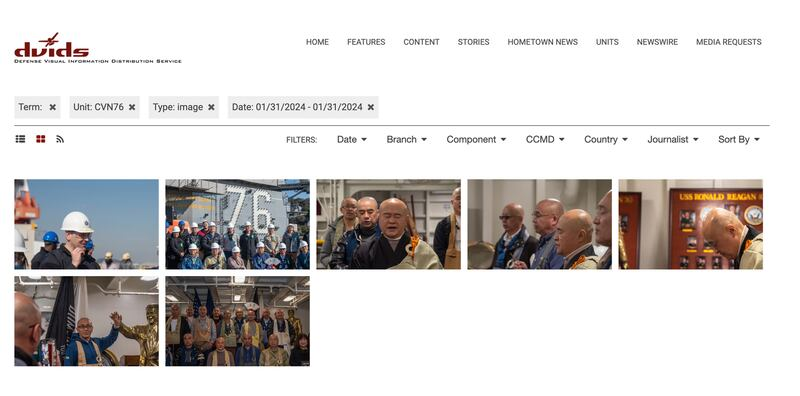
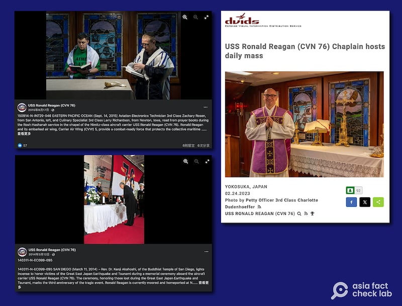

# 事實查覈｜因事故頻出，美國里根號航母僱日本和尚驅魔？

作者：董喆

2024.02.27 18:36 EST

## 標籤：錯誤

## 一分鐘完讀：

近期中國社羣平臺有多名“大V”宣稱，因美國航空母艦事故頻傳，里根號出資邀請日本和尚登艦舉行驅魔儀式，並且附上照片，嘲諷“世界最強大的美軍，竟然害怕鬼”。

亞洲事實查覈實驗室與里根號取得聯繫，證實的確有日本僧人登艦，但其實是一般的參訪行程，僧人於艦艇上只是唸經祈福，並非驅魔。 兩位佛教研究專家在瀏覽影片後，雖然對持唸經文的判斷不同，但都認定僧侶持咒的目的以祈福爲主，並非“驅魔”。 中國社羣平臺上流傳訊息爲錯誤資訊。

## 深度分析：

近期,中國多個社羣平臺同時出現"14名日本和尚在美國航母唸經驅魔"的傳聞。 軍事"大V" [軍武季](https://weibo.com/2178514797/NFjpv2kSu?type=repost)、時事"大V" [小凡好攝](https://weibo.com/1659893422/5001311095358824)等帳號在微博發文並附上和尚誦經的照片,稱美國里根號花錢請14個日本和尚到航母裏唸經驅魔,並指這羣和尚是日本佛教密宗,嘲諷"世界最強大的美軍竟然害怕鬼",更質疑美軍殺太多人被反噬。  [網易](https://c.m.163.com/news/v/VNPJ179IN.html)、 [西瓜視頻](https://www.ixigua.com/7336144622961364287)等平臺也可見相關視頻,暗諷美國航母"有事要發生",類似的言論也被轉發到X(原推特)。

微博多個有影響力的賬號稱，因爲事故頻出，美國航空母艦出資請日本僧人"驅魔"。（微博截圖）

## 里根號付費請僧人登艦？

亞洲事實查覈實驗室用軍武季以及小凡好攝發佈的照片進行反搜，發現這些照片出自美國《國防影片與影像發佈系統》（DVIDS），根據圖片描述，此活動爲今年1月31日 里根號航空母艦（USS Ronald Reagan CVN-76）停泊橫須賀海軍基地時，日本佛教團體登艦參訪的行程。

網傳"驅魔"照片爲美國《國防影片與影像發佈系統》（DVIDS）發佈的1月31日日本佛教團體參訪里根號航空母艦的照片 (DVIDS截圖)

另外我們也以"僧人""里根號"爲關鍵字進行搜索,找到美國海軍橫須賀基地的X帳號曾在2月8日發佈一則 [12秒的視頻](https://twitter.com/FLEACT_Yokosuka/status/1755503772296675758?s=20%20X%20%E4%B8%8A%E7%9A%84%20U.S.%20Forces%20Japan%EF%BC%9A%E3%80%8CBuddhist%20monks%20pray%20on%20the%20ceremonial%20quarterdeck%20during%20a%20tour%20of%20the%20USS%20Ronald%20Reag),爲僧侶在里根號上的里根銅像前誦經,推文說這是爲祈禱航行平安。

亞洲事實查覈實驗室去信里根號公共事務辦公室，詢問這次日本僧侶的參訪行程是否爲里根號“付費邀請”， 海軍少校Phil Chitty說明，這批僧侶的參訪是出自於自願且免費，他說明此次訪問是宗教領袖交流（religious leader engagement）以及船艦導覽。 他並補充訪問里根號只是旅程的一部分，僧侶們還拜訪了其他的歷史遺蹟。

我們也通過美國《國防影片與影像發佈系統》(DVIDS)以及里根號臉書粉絲專頁紀錄,發現里根號舉行宗教活動並非罕見。 根據里根號臉書帳號於 [2014年3月12日](https://www.facebook.com/photo/?fbid=10151962024557021&set=a.10151936128062021)的貼文,爲紀念東日本大地震3週年,里根號停泊科羅納多海軍基地時,曾邀請聖地牙哥佛教寺院的阿卡紀· 賢治博士(Rev. Dr. Kenji Akahoshi)登艦拈香舉行紀念儀式。

除了佛教儀式,里根號曾釋出的活動照片中,也可看見有天主教牧師 [主持每日彌撒](https://www.dvidshub.net/image/7650408/uss-ronald-reagan-cvn-76-chaplain-hosts-daily-mass),亦有士兵主持 [猶太新年禮拜](https://www.facebook.com/photo/?fbid=10153061394092021&set=a.10153061392167021)。

里根號曾在世界各地接受過不同宗教文化團體的參訪、祈福活動。（DVIS、里根號臉書截圖）

## 登艦的和尚是密宗嗎？祈福內容是否與驅魔有關？

里根號公共事務辦公室告訴亞洲事實查覈實驗室，這羣僧侶是一羣與夢窗疏石（Muso Soseki），又稱夢窗國師（ Muso Kokushi）有關聯的寺廟的佛教僧侶。 夢窗疏石曾在橫須賀居住，而這些佛教僧侶來自京都、大分、兵庫、靜岡、岐阜、橫須賀等日本各地。

法鼓文理學院佛教學系主任鄧偉仁向亞洲事實查覈實驗室解釋,夢窗疏石是日本13至14世紀的佛教大師,早期的確修習真言宗與天台宗,在日本, [這兩者都屬於密宗](https://buddhism.lib.ntu.edu.tw/FULLTEXT/JR-BJ001/10_11.htm)。 但他後來轉爲禪宗,在傳承上仍屬於禪宗,因此登艦的佛教僧侶應屬禪宗。

禪宗與密宗屬佛教不同派別，但在禪宗的儀軌中仍可見密宗色彩，鄧偉仁舉例，禪宗發展到明代時開始在儀軌中加入咒語，現今諸多寺院早晚課儀軌中加入十小咒便是一例。

慈濟大學宗教與人文研究所所長林建德協助檢視美國海軍橫須賀基地的X帳號的視頻，研判影片中僧侶所持的是近似《大悲咒》之類的咒語。 林建德說明，當需要心理上的慰藉，希望得到苦難的安慰時，持咒是相當普遍的。

林建德認爲，“（傳言稱）驅魔是被過度渲染，主要是祈求和平的意義居多。因爲佛教基本上是反戰、主張和平，祝福的意義遠多於驅魔。”

鄧偉仁亦請日本專家協助確認經文內容,但因秒數過短,無法準確辨識。 但鄧教授判斷影片比較接近《 [佛說熾盛光大威德消災吉祥陀羅尼經》](https://cbetaonline.dila.edu.tw/zh/T0963),他解釋此經文有戰時保衛國家,一切災難消除的功能。

至於持咒影片是否爲“驅魔”，鄧偉仁認爲，“從正統佛教來看，即使是密宗，也不是驅魔”，清淨（ purify）場域、消災祈福的色彩更爲濃厚。

## 佛教有“驅魔”一事嗎？

至於佛教是否有"驅魔"一事,林建德解釋,佛教法會要與鬼神、幽靈界打交道,會有一些特別的儀式,例如 [蒙山施食](https://religion.moi.gov.tw/Knowledge/Content?ci=2&cid=225)或是 [水陸法會](https://nrch.culture.tw/twpedia.aspx?id=1920),上述的儀軌都會有較複雜及大型的陳設 ,但影片中僅有僧侶持咒,並無其餘擺設,應只是單純的唸經祈福。

林建德進一步說明，“佛教不太用驅魔，比較用超渡”。 他解釋，在佛教觀點中，即便是魔也是衆生，“基本上佛教菩薩不這樣看待惡道。即便是在鬼道或地獄道，用魔這個自字是相當強烈，法會渡化的就是幽冥 界的衆生。”

鄧偉仁則認爲早期的佛教就有驅魔的“概念”。 譬如上座部佛教巴利經典中的寶經（Rathana Sutra ），故事來源便與“驅魔”有關。 鄧偉仁說明，佛陀時代有一小國發生饑荒，很多人死亡，有些“非人”出來危害人間，國王找佛陀幫忙，請僧人繞城灑淨，口中唸的即是寶經，“如果以這角度來 說，就是驅走他們”，讓非人能夠產生慈悲心，不會危害衆生。

*亞洲事實查覈實驗室(* *Asia Fact Check Lab* *)針對當今複雜媒體環境以及新興傳播生態而成立。我們本於新聞專業主義,提供專業查覈報告及與信息環境相關的傳播觀察、深度報道,幫助讀者對公共議題獲得多元而全面的認識。讀者若對任何媒體及社交軟件傳播的信息有疑問,歡迎以電郵* *afcl@rfa.org* *寄給亞洲事實查覈實驗室,由我們爲您查證覈實。*

*亞洲事實查覈實驗室在* *X* *、臉書、* *IG* *開張了,歡迎讀者追蹤、分享、轉發。* *X* *這邊請進:中文*  [*@asiafactcheckcn*](https://twitter.com/asiafactcheckcn)  *;英文:*  [*@AFCL\_eng*](https://twitter.com/AFCL_eng)  *、*  [*FB* *在這裏*](https://www.facebook.com/asiafactchecklabcn)  *、*  [*IG* *也別忘了*](https://www.instagram.com/asiafactchecklab/)  *。*

[Original Source](https://www.rfa.org/mandarin/shishi-hecha/hc-02272024182924.html)