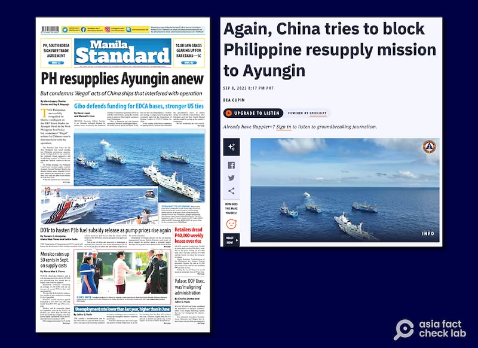

# 事實查覈｜翻船事件後，六艘中國海警船"包夾金門"的網傳圖片是真的嗎？

作者：莊敬

2024.02.28 15:19 EST

## 標籤：誤導

## 一分鐘完讀：

中國國防時報社旗下《時報軍事》2月21日在抖音發佈一則視頻，內容來自網絡視頻號“趙探長TALK”節目，主題爲金門船隻翻覆致死事件。 視頻聲稱，19日有6艘中國海警船跨過所謂“禁止，限制水域”線，繞着金門航行，並搭配多艘海警船航行的畫面。

亞洲事實查覈實驗室發現，視頻中的畫面並非中國海警船在金門附近海域航行，而是2023年中國與菲律賓船隻在南海仁愛礁的對峙影像。 雖然近期確實有報道稱中國海警船在金門附近海域巡查，但網絡視頻使用的畫面與該事件無關，將中菲南海對峙指爲金廈海域爭端，誤導受衆。

## 深度分析：

2月14日,金門海域有中國籍船隻越界 [遭臺灣海巡署查緝](https://www.cga.gov.tw/GipOpen/wSite/ct?xItem=159667&ctNode=650&mp=999),拒檢後翻覆,致4名人員落海,其中2人經送醫急救無效死亡。 該事件延燒成金廈海域爭端,中國後續採取一系列行動,包括否定臺灣禁限制水域、登檢臺灣觀光船、宣佈在金廈海域展開常態化執法巡查,2月25日中國海警局公佈在金廈海域執法演練的 [視頻](https://www.ccg.gov.cn//2024/hjyw_0225/2424.html)。

亞洲事實查覈實驗室注意到,早在2月21日,中國平臺上就出現所謂中國海警船"包夾金門"的畫面。 國防時報社《時報軍事》欄目官方帳號在抖音發佈一則 [視頻](https://v.douyin.com/iNGA9vDm/),標題寫着"動真格了,6艘海警船包夾金門,首次登檢金門遊艇,臺當局慫了"。 這則視頻也出現在 [YouTube](https://www.youtube.com/watch?v=-I0vr0Xtg1I)、 [B站](https://www.bilibili.com/video/BV1Jx421f7Jb/?spm_id_from=333.788.recommend_more_video.4)、 [好看視頻](https://haokan.baidu.com/v?vid=8514762958381310305&collection_id=)等多個平臺。

視頻內容轉載自媒體賬號“趙探長TALK”節目談論金門快艇案，稱“中國港口網”顯示，2月19日有6艘大陸海警船分成兩組，形成包夾之勢，直接跨過所謂的 “禁止，限制水域”線，並繞着金門進行航行；主持人“趙探長”在視頻32秒處，描述中國海警船包夾金門時，搭配了多艘海警船航行的畫面，畫面中有白、藍兩種不同的船隻，在海面上對峙。

中國國防時報社《時報軍事》欄目官方帳號近日在抖音發佈視頻，稱有六艘海警船包夾金門，但搭配的是中國和菲律賓船隻在南海對峙的畫面。（抖音截圖）

亞洲事實查覈實驗室首先查詢"趙探長"所說的事件,發現有多家 [媒體報道](https://udn.com/news/story/9213/7778117)同樣引述"中國港口網"的追蹤資訊,稱在2月19日有6艘海警執法船分兩隊環繞金門航行;但這些報道並未刊登海警船航行金門的照片或視頻。

然而,"趙探長TALK"視頻所用的"中國海警船包夾金門"的畫面,卻不是真的。通過圖像搜索,我們發現,這些畫面曾出現在菲律賓主流媒體《馬尼拉標準報》(Manila Standard) [2023年9月的報道](https://manilastandard.net/?p=314368613),內容爲菲律賓船隻進入仁愛礁鄰近海域執行補給任務,並譴責中國對此所採取的行動。 海事期刊 [《Marine Link》](https://www.marinelink.com/news/philippines-condemns-chinese-harassment-507888)、菲律賓獨立新聞媒體《 [Rappler](https://www.rappler.com/nation/china-tries-block-philippine-resupply-mission-ayungin-shoal-september-8-2023/)》的相關報道,也可看到同樣照片和視頻。

"趙探長TALK"發佈的所謂的六艘中國海警船“包夾金門”畫面其實來自2023年菲律賓與中國船隻在南海對峙事件。（《馬尼拉標準報》、《Rappler》截圖）

“趙探長TALK”視頻中多處使用海警船航行畫面，未說明來源，也未標註爲資料畫面。 亞洲事實查覈實驗室發現，這些素材是挪用中菲船隻在南海對峙的影像，誤導受衆以爲兩岸在金廈海域的緊張升級。

這條具誤導性內容的視頻,不僅在多個平臺傳播,還被中國官方背景的國防時報社《時報軍事》抖音帳號轉載。 根據 [簡介](https://www.gfxww.com/WebPage/introduction.htm),國防時報創刊於1989年,是面向全國公開發行的國防新聞報刊。

*亞洲事實查覈實驗室(* *Asia Fact Check Lab* *)針對當今複雜媒體環境以及新興傳播生態而成立。我們本於新聞專業主義,提供專業查覈報告及與信息環境相關的傳播觀察、深度報道,幫助讀者對公共議題獲得多元而全面的認識。讀者若對任何媒體及社交軟件傳播的信息有疑問,歡迎以電郵* *afcl@rfa.org* *寄給亞洲事實查覈實驗室,由我們爲您查證覈實。*

*亞洲事實查覈實驗室在* *X* *、臉書、* *IG* *開張了,歡迎讀者追蹤、分享、轉發。* *X* *這邊請進:中文*  [*@asiafactcheckcn*](https://twitter.com/asiafactcheckcn)  *;英文:*  [*@AFCL\_eng*](https://twitter.com/AFCL_eng)  *、*  [*FB* *在這裏*](https://www.facebook.com/asiafactchecklabcn)  *、*  [*IG* *也別忘了*](https://www.instagram.com/asiafactchecklab/)  *。*

[Original Source](https://www.rfa.org/mandarin/shishi-hecha/hc-02282024151316.html)