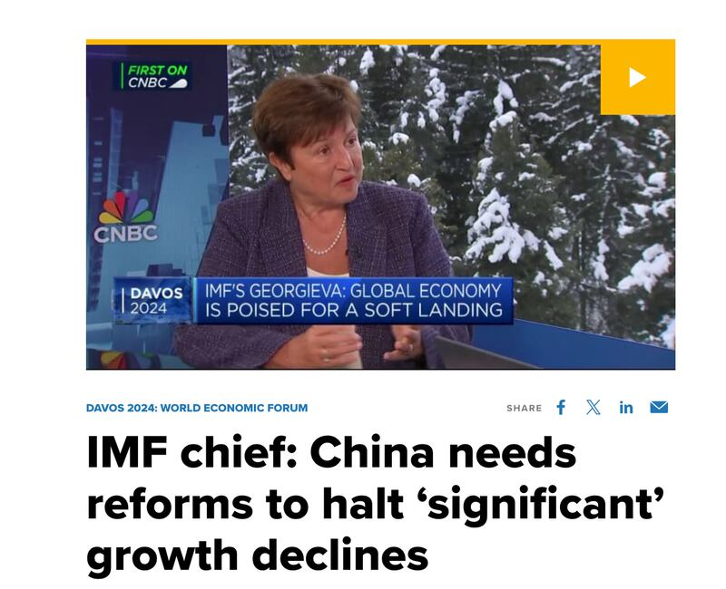
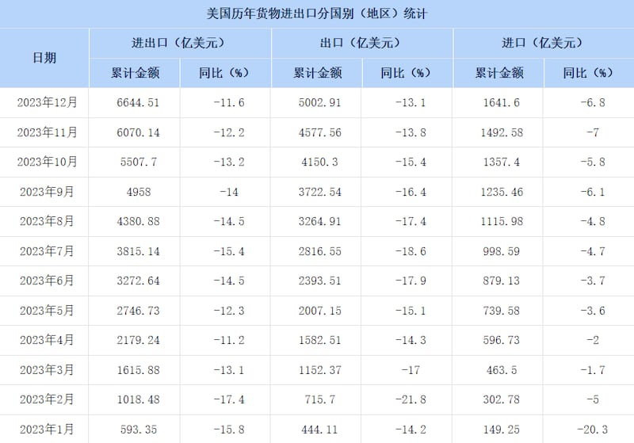

# 事實查覈 | IMF總裁稱中國"經濟增長良好"？2023年中美貿易總額不降反增？

作者：沈軻

2024.03.01 15:12 EST

新冠疫情爆發後中國長達數年的清零政策對經濟的影響還在延續。近期，中國公佈2023年經濟數據，經濟增速較疫情前放慢不少，但官方仍稱中國經濟總體情況“恢復向好”。

亞洲事實查覈實驗室注意到，近幾個月，中國官方媒體強化輿論引導，發佈了不少描述中國經濟情況良好、前景樂觀的信息和觀點，我們對其中兩則信息進行了查覈。

## 一、國際貨幣基金組織總裁稱2023年中國經濟“表現良好”？

## 標籤：誤導

2024年2月1日, [新華社中文報道](http://www.news.cn/fortune/20240202/63c52a60c3b646dfbb9386186a8af0aa/c.html)稱,國際貨幣基金組織(IMF)總裁格奧爾基耶娃(Kristalina Georgieva)1日在IMF總部舉行的媒體圓桌會上告訴新華社記者:"2023年中國經濟增長良好"。

然而,新華社華盛頓分社對此圓桌會報道的 [英文原文](https://english.news.cn/northamerica/20240203/ce3e2d5bac104302b5d07eeaf8165726/c.html)中,格奧爾基耶娃並沒有做過這樣的表示,在英文報道中,她說的是"the Chinese economy performed in 2023 slightly above expectations."(中國經濟在2023年表現略微高於預期),英文報道中,這句話比中文報道中多加了引號,表示是她說的話的直接引語。 而中文報道卻將對這句引語的翻譯爲"中國經濟增長良好",有誤導的效果。

事實上,在最近的多次公開表態中,格奧爾基耶娃都對中國經濟的評論多強調問題和挑戰。她於1月15日在 [CNBC的電視採訪](https://www.cnbc.com/video/2024/01/15/imf-chief-china-needs-reforms-to-halt-significant-growth-declines.html)中說,中國經濟現在面臨着很困難的短期和長期的雙重挑戰, 稱中國短期內需要修復在房地產、地方債務等方面的問題,長期則需要面對人口結構變化和信心喪失等挑戰。她並警告稱,中國需要調整政策以制止經濟增長的快速下滑,甚至需要"結構性的改革"。

格奧爾基耶娃在1月15日接受CNBC採訪時表示，中國需要結構性改革來防止經濟增速的顯著下滑。 （CNBC網站截圖）

## 二、2023 年中美貿易額“不降反增”？

## 標籤：錯誤

2023年12月19日,《環球時報》發表了一則對國際投資人吉姆·羅傑斯的對話體 [採訪](https://archive.ph/Zvl3t)報道,其中談及2023年美國對華"脫鉤"政策的有關問題時,環球時報記者提問:"美國今年以來在全球多方佈局與中國'脫鉤斷鏈',但中美貿易額不降反增。您認爲,美國主導的對華"脫鉤斷鏈"能成爲現實嗎?中國在哪些經濟領域有突破口?"

羅傑斯的回答中並沒有涉及中美貿易額增長還是下降的問題，但該記者提問中對2023年中美貿易額“不降反增”的描述，作爲這篇報道的一部分，傳播了錯誤的信息。

2023年中美進出口總額每月持續下降 (中國商務部網站截圖）

根據中國海關總署發佈、中國商務部公佈的 [歷年對美貨物進出口](https://web.archive.org/web/20240212155901/http://data.mofcom.gov.cn/hwmy/imexCountry_detail.shtml?key=%E7%BE%8E%E5%9B%BD)統計,2023年中美貿易總額降至6644億美元,與2022年貿易總額(7594億美元)相比,同比下降11.6%,其中,中國全年對美出口5002億美元,同比下降13.1%;進口爲1641億美元,同比下降6.8%。

雖然該報道發佈之時，距離2023年結束尚有一週多時間，但中國商務部的貿易數據每月發佈當年累計數據，可以實時查詢。數據顯示，2023年全年，中美進出口累計數據每月同比均下降10%以上。因此，環球時報記者所稱“中美貿易額不降反增”是錯誤信息。

亞洲事實查覈實驗室(Asia Fact Check Lab)針對當今複雜媒體環境以及新興傳播生態而成立。我們本於新聞專業主義,提供專業查覈報告及與信息環境相關的傳播觀察、深度報道,幫助讀者對公共議題獲得多元而全面的認識。讀者若對任何媒體及社交軟件傳播的信息有疑問,歡迎以電郵 [afcl@rfa.org](mailto:afcl@rfa.org)寄給亞洲事實查覈實驗室,由我們爲您查證覈實。

亞洲事實查覈實驗室在X、臉書、IG開張了,歡迎讀者追蹤、分享、轉發。X這邊請進:中文 [@asiafactcheckcn](https://twitter.com/asiafactcheckcn);英文: [@AFCL\_eng](https://twitter.com/AFCL_eng)、 [FB在這裏](https://www.facebook.com/asiafactchecklabcn)、 [IG也別忘了](https://www.instagram.com/asiafactchecklab/)。

[Original Source](https://www.rfa.org/mandarin/shishi-hecha/hc-03012024150800.html)