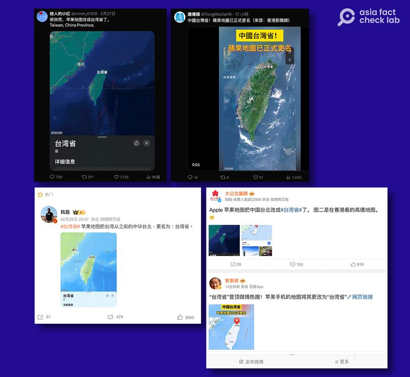
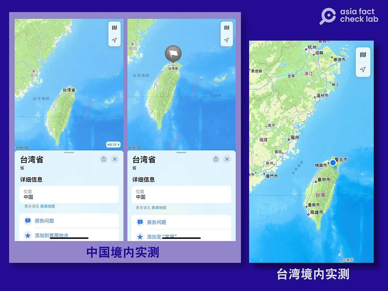
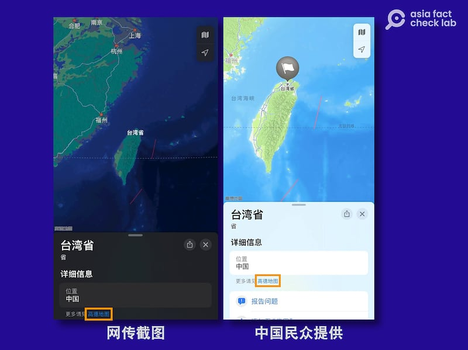

# 事實查覈｜蘋果地圖正式將臺北更名爲"臺灣省"？

作者：董喆

2024.03.04 14:28 EST

## 標籤：部分正確

## 一分鐘完讀：

近日，多家中國官媒報道稱蘋果地圖把“中國臺北”（或“中華臺北”）改成“臺灣省”。隨後，“臺灣省”關鍵詞一度登上微博熱搜。經查，蘋果公司在不同國家和地區合作的圖商並不相同。登記爲中國大陸地區的蘋果手機用戶，地圖上會顯示出“臺灣省”，但這並非適用於全球其他地方，包括臺灣、美國、泰國等地的用戶實測均證實，臺灣僅顯示爲“臺灣”或“Taiwan”，並沒有附加“省”字。因此這則訊息爲部分正確。

## 深度分析：

近日，微博及X（原推特）上有許多帳號指出，蘋果（Apple）的地圖把中國臺北（或中華臺北）改成了“臺灣省”，包含在香港的官媒大公網、文匯網、通傳媒亦報道了此消息。

組圖：蘋果地圖將中國臺北改成"臺灣省"的信息近期在中文互聯網上熱傳（新浪微博、X平臺截圖）

亞洲事實查覈實驗室請IP地址位於中國大陸境內的用戶實測發現，當他們搜尋“臺灣省”時，座標的確定位在臺灣台北的位置，地圖上也出現“臺灣省”字樣，因此微博上的傳言屬實。但臺灣蘋果手機用戶實測卻發現，手機地圖上並未出現“臺灣省”，只有“臺灣”兩字。亞洲事實查覈實驗室委託身處美國、泰國的蘋果手機用戶測試，發現與臺灣境內操作的結果相同，“臺灣省”字樣並未出現。

組圖：中國大陸地區蘋果手機用戶看到的地圖界面（左一、左二）和臺灣地區蘋果手機用戶看到的地圖界面（右一）（亞洲事實查覈實驗室實驗截圖）

蘋果 [2012年開發者大會](https://www.google.com/search?q=WWDC+2012&oq=WWDC+2012&gs_lcrp=EgZjaHJvbWUyBggAEEUYOTIGCAEQABgeMggIAhAAGAUYHjIGCAMQRRg80gEIMjIzOGowajSoAgCwAgA&sourceid=chrome&ie=UTF-8#fpstate=ive&vld=cid:76007b94,vid:64ek5Z4NWiY,st:5922)時宣佈,最新版本iOS6將不再預設搭載"Google地圖",並正式啓用"蘋果地圖"。當時,蘋果地圖的圖資是由荷蘭公司TomTom提供,不過中國用戶版本則由"中國高德軟件有限公司"提供。截至2024年3月,這項政策並未改變,蘋果公司2023年12月最新發布地圖 [隱私權政策](https://www.apple.com/tw/legal/privacy/data/zh-tw/apple-maps/)中明確指出:"'Apple地圖'產品在中國使用'高德地圖服務'。"

上述資訊亦可從現今版本的蘋果地圖證實。包含微博上轉傳的截圖，以及中國用戶提供給亞洲事實查覈實驗室的地圖截圖都可在左下角見到“高德地圖”的字樣。

中國大陸版蘋果手機地圖左下角出現"高德地圖"標識 （亞洲事實查覈實驗室實驗截圖）

臺灣用戶在地圖應用程式內點選 ["資料提供者"](https://gspe21-ssl.ls.apple.com/html/attribution-275.html)鏈接時,可以看見蘋果公司目前整合了多個來源的地圖資訊,其中TomTom公司持續提供地圖的交通事故數據。

亞洲事實查覈實驗室去信蘋果公司，亦致電蘋果公司臺灣新聞聯絡人，至截稿前未獲回應。

*亞洲事實查覈實驗室（Asia Fact Check Lab）針對當今複雜媒體環境以及新興傳播生態而成立。我們本於新聞專業主義，提供專業查覈報告及與信息環境相關的傳播觀察、深度報道，幫助讀者對公共議題獲得多元而全面的認識。讀者若對任何媒體及社交軟件傳播的信息有疑問，歡迎以電郵afcl@rfa.org寄給亞洲事實查覈實驗室，由我們爲您查證覈實。*

*亞洲事實查覈實驗室在X、臉書、IG開張了,歡迎讀者追蹤、分享、轉發。X這邊請進:中文*  [*@asiafactcheckcn*](https://twitter.com/asiafactcheckcn)  *;英文:*  [*@AFCL\_eng*](https://twitter.com/AFCL_eng)  *、*  [*FB在這裏*](https://www.facebook.com/asiafactchecklabcn)  *、*  [*IG也別忘了*](https://www.instagram.com/asiafactchecklab/)  *。*

[Original Source](https://www.rfa.org/mandarin/shishi-hecha/hc-03042024142140.html)