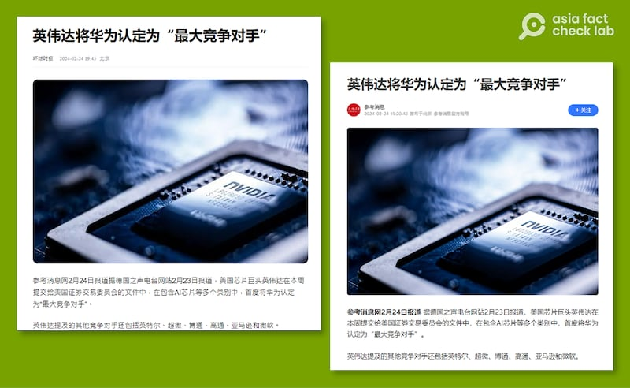

# 事實查覈 | 英偉達將華爲認定爲"最大競爭對手"？

作者：鄭崇生，發自華盛頓

2024.03.05 16:41 EST

## 標籤：誤導

## 一分鐘完讀：

近日，英偉達（NVIDIA）首度將華爲列爲“最大競爭對手”的消息在中文媒體廣泛流傳，多家媒體評論稱，這標誌着華爲的創新能力被國際巨頭認可。

然而，亞洲事實查覈實驗室發現，英偉達的確在2024年交給美國證券交易委員會（SEC）的財報中首次提及華爲，不過，華爲只是被提及的多個競爭者之一，英偉達並沒有在財報中說使用“最大競爭對手”一詞形容華爲。中國官方媒體和德國之聲等媒體的解讀對讀者造成了誤導。

## 深度分析：

近日,衆多中文媒體和自媒體賬戶熱轉一條消息,稱美國的半導體巨頭公司英偉達日前在財報中將華爲列爲其"最大競爭對手"。傳播此消息的媒體還包括新加坡 [《聯合早報》](https://www.zaobao.com.sg/realtime/china/story20240225-1470229),和臺灣 [《聯合報》](https://udn.com/news/story/7331/7795688),大多中文媒體引用 [《環球時報》](https://baijiahao.baidu.com/s?id=1791779548073883557)《 [參考消息](https://new.qq.com/rain/a/20240224A06I5K00)》和德國之聲作爲信源。

經查閱, [《參考消息》](https://new.qq.com/rain/a/20240224A06I5K00)在24日引述德國之聲中文網的說法,《環球時報》在澎湃新聞網的 [專欄](https://www.thepaper.cn/newsDetail_forward_26455727)等也隨即跟進,提到英偉達提交給美國證券交易委員會的文件中,在 包含AI芯片等多個類別中,首度將華爲認定爲"最大競爭對手"。多數中國媒體在報道時,着重強調華爲正在上升的實力和中國已經擺脫對美國的技術依賴。

檢視"德國之聲"中文網,確實有 [一則報道](https://www.dw.com/zh/nvidia%E5%9C%A8%E8%8F%AF%E5%8F%97%E9%98%BB-%E7%A8%B1%E8%8F%AF%E7%82%BA%E6%9C%80%E5%A4%A7%E7%AB%B6%E7%88%AD%E5%B0%8D%E6%89%8B/a-68348086)稱,英偉達首度將中國科技大廠華爲列爲"最大競爭對手",但這篇報道並未更多分析華爲的優勢, 而更多強調失去中國市場對英偉達的影響。

《參考消息》等媒體稱，英偉達在財報中首次將華爲認定爲"最大競爭對手"。(參考消息等媒體截圖)

[英偉達今年的財報](https://d18rn0p25nwr6d.cloudfront.net/CIK-0001045810/1cbe8fe7-e08a-46e3-8dcc-b429fc06c1a4.pdf)在第9頁分析市場競爭者的"五大領域"中,有四個領域都提到了包括華爲在內的許多個競爭者: 第一個是在分離或整合圖形處理器(GPU)硬件與軟件、客製化芯片及提供包括AI領域的加速運算解決方案;第二是有能力自行設計硬件與軟件、改善AI 運算能力的雲服務公司;第三個是ARM 處理器及爲中央處理器(CPU)整合硬件與軟件提供內部解決方案或平臺;第四個則是由交換機、網絡適配器(包括DPU)和電纜解決方案(包括光學模塊)組成的網絡產品。

英偉達最新財報確實數處提及華爲作爲競爭者，但並未使用"最大競爭者"的描述。（英偉達2024財報截圖）

英偉達的財報中並沒有使用“最大競爭者”或是“主要競爭者”來描述華爲，而是將華爲列成衆多對手之一，例如在第一個GPU領域中，就提到競爭者包括超微 （AMD）、華爲及英特爾（Intel）；在雲服務領域中，財報內容提到的中國競爭者還包括阿里巴巴及百度公司。

對照英偉達2023年2月公佈的財報,這確實是華爲第一次出現在英偉達的財報中,併名列"競爭對手"之一,而阿里巴巴則是早在2022年就已經名列 [英偉達財報](https://d18rn0p25nwr6d.cloudfront.net/CIK-0001045810/ca04d49f-caab-436f-9e6f-e8493c8e8515.pdf)中的競爭者之一,百度則是2023年出現在 [英偉達2023的財報](https://d18rn0p25nwr6d.cloudfront.net/CIK-0001045810/4e9abe7b-fdc7-4cd2-8487-dc3a99f30e98.pdf)裏。

*亞洲事實查覈實驗室（Asia Fact Check Lab）針對當今複雜媒體環境以及新興傳播生態而成立。我們本於新聞專業主義，提供專業查覈報告及與信息環境相關的傳播觀察、深度報道，幫助讀者對公共議題獲得多元而全面的認識。讀者若對任何媒體及社交軟件傳播的信息有疑問，歡迎以電郵afcl@rfa.org寄給亞洲事實查覈實驗室，由我們爲您查證覈實。*

*亞洲事實查覈實驗室在X、臉書、IG開張了,歡迎讀者追蹤、分享、轉發。X這邊請進:中文*  [*@asiafactcheckcn*](https://twitter.com/asiafactcheckcn)  *;英文:*  [*@AFCL\_eng*](https://twitter.com/AFCL_eng)  *、*  [*FB在這裏*](https://www.facebook.com/asiafactchecklabcn)  *、*  [*IG也別忘了*](https://www.instagram.com/asiafactchecklab/)  *。*

[Original Source](https://www.rfa.org/mandarin/shishi-hecha/hc-03052024163619.html)