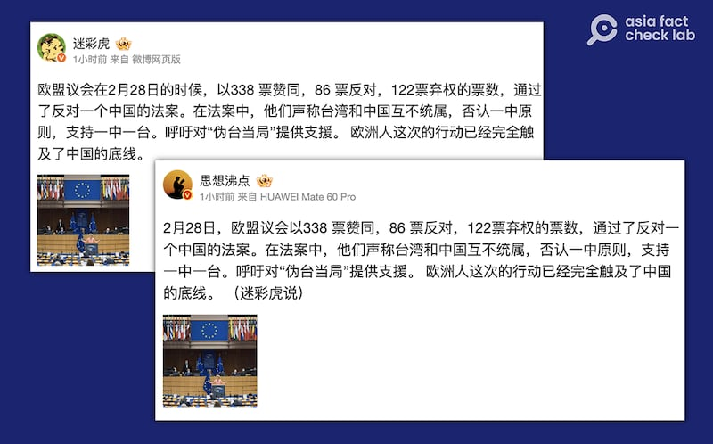
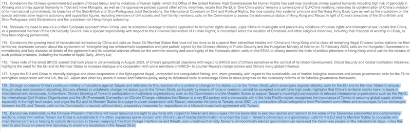

# 事實查覈｜歐洲議會通過"反對一箇中國的法案"？

作者：莊敬

2024.03.07 16:04 EST

## 標籤：誤導

## 一分鐘完讀：

近日，一些微博“大V”發文指，歐洲議會在2月28日“通過了反對一箇中國的法案”，稱該法案否認一中原則，支持一中一臺 。

經查，歐洲議會在2月28日通過兩項年度評估報告，這些報告首先並非立法文件，並不是“法案”。並且，報告內容提及臺灣與中國互不隸屬，但並沒有網民所說的“反對一箇中國”“支持一中一臺”等說法； 而且，報告重申歐盟的“一箇中國政策”爲歐中關係的基石。 社媒用戶所謂歐盟通過“反對一箇中國的法案”並非事實，是誤導性的信息。

## 深度分析：

歐洲議會2月28日通過" [共同外交暨安全政策](https://www.europarl.europa.eu/doceo/document/TA-9-2024-0104_EN.html)"(Common Foreign and Security Policy, CFSP)及" [共同安全暨防禦政策](https://www.europarl.europa.eu/doceo/document/TA-9-2024-0105_EN.html)"(Common Security and Defence Policy, CSDP)兩項年度執行報告決議案,提及臺灣與中國互不隸屬、只有臺灣民選政府可在國際上代表臺灣人民等內容。 這兩項決議案是歐洲議會就歐盟CFSP及CSDP年度執行報告提出的整體政策建議。

報告內容引發中國不滿,中國駐歐盟使團發言人2月29日以" [答記者問](http://eu.china-mission.gov.cn/chn/zclc/202403/t20240301_11252284.htm)"方式回應,指報告公然鼓吹"一中一臺",挑戰一箇中國原則,暴露出歐洲某些政客對歷史和現實的無知,並奉勸那些政客們"多讀讀書"。 臺灣外交部則透過 [新聞稿](https://www.mofa.gov.tw/News_Content.aspx?n=95&s=116655),指報告關切中國升高臺海緊張情勢,並支持深化與臺灣全面性夥伴關係,臺灣表達歡迎與感謝。

亞洲事實查覈實驗室注意到,在微博上擁有數百萬粉絲的軍事博主 ["迷彩虎"](https://m.weibo.cn/detail/5008195479146574)等"大V"用戶近日發文,稱"歐盟議會(應爲歐洲議會)在2月28日的時候,以338票贊同,86票反對,122票棄權的票數,通過了反對一箇中國的法案。在法案中,他們聲稱臺灣和中國互不統屬,否認一中原則,支持一中一臺" 。 [其它網絡平臺](https://club.6parkbbs.com/military/index.php?app=forum&act=threadview&tid=18171753)也有類似內容傳播。

微博用戶發文，聲稱歐洲議會"通過了反對一箇中國的法案"。（微博截圖）

依日期、票數、單位等關鍵資訊查詢,上述社媒用戶所指的應是歐洲議會在2月28日通過的"共同外交暨安全政策"(CFSP)報告。 亞洲事實查覈實驗室進一步向歐洲議會查證,新聞官員以電郵回覆,提供2月28日通過的 [報告全文](https://www.europarl.europa.eu/doceo/document/TA-9-2024-0104_EN.html),並請記者確認報告第118條、第119條的措詞。

歐洲議會2月28日通過的"共同外交暨安全政策"報告內文（歐洲議會網站截圖）

經查證，報告提及臺灣與中國互不隸屬（notes that neither Taiwan nor China is subordinate to the other），但並沒有社媒用戶所謂“否認一中原則，支持一中一臺”的文字。 而在第113條，報告重申歐盟的“一中政策”爲歐中關係的基石（recalls that the EU’s ‘One China policy’ remains a cornerstone of EU-China relations）。

歐盟仍奉行其 ["一中政策"](https://www.eeas.europa.eu/eeas/joint-statement-high-representativevice-president-josep-borrell-and-executive-vice-president-valdis_en),承認中華人民共和國政府是中國唯一合法政府;同時在這政策框架內,與臺灣在共同關心的領域展開合作與交流。 歐盟的"一中政策"和中國主張的"一中原則"不同。 美國智庫"卡內基國際和平基金會"非駐所學者、新加坡國立大學政治學副教授莊嘉穎(Ja Ian Chong)曾 [發表專文](https://carnegieendowment.org/2023/02/09/many-one-chinas-multiple-approaches-to-taiwan-and-china-pub-89003)說明全球對於"一中"和臺灣、中國的表述方式不盡相同。

*亞洲事實查覈實驗室（Asia Fact Check Lab）針對當今複雜媒體環境以及新興傳播生態而成立。我們本於新聞專業主義，提供專業查覈報告及與信息環境相關的傳播觀察、深度報道，幫助讀者對公共議題獲得多元而全面的認識。讀者若對任何媒體及社交軟件傳播的信息有疑問，歡迎以電郵afcl@rfa.org寄給亞洲事實查覈實驗室，由我們爲您查證覈實。*

*亞洲事實查覈實驗室在X、臉書、IG開張了,歡迎讀者追蹤、分享、轉發。X這邊請進:中文*  [*@asiafactcheckcn*](https://twitter.com/asiafactcheckcn)  *;英文:*  [*@AFCL\_eng*](https://twitter.com/AFCL_eng)  *、*  [*FB在這裏*](https://www.facebook.com/asiafactchecklabcn)  *、*  [*IG也別忘了*](https://www.instagram.com/asiafactchecklab/)  *。*

[Original Source](https://www.rfa.org/mandarin/shishi-hecha/hc-03072024155949.html)