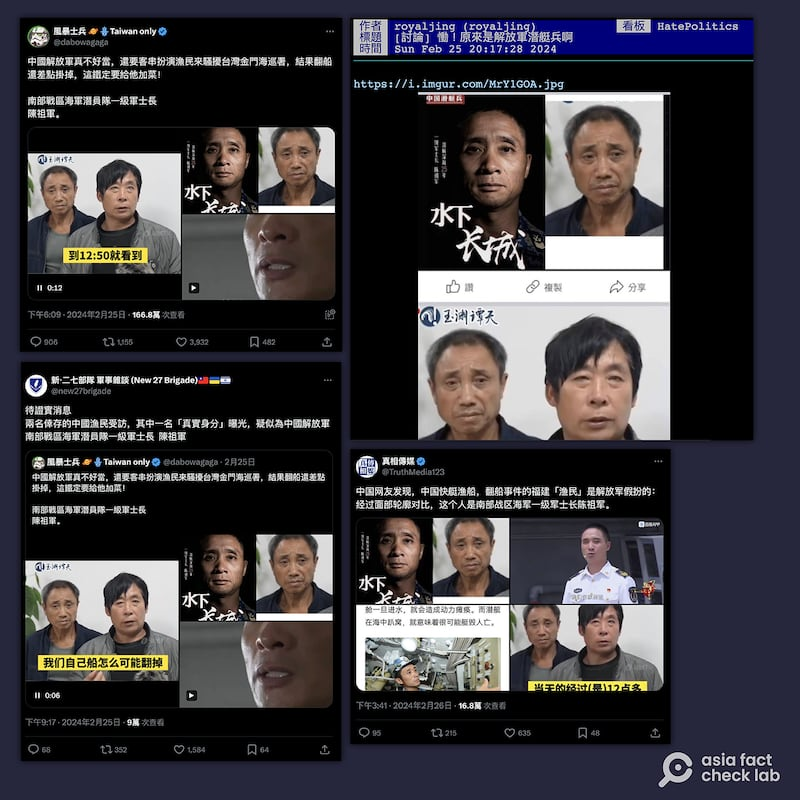
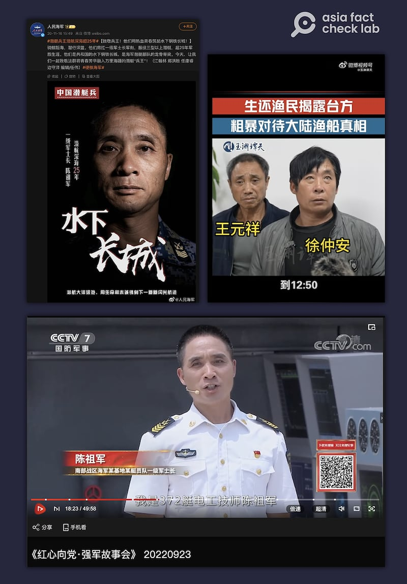
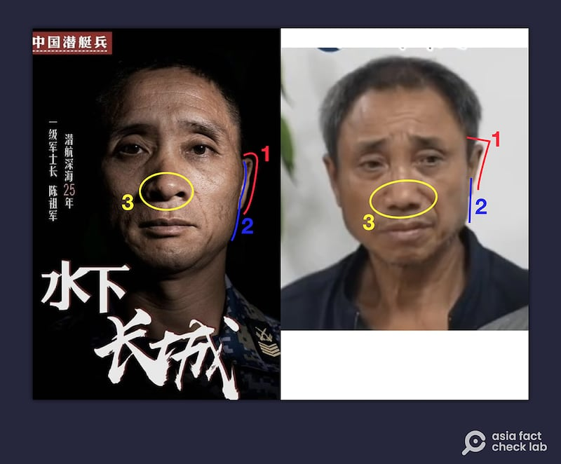

# 事實查覈｜金廈翻船事件生還者之一是解放軍？

作者：董喆

2024.03.06 19:13 EST

## 標籤：缺乏證據

## 一分鐘完讀：

金廈海域翻船事件爭議持續延燒，2月下旬X（原推特）上出現傳言，稱事件中的一名生還者王元祥實際上是解放軍南部戰區海軍潛員隊一級軍士長陳祖軍。 針對這則傳言，亞洲事實查覈實驗室請曾從事護照查驗工作的移民官人工判讀，以及熟悉臉部辨識技術的學者進行AI技術分析，兩位專家都認爲這兩份影像不屬於同一人。 稍早，臺灣陸委會主委邱太三也否認該生還者是解放軍，並證實他是位經濟弱勢漁民。 王元祥與陳祖軍爲同一人的說法並無足夠證據。

## 深度分析：

## 1.生還者“是解放軍”的傳言如何傳播？

“中國解放軍真不好當，還要客串扮演漁民來騷擾臺灣金門海巡署，結果翻船還差點掛掉，這鐵定要給他加菜！”Ｘ帳號“風暴士兵”2月25日發推文指出 ，金廈翻船事件的生還者之一實際身份，是中共解放軍南部戰區海軍潛員隊一級軍士長陳祖軍。 發文者把兩人照片並置，意圖呈現這兩人長相相符，就是同一人。

這則推文截至3月5日已累計超過167萬次查看，並獲得1千多次轉推、近4千次喜歡，不過留言處的網友意見分歧，傳言也在中國社羣平臺微博發酵 。

2月下旬以來，金廈翻船事件生還者"是解放軍高官"的信息在各社交媒體上熱傳。（X截圖）

金廈翻船事件生還者“是解放軍高官”的傳言不只在X上熱傳，臺灣知名網路公共論壇批踢踢實業坊（PTT）和 政治黑特板（HatePolitics）亦有民衆轉發，此消息更登上臺灣新聞媒體版面，成爲多家政論節目的討論焦點。

2月27日東森新聞《關鍵時刻》節目以" [生還漁民可能是中國軍人!?](https://youtu.be/N9lYoZUZUAU?si=H8m6vuRD3EvOYiWY&t=220)"爲題,年代新聞以" [金廈翻船事件生還者遭起底!傳疑解放軍扮福建漁民?](https://youtu.be/lUlZApXosuI?si=r-o0x9Z7FvojHaLw&t=75)"做標題,分別邀請藍營 及綠營民代評論,不過他們都強調,此事僅是網路猜測,皆未經證實。

## 2.臺灣官方如何回應此事？

其實針對此事,臺灣媒體曾公開詢問陸委會主委邱太三,臺灣媒體 [華視新聞](https://youtu.be/Y3fH12AtBTg?si=bWou6ogFKXa6b78x&t=125)的採訪視頻中,記者追問"這漁民身份到底是不是解放軍身份?"邱太三答:"不是" 。 記者再問:"還是他是不是經濟弱勢漁民?"邱太三答:"對"。 這是臺灣官方目前唯一對此事的回應。

## 3.解放軍與漁民照片出處是否屬實？

爲覈實此傳言，亞洲事實查覈實驗室首先釐清Ｘ帳號“風暴士兵”貼文的圖片來源。

我們以圖反搜,解放軍軍士長(士官長)陳祖軍的照片出自人民海軍微博公衆號於 [2020年的一則貼文](https://weibo.com/7073308386/JuaQ1FW1e),標題爲"致敬兵王!他們用熱血青春築起水下鋼鐵長城" ,目的是表揚服役超過25年且至少服役三型以上潛艇的中國海軍一級軍士長。

網絡傳言的圖片，分別來自中國媒體對翻船事件和此前對解放軍的報道。（微博、中央電視臺節目截圖）

進一步以關鍵字在中國搜尋引擎百度查詢,可找到2022年9月23日央視國防軍事臺《紅心向黨·強軍故事會》節目,影片 [18分23秒處](https://tv.cctv.com/2022/09/23/VIDEaLH41UTTt840X1Un8d6B220923.shtml?spm=C55953877151.PZoCQI3fz1JO.0.0),陳祖軍的職銜確實爲"南部戰區 海軍某基地某艇員隊一級軍士長"。

漁民照片則是出自於央視旗下微博號"玉淵譚天"2月24日發表的生還漁民 [獨家採訪](https://weibo.com/7040797671/O1CtoA5gh?pagetype=profilefeed),影片中一前一後分別爲徐仲安及王元祥,後者即是此次傳言遭認定是解放軍 的主角。

亞洲事實查覈實驗室曾試圖以聲音以及臉部線索驗證二人是否爲同一人，但目前公開的影片中，王元祥皆未發言。 因此我們將查覈重點轉向辨識二人的臉部特徵。

## 4.前移民官怎麼說？

一位曾在臺灣入境處從事證照查驗工作、不願具名的前移民官表示，以人工查驗的角度出發，二人乍看之下相似，是因爲眼睛、鼻子等五官比例差不多，但仔細辨識鼻翼寬度、 鼻尖厚度等細節，仍可發現差異。

前邊境官員指出，照片上的兩人的面部特徵有多處不同。（亞洲事實查覈實驗室製圖）

他首先分析二人的耳朵，陳祖軍的耳形較圓弧，弧度向外，王元祥則弧度向內（1）。 臉部輪廓部分，陳祖軍的顴骨突出明顯，但王元祥的額頭至下巴旁線條明顯較爲筆直（2），“除非是動手術，不然不會有那麼大的差別”。 鼻頭部分陳祖軍的鼻翼較王元祥薄。 （3）

這位前移民官的結論是，“二人不相同的特徵太多，不足以說服我是同一個人”。

## 5.以AI工具分析結果爲何？

除了以人工查驗角度分析，我們亦請專長爲影像處理以及機器學習的臺灣成功大學統計系副教授許志仲，比較陳祖軍與王元祥是否爲同一人。

許志仲以2022年最新發表的學術論文 [Controllable and Guided Face Synthesis for Unconstrained Face Recognition](https://cvlab.cse.msu.edu/pdfs/Liu_Kim_Jain_Liu_ECCV2022.pdf)作爲分析基礎。 該論文曾在2022年與國際電腦視覺領域頂尖會議發表。

許志仲以此篇論文的研究方法與開放原始碼進行分析，結果顯示二人爲不同人。 但許志仲補充，“因爲影像的來源（解析度）並不是很清楚，雖然我們試了不同的方法，都檢驗出是不同人，但是還是要強調（畫質）的影響是有的。”

網絡傳言和新聞媒體的討論中，除了陳祖軍與王元祥“看上去相似”以外，並未提供更多證據。而無論是經驗豐富的邊境官員，還是基於機器學習的計算機程序，都認爲翻船事件生還漁民和傳言中的解放軍士官長並非同一人。

＊臺灣科技媒體中心亦對本文有貢獻＊

*亞洲事實查覈實驗室（Asia Fact Check Lab）針對當今複雜媒體環境以及新興傳播生態而成立。我們本於新聞專業主義，提供專業查覈報告及與信息環境相關的傳播觀察、深度報道，幫助讀者對公共議題獲得多元而全面的認識。讀者若對任何媒體及社交軟件傳播的信息有疑問，歡迎以電郵afcl@rfa.org寄給亞洲事實查覈實驗室，由我們爲您查證覈實。*

*亞洲事實查覈實驗室在X、臉書、IG開張了,歡迎讀者追蹤、分享、轉發。X這邊請進:中文*  [*@asiafactcheckcn*](https://twitter.com/asiafactcheckcn)  *;英文:*  [*@AFCL\_eng*](https://twitter.com/AFCL_eng)  *、*  [*FB在這裏*](https://www.facebook.com/asiafactchecklabcn)  *、*  [*IG也別忘了*](https://www.instagram.com/asiafactchecklab/)  *。*

[Original Source](https://www.rfa.org/mandarin/shishi-hecha/hc-03062024190500.html)