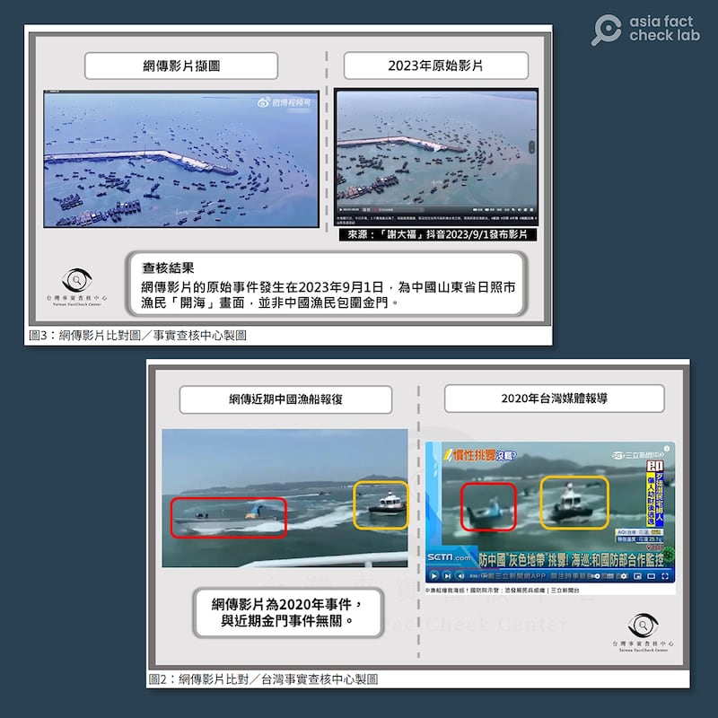
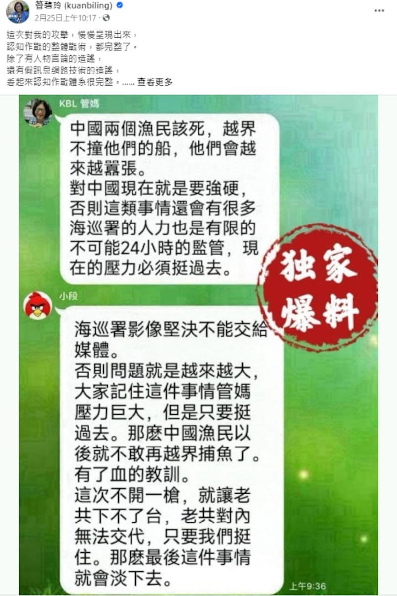
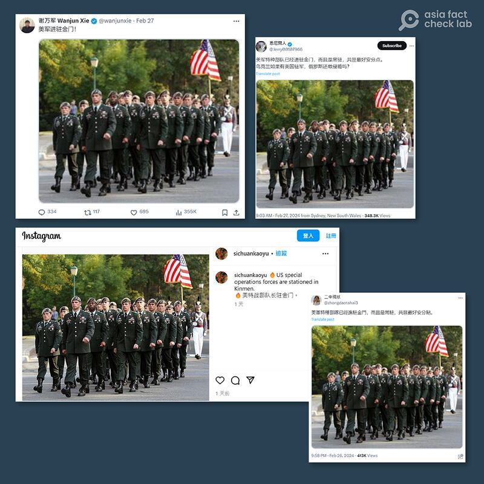

# 傳播觀察｜金廈翻船事件後，謠言和宣傳敘事中出現大量無關影像

作者：莊敬

2024.03.08 17:34 EST

2月14日,在金門近海發生中國籍船隻翻覆 [事故](https://www.cga.gov.tw/GipOpen/wSite/ct?xItem=159714&ctNode=650&mp=999),船上4人落海,其中2人送醫不治。中國 [國臺辦](http://www.gwytb.gov.cn/xwdt/xwfb/wyly/202402/t20240215_12600008.htm)強烈譴責臺方,指臺灣民進黨當局粗暴對待大陸漁民,是導致惡性事件發生的主要原因。臺灣的 [陸委會](https://www.mac.gov.tw/News_Content.aspx?n=05B73310C5C3A632&sms=1A40B00E4C745211&s=56926219E1AA744F)等單位則表示,海巡人員依法執行職務,過程並無不當,對發生不幸事件深表遺憾。

船隻翻覆案持續延燒，網上不斷出現各種傳言，亞洲事實查覈實驗室（AFCL）已經查實了其中多個謠言，在此基礎上又彙總整理了該案相關的各類信息及其他查覈報告，並採訪專家學者，分析了此事件的傳播現象。

## 挪用無關影像爲宣傳造勢

綜合AFCL、臺灣事實查覈中心、MyGoPen等組織的查覈報告,在翻船事件後,臉書、X(原推特)、微博、抖音等多個平臺上,都出現大量有關翻船事件的傳言,其中許多信息挪用了無關的影像並加以解讀。例如,網傳 ["中國漁船包圍金門島,讓漁民出不了門"](https://tfc-taiwan.org.tw/articles/10317)是拼湊中國漁民開漁畫面,虛構出中國漁船包圍金門的"壯觀"景象, ["金廈海域大陸10艘漁船報復海巡船"](https://tfc-taiwan.org.tw/articles/10339)則是挪用2020年3月16日新聞事件的舊影像。

臺灣事實查覈中心2月底發表的 [文章](https://tfc-taiwan.org.tw/articles/10345)指出,以"中國漁民反擊海巡"爲敘事主軸的傳言有多種版本,其共同的手法是引用舊事件或無關事件,呈現中國人數衆多、壯盛、團結,暗示中國武力強大,同時弱化臺灣。

組圖：發生翻船事故後，臺灣的事實查覈單位發現網路上流傳挪用無關影像的內容。（圖取自臺灣事實查覈中心）

持續觀察網傳信息一段時間後,AFCL發現,上述手法不僅出現在"中國漁民反擊海巡"的敘事中,也用於宣傳中國海警在金廈海域的作爲,以展現中國的強勢作風。像是網路視頻中出現的 ["六艘中國海警船包夾金門"](2024-02-28_事實查覈｜翻船事件後，六艘中國海警船"包夾金門"的網傳圖片是真的嗎？.md)畫面,實爲2023年中菲船隻在南海對峙的影像;另外還有網民聲稱在金門拍到的"顯示出雙方實力差距"的 [兩岸海巡船隻對比圖](https://www.mygopen.com/2024/03/kinmen-photo.html),早在此次翻船事件之前就曾多次出現在中國與菲利賓、越南等國在南海海域發生衝突事件的報道里,與臺灣無關。

事實上,2月14日發生翻船事件後,中國雖強勢採取多項行動,包括否定臺灣禁限制水域、登檢臺灣觀光船、宣佈在金廈海域展開常態化執法巡查等,但初期由官方發佈的影像並不多。直到2月25日,中國海警局接連發布兩則搭配影像的要聞,一則是 [福建海警組織艦艇編隊在金門附近海域開展執法巡查](https://www.ccg.gov.cn/2024/hjyw_0225/2423.html),附有三張照片;另一則是 [福建海警在廈金海域開展綜合執法演練](https://www.ccg.gov.cn/2024/hjyw_0225/2424.html),附有一則45秒的視頻。

當日,中國海警局也同步發佈了"執法巡查"和"執法演練"的影像,讓不少媒體、網紅取材時,有意或無意地誤用演練的畫面來報道中方海警在金門附近巡查的過程,甚至有 [評論員](https://weibo.com/7781698041/5005791757079242)使用演練畫面來解讀"巡查現場",把演練視頻中"發現疑似PC10031船"的模擬情境,當成現實的巡航過程,而傳播了錯誤內容。此一傳播現象,AFCL亦有專文分析。

## 各方找“戰犯” 假訊息亂竄

相關單位仍在釐清事件肇因時,一些人就開始"找戰犯",傳播針對特定人士的不實信息。其中一例是社媒用戶發文指控,臺灣海巡署一名吳姓隊長因經營漁業公司的生意考量,而造成福建漁民喪生的悲劇,發文並附上一份公文爲證。經 [查覈](2024-02-19_事實查覈｜在金門死亡的中國漁民是臺灣"海巡隊長"造成？.md),其指控內容有多項疑點,公文不完整,海巡署亦駁斥網傳內容。

另一則是針對臺灣海委會主委管碧玲。網路上流傳管碧玲與前立委段宜康的羣組對話截圖，用戶“KBL管媽”向“小段”（段宜康）表示：“中國兩個漁民該死，越界不撞他們的船，他們會越來越囂張。”“小段”則回應：“海巡署影像堅決不能交給媒體。”查覈結果顯示，網傳聊天記錄對話框外的頭像和背景是將兩人在2017年討論婚姻平權的對話截圖，而對話框內的文字則被修改成了討論翻船事件的內容。

網傳臺灣海委會主委管碧玲與前立委段宜康的羣組對話截圖。管碧玲在臉書表示，這是對她的攻擊、認知作戰。（管碧玲臉書截圖）

在臺灣事實查覈中心整理的四種敘事之中，上述爲第二種“臺灣政府或臺灣人不正當、不公義”，站在中國角度批判臺灣。第三、第四類傳言，則是站在反中、反共立場，批評中國籍船隻，或是懷疑中國籍船員的真實身份。

其實,在事件初期出現的 ["網傳越界陸籍漁船衝撞金門海巡船隻影片"](https://www.mygopen.com/2024/02/cp-1022.html)之中,就指控"中共特工假扮平民乘快艇衝撞臺灣海巡船",爲了轉移國內矛盾而"碰瓷"。值得注意的是,這支網傳影片也是挪用2020年3月16日新聞事件的舊影像,也就是與 ["金廈海域大陸10艘漁船報復海巡船"](https://tfc-taiwan.org.tw/articles/10339)使用同樣的影像素材,但敘事角度截然不同。

2月下旬,網路盛傳生還者之一的王元祥"真實身份"是中共解放軍南部戰區海軍潛員隊一級軍士長陳祖軍。這個傳言還成爲臺灣政論節目討論的話題,但臺灣的陸委會主委邱太三已否認生還者爲解放軍,AFCL亦 [查覈](2024-03-07_事實查覈｜金廈翻船事件生還者之一是解放軍？.md)此傳言,經移民官、熟悉面部識別技術的學者判讀,該生還者與陳祖軍爲同一人的說法缺乏證據。

## 美國“被捲入”事件

AFCL注意到，在2月下旬至3月初這段期間，網路上有關該案件的討論，除了圍繞作爲主角的中國與臺灣，愈來愈多人提及美國。其中一例是多位社媒用戶發文，稱美軍特種部隊已進駐金門，並搭配一張美軍的照片爲證。但在這些帖子下面，有網民指出這是2007年的舊照片。

AFCL以圖反搜,在 [維基百科](https://en.m.wikipedia.org/wiki/File:Wayne_Downing_funeral_honor_guard.jpg)找到上述對照片的描述,是美國陸軍遊騎兵與第75遊騎兵團組成"榮譽排",走在韋恩.唐寧將軍送葬隊伍中的場景,但原始照片連結已失效。不過,搜尋結果顯示,這張照片過去多次出現在介紹"綠色貝雷帽"(又稱綠扁帽)部隊的文章,並非最近的情境。

組圖：多位社媒用戶發文，稱美軍特種部隊已進駐金門，並搭配一張美軍的照片爲證。但另有網民指出這是2007年的照片。（X、IG平臺截圖）

有關美軍"綠色貝雷帽"進駐金門的傳言,除了挪用無關照片,也被一些人誇大解讀。經查,相關美軍進駐金門的消息出自臺灣 [《聯合報》](https://udn.com/news/story/10930/7754972)2月初的報道,指今年起美軍顧問長駐金門、澎湖陸軍兩棲營,但臺灣國防部不予評論。根據《美國之音》3月5日報道,美國國防部對此事的回應是"不評論特定行動",但也表示美臺防務關係會因當前中國對臺威脅調整。

事涉美臺防務細節，相關單位的不予置評讓消息本身是否屬實更難評斷。但至少可以確定的是，《聯合報》的報道是在翻船案之前刊出，卻有許多社媒用戶將此消息與該案關聯解讀，傳播誤導性的內容。

圍繞此次事件,近期也有不少網民討論 [《臺灣關係法》](https://web-archive-2017.ait.org.tw/zh/taiwan-relations-act.html)只管臺灣、澎湖,其他外島不管。經查,《臺灣關係法》指出,"'臺灣'一詞將視情況需要,包括臺灣及澎湖列島,這些島上的人民、公司及根據適用於這些島嶼的法律而設立或組成的其他團體及機構。1979年1月1日以前美國承認爲中華民國的臺灣治理當局,以及任何接替的治理當局(包括政治分支機構、機構等)。"

《臺灣關係法》僅正面表列臺灣及澎湖列島，但也未明文排除金門、馬祖。所謂美國只管臺澎，不管其他外島的說法證據不足。針對此議題，AFCL將發佈專題報道。

## 專家觀察：中國官方與網民看法存在差距

對於翻船案後，網上流傳大量傳言與挪用無關畫面的現象，臺灣淡江大學國際事務與戰略研究所助理教授林穎佑指出，此事件再次證明大家取得資訊的來源有所轉變，以及對於網路信息的依賴。而從這次事件也可以看出，對於宣傳而言，結合影像製造和傳播不實訊息，能取得更好的傳播效果。

林穎佑提醒，事件相關方各自有想法與目的，都會希望透過影片等內容展開宣傳敘事以證明自己的正當性，大衆必須留意，避免因錯誤資訊的誤導而做出錯誤判斷。

淡江大學兩岸關係研究中心主任張五嶽觀察到,2月15日至3月5日之間,中共機關報《人民日報》僅有一則報道 [《宋濤會見夏立言一行》](http://cpc.people.com.cn/BIG5/n1/2024/0301/c64094-40186559.html)提到了金廈海域事件,未曾刊登過對此一事件有任何評論性的文章,顯示北京官方對此事的看法與中國網民存有相當大的認知差距。

張五嶽向AFCL進一步說明，中國讓網民宣泄情緒，也有向臺灣施壓的作用，但官方的政策立場不會受到網民言論的影響、制約；至於國臺辦對此事的強烈措辭，張五嶽認爲可以理解，畢竟國臺辦是第一線對臺單位，且許多中國網民長期認爲國臺辦在臺灣議題上過度軟弱，所以國臺辦必須對此事表態。

張五嶽研判，此事件或傷害人民感情，可能引起羣情激憤，但不至於升高到兩岸軍事危機的程度。

*亞洲事實查覈實驗室（Asia Fact Check Lab）針對當今複雜媒體環境以及新興傳播生態而成立。我們本於新聞專業主義，提供專業查覈報告及與信息環境相關的傳播觀察、深度報道，幫助讀者對公共議題獲得多元而全面的認識。讀者若對任何媒體及社交軟件傳播的信息有疑問，歡迎以電郵afcl@rfa.org寄給亞洲事實查覈實驗室，由我們爲您查證覈實。*

*亞洲事實查覈實驗室在X、臉書、IG開張了,歡迎讀者追蹤、分享、轉發。X這邊請進:中文*  [*@asiafactcheckcn*](https://twitter.com/asiafactcheckcn)  *;英文:*  [*@AFCL\_eng*](https://twitter.com/AFCL_eng)  *、*  [*FB在這裏*](https://www.facebook.com/asiafactchecklabcn)  *、*  [*IG也別忘了*](https://www.instagram.com/asiafactchecklab/)  *。*

[Original Source](https://www.rfa.org/mandarin/shishi-hecha/hc-03082024172043.html)