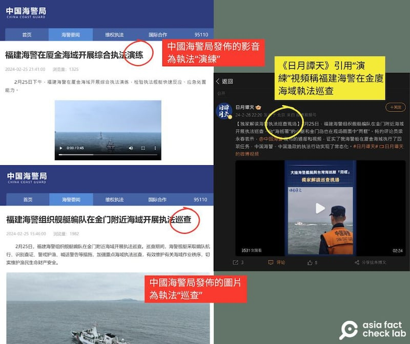

# 開源情報查覈（上）｜ 金門翻船事件後，中國海警的"執法"、"演習"和"宣傳"

作者： 艾倫

2024.03.12 15:31 EDT

2月14日，一艘中國船隻在金門海域遭臺灣海巡艇執法時翻覆，導致兩岸衝突升級，至今未見緩解。隸屬中國中央電視臺的新媒體帳號發佈消息，宣稱中國海警艦艇航行時突破了“原本就不存在”的禁止、限制水域，並且強調“有權依法巡查臺方船隻”，未來還可能將 “對臺灣海巡船進行喊話警告”。

中國官媒宣稱無視金門禁限水域,但實際行動上是不是真的如此?中國海警船是否在25日的行動中喊話、警告了臺灣海巡艇?臺灣有 [政論節目](https://www.youtube.com/watch?v=cLatoX9s3Hk)直接以標題稱中國已對金門佈署"準軍事行動",實際情況究竟如何?

亞洲事實查覈實驗室通過開源情報(open source intelligence)搜索、監看、查覈後發現，從2月25日到本文撰稿的3月7日之間，中國海警和相關執法船隻確實在2月25到27日曾短時間進入金門的禁止、限制水域，其它時間都在禁限水域外航行。而中國官媒的新媒體帳號和諸多中國媒體，則把中國海警的“演練”當作實際執法對外宣傳，臺灣媒體跟進報道者也不在少數。

我們將以兩篇報道呈現查覈的結果。

## 《日月譚天》的獨家視頻是執法，還是演練？

2月26日,中國中央電視臺所屬新媒體《日月譚天》在微博發佈一則 [視頻](https://weibo.com/7781698041/5005791757079242?layerid=5005791757079242),題爲"獨家解讀海警執法巡查現場"。該視頻引用福建海警在25日下午於金廈海域進行執法巡查的影片,並搭配評論員梁永春做出的四點解讀:

1. 中國海警突破了"原本就不存在"的禁限制水域。
2. 中國海警船有權巡查、登檢臺方船隻。
3. 中國海警保護大陸漁民在金廈"傳統漁場"的作業。
4. 中國海警將對臺灣海巡船喊話警告,必要時採取驅離行動。

貼文一出,臺灣媒體紛紛轉載報導, [中國時報](https://www.chinatimes.com/opinion/20240226004263-262110?chdtv)、 [聯合報](https://udn.com/news/story/9213/7791235)、 [ETtoday](https://www.ettoday.net/news/20240226/2689142.htm%23ixzz8SokhuvJ2)等皆轉述了相關新聞,消息甚至傳到臺灣論壇 [PTT](https://www.ptt.cc/bbs/Military/M.1708922386.A.92F.html)上。中時直接轉載了《日月譚天》"譚主"的評論,標題爲 ["既然騙不下去,就早點道歉究責"](https://www.chinatimes.com/opinion/20240226004263-262110?chdtv)。

由《日月譚天》發佈,梁永春點評的內容,真的是中國海警"執法"的實況嗎?我們查看了中國海警的官網,發現海警局在25日下午3點46分先發布了" [福建海警組織艦艇編隊在金門附近海域開展執法巡查](https://www.ccg.gov.cn/2024/hjyw_0225/2423.html)"的新聞稿,附帶三張照片,其中一張可以見到一艘臺灣海巡艇。當晚9點41分,海警局再公佈了一則視頻," [福建海警在廈金海域開展綜合執法演練](https://www.ccg.gov.cn/2024/hjyw_0225/2424.html)",而這部正是《日月譚天》於26日在微博所引用的影片。

可以發現，中國海警局原本發佈的新聞材料及影片，內容都是“執法演練”，但《日月譚天》和評論員梁永春卻把這段影片說成執法實況，還加入了靜態照片。以誤導手法塑造了一段新敘事：中國海警進入金門禁限水域執法，並且喊話驅趕臺灣海巡艇。

## 臺灣10031海巡艇和中國海警"同框"了嗎？

《日月譚天》和評論員梁永春以誤導手法創造新敘事的另一個證明，是中國海警影片中的喊話對象，以及所公佈照片中與中國海警同框的所謂“PC-10031號臺灣海巡艇”。

《日月譚天》26日發佈的金廈海域執法解說影片，使用的是中國海警局的"演練"影音。（微博和海警局官網截圖）

臺灣海巡署官員向亞洲事實查覈實驗室證實,臺灣海巡署轄下並沒有"PC-10031號"海巡艇,但確實有發音相近的"PP-10031號"海巡艇,但這艘海巡艇屬於臺中海巡隊,並不在金門。亞洲事實查覈實驗室同時根據根據 [政府電子採購網](https://web.pcc.gov.tw/tps/atm/AtmAwardWithoutSso/QueryAtmAwardDetail?pkAtmMain=NzA0MDg3MzU=),查到一則維修招標公告,證明PP-10031艇確實屬於"第三(臺中)海巡隊"。負責維修的基隆協鑫造船公司證實這艘船在2023年12月13日驗收,並返回單位。

隸屬臺中的10031艇可不可能在金門海域執勤？以至於有機會如《日月譚天》所稱，在海面上和中國海警船“同框”？ 臺灣海洋委員會公關科科員林冠瑩指出，目前臺灣海巡僅派小艇在相關海域進行一般勤務，並沒有出現雙方海巡對峙的情況，也不曾派遣其他大型艦艇支援。

臺中海巡分隊一名官員回應詢問時指出，除非有特殊任務，否則地方海巡艦艇不會任意更改地方服役。因此可以證明，臺灣海巡10031艦艇和中國海警船在金廈海域同框機率極低。

至於實際上與中國海警艦艇“同框”的船隻，根據中國公佈的照片，亞洲事實查覈實驗室可以識別出應該爲臺灣海巡艇，但究竟是哪一艘船，則無法確定。

*亞洲事實查覈實驗室（Asia Fact Check Lab）針對當今複雜媒體環境以及新興傳播生態而成立。我們本於新聞專業主義，提供專業查覈報告及與信息環境相關的傳播觀察、深度報道，幫助讀者對公共議題獲得多元而全面的認識。讀者若對任何媒體及社交軟件傳播的信息有疑問，歡迎以電郵afcl@rfa.org寄給亞洲事實查覈實驗室，由我們爲您查證覈實。*

*亞洲事實查覈實驗室在X、臉書、IG開張了,歡迎讀者追蹤、分享、轉發。X這邊請進:中文*  [*@asiafactcheckcn*](https://twitter.com/asiafactcheckcn)  *;英文:*  [*@AFCL\_eng*](https://twitter.com/AFCL_eng)  *、*  [*FB在這裏*](https://www.facebook.com/asiafactchecklabcn)  *、*  [*IG也別忘了*](https://www.instagram.com/asiafactchecklab/)  *。*

[Original Source](https://www.rfa.org/mandarin/shishi-hecha/hc-03122024152712.html)