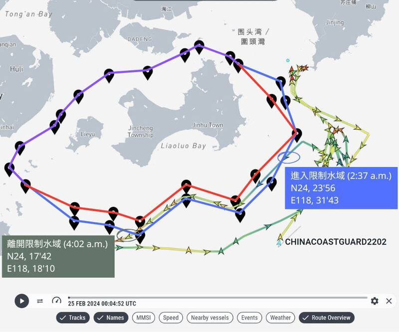
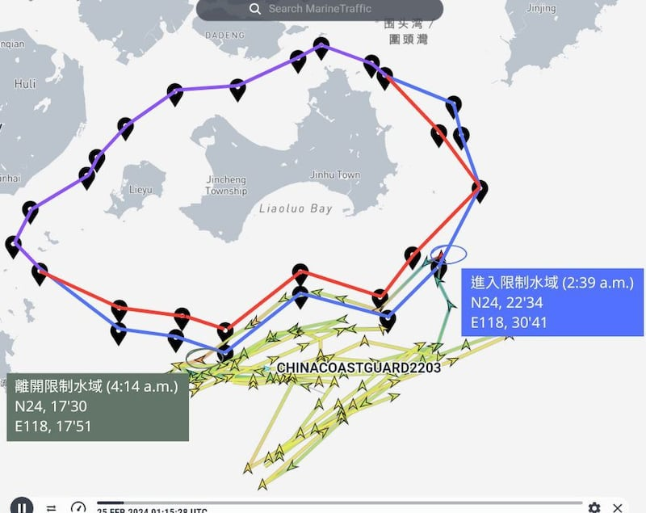
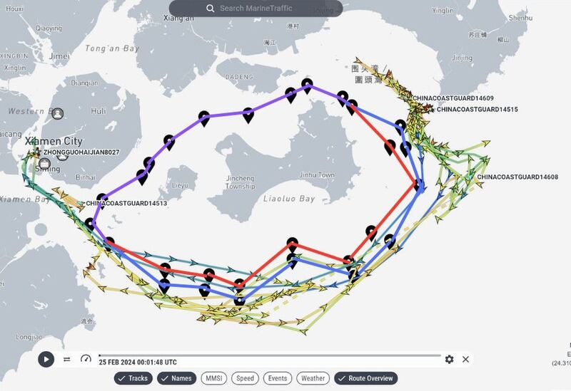
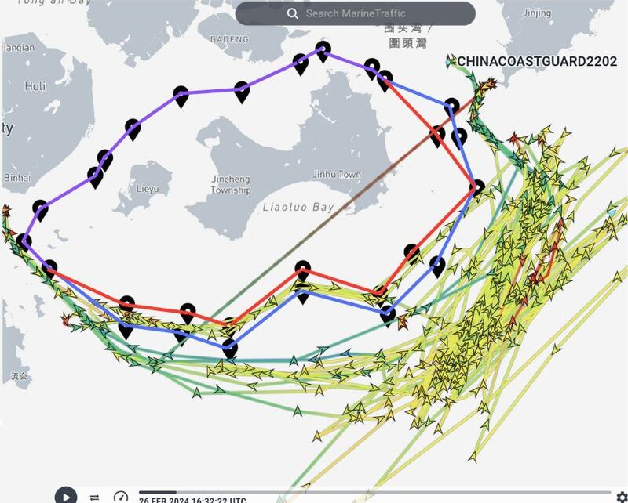
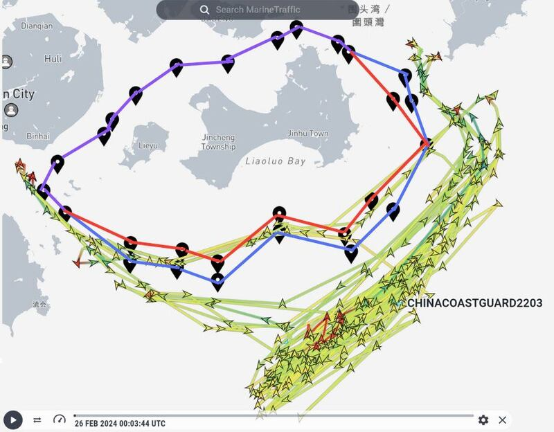
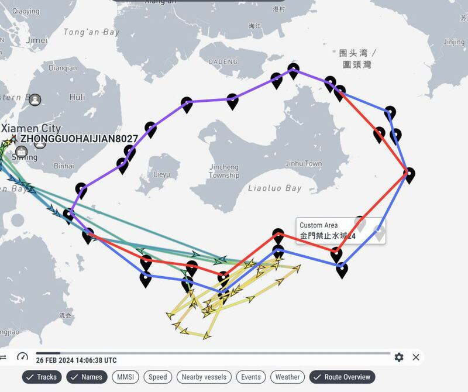
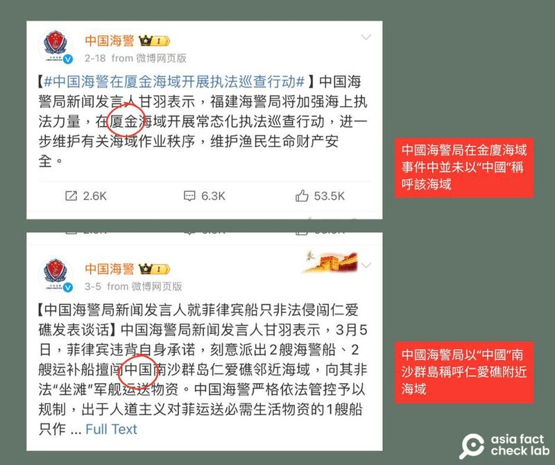

# 開源情報查覈(下)｜金門翻船事件後，中國海警的實際行動和宣傳有多大差距？

作者：艾倫

2024.03.14 15:57 EDT

2月14日,在金門海域,一艘中國船隻在臺灣海巡艇執法時翻覆,導致兩岸矛盾升級,至今未見緩解。2月26日,中國中央電視臺的新媒體帳號發佈消息,宣稱中國海警艦艇25日航行時突破了"原本就不存在"的禁止、限制水域,並且強調"有權依法巡查臺方船隻",未來還可能將 "對臺灣海巡船進行喊話警告"。臺灣更有 [政論節目](https://www.youtube.com/watch?v=cLatoX9s3Hk)稱中國已對金門佈署"準軍事行動"。

[本系列上篇](https://www.rfa.org/mandarin/shishi-hecha/hc-03122024152712.html?encoding=traditional)中,亞洲事實查覈實驗室針對上述報道進行查覈,發現官媒和海警局發文互相矛盾。

從2月25日迄今，中國海警的巡查路線如何？是不是如中國官媒所說無視臺灣的規定？兩岸摩擦真的如臺媒所稱，達到“準軍事衝突標準？”

亞洲事實查覈實驗室通過開源情報(open source intelligence)查覈發現，從2月25日起，到本文撰稿的3月7日之間，中國海警和相關執法船隻確實在2月25到27日曾短時間進入金門的禁止、限制水域，其它時間都在禁限水域外航行。專家分析，兩岸媒體的報道、解讀，有誇張、誤導之處。

## 2月25日，金廈海域發生了什麼？

我們用公開網站“Marine Traffic”的數據，着重追蹤了中國在金門海域執法的2202、2203號海警船從2月25日到3月6日的航行軌跡，也查看了這段時間該海域其它海警、海監船的動態，試圖展現中國政府和官媒的宣傳，與海警巡查的實際行動之間的差異。

[Marine Traffic](https://www.marinetraffic.com/en/ais/home/centerx:108.2/centery:24.0/zoom:5)(海事交通)爲全球性船舶即時動態追蹤網站,該網站用Google地圖做爲基底,提供各項船舶資訊和船隻的即時和過去航跡等動態。不少主流新聞媒體如《紐約時報》、BBC等已將Marine Traffic [作爲開源情報調查的證據來源](https://www.marinetraffic.com/blog/supporting-journalism-shipping-data/)。

Marine Traffic使用世界協調時間(UTC),比臺灣時間晚8小時。數據顯示, 在25日前後,中國海警一系列的"執法"中,參與行動的艦艇除了屬於福建海警局的14608等艦艇外,還包括直屬中國海警第二局的2202、2203兩艘大噸位、由軍艦改編的執法船。 兩艦的參與象徵意味濃厚,中國媒體《環球時報》在 [報道中](https://hqtime.huanqiu.com/article/4Gje1IwuxoN)形容2202艦參與執法是"一大亮點""這無疑是對現地力量的一種顯著加強",亞洲事實查覈實驗室因此着重觀察了這兩艘海警船的航行軌跡。

首先，我們發現中國2202號海警船從25日凌晨2點多便開始在金門東南和西南海域巡航，最近距離金門不到4海里，進入了金門限制水域，貼着限制線航行，到4點多離開。

中國海警2202船於2月25日進入金門限制水域。紅線爲禁止水域、藍線爲限制水域、紫線則爲同時禁止和限制範圍(下圖皆同)。此圖僅展示2202船當日一次的進出限制水域時間。（圖截自Marine Traffic，禁、限制水域為AFCL根據官方公告經緯度所套繪，下同）

2203的動向則和2202差不多。而2203號船則主要繞行在金門南部，距離金門最近也僅不到4海里，和2202號狀況相仿。

中國海警2203船於2月25日進入金門限制水域的時間和位置（圖截自Marine Traffic）

因此，25日的巡查主力2202、2203號海警船，並未突破金門的禁止海域，只有短時進入限制海域。《日月譚天》宣稱中國海警船25日航行時突破了禁止、限制水域的說法存在誤導信息。

除了2202、2203兩艦外，25日主要在金廈海域繞行的還有其他4艘海警船，包含14608、14609、14513和14515艦艇，以及一艘中國海監 8027號船。 這些海警船大多僅貼着限制線航行，只有海監8027號船在凌晨將近1點時進入禁止水域，是整段觀測時間內最明顯逾越禁止線的中方艦艇。 （注：Marine Traffic須藉助航行船隻開通AIS自動辨識系統纔有航行記錄，本篇僅着重在25日動態地圖上明顯繞行金廈水域的船舶）

中國海警船14608、14609、14513和14515，以及海監船8027船在25日當天於金廈海域的動向，其中穿越紅色禁止線的爲海監8027。（圖截自Marine Traffic）

數據顯示,這段時間中,中國派出了不同級別的海警、海監船,只有執法力度較弱的海監船短時間進入了禁止水域。根據臺灣海委會《海巡季刊》資料,中國的海監和漁政部門原屬國土資源部和農業部,從2013年起整合進入海警系統。然而,臺灣國防安全研究院副研究員黃宗鼎分析,比起2202、2203號等正規海警船,中國海監船的性質仍屬一般行政船,進入金門海域雖然造成一定程度挑戰,但執法力度不如海警艦艇。 目前,中國海警編列在武警系統之下,由中央軍委會直接坐鎮指揮,美國曾表明 [會將中國海警和海軍同等對待。](https://indsr.org.tw/respublicationcon?uid=12&resid=702&pid=2542)

至於爲何中國海警船大多在金門南邊海域活動，黃宗鼎則說，金門西北和西部的禁止以及限制水域趨於重疊，在那邊活動效果較小，但在禁止、限制比較有明顯距離範圍的南部水域巡查，較有“挑戰”意味。

## 25日後，中國在金廈海域執法動向如何？

在中方高調宣傳了25日的“執法行動”後，Marine Traffic資訊顯示，海警船2202於2月27日也駛入限制水域，此後一週便如25日當天，緊靠金門限制海域航行。但之後就多在金門東南方海域航行，距離禁限水域愈來愈遠。

2月26日至3月6日海警2202船的航行軌跡，突破限制水域。圖中劃過禁止水域的直線爲該船在2月29日8點54分至22點02分期間，AIS（自動辨識系統）訊號消失的標誌，並非已經穿越禁止水域。

2203在25日之後，船隻動向和2202並無太大差異，也是於27日再次進入限制水域。但同樣之後就多在金門東南方海域航行，距離禁限水域愈來愈遠。

2月26日至3月6日海警2203船的航行軌跡，期間突破限制水域。

另外Marine Traffic數據也顯示海監8027曾經在2月26及27日明顯進入禁止水域。

但總體來說，2月25日至3月7日之間，在金廈海域執勤的中國海警船，航行軌跡並沒有太大變化。 儘管確實如中方所說，中國已經在金門臨近海域展開“常態性”巡查，但除了海監船進入禁止水域外，6艘經本文查覈的海警船（2202、2203、14608、14609、14513和 14515），最多隻是緊貼限制海域，或者在距離更遠一點的海域航行。

左上：2月26日至3月6日海監8027船的航行軌跡，突破禁止水域。

## 中共海上執法意味衝突升高，或只是宣傳戰？

黃宗鼎在接受亞洲事實查覈實驗室採訪時說，金門禁止、限制海域是“兩岸早年在有政治諒解的情況下，兩岸人民關係條例下延伸出來的產物”。中國在船隻翻覆事件後，雖然在宣傳上稱禁限水域“原本就不存在”，卻也沒有真的派海警船深入禁止水域，並不能算是“持續性的挑戰”或“推翻”兩岸現況。

針對中媒如《日月譚天》的相關報道，黃宗鼎認爲此事件是中方宣傳戰一貫的手法，但不認爲中國官方有刻意透過此事件來擴大爭議。黃宗鼎補充，從海警局的聲明來看，在面對南沙羣島、釣魚臺或是在南海和菲律賓的衝突，中國都會強調是在“中國管轄海域範圍”執法，但這次面對金廈海域爭議的聲明只提及金廈“相關海域”，態度可說是硬中帶軟。

中國海警局針對南沙羣島及金廈海域爭議的聲明，措辭不同。（圖截取自中國海警局官方微博帳號）

對於臺媒所稱兩岸達到“準軍事衝突”標準，黃宗鼎認爲，這個說法也並不準確。金門、馬祖爲中國的統戰示範區，升高衝突不利於統戰認知，而金門和馬祖水域從1980年代就被中國認定爲“領海基線內水”， 在所謂的“內水”製造軍事衝突，反而自相矛盾。

至截稿日（3月8日），兩岸已針對船隻翻覆致死案進行15次的協商，但雙方還未達成共識。

和具有爭議、分歧性的事件一樣，這次不論是船隻翻覆或中國海警執法，都可以看到很多信息操作的情況。 黃宗鼎認爲，媒體基於意識形態或爲求快，常會直接引用中國官媒釋出的消息，讓面對真相變得困難，需要不斷的進行求證。

*亞洲事實查覈實驗室（Asia Fact Check Lab）針對當今複雜媒體環境以及新興傳播生態而成立。我們本於新聞專業主義，提供專業查覈報告及與信息環境相關的傳播觀察、深度報道，幫助讀者對公共議題獲得多元而全面的認識。讀者若對任何媒體及社交軟件傳播的信息有疑問，歡迎以電郵afcl@rfa.org寄給亞洲事實查覈實驗室，由我們爲您查證覈實。*

*亞洲事實查覈實驗室在X、臉書、IG開張了,歡迎讀者追蹤、分享、轉發。X這邊請進:中文*  [*@asiafactcheckcn*](https://twitter.com/asiafactcheckcn)  *;英文:*  [*@AFCL\_eng*](https://twitter.com/AFCL_eng)  *、*  [*FB在這裏*](https://www.facebook.com/asiafactchecklabcn)  *、*  [*IG也別忘了*](https://www.instagram.com/asiafactchecklab/)  *。*

[Original Source](https://www.rfa.org/mandarin/shishi-hecha/hc-03142024154742.html)