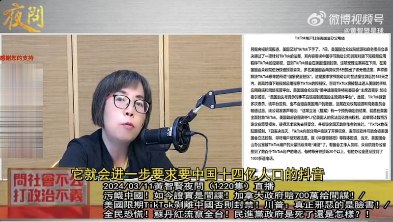
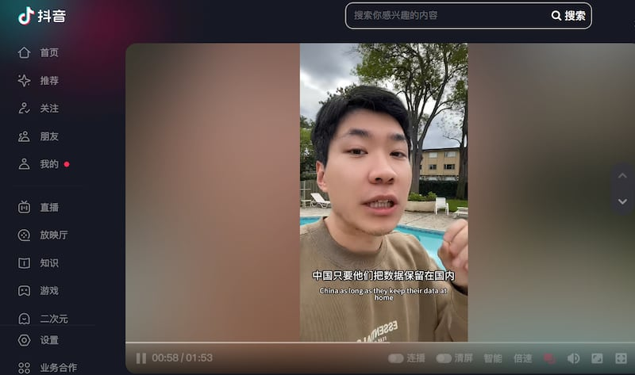
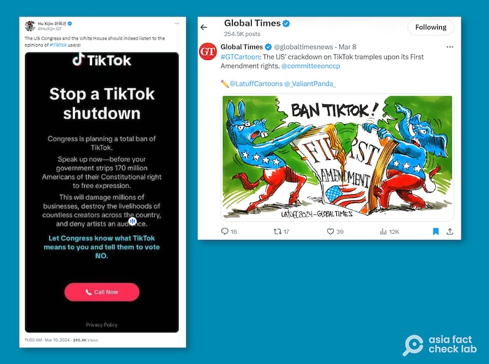

# 事實快查｜中國熱議美國針對Tiktok立法進展，哪些說法有問題？

作者：鄭崇生，發自華盛頓

2024.03.15 18:56 EDT

美國聯邦衆議院3月13日(週三)以352贊成、65票反對,通過針對TikTok的 [《保護美國人免受外國對手控制應用程序法》法律草案](https://docs.house.gov/billsthisweek/20240311/HR%207521%20Updated.pdf)(Bill of Protecting Americans from Foreign Adversary Controlled Applications Act,下簡稱法案)。 [《華盛頓郵報》報道](https://www.washingtonpost.com/technology/2024/03/07/tiktok-ban-congress-calls-us/),TikTok在法案於衆院通過前大動作出擊,發動彈窗動員1.7億的美國用戶給選區議員打電話施壓,表達反對立法的態度,一度癱瘓不少議員辦公室電話,展現出TikTok在美國的影響力。

TikTok是中國互聯網行業“出海”最成功的產品之一，因此，該項法案的進展也在中國國內引發媒體廣泛報道和網絡討論，但其中不少論述有扭曲事實和錯誤之處。

亞洲事實查覈實驗室針對一些流傳甚廣的說法進行查覈，釐清相關資訊，供讀者參考。

## 一 、美國針對TikTok立法,是爲進一步取得中國抖音用戶的數據?

## 這個 說法沒有根據。

在中國新浪微博上擁有近200萬粉絲的臺灣名嘴黃智賢11日在錄製的 [視頻](https://weibo.com/tv/show/1034:5010861731807267?from=old_pc_videoshow)中就聲稱,美國要求TikTok賣給美國公司是要"所有的數據"(約02"30處),是要 "反向喫你14億人口抖音的所有東西",之後會進一步要求中國14億人口的抖音(數據)(約3"10處)。

臺灣名嘴黃智賢稱美國國會立法是在圖謀抖音的數據 （圖截取自微博視頻號"黃智賢星球"）

但查詢該法案內容，它要求在美國總統簽字生效後的180天內，TikTok需與總部位於北京的母公司字節跳動剝離，否則包括蘋果Apple與谷歌Google在內的應用程序商店將不能提供下載服務或是向字節跳動控制的應用程序提供網絡託管服務，立法目的載明是爲了保護美國的國家安全及美國TikTok用戶的數據安全。

黃智賢的說法，並沒有已知文件或在證據支持。

## 二、TikTok VS Google：守法的Tiktok被美國趕走，而當年Google是因爲不願守法，放棄中國市場？

## 這個說法沒有事實依據。

中國抖音上擁有粉絲數超過300萬的博主 ["李三金Alex看世界"](https://v.douyin.com/iFkV3vqs/)的觀點,在中國網絡世界不算少見。很多博主聲稱,中國當初只是要像是谷歌等外國網絡企業或社交媒體將數據保留在中國,就可以在中國市場發展,但"谷歌不同意,是他們放棄了中國市場。

抖音網紅"李三金Alex看世界"稱谷歌是因爲拒絕將數據保留在中國而放棄中國市場 （圖截取自抖音）

這類博主多以谷歌當年退出中國的事件對比美國現在的立法進程,凸顯美國作法是刻意針對TikTok。 然而,翻查舊檔案可發現,谷歌2010年宣佈退出中國市場以前,其服務器曾設在中國境內。谷歌當時 [聲明](https://www.google.cn/press/new-approach-to-china/update.html),受到來自中國、複雜的網絡攻擊,和中國政府對審查的要求,該公司決定將"爲中國大陸用戶設計的服務"轉向香港的服務器。

回顧新華社當年的英文 [報道](https://web.archive.org/web/20220708214551/https:/www.chinadaily.com.cn/china/2010-03/23/content_9625554.htm),網信辦不具名的官員明確表示:"谷歌停止在搜尋服務上的審查,並影射遭到中國的網絡駭客攻擊,違反了谷歌當年進入中國市場時寫下的書面承諾",網信辦官員還指責谷歌"將商業問題政治化"。

## 三、美國要禁TiKTok是因爲它傳播了以色列與哈馬斯衝突的真相？

## 這個說法存在誤導。

以哈衝突中,TikTok的確成爲許多加沙當地民衆第一時間分享訊息的重要平臺,但亞洲事實查覈實驗室也發現,不乏在TikTok與抖音這兩個平臺間互相轉發的重製影片,有不少是舊片重發、移花接木的資訊,亞洲事實查覈實驗室也有過多篇系列報道,詳見: [一](2023-10-18_事實快查｜以哈衝突第一週，被當成"新聞"的舊照片.md)、 [二](2023-10-25_事實快查｜以哈衝突中的熱傳視頻：哈馬斯童軍突襲警局？加沙孩子餓到喫草？.md)。

因此,像是抖音上有超過600萬粉絲的博主 ["阿跪的幸福生活"](https://v.douyin.com/iFkTGCrk/)的說法,聲稱因TikTok揭發以哈衝突真相,美國纔要立法針對TikTok,有誤導之嫌。

抖音網紅"阿跪的幸福生活"稱因TikTok揭發以哈衝突真相，美國纔要立法針對TikTok （圖截取自抖音）

並且，在互聯網世界對以哈問題的討論中，TikTok和X，Facebook等許多社羣平臺一樣，充滿了各方觀點的表達，目前，在美國並沒有任何媒體或者互聯網因爲傳播以哈衝突相關信息而受到懲罰。

## 四、 該草案是TikTok"禁令"? 違反美國憲法第一修正案?   這個 觀點有爭議。
中國前媒體人胡錫進及《環球時報》都在X上發表上述觀點,在美國,這項法案是否是"禁令"、是否違憲也引發了很多討論和爭議,但尚未有定論。

胡錫進及《環球時報》稱國會立法是要徹底"禁用"TikTok,是對1.7億美國用戶基本權利的踐踏 （圖截取自X）

美國霍夫斯特拉大學（Hofstra University）法學院教授古舉倫（Julian Ku）告訴亞洲事實查覈實驗室，這個法案不是一項全面禁令，而是一個要求分拆的法案，只有當字節跳動不放棄控制權，纔會對 TikTok 實施限制。而對於有關憲法第一修正案的擔憂，他認爲這項立法 “規範的是行爲”，是針對字節跳動的行爲而立法，可能會對言論有間接影響， 但並不是立法去規範言論本身。

關於美國憲法第一修正案中、言論自由的保護,在這次立法中,不少法律界人士都提到了美國最高法院1986年阿卡拉與雲書店(Arcara v. Cloud Books)的 [釋憲案](https://supreme.justia.com/cases/federal/us/478/697/)。 美國最高法院當時指出,法院關閉專門販售成人書籍的書店,並沒有違憲,這一案例也確認了保護言論自由的原則的範圍,也就是"言論內容本身"才受到憲法第一修正案的絕對保護。

支持立法要求TikTok與字節跳動剝離的美國聯邦通信委員會(FCC)委員柯爾(Brendan Carr)就在X [闡述](https://x.com/BrendanCarrFCC/status/1766305153072722284?s=20),最高法院當時認識到關閉書店會對保護言論自由造成連帶負擔,但最後仍維持紐約法院作出關閉書店的判決,因爲政府是根據店主的非法行爲,採取關店行動,並不是根據言論內容。

美國憲法第一修正案指出，國會不得制定有關下列事項的法律：確立一種宗教或禁止信教自由；剝奪言論自由或出版自由；或剝奪人民和平集會及向政府要求伸冤的權利。

另外,聯邦衆議院這次發動立法,不是像蒙大拿州去年直接要求在州範圍內一刀切禁掉TikTok、毫無配套措施的 [立法](https://leg.mt.gov/bills/2023/billpdf/SB0419.pdf)。蒙大拿州聯邦法官去年底在法律生效前判定,暫緩執行, [在判決文書](https://s3.documentcloud.org/documents/24179554/tiktok-inc-v-knudsen.pdf)中,法官認爲"在沒有完善相關配套與中度審查(intermediate scrutiny)情況下、蒙大拿州的立法有可能違反美國憲法第一修正案。"

古舉倫則說，聯邦層級國會提出這項法案比地方州層級更有力，因爲與蒙大拿州不同，國會經常能出於國家安全理由、制定限制外國所有權的法律。

要求TikTok與字節跳動剝離的法案接下來將送交聯邦參議院,若兩院都通過,美國總統拜登(Joe Biden)已經 [表態](https://web.archive.org/web/20240308185540/https://www.reuters.com/technology/trump-raises-concerns-about-us-ban-tiktok-2024-03-08/),他會簽署生效成爲法律。

該法案也訂有救濟條款，在生效後的165天內，可就該法案提出法律訴訟。

*亞洲事實查覈實驗室(* *Asia Fact Check Lab* *)針對當今複雜媒體環境以及新興傳播生態而成立。我們本於新聞專業主義,提供專業查覈報告及與信息環境相關的傳播觀察、深度報道,幫助讀者對公共議題獲得多元而全面的認識。讀者若對任何媒體及社交軟件傳播的信息有疑問,歡迎以電郵* *afcl@rfa.org* *寄給亞洲事實查覈實驗室,由我們爲您查證覈實。*

*亞洲事實查覈實驗室在* *X* *、臉書、* *IG* *開張了,歡迎讀者追蹤、分享、轉發。* *X* *這邊請進:中文*  [*@asiafactcheckcn*](https://twitter.com/asiafactcheckcn)  *;英文:*  [*@AFCL\_eng*](https://twitter.com/AFCL_eng)  *、*  [*FB* *在這裏*](https://www.facebook.com/asiafactchecklabcn)  *、*  [*IG* *也別忘了*](https://www.instagram.com/asiafactchecklab/)  *。*

[Original Source](https://www.rfa.org/mandarin/shishi-hecha/hc-03152024172348.html)