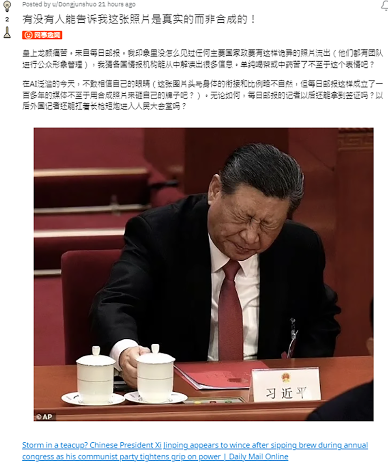
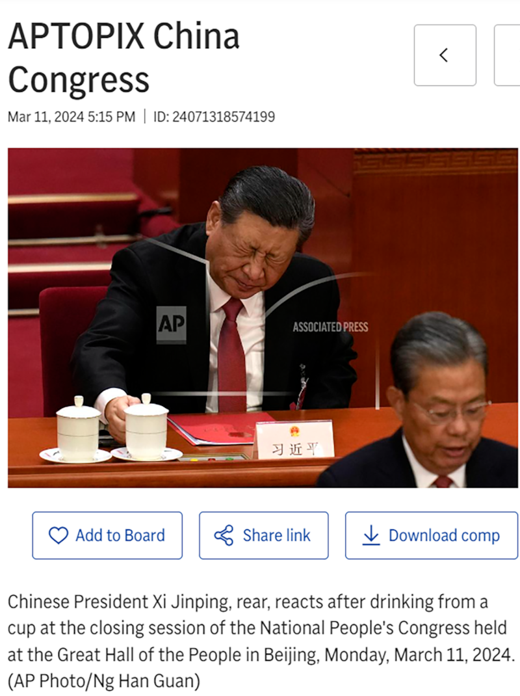

# 事實查覈｜網路瘋傳的習近平皺眉閉眼照是真的嗎？

作者：莊敬

2024.03.18 14:49 EDT

## 標籤：正確

## 一分鐘完讀：

近日，網路瘋傳一張中國國家主席習近平在“兩會”期間的照片，照片中他閉眼、皺眉，表情扭曲，也有多家媒體報道、政論節目討論時使用這張照片。

亞洲事實查覈實驗室注意到，不少網民懷疑照片的真實性，社交平臺上還有人指出圖片中習近平的頭與身體的銜接與比例略不自然。經查，這張照片爲真實畫面，是美聯社記者所拍。

## 深度分析：

在社媒平臺上，有用戶發文懷疑中國國家主席習近平照片的真實性。（圖取自Reddit）

近日，一張中國國家主席習近平在“兩會”期間，閉眼皺眉、表情扭曲的照片，引起多家媒體報道，並在多個社媒平臺上瘋傳。但也有許多網民質疑照片的真實性，有人留言“這應該是境外勢力用AI做的假圖”，還有人發文詢問：“有沒有人能告訴我這張照片是真實的而非合成的！”

經查,該照片出自英國《每日郵報》3月11日 [報道](https://www.dailymail.co.uk/news/article-13183627/Chinese-President-Xi-Jinping-annual-congress-communist-party.html),習近平出席全國人大閉幕會議期間,被媒體捕捉到拿起桌上茶杯喝了一口之後,緊閉雙眼、皺眉頭,面露痛苦表情,就像是被杯裏的東西燙到。報道指出,尚不確定習近平爲何會出現這種奇怪的面部表情,他周邊的人員似乎也沒有注意到。

《每日郵報》的照片左下角標註來源爲美聯社，但沒有提供其他資訊。我們在美聯社圖庫搜尋習近平，隨即找到這張由記者Ng Han Guan在3月11日拍攝的照片。經查覈，這張照片並非AI生成，而是真實畫面。

在美聯社圖庫查詢，即找到這張由記者拍攝的照片。（圖取自AP Newsroom）

此報告僅查覈照片真實性，部分媒體與網民從習近平的表情猜測其身體狀況、心理狀態等內容，不在查覈範圍。

*亞洲事實查覈實驗室（Asia Fact Check Lab）針對當今複雜媒體環境以及新興傳播生態而成立。我們本於新聞專業主義，提供專業查覈報告及與信息環境相關的傳播觀察、深度報道，幫助讀者對公共議題獲得多元而全面的認識。讀者若對任何媒體及社交軟件傳播的信息有疑問，歡迎以電郵afcl@rfa.org寄給亞洲事實查覈實驗室，由我們爲您查證覈實。*

*亞洲事實查覈實驗室在X、臉書、IG開張了,歡迎讀者追蹤、分享、轉發。X這邊請進:中文*  [*@asiafactcheckcn*](https://twitter.com/asiafactcheckcn)  *;英文:*  [*@AFCL\_eng*](https://twitter.com/AFCL_eng)  *、*  [*FB在這裏*](https://www.facebook.com/asiafactchecklabcn)  *、*  [*IG也別忘了*](https://www.instagram.com/asiafactchecklab/)  *。*

[Original Source](https://www.rfa.org/mandarin/shishi-hecha/hc-03182024144908.html)