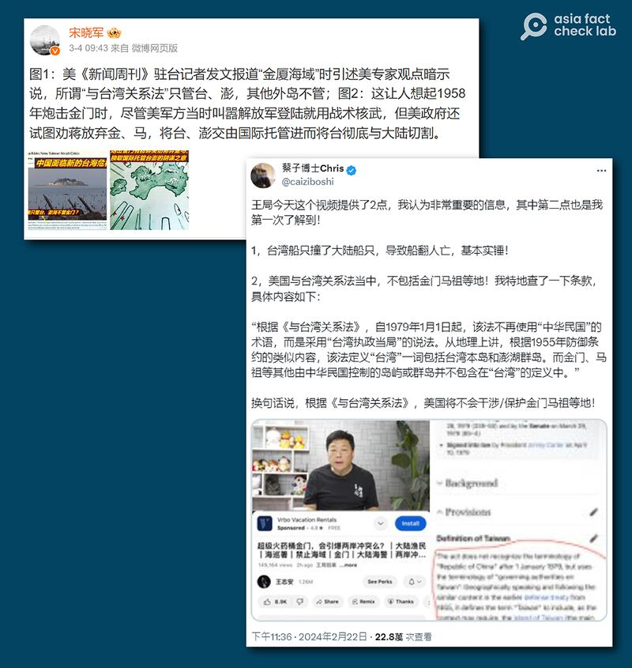

# 深度查覈｜“根據《臺灣關係法》，美國不管金門馬祖”的說法對不對？

作者：莊敬

2024.03.19 19:03 EDT

## 標籤：誤導

2月14日，一艘中國籍船隻在金門附近水域遭臺灣海巡署追緝時翻覆，船上4人落海，其中2人送醫後不治。 這起事件引發兩岸情勢升溫，美國白宮、國務院也相繼重申維護臺海和平穩定的立場。

亞洲事實查覈實驗室(AFCL)注意到,網上有關船隻翻覆案的討論之中,有些具影響力的社媒帳號在傳播"根據《臺灣關係法》,美國不管金馬"的觀點。 例如,微博粉絲超500萬,經常擔任中央電視臺、新華網等官方媒體特約評論員的 [宋曉軍](https://m.weibo.cn/detail/5008137897119296)於3月4日發文稱,"美《新聞週刊》駐臺記者發文報道'金廈海域'時引述美專家觀點暗示說, 所謂'與臺灣關係法'只管臺、澎,其他外島不管。"

類似論述亦出現在 [X(前推特](https://twitter.com/caiziboshi/status/1760690019675893764))、 [Reddit](https://www.reddit.com/r/real_China_irl/comments/1axp0ws/%E5%86%B7%E7%9F%A5%E8%AF%86%E6%A0%B9%E6%8D%AE%E5%8F%B0%E6%B9%BE%E5%85%B3%E7%B3%BB%E6%B3%95%E7%BE%8E%E5%9B%BD%E9%98%B2%E5%8D%AB%E6%94%AF%E6%8F%B4%E5%8F%B0%E6%B9%BE%E7%9A%84%E8%8C%83%E5%9B%B4%E4%B8%8D%E5%8C%85%E6%8B%AC%E9%87%91%E9%97%A8%E5%92%8C%E9%A9%AC%E7%A5%96/)等多個平臺,有"藍勾"認證X用戶發文稱,根據《臺灣關係法》,如果兩岸衝突發生在金、馬等外島,美國將不會干涉。

這樣的說法是否屬實? AFCL首先檢視 [《新聞週刊》](https://www.newsweek.com/china-taiwan-kinmen-islands-crisis-coast-guard-patrols-1874567)2月29日發表的全文,文中引述美國智庫"戰略暨國際研究中心"(CSIS)中國權力計劃主任林洋(Bonny Lin)的話,提到1979年生效的《臺灣關係法 》未包括金門。 緊接着下一段文字是林洋告訴《新聞週刊》:"《臺灣關係法》沒有具體說明美國在這類情況下會做什麼,但爲美國領導人在這類情況下採取行動支持臺灣提供了依據 。(原文:"The TRA does not state specifically what the United States would do in this context, but provides a basis for U.S. leaders to act in support of Taiwan in such scenarios," Lin told Newsweek)"

但宋曉軍並沒有提及林洋的這段解釋，將《臺灣關係法》“沒有具體說明美國在這類情況下會做什麼”曲解成“美國對其他外島不管”。

金廈海域爭端引發兩岸情勢升溫，網上出現許多相關討論，其中有具影響力的網民提及“根據《臺灣關係法》，美國不管金馬”的論述。（ 圖取自微博、X）

## 《臺灣關係法》中如何提及金馬

[《臺灣關係法》](https://web-archive-2017.ait.org.tw/zh/taiwan-relations-act.html)第十五條第二款:"臺灣"一詞將視情況需要,包括臺灣及澎湖列島,這些島上的人民、公司及根據適用於這些島嶼的法律而設立或組成的其他團體及機構,1979年1月1日以前美國承認爲中華民國的臺灣治理當局,以及任何接替的治理當局(包括政治分支機構、機構等)。

《臺灣關係法》在定義“臺灣”時，明確列舉了臺灣及澎湖列島，並未列出金門、馬祖等地，但也沒有明文排除。

美國斯坦福大學胡佛研究院研究員林孝庭向AFCL說明，“1979年以前，當臺灣(中華民國)與美國仍有邦交之時，依據1954年雙方所簽訂的協防條約，美政府對於金門與馬祖等外島地區採取一種刻意模糊策略，美方因擔心被國共雙方在外島發生的戰事牽連，捲入與中共之間的戰爭，因而不願在條約中白紙黑字承諾具體的協防範圍除了臺澎之 外，也包含金馬外島，而是視個別情況決定所應採取之策略。”

“1979年臺(中華民國)美斷交之後，協防條約也在該年年底失效，此後美方已沒有協防颱澎的條約義務，《臺灣關係法》內容基本上規範美國與臺灣‘人民’之 間的非官方交流互動，並未明確提及協防颱澎或金馬外島議題，只論及美政府未來將繼續向臺灣提供必要之防衛物資與技術服務，以確保臺海地區的和平。”

林孝庭並指出：“《臺灣關係法》適用範圍主要對象乃臺澎兩地的中華民國百姓，至於金馬，我個人認爲只要是中華民國公民，當然也在《臺灣關係法》適用範圍之內，譬如金馬居民申請美籤前往美國，美國在臺協會沒有理由拒絕核發簽證。”

曾任美國在臺協會（AIT）臺北辦事處處長的包道格（Dougals Paal）則告訴AFCL，金門相關問題，美國前總統艾森豪威爾（Dwight D. Eisenhower）和繼任者避開了，但新的領導人可能會得出不同結論。

## 艾森豪威爾曾提確保金門安全

包道格與林孝庭在回應之中，都提到了1950年代美臺安全關係的重要時刻。

根據林孝庭著作《意外的國度》，1954年9月3日起，解放軍大規模炮擊金門，國際社會一時預估臺海將成亞洲冷戰的下一個主戰場。 中共極可能意外、間接地促成臺灣與美國之間締結共同防禦條約。

1954年12月2日，雙方簽訂共同防禦條約。 “一如雙方先前所磋商，條約正文對於美國是否防衛外島地區，故意略而不提，希望以此模糊戰略，達到嚇阻中共的效果，同時阻止蔣介石利用這些外島爲反攻大陸的跳板。”《意外的國度》寫道。

然而，條約故意略而不提外島，是否就代表美國政府不管外島？ 從後續發生的事件與美方反應看來，似乎並非如此。

1955年1月，解放軍轟炸由國民黨駐軍的一江山、大陳島等島嶼後，美國國會1月底通過《福爾摩沙決議案》（Formosa Resolution of 1955），授權美國總統得以動用美軍武力保衛 臺灣、澎湖及其他相關地區。 此案於1974年10月廢止。

1958年8月23日,解放軍再度炮擊金門,臺海緊張情勢升高,美方曾要求蔣介石從外島撤出部分兵力,但遭蔣拒絕。 此後美方發表的言論,包括 [9月4日白宮新聞稿](https://history.state.gov/historicaldocuments/frus1958-60v19/d68)、 [9月11日艾森豪威爾發表演說](https://www.presidency.ucsb.edu/documents/radio-and-television-report-the-american-people-regarding-the-situation-the-formosa),都提及美國保衛臺灣,以及確保金門等外島的安全,並且強調金門和馬祖始終在中華民國治 下,從未受共產中國統治。

## 美國務院：密切關切北京行動

1979年1月1日美國與中華民國斷交後，提出終止雙方共同防禦條約，條約於通告後一年正式失效。 美國國會認爲有必要制訂《臺灣關係法》，爲維持西太平洋地區的和平、安全及穩定，並授權繼續維持美國人民及臺灣人民間的商務、文化及其他各種關係。 《臺灣關係法》於當年4月10日經時任總統卡特（Jimmy Carter）簽署後，追溯至1月1日生效，並依《臺灣關係法》成立美國在臺協會（AIT）。

事實上,美國在臺協會的活動範圍也確實包括金門等外島, [AIT發言人曾稱](https://www.facebook.com/AIT.Social.Media/posts/10158627533858490/)金門承載着"美臺多年以來豐富而悠久的合作歷史"。2020年8月23日,時任AIT臺北辦事處處長酈英傑(Brent Christensen) [赴金門](https://www.facebook.com/AIT.Social.Media/posts/10158486339218490/)參與紀念1958年823戰役62週年的紀念活動,也強調美臺安全合作是雙方夥伴關係中極爲重要的一環。

針對今年2月14日發生中國籍船隻翻覆事故,引發兩岸緊張情勢,白宮國安顧問 [傑克·沙利文](https://www.whitehouse.gov/briefing-room/press-briefings/2024/02/20/on-the-record-regional-press-call-by-apnsa-jake-sullivan-on-the-national-security-supplemental/)(Jake Sullivan)2月20日回覆記者提問時,重申美國維護臺海和平與穩定的立場;國務院發言人 [馬修·米勒](https://www.state.gov/briefings/department-press-briefing-february-20-2024/#post-536281-CHINA)(Matthew Miller)也在例行記者會表示,美方正在密切關注北京的行動。

AFCL亦去信詢問美國國務院，是否回應網傳“根據《臺灣關係法》，美國不管金馬”的說法。 國務院東亞局一名發言人的回覆內容重申米勒稍早的說法，即美方正在密切關注北京的行動，繼續敦促各方保持克制，不要片面改變現狀，並敦促中華人民共和國與臺灣進行有意義的對話 ，以減少誤判風險。

該發言人並表示，臺海與印太地區的和平與穩定符合美國和其他國家的共同利益，這影響着全球的安全與繁榮。

## 結論

美國對金門、馬祖等外島的具體立場，在外交文件中確實“沒有具體說明”、“略而不提”，背後或有戰略考量。然而，回顧歷史事件，以及觀察目前美國在臺的行動，可以發現，歷史上美國總統曾表態要保證金門安全，目前美國在臺協會也同金門、馬祖等外島維持着正常聯繫；兩岸關係專家也表示，美方對於外交文件未明文提及的區域，可視個別情況決定採取何種行動。 並且，《臺灣關係法》並無協防的條約義務，因此，所謂“根據《臺灣關係法》，美國不會‘保護’金馬”的說法，與歷史事實和現實情況不符，爲誤導言論內容 。

*亞洲事實查覈實驗室(* *Asia Fact Check Lab* *)針對當今複雜媒體環境以及新興傳播生態而成立。我們本於新聞專業主義,提供專業查覈報告及與信息環境相關的傳播觀察、深度報道,幫助讀者對公共議題獲得多元而全面的認識。讀者若對任何媒體及社交軟件傳播的信息有疑問,歡迎以電郵* *afcl@rfa.org* *寄給亞洲事實查覈實驗室,由我們爲您查證覈實。*

*亞洲事實查覈實驗室在* *X* *、臉書、* *IG* *開張了,歡迎讀者追蹤、分享、轉發。* *X* *這邊請進:中文*  [*@asiafactcheckcn*](https://twitter.com/asiafactcheckcn)  *;英文:*  [*@AFCL\_eng*](https://twitter.com/AFCL_eng)  *、*  [*FB* *在這裏*](https://www.facebook.com/asiafactchecklabcn)  *、*  [*IG* *也別忘了*](https://www.instagram.com/asiafactchecklab/)  *。*

[Original Source](https://www.rfa.org/mandarin/shishi-hecha/hc-03192024190120.html)