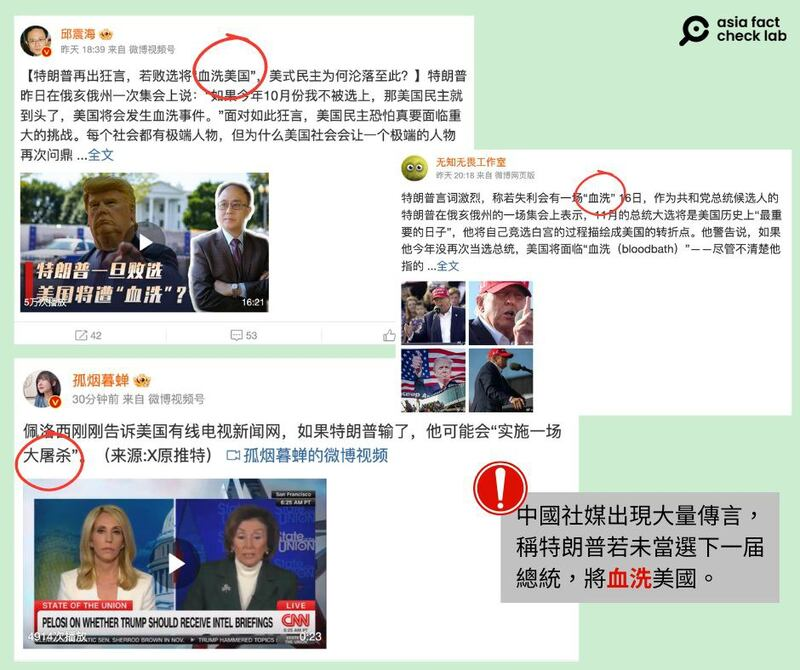

# 事實查覈｜特朗普稱若他選舉失利，美國會有一場“血洗”？

作者： 董喆

2024.03.20 18:40 EDT

## 標籤：誤導

## 一分鐘完讀：

微博近日傳，特朗普稱若他選舉失利，美國會有一場“大血洗”，更有人將他的言論演繹成“大屠殺”。 經查，特朗普演講中的確用了”Bloodbath”這個詞，直譯可做”血洗”。 但根據上下文，他當時是在對汽車行業發表評論，指的是若他未選上美國總統，美國的汽車工業將面臨一場如同大血洗般的災難。

## 深度分析：

很可能會將成爲2024美國總統選舉共和黨候選人的特朗普，於3月16日在俄亥俄州的選舉活動上的發言不止引發西方媒體熱議，也在中國社羣平臺上引發討論，很多社媒文章稱，特朗普稱這次他若無法當選總統，美國將會有一場“血洗”。

擁有百萬粉絲的微博用戶邱震海提出疑問"美式民主爲何淪落至此?",孤煙暮蟬在微博也 [分享同樣的傳言](https://archive.ph/lg2Fh),並指美國前衆院議長佩洛西告訴美國有線電視新聞網,如果特朗普輸了,他可能會實施一場大屠殺。 中國網民留言戲稱,"那不更得讓他贏了"。

圖：近日，多位微博“大V”稱特朗普“再出狂言”：若敗選將“血洗”美國或“實施一場大屠殺” （圖截取自新浪微博)

## 特朗普原話怎麼說？

亞洲事實查覈實驗室查證,特朗普在3月16日前往俄亥俄州爲該州參議院候選人伯尼·莫雷諾(Bernie Moreno)造勢,美國公共事務衛星有線電視網(C-SPAN)有當天特朗普演說的 [完整片段](https://www.c-span.org/video/?534259-1/president-trump-campaigns-bernie-moreno)。

他在演說中提到，中國正在墨西哥建造大型汽車工廠，並打算將汽車成品銷售至美國，藉着美墨之間的關稅減免，以逃避美國對於直接由中國進口車輛的關稅。並強調，如果自己當選，將會提高關稅，讓這些汽車無法賣到美國。

34分49秒處特朗普的確提到，“如果我沒有當選，局勢將是一場血洗。”（“Now, if I don't get elected, it's going to be a bloodbath for the whole“）這句話是承接上文對汽車工業的評論。

我們將特朗普發言前後的視頻內容轉錄爲逐字稿，並提供翻譯供讀者參考：

China now is building a couple of massive plants where they're going to build the cars in Mexico and they think that they're going to sell those cars into the United States with no tax at the border.

中國現在正在建造幾座大型工廠，他們打算在墨西哥製造汽車，並認爲可以無需關稅將這些汽車銷售到美國。

Let me tell you something, to China, if you're listening, President Xi, and you and I are friends, but he understands the way I deal. Those big, monster car-manufacturing plants that you're building in Mexico right now , and you think you're going to get that, you're going to not hire Americans, and you're going to sell the cars to us?

讓我告訴你，中國，如果你在聽，習主席，你和我是朋友，但他明白我做事的方式。你們現在在墨西哥建造的那些巨大的汽車製造廠，你們認爲你們會做到，你們打算不僱用美國人，然後把汽車賣給我們？

No, we're going to put a 100% tariff on every single car that comes across the line, and you're not going to be able to sell those cars if I get elected. Now, if I don't get elected, it's going to be a bloodbath for the whole, that's going to be the least of it, it's going to be a bloodbath for the country, that'll be the least of it.

不，我們將對每輛過境的汽車徵收100%的關稅，如果我當選，你們就不能賣這些汽車。現在，如果我沒有當選，那將是對整個局面的一場血洗，這只是一部分，對整個國家來說是血洗, 這只是一部分。

根據上下文，特朗普的確用了“bloodbath”一詞，但他前文都在談自己當選後對進口汽車將採取的高關稅政策，因此，“如果我沒有當選，那將是對整個局面的一場血洗”，也應被理解爲他在強調該政策的重要性，對如果不能執行這一政策，美國汽車工業前景將會有多慘烈的形象化描述，而並非如一些中文社媒文章所稱，意指暴力、屠殺。

根據 [柯林斯英語詞典](https://www.collinsdictionary.com/dictionary/english/bloodbath)(Collins English Dictionary)以及 [韋伯字典](https://www.merriam-webster.com/dictionary/bloodbath)(Merriam-Webster Dictionary),"bloodbath"一詞確實可以用於形容經濟上的大損失。

## #bloodbath  在美兩黨間亦引發爭議

特朗普的這番言論,並非只在中文社羣被脫離語境解讀,早在演說當日,美國兩黨之間就對此進行熱烈討論,這波熱議後再轉傳到中文世界。 特朗普競選顧問傑森·米勒(Jason Miller)在X上 [表示](https://archive.ph/QmwIp),強調特朗普談論的是"汽車行業"。 拜登競選團隊則 [發表聲明](https://archive.ph/dYC69),認爲特朗普的言論是政治暴力威脅。

根據 [美國有線電視網(CNN)](https://edition.cnn.com/2024/03/16/politics/trump-bloodbath-auto-industry-election/index.html)、 [美國國家廣播公司新聞網(NBC News)](https://www.nbcnews.com/politics/donald-trump/trump-bloodbath-loses-election-2024-rcna143746)報導,特朗普競選團隊發言人卡羅琳·萊維特(Karoline Leavitt)告訴媒體,特朗普的語意是拜登的政策將爲汽車行業和汽車工人帶來經濟大屠殺。

特朗普以爭議言論著稱,美國政治事實查覈網站PolitiFact [多次查覈特朗普發言](https://www.politifact.com/personalities/donald-trump/),其言論曾獲頒PolitiFact的2015年、2017年和2019年年度謊言獎。 但這次的"血洗"言論風波,確實是他發言的原意遭到扭曲。

*亞洲事實查覈實驗室(* *Asia Fact Check Lab* *)針對當今複雜媒體環境以及新興傳播生態而成立。我們本於新聞專業主義,提供專業查覈報告及與信息環境相關的傳播觀察、深度報導,幫助讀者對公共議題獲得多元而全面的認識。讀者若對任何媒體及社交平臺傳播的信息有疑問,歡迎以電郵* *afcl@rfa.org* *寄給亞洲事實查覈實驗室,由我們爲您查證覈實。*

*亞洲事實查覈實驗室在* *X* *、臉書、* *IG* *開張了,歡迎讀者追蹤、分享、轉發。* *X* *這邊請進:中文*  [*@asiafactcheckcn*](https://twitter.com/asiafactcheckcn)  *;英文:*  [*@AFCL\_eng*](https://twitter.com/AFCL_eng)  *、*  [*FB* *在這裏*](https://www.facebook.com/asiafactchecklabcn)  *、*  [*IG* *也別忘了*](https://www.instagram.com/asiafactchecklab/)  *。*

[Original Source](https://www.rfa.org/mandarin/shishi-hecha/hc-03202024183820.html)