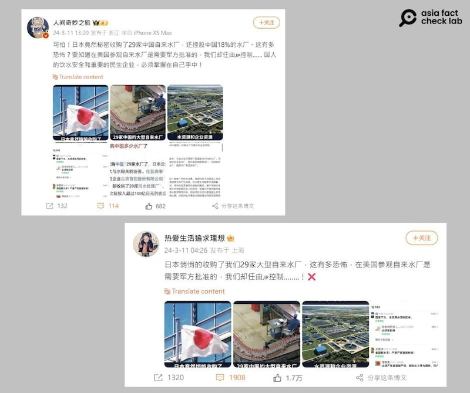
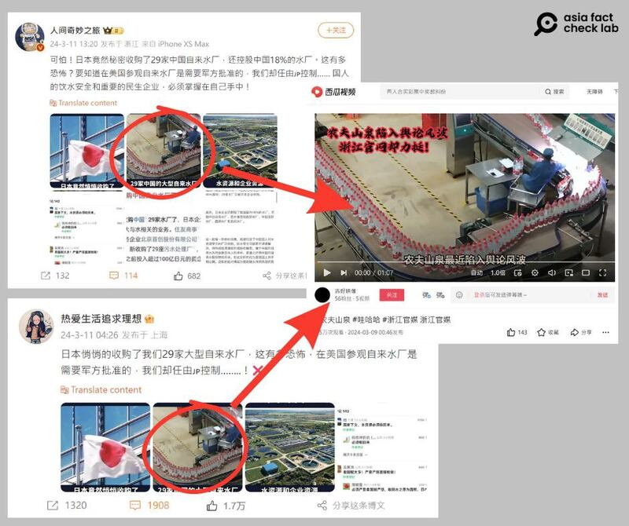

# 事實查覈｜日本收購中國29家自來水廠並控股中國18%的水廠？

作者：董喆

2024.03.21 14:22 EDT

## 標籤：證據不足

## 一分鐘完讀：

近期有微博傳言稱，日本祕密收購了中國29家自來水廠，甚至已經控股中國18%的水廠。傳言更稱，美國參觀自來水廠需要軍方批准，中國卻任由日本控制其水務。查覈發現，這些說法多處錯誤、證據不足。日本確實有企業與中國企業合資，參股中國29家污水處理廠，而並非自來水廠，並且相關信息在網路上公告，所謂“祕密收購”並不屬實。日本“控股中國18%的水廠”一說則沒有任何證據。另，美國多個州皆開放自來水廠讓民衆參觀，傳言所指參觀美國水廠需軍方批准並無證據。

## 深度分析：

3月11日,微博大V "人間奇妙之旅" [發文指出](https://archive.ph/WD421)日本祕密收購中國29家自來水廠,還控股中國18%的水廠,並稱此舉可怕。貼文更表示在美國參觀自來水廠是需要軍方批准的,以批評中國讓別國控制重要民生產業。另有微博用戶 "熱愛生活追求理想" 以同樣的截圖發表 [同樣內容](https://archive.ph/8p5e0),獲得千次轉發,上萬次點贊。

微博大V傳播“日本祕密收購中國29家自來水廠並控股中國18%水廠”的消息 （圖截取自新浪微博）

中國知名網絡意見領袖司馬南也在微博轉發此消息,提出數點質疑,但原文已刪,他隨後在YouTube [發佈一則5分鐘的視頻](https://www.youtube.com/watch?v=q8_V6rDSbjY&ab_channel=%E5%8F%B8%E9%A9%AC%E5%8D%97),引用了微博上廣爲轉傳的截圖,併發問"截圖裏反映的是不是事實?"。

## 日本祕密收購了中國29家自來水廠嗎？

亞洲事實查覈實驗室以關鍵字搜尋,找到日經中文網在2021年的 [報道](https://zh.cn.nikkei.com/industry/manufacturing/47045-2021-12-21-05-00-40.html),當中提到日本"住友商事"與中國大型水務企業"北京首創股份有限公司"合資成立"首創頂峯環保投資有限公司",收購了北京首創擁有的29座污水處理廠。

住友商事的官方網站亦可找到此投資案的 [新聞稿](https://archive.ph/nFIG6),文中提到此合作案由住友商事株式會社、中國住友商事以及北京首創生態環保集團共同進行。此三家公司從2010年即共同營運3座污水處理廠,2021年再加上原來由北京首創持有的29家污水廠, "首創頂峯" 名下共營運32座污水廠。

新聞稿亦揭示了首創頂峯的持股結構：北京首創60%、住友商事40%，北京首創是控股單位。

另外微博貼文中使用的照片，記者反搜發現更早之前就被用做農夫山泉的新聞素材，因此截圖應爲礦泉水包裝工廠，而非自來水廠或污水處理廠。

網傳信息中的礦泉水廠圖片與污水處理廠無關 （圖截取自新浪微博和西瓜視頻）

因此，日本祕密收購中國29家自來水廠爲錯誤訊息，日本參股的應爲29家污水處理廠，且是與中國企業合資、由中國企業控股，媒體與新聞稿早已公開此事，並非“祕密”。

## 日本控股中國18%的水廠？

根據日經中文網2021年針對住友商事與北京首創合作案的報道,當中提到2019年度日本企業在中國水務市場的佔有率僅爲0.18%。我們在日本經濟產業省統計 [網站](https://www.meti.go.jp/statistics/index.html)並未找到相關數據,查覈記者去信日本經濟產業省,至截稿前未獲回應。

有關日本控股中國18%的水廠一說，並未有足夠證據。

## 在美國參觀自來水廠需要軍方批准，中國卻任由日本控制？

微博貼文更指出，在美國參觀自來水廠需要軍方批准。亞洲事實查覈實驗室檢索數個美國自來水廠網頁，發現並未有任何一家水廠稱參觀需要軍方批准。

以美國田納西州爲例,該州開放學生以及成人蔘訪其自來水廠以及污水處理廠,根據 [其官方網站](https://www.nashville.gov/departments/water/about-us/tours),報名者須年滿16歲,或是以學校團體名義申請,報名表僅需填寫姓名與聯絡資訊,並未有其他審覈規定。

其他包含 [密蘇里州](https://www.kcwater.us/education/tours/)、 [北卡羅來納州](https://raleighnc.gov/water-and-sewer/services/water-wastewater-treatment-plant-tours), [南卡羅來納州](https://www.charlestonwater.com/469/Plant-Tours)、 [華盛頓特區](https://www.dcwater.com/whats-going-on/tours)等水廠皆有在網上公開參訪資訊,他們大多基於安全性設有年齡限制,但未有微博貼文所稱需要軍方批准的情形。不過華盛頓特區的自來水廠導覽因新冠疫情暫停,至今未恢復。

因此，在美國參觀自來水廠需要軍方批准是錯誤訊息。

亞洲事實查覈實驗室發現,"日本祕密收購中國自來水廠"的論述在2023年8月日本宣佈排放核處理水時,就已經在中國社羣廣傳過一次( [網易文章](https://www.163.com/dy/article/ICTSTC7T055331GT.html), [頭條匯](https://min.news/zh-hant/world/f3896d7911516abbe7884ae63ff987a2.html)),2023年9到10月,也就是日本第二次排放核處理水時,該消息再次被傳播( [網易文章](https://m.163.com/dy/article/IGBPB2C70552ZPDP.html))。目前又在微博熱傳,已經是至少第三輪傳播。

*亞洲事實查覈實驗室（Asia Fact Check Lab）針對當今複雜媒體環境以及新興傳播生態而成立。我們本於新聞專業主義，提供專業查覈報告及與信息環境相關的傳播觀察、深度報道，幫助讀者對公共議題獲得多元而全面的認識。讀者若對任何媒體及社交軟件傳播的信息有疑問，歡迎以電郵afcl@rfa.org寄給亞洲事實查覈實驗室，由我們爲您查證覈實。*

*亞洲事實查覈實驗室在X、臉書、IG開張了,歡迎讀者追蹤、分享、轉發。X這邊請進:中文*  [*@asiafactcheckcn*](https://twitter.com/asiafactcheckcn)  *;英文:*  [*@AFCL\_eng*](https://twitter.com/AFCL_eng)  *、*  [*FB在這裏*](https://www.facebook.com/asiafactchecklabcn)  *、*  [*IG也別忘了*](https://www.instagram.com/asiafactchecklab/)  *。*

[Original Source](https://www.rfa.org/mandarin/shishi-hecha/hc-03212024142239.html)