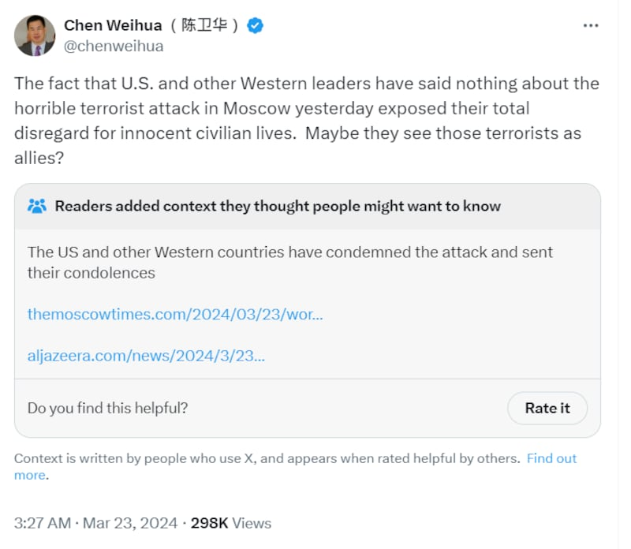
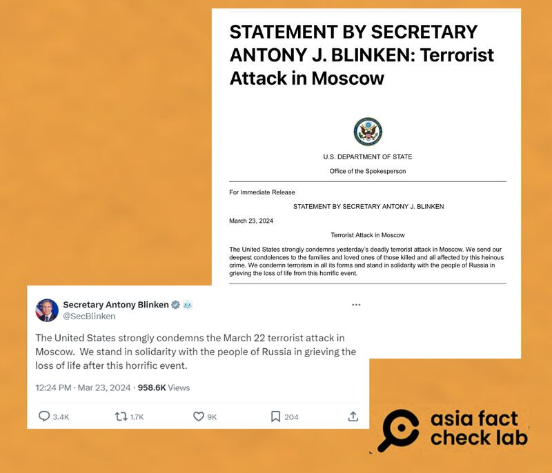
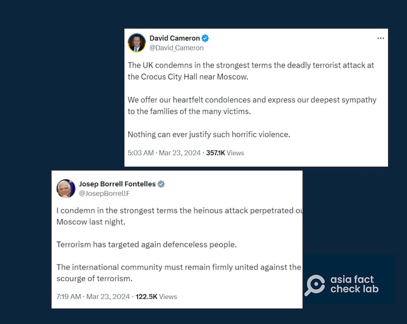
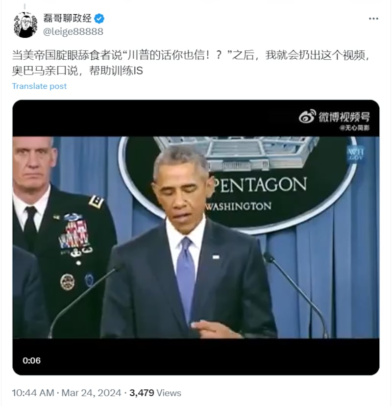
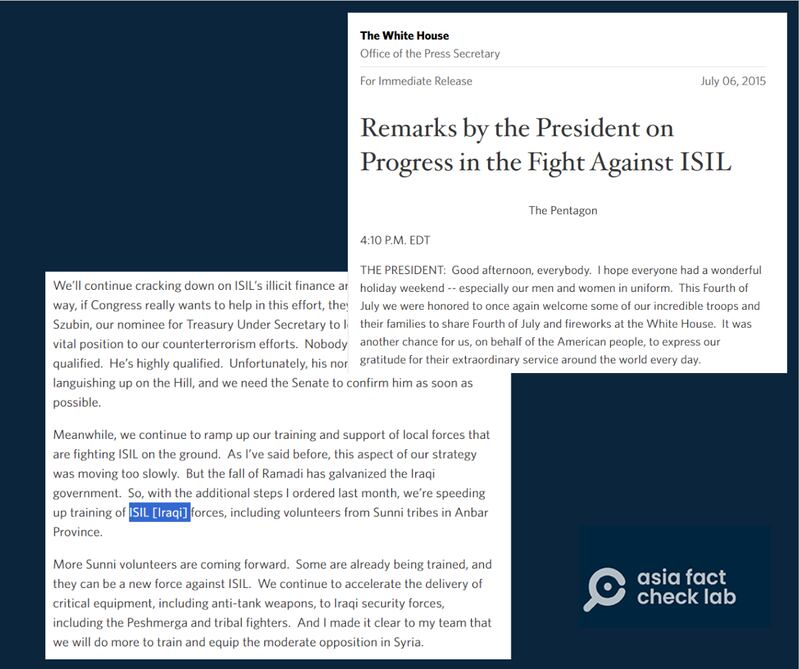
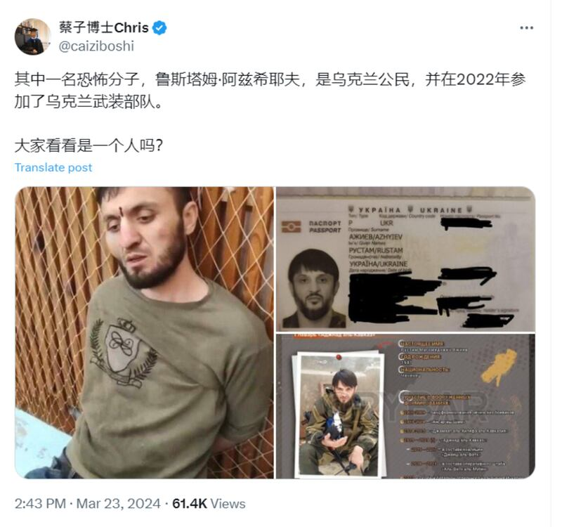
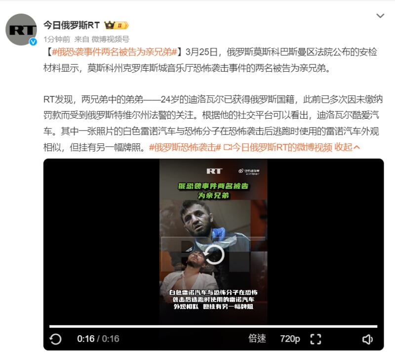
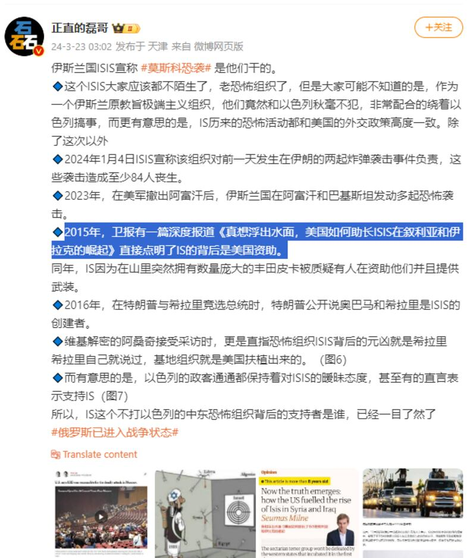

# 事實快查 | 關於莫斯科恐襲，這些說法有問題

作者：鄭崇生，發自華盛頓DC

2024.03.25 20:21 EDT

俄羅斯首都莫斯科近郊的克洛庫斯音樂廳(Crocus City Hall)於當地時間3月22日(週五)晚間發生恐怖襲擊事件,截至發稿,該襲擊已造成至少 [137人死亡、182人受傷](https://web.archive.org/web/20240325150940/https:/tass.com/emergencies/1765529),俄羅斯已公佈 [七名嫌犯的初步資料](https://web.archive.org/web/20240325181636/https:/tass.com/emergencies/1765607)。伊斯蘭國(Islamic State)組織第一時間宣稱對此次襲擊負責,但俄羅斯總統普京(Vladimir Putin)及俄國官方媒體則在恐襲發生之後稱該行動與烏克蘭有關。

這次襲擊造成的死傷慘重，成爲世界各國媒體關注的焦點事件和社交媒體熱議的話題。衆議紛紜之間，有不少信息仍待進一步確認，但也有不少明顯虛假、誤導性的消息散佈坊間。在中文信息環境中，中國官方媒體記者及不少網絡輿論大V或跟隨俄羅斯媒體官方敘事風向，或生造虛假信息，指責西方國家對恐襲沉默、稱烏克蘭、美國是幕後黑手等。

亞洲事實查覈實驗室對幾則廣傳的信息進行了查覈：

## 1. 西方國家領袖集體沉默,對俄羅斯民衆傷亡不聞不問?

這不是事實。

中國主要英文官方媒體《中國日報》駐歐盟分社社長陳衛華髮文稱，美國與西方國家領袖對莫斯科音樂廳遭恐襲沉默，不慰問平民，並質疑西方國家領袖將IS當成盟友。

陳衛華髮文稱，美國等西方領袖對俄羅斯恐襲沉默不發聲。（X截圖）

但事實上,恐襲發生第二天,美國國務院就發佈了 [相關聲明](https://www.state.gov/terrorist-attack-in-moscow/),表示對遇難者的哀悼。隨即,美國國務卿布林肯也於社交媒體X發文強烈譴責莫斯科的恐怖主義攻擊,並慰問俄羅斯人民。

美國國務院官方聲明、國務卿布林肯個人發文哀悼遇難者。（美國國務院官網、X截圖）

另外,包括 [英國外相卡麥隆(David Cameron)](https://x.com/David_Cameron/status/1771462789460037775?s=20)、 [歐盟外交與安全事務高級代表博雷利(Josep Borrell)](https://x.com/JosepBorrellF/status/1771497041815871521?s=20)也紛紛在事發後以強烈措詞譴責發生在莫斯科的恐怖攻擊,並慰問俄羅民衆。

英國、歐盟等領導人發言譴責恐襲、哀悼遇難者。（X截圖）

因此，陳衛華含有不實信息的帖子也被X進行了錯誤信息標註，並附上了其他用戶提供的資料。

## 2. 前美國總統奧巴馬曾證實美國資助訓練IS?

這個說法有誤導性。

或許是因爲俄羅斯和中國官方媒體渲染的反美情緒，社交媒體平臺上有許多將此次恐襲歸罪於美國的說法，稱美國是IS的資助方，但都未能提供足夠證據。

X上“磊哥聊政經”的簡體中文賬號就擷取一段前美國總統奧巴馬（Barack Obama）2015年在美國國防部記者會上的談話，聲稱奧巴馬親口認了美國協助訓練IS。但亞洲事實查覈實驗室檢視發現，這是當年奧巴馬的一個口誤，已有多個媒體糾正、報道，而這個記者會的重點則是奧巴馬強調抗擊IS需要建立國際同盟的談話。

X賬號"磊哥聊政經"稱奧巴馬親口承認美國"幫助訓練IS"。（X截圖）

根據五角大廈的 [完整視頻檔案](https://www.dvidshub.net/video/413783/president-barack-obamas-statement-press)(約05"40開始),奧巴馬當時在記者會上的確說了"我們正在加速訓練伊斯蘭國的部隊",但對照當時的完整談話,奧巴馬主要談論美國強化國際合作,一同打擊IS的重要性,奧巴馬在這句口誤前、後都圍繞談論需打擊IS在包括敘利亞及伊拉克的發展勢頭,而白宮當時在 [逐字稿](https://web.archive.org/web/20240114020457/https:/obamawhitehouse.archives.gov/the-press-office/2015/07/06/remarks-president-progress-fight-against-isil)中就已經特別補充說明(截圖反白處),奧巴馬是將"協助訓練伊拉克的部隊"、口誤說成了協助訓練IS的部隊。

奧巴馬2015年講話全文，及口誤被更正之處。（白宮官網截圖）

## 3. 烏克蘭是莫斯科恐襲的幕後協力者?兇手有烏克蘭籍?

這兩個說法都沒有公開證據支持。

在恐襲發生之後,俄羅斯和中國官方媒體都在試圖將此次恐襲事件與烏克蘭聯繫起來。普京多次強調 [聲稱](https://web.archive.org/web/20240325085609/https:/www.rt.com/russia/594781-putin-atack-crocus-moscow/)兇嫌在犯案後試圖逃往烏克蘭邊境,烏克蘭還爲嫌犯的逃亡提供便利,包括 [美國白宮](https://apnews.com/article/russia-moscow-gunmen-concert-hall-injuries-fe7db5bb4ad4df17b6cbd04a3250faa1)及 [烏克蘭官方](https://x.com/ZelenskyyUa/status/1771638417266257987?s=20)都已經數次否認了這樣的說法,不過,中國英文報刊 [《環球時報》](https://web.archive.org/web/20240325185559/https:/www.globaltimes.cn/page/202403/1309415.shtml)引述中國專家的話,質疑美國第一時間就說恐怖攻擊與烏克蘭無關,"看上去很奇怪(looks very strange)"。而《環球時報》引述專家的觀點,和俄國外交部發言人扎哈羅娃(Maria Zakharova) [指責](https://web.archive.org/web/20240325185913/https://tass.com/world/1765181)烏克蘭總統澤連斯基的說法相呼應。

莫斯科恐怖攻擊發生後,恐怖組織伊斯蘭國駐阿富汗的分支——"伊斯蘭國呼羅珊省"(ISKP,或ISIS-K)第一時間在自家電報賬號上公開一段現場視頻,宣稱犯案,英國廣播公司(BBC)證實了 [這段視頻的真實性](https://www.bbc.com/news/world-europe-68645755)。俄國已拘留11人,其中,第一批逮捕的4名槍手公開庭審, [根據他們露面的情況](https://web.archive.org/web/20240324231412/https:/www.rt.com/russia/594846-moscow-concert-hall-attackers-court/),似乎都遭到不同程度的肢體攻擊或虐待。

然而除了嫌犯“試圖逃亡的方向”指向烏克蘭之外，俄羅斯官方媒體並沒有公佈其他證據顯示恐襲與烏克蘭有關。

另外，中文世界流傳甚廣的所謂“兇嫌有烏克蘭國籍”的謠言，則與俄羅斯主要官方媒體的報道及調查小組的說法不符。

網傳莫斯科恐襲案其中一名嫌疑人"是烏克蘭公民"。（X截圖）

根據 [塔斯社的最新報導](https://web.archive.org/web/20240325181636/https:/tass.com/emergencies/1765607),俄羅斯25日晚間再公開了三名父子檔兇嫌的資料,三人都出生於塔吉克斯坦首都杜尚別(Dushanbe),其中,父親是塔吉克斯坦公民、兩兄弟則有俄羅斯國籍。

美聯社稍早 [報導](https://apnews.com/article/russia-moscow-krasnogorsk-gunmen-concert-hall-fire-b719cbe27d26207955fd423b1e3ddc68)則指出,四名已知嫌犯都是塔吉克斯坦人,而今日俄羅斯的 [中文微博](https://web.archive.org/web/20240325161050/https:/weibo.com/6244553417/O6HiLytJL?refer_flag=1001030103_)帳號甚至已經發文,證實第一批逮捕的四名嫌犯中、有一人是俄羅斯籍。

俄羅斯官方媒體對恐襲者身份的報道（微博截圖）

## 4. 英國《衛報》的深度報導證實了美國是IS的背後資助者?

這個說法也是誤導。

新浪微博賬號“正直的磊哥”在微博上傳播有“國際媒體證實了美國資助IS”的觀點。亞洲事實查覈實驗室發現，這個賬號和此前提到的“磊哥聊政經”的賬號所發的視頻內容中，顯示同一個人。

微博用戶"正直的磊哥"稱，英國《衛報》曾有深度報道稱"美國資助了IS"。（微博截圖）

另外,亞洲事實查覈實驗室還發現,所謂英國《衛報》幾年前的" [深度報道](https://web.archive.org/web/20240303125618/https:/www.theguardian.com/commentisfree/2015/jun/03/us-isis-syria-iraq)",實際上是一篇評論文章,是前衛報專欄作者米耐(Seumas Milne)撰寫的觀點文章,並非事實報道。

細讀文章，米耐確實美國在伊斯蘭國發展期間的作爲持批評態度， 但也明確指出，這不代表美國是伊斯蘭國的始作俑者（That doesn’t mean the US created Isis, of course）。

*亞洲事實查覈實驗室(* *Asia Fact Check Lab* *)針對當今複雜媒體環境以及新興傳播生態而成立。我們本於新聞專業主義,提供專業查覈報告及與信息環境相關的傳播觀察、深度報道,幫助讀者對公共議題獲得多元而全面的認識。讀者若對任何媒體及社交軟件傳播的信息有疑問,歡迎以電郵* *afcl@rfa.org* *寄給亞洲事實查覈實驗室,由我們爲您查證覈實。*

*亞洲事實查覈實驗室在* *X* *、臉書、* *IG* *開張了,歡迎讀者追蹤、分享、轉發。* *X* *這邊請進:中文*  [*@asiafactcheckcn*](https://twitter.com/asiafactcheckcn)  *;英文:*  [*@AFCL\_eng*](https://twitter.com/AFCL_eng)  *、*  [*FB* *在這裏*](https://www.facebook.com/asiafactchecklabcn)  *、*  [*IG* *也別忘了*](https://www.instagram.com/asiafactchecklab/)  *。*

[Original Source](https://www.rfa.org/mandarin/shishi-hecha/hc-03252024200746.html)