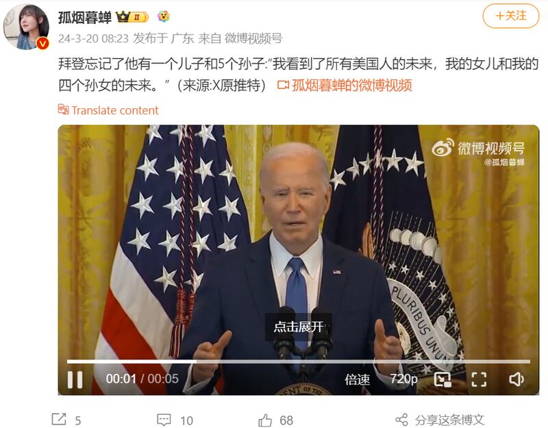
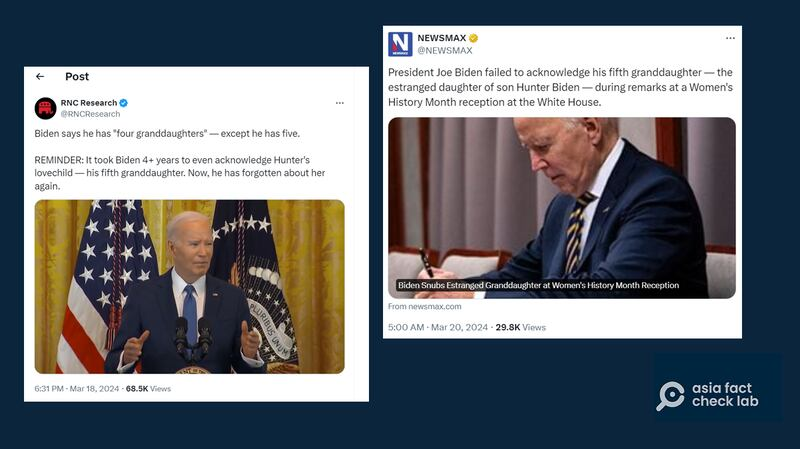

# 事實查覈｜拜登老糊塗又犯了？忘了兒孫有幾人？

作者：鄭崇生，發自華盛頓

2024.03.26 17:20 EDT

## 標籤：斷章取義

## 一分鐘完讀：

“我看到了所有美國人的未來，我的女兒和我的四個孫女的未來。”美國總統拜登3月18日在白宮說的這句話，近來成了中國網絡大V“孤煙暮蟬”諷刺拜登忘記自己兒孫人數的最新素材。

亞洲事實查覈實驗室則發現,孤煙暮蟬的 [發文](https://weibo.com/2150758415/O5UJDaEsG#commen),只擷取拜登這一句談話,但沒有提到當天是慶祝美國婦女歷史月活動。拜登的發言,針對的是"女性"這一主題,因此着重強調自己女兒和孫女的未來,並不包含男性子孫。

微博賬戶孤煙暮蟬稱，拜登在講話中"忘記"了自己還有兒子和孫子。（新浪微博截圖）

## 深度解析：

拜登忘了自己兒孫的話題,孤煙暮蟬不是第一個發出。事實上,她也註明了自己是從中國國內禁止的社交平臺X搬至新浪微博。亞洲事實查覈實驗室進一步查覈發現,最早只剪輯這一句話的視頻,並據此發文質疑拜登的是來自共和黨全國委員會(RNC)主管的一個 [X帳號](https://x.com/RNCResearch/status/1769854281757126878?s=20) RNC Research。

在英文社交媒體上傳播的指拜登忘記子孫數量的推文 （X平臺截圖）

爲了慶祝美國女權的發展及女性的貢獻,白宮幾乎每年3月都會舉辦慶祝活動。拜登當天在活動上的 [談話](https://www.youtube.com/watch?v=cePtU2MWaOc)除了對自己女兒及4個孫女的未來寄予希望之外,還說到了"所有女性的未來",他很明顯地是在針對女性羣體發言。

拜登和孫輩的關係緊密,他在白宮公開提到的4名孫女,曾在2020年拜登競選美國總統時爲祖父 [發聲](https://www.youtube.com/watch?v=pv9YLI5EvCM)。雖然拜登曾經不止一次提過,包括4名孫女在內,自己一共有6位孫子與孫女,但這並不包含一位後來引發風波的非婚生孫女。

至於拜登的子孫數目,美國時人雜誌(People) [報道](https://web.archive.org/web/20230801162259/https:/people.com/politics/hunter-biden-confirmed-paternity-test-fathered-arkansas-child/),拜登的兒子亨特·拜登(Hunter Biden)與阿肯色州女子羅伯茨(Lunden Roberts)於2018年生下非婚生女兒內菲·瓊·羅波茨(Navy Joan Roberts),但亨特·拜登否認與羅伯茨發生關係,羅伯茨2019年告上法院,並於當年確認了兩人的父女關係。在拜登競選期間,這一話題也一度成爲共和黨人攻擊拜登家族的焦點之一。後來,雙方在法院纏訟4年多後,於2023年針對女兒的扶養費問題達成和解,和解條件不公開。

官司落幕後,拜登才於去年首次通過 [書面聲明的方式](https://web.archive.org/web/20240107021238/https:/people.com/politics/all-about-joe-biden-grandchildren/),表達對他的兒子亨特·拜登(Hunter Biden)非婚生女兒的關心。

而RNC Research和孤煙暮蟬聲稱拜登忘記了他有5個孫子，是對拜登家庭情況有錯誤描述，包括亨特·拜登的非婚生女兒在內，拜登目前共有7個孫子女。

*亞洲事實查覈實驗室(* *Asia Fact Check Lab* *)針對當今複雜媒體環境以及新興傳播生態而成立。我們本於新聞專業主義,提供專業查覈報告及與信息環境相關的傳播觀察、深度報道,幫助讀者對公共議題獲得多元而全面的認識。讀者若對任何媒體及社交軟件傳播的信息有疑問,歡迎以電郵* *afcl@rfa.org* *寄給亞洲事實查覈實驗室,由我們爲您查證覈實。*

*亞洲事實查覈實驗室在* *X* *、臉書、* *IG* *開張了,歡迎讀者追蹤、分享、轉發。* *X* *這邊請進:中文*  [*@asiafactcheckcn*](https://twitter.com/asiafactcheckcn)  *;英文:*  [*@AFCL\_eng*](https://twitter.com/AFCL_eng)  *、*  [*FB* *在這裏*](https://www.facebook.com/asiafactchecklabcn)  *、*  [*IG* *也別忘了*](https://www.instagram.com/asiafactchecklab/)  *。*

[Original Source](https://www.rfa.org/mandarin/shishi-hecha/hc-03262024171440.html)