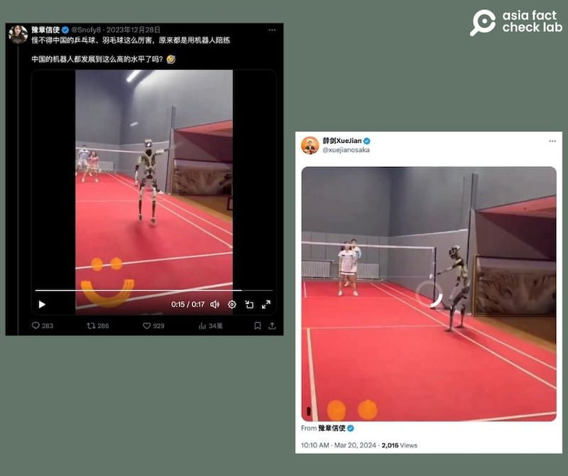
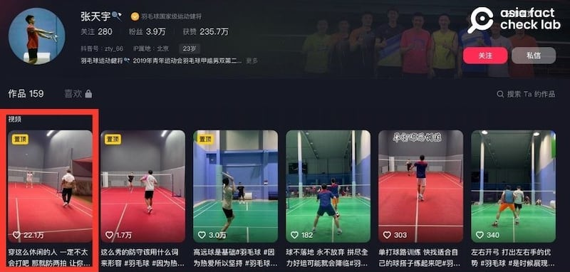
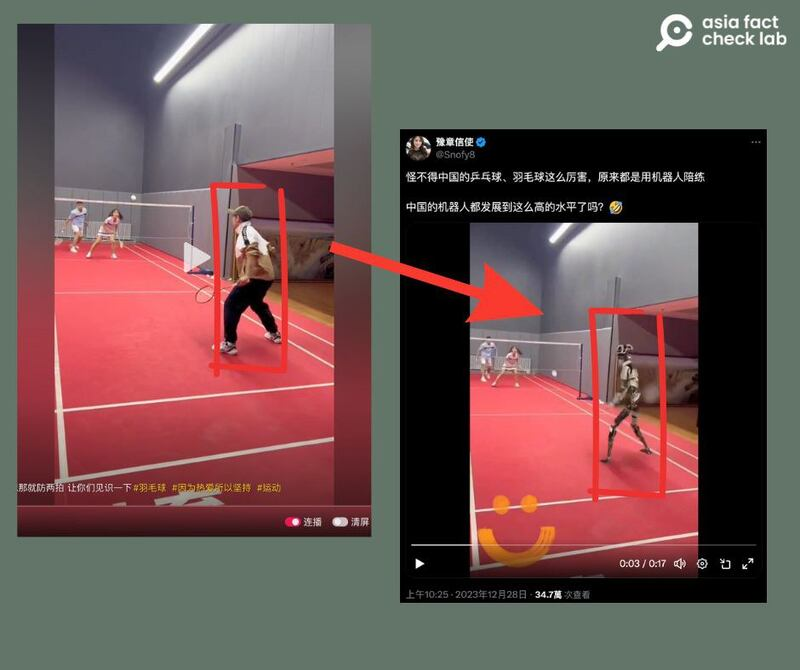
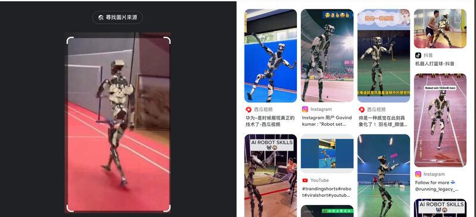
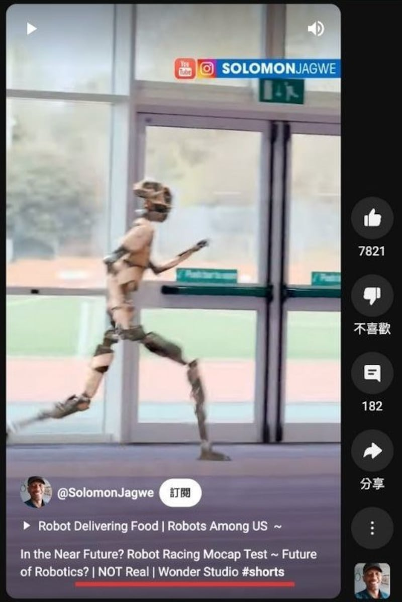
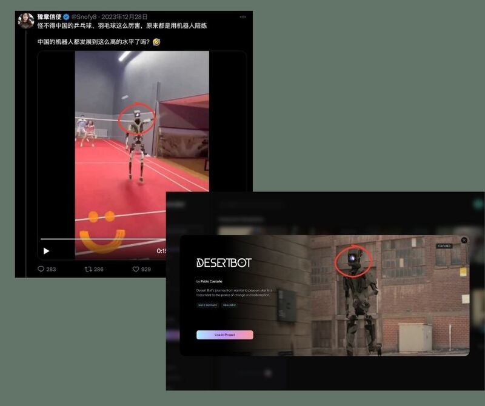

# 事實查覈｜球技高超的中國羽毛球隊，是機器人陪練出的？

作者：董喆

2024.03.27 14:32 EDT

## 標籤：錯誤

## 一分鐘完讀：

中國外交官薛劍近期在X（原推特）上轉發了一則機器人與運動員對打羽毛球的視頻，原貼文稱中國羽毛球因爲有機器人陪練，所以球技強。 經查，此視頻經過AI後期製作，將選手置換爲機器人，原始視頻出自中國羽毛球運動員張天宇的抖音賬號，機器人與真人練球的場景並不存在。

## 深度分析：

X賬號"豫章信使"於2023年12月在X布了 [一則視頻](https://archive.ph/PP9ZE),內容爲一機器人與一男一女進行羽毛球對打,推文稱"怪不得中國的乒乓球、羽毛球這麼厲害,原來都是用機器人陪練。 中國的機器人都發展到這麼高的水平了嗎?" 2024年3月中旬,中國外交官薛劍轉貼了 [這則視頻](https://archive.ph/NMGNq)。

豫章信使發佈並經外交官薛劍轉發的視頻 （X平臺截圖）

亞洲事實查覈實驗室將視頻截圖反搜,在 [X](https://twitter.com/YoloOliver1/status/1740332621543227647)和 [臉書](https://m.facebook.com/100088760447907/videos/887823813022422/?extid=reels&refsrc=deprecated&_rdr)平臺上找到兩個與這則視頻相同的畫面,這些畫面中的顯示的抖音賬號"zty\_66",對應的是中國羽毛球運動員張天宇的抖音號,其置頂影片與機器人版本相符。

張天宇抖音賬號頁面（抖音截圖）

我們發現，張天宇所發視頻中的場地、選手穿着與薛劍轉傳的視頻一致，不過視頻中身穿棕色白色夾克、頭戴鴨舌帽的男子被置換成機器人。

張天宇發佈的原視頻與豫章信使發佈的視頻對比（抖音及X平臺截圖）

機器人版本視頻中的動作，與原始視頻中的鴨舌帽男子動作一致。我們將視頻中的機器人影像截圖反搜，在Google搜尋中找到大量的機器人與運動員合成影片，同一款式機器人還出現在田徑、拳擊、桌球及舞蹈影片中。

谷歌搜索發現各大社交媒體平臺都有"同款"機器人合成影片 （谷歌截圖）

我們逐一檢視搜索結果，找到其中一則包含同款機器人的YouTube視頻，視頻的標籤包含關鍵字“Not Real”（非真實）進一步搜索該視頻信息中所指的“Wonder Studio” ，發現這是一個AI後期製作的線上服務。

將同款機器人標記爲"非真實"的YouTube短視頻 （YouTube截圖）

Wonder Studio 是一款由Wonder Dynamics公司開發的AI工具，使用者只要將影片上傳，Wonder Studio就可以將真人替換爲角色動畫。

比對Wonder Studio提供的角色模板，上述影片中與中國運動員打羽毛球的機器人，與一款叫做Desert Bot的機器人相同。

因此，我們認爲，中國外交官薛劍轉發的這則視頻，很可能是利用Wonder Studio的技術，將羽毛球運動員張天宇發佈的訓練影片中的部分真人置換成機器人的加工視頻。

Wonder Studio生成的同款機器人與網傳影片中的高度雷同 （Wonder Studio截圖）

中國外交官薛劍多次在X轉貼未經查證的影片，過去亞洲事實實驗室曾撰寫過查覈報告包括：

[事實快查|以哈衝突中的熱傳視頻:哈馬斯童軍突襲警局?加沙孩子餓到喫草?](https://www.rfa.org/cantonese/news/factcheck/isreal-10262023075852.html)  [事實查覈|男警"跪頸壓制"女子,"我不能呼吸"重現臺灣?](https://www.rfa.org/cantonese/news/factcheck/police-06012023082838.html)  [事實查覈|五十五歲的"天安門母親"在三十年前有個二十歲的兒子被解放軍打死?](https://www.rfa.org/cantonese/news/factcheck/mother-06062023082028.html)  [事實查覈|蔡英文派"臺妹"招待英國保守黨人士?](https://www.rfa.org/cantonese/news/factcheck/tw-01052024074604.html)

[ [傳播觀察|加沙戰事起，親中社媒帳號操作“誰纔是種族滅絕”的敘事 Opens in new window](https://www.rfa.org/cantonese/news/factcheck/gaza-11202023084903.html) ]

*亞洲事實查覈實驗室（Asia Fact Check Lab）針對當今複雜媒體環境以及新興傳播生態而成立。我們本於新聞專業主義，提供專業查覈報告及與信息環境相關的傳播觀察、深度報道，幫助讀者對公共議題獲得多元而全面的認識。讀者若對任何媒體及社交軟件傳播的信息有疑問，歡迎以電郵afcl@rfa.org寄給亞洲事實查覈實驗室，由我們爲您查證覈實。*

*亞洲事實查覈實驗室在X、臉書、IG開張了,歡迎讀者追蹤、分享、轉發。X這邊請進:中文*  [*@asiafactcheckcn*](https://twitter.com/asiafactcheckcn)  *;英文:*  [*@AFCL\_eng*](https://twitter.com/AFCL_eng)  *、*  [*FB在這裏*](https://www.facebook.com/asiafactchecklabcn)  *、*  [*IG也別忘了*](https://www.instagram.com/asiafactchecklab/)  *。*

[Original Source](https://www.rfa.org/mandarin/shishi-hecha/hc-03272024141941.html)