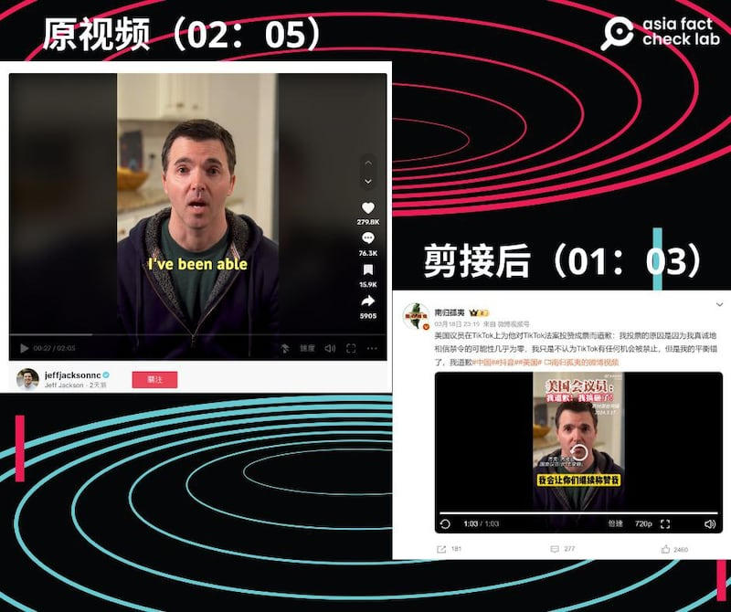

# 事實查覈｜美衆議員爲投TikTok法案贊成票道歉？

作者：艾倫

2024.03.28 15:15 EDT

## 標籤：斷章取義

## 一分鐘完讀：

從美國衆議院通過TikTok法案以來，網絡輿論持續升溫。近期，微博上流傳着一段視頻，內容爲美國衆議員傑夫·傑克遜（Jeff Jackson）對著鏡頭道歉，稱自己以爲TikTok絕對不可能被禁，所以才投下了贊成票。

經查覈，這位議員確實因為自己投了贊成票，拍攝了道歉視頻上傳TikTok，但他亦在原視頻中解釋了投票贊成是因爲不希望TikTok受“敵對政府”控制，而微博的影音卻剪去了這部分解釋，使他看起來像是在檢討自己因“思慮不周”而犯了一個錯誤，傳遞了斷章取義的資訊。

## 深度分析：

3月18日晚上,微博賬號 "南歸孤夷" 轉發 [視頻](https://weibo.com/7782884695/O5D1Mjr66?refer_flag=1001030103_),標題爲 "美國議員在TikTok上爲他對TikTok法案投贊成票而道歉" 。影音內容爲美國民主黨衆議員傑夫·傑克遜(Jeff Jackson)在TikTok上發佈的視頻,視頻中,他爲自己在TikTok法案中投下贊成票道歉。

組圖：微博賬號“南歸孤夷”發佈的視頻爲剪輯後版本，只剩1分3秒，原TikTok影音則總長2分鐘。（圖截自微博、TikTok）

搜尋 [傑克遜的TikTok](https://www.tiktok.com/@jeffjacksonnc/video/7346944777075559722?_r=1&_t=8kkuLkURxi3)頁面會發現,儘管該道歉視頻確實存在,但原影音時長爲兩分鐘,"搬"到微博上卻被剪到剩一分鐘。被剪去的部分是傑克遜解釋他爲何投下贊成票,內容及翻譯如下:

“I like this app. I’ve been able to reach a lot of people and hear directly from them, and it’s been great. I’m also in Congress, and I’ve been in some part of briefings about this app that were genuinely alarming. When I was reading the bill, the part I agreed with was the part that tries to force a sale because I figured this would just be a better app if we didn’t have to worry about the stuff that comes with it being potentially controlled by an adversarial government. The part I didn’t like was the part that threatens a ban.”

“我喜歡這個應用程式。透過它我能夠接觸到很多人，並直接聽到他們的意見，這是一件很棒的事。我在國會聽過TikTok的相關簡報，某些層面確實讓人擔心。我在閱讀法案時，同意的是強制出售的部分，因爲我認爲，如果我們不用擔心這個程式可能會被敵對政府控制，那它會變得更好，我不喜歡的是威脅要禁止的部分。”

微博視頻剪去了上述這段傑克遜的解釋，直接接到視頻後面傑克遜的談話：“因爲我真誠的相信，禁令的可能性幾乎爲零。原因有很多，金融、政治、還有地緣政治，我只是不認爲有任何真正的機會被禁止，但也許我的衡量錯了。”斷章取義的影音，讓傑克遜看起來是因爲思慮不周而贊成禁令。

自從美國衆議院3月13日(週三)通過針對TikTok的《保護美國人免受外國對手控制應用程序法》法律草案,該法案的相關新聞也在中國境內引發廣泛報道和討論,但其中有不少論述爲扭曲事實的錯假訊息,亞洲事實查覈實驗室已針對幾個說法 [進行了查覈](2024-03-15_事實快查｜中國熱議美國針對Tiktok立法進展，哪些說法有問題？.md)。

延伸閱讀：

[ [事實快答：關於字節跳動與TikTok的五個問題Opens in new window](2023-03-25_事實查覈 ｜ 事實快答：關於字節跳動與TikTok的五個問題.md) ]

[ [事實查覈：TikTok能與中國政府共享美國用戶數據嗎？Opens in new window](2023-03-24_事實查覈 ｜ TikTok能與中國政府共享美國用戶數據嗎？.md) ]

*亞洲事實查覈實驗室（Asia Fact Check Lab）針對當今複雜媒體環境以及新興傳播生態而成立。我們本於新聞專業主義，提供專業查覈報告及與信息環境相關的傳播觀察、深度報道，幫助讀者對公共議題獲得多元而全面的認識。讀者若對任何媒體及社交軟件傳播的信息有疑問，歡迎以電郵afcl@rfa.org寄給亞洲事實查覈實驗室，由我們爲您查證覈實。*

*亞洲事實查覈實驗室在X、臉書、IG開張了,歡迎讀者追蹤、分享、轉發。X這邊請進:中文*  [*@asiafactcheckcn*](https://twitter.com/asiafactcheckcn)  *;英文:*  [*@AFCL\_eng*](https://twitter.com/AFCL_eng)  *、*  [*FB在這裏*](https://www.facebook.com/asiafactchecklabcn)  *、*  [*IG也別忘了*](https://www.instagram.com/asiafactchecklab/)  *。*

[Original Source](https://www.rfa.org/mandarin/shishi-hecha/hc-03282024151502.html)