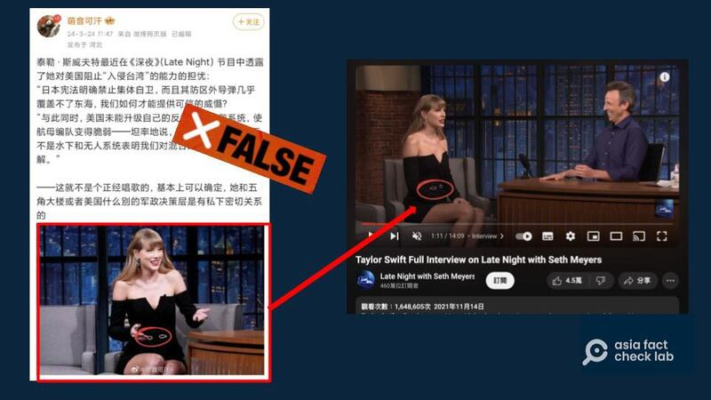

# 事實查覈｜歌手泰勒·斯威夫特在電視節目上質疑美國無法防止“臺灣遭侵略”？

作者：董喆

2024.03.29 13:06 EDT

## 標籤：錯誤

## 一分鐘完讀：

微博賬號“萌音可汗”近日於微博發文並附圖稱，美國歌手泰勒·斯威夫特（Taylor Swift，臺譯爲泰勒絲）最近在《深夜》節目中透露他對美國阻止（中國）入侵臺灣的能力的擔憂。經查，該截圖確實爲斯威夫特錄製“塞斯·梅耶斯深夜秀（Late Night with Seth Meyers）”的影片截圖，但該集節目並未提到任何與美臺關係相關的內容，此貼文爲錯誤訊息。

## 深度分析：

微博用戶"萌音可汗"近期在微博的推文 [引發討論](https://archive.ph/XDITU),他稱美國知名歌手斯威夫特近期在《深夜》(Late Night)節目中透露擔憂,質疑美國阻止(中國)入侵臺灣的能力。

萌音可汗更直接引述了兩段據稱是斯威夫特的發言，首先是日本憲法禁止集體自衛，且其防區外的導彈覆蓋不了東海，無法提供可信的威懾。第二是美國未能升級自己的反艦導彈防禦系統。此賬號最後評論斯威夫特“不是個正經唱歌的”，且直指她與美國五角大廈關係密切。

該貼文留言評論“美國一直利用偶像進行意識型態植入和煽動運動是有歷史的”“民主黨的未來新星，以後要從政的”，有部分網民留言表示相信和支持該博主的說法。不過這些留言以及推文也引來中國的斯威夫特支持者反擊。

亞洲事實查覈實驗室查證，發現美國稱作“深夜秀”的節目有非常多，多半是以主持人爲名，后冠上深夜秀三字，因此我們改以貼文附上的截圖進行反搜，確定該截圖是出自“塞斯·梅耶斯深夜秀（Late Night with Seth Meyers）”2021年專訪斯威夫特的影片。

圖：“萌音可汗”發佈的帖子截圖來自於塞斯·梅耶斯深夜秀 （圖截取自微博和塞斯·梅耶斯深夜秀官方YouTube賬號）

影片錄製的時間就已否定原貼文稱斯威夫特“最近”在《深夜》節目評論軍事議題的說法。

我們進一步瀏覽總長度爲14分鐘的影片內容，發現該專訪話題集中在斯威夫特當時的流行音樂新專輯上，並未談及有關臺美軍事議題，因此微博賬號萌音可汗的說法有誤。

在反搜截圖時我們也發現,"萌音可汗"的說法極可能是出自X(原推特)早些時候的流言。X賬號 [Patrick Blumenthal](https://archive.ph/dIhtR)以及 [Tracker Deep](https://archive.ph/2OG1Q)一前一後在3月24日凌晨發佈同樣截圖但以英文書寫的貼文,萌音可汗則是在近中午時發表微博。

同時,這三個社交媒體賬號使用的脫口秀 [影片](https://www.youtube.com/watch?v=ArtqQkltlkI&ab_channel=AIToolsSearch),過去也曾被作爲AI生成的素材,產出紅極一時的"泰勒絲說中文"影片,但原影片已經明確標示"泰勒絲說中文"的部分爲AI生成。

*亞洲事實查覈實驗室（Asia Fact Check Lab）針對當今複雜媒體環境以及新興傳播生態而成立。我們本於新聞專業主義，提供專業查覈報告及與信息環境相關的傳播觀察、深度報道，幫助讀者對公共議題獲得多元而全面的認識。讀者若對任何媒體及社交軟件傳播的信息有疑問，歡迎以電郵afcl@rfa.org寄給亞洲事實查覈實驗室，由我們爲您查證覈實。*

*亞洲事實查覈實驗室在X、臉書、IG開張了,歡迎讀者追蹤、分享、轉發。X這邊請進:中文*  [*@asiafactcheckcn*](https://twitter.com/asiafactcheckcn)  *;英文:*  [*@AFCL\_eng*](https://twitter.com/AFCL_eng)  *、*  [*FB在這裏*](https://www.facebook.com/asiafactchecklabcn)  *、*  [*IG也別忘了*](https://www.instagram.com/asiafactchecklab/)  *。*

[Original Source](https://www.rfa.org/mandarin/shishi-hecha/hc-03292024130649.html)