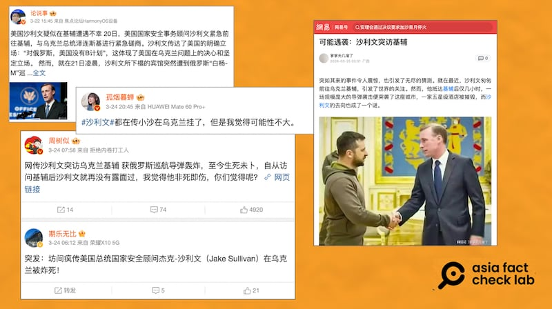

# 事實查覈｜美國安顧問沙利文在烏克蘭生死未卜？

2024.04.01 16:26 EDT

## 標籤：錯誤

## 一分鐘完讀：

白宮國安顧問傑克·沙利文（Jake Sullivan）3月20日訪問烏克蘭首都基輔，21日基輔遭俄羅斯空襲。 此後幾天，微博等中文社交媒體開始流傳沙利文在烏克蘭失聯、生死未卜的消息，到26日，仍有網民懷疑沙利文在烏克蘭喪生。 但根據公開資訊，沙利文已返回美國，並在華盛頓陸續會晤來訪的伊拉克、以色列高官。 網傳沙利文喪生的謠言，爲不實信息。

## 深度分析：

白宮國安顧問沙利文(Jake Sullivan)3月20日突訪烏克蘭首都基輔,表達美國堅定支持烏克蘭。 據 [報道](https://edition.cnn.com/2024/03/21/europe/kyiv-missile-attack-ukraine-russia-intl/index.html),在沙利文抵達幾小時後,基輔遭遇俄羅斯的飛彈襲擊。

亞洲事實查覈實驗室注意到，在22日至25日之間，微博、網易等中文平臺出現大量宣稱沙利文在烏克蘭遭遇不測、生死未卜的文章，發文者包括多位“大V”級 博主。 其中部分博主聲稱消息來自俄羅斯媒體的報道，但並未附上任何報道鏈接或截圖等資訊。

近日，在微博、網易等中國平臺上，盛傳白宮國安顧問沙利文訪問基輔後生死未卜的消息。 （微博、網易截圖）

但事實上,沙利文3月22日在白宮會見伊拉克副總理侯賽因(Fuad Hussein),伊拉克外交部已發佈 [兩人會見的合照](https://mofa.gov.iq/2024/44523/),沙利文則在X(原推特)上 [發文](https://twitter.com/JakeSullivan46/status/1771300611297825139)。 沙利文另於 [25日發文](https://twitter.com/JakeSullivan46/status/1772352400776458315)指出,很榮幸在白宮會見以色列​​國防部長加蘭特(Yoav Gallant), [《以色列時報》](https://www.timesofisrael.com/liveblog_entry/gallant-tells-sullivan-gaza-war-outcome-will-affect-middle-east-for-years-to-come/)(The Times of Israel)、 [《耶路撒冷郵報》](https://www.jpost.com/israel-hamas-war/article-793667#google_vignette)(The Jerusalem Post)皆有報道。

伊拉克外交部公佈沙利文於22日與伊副總統會見照片（伊拉克外交部網站截圖）

然而,亞洲事實查覈實驗室3月26日上午在微博等平臺搜尋有關沙利文的消息,仍可看到不少網民宣稱沙利文在烏克蘭失聯、喪生,上列"大V"級博主 的發文亦未刪除或修改。 雖然也有社媒用戶 [發文闢謠](https://mbd.baidu.com/newspage/data/dtlandingsuper?nid=dt_4305502439401190018),但底下留言卻是要求沙利文"出來說幾句話"、"出來走兩步",仍懷疑沙利文的去向。

亞洲事實查覈實驗室亦曾發佈 [查覈報告](2024-01-25_事實查覈｜美國防部長在烏克蘭遇襲身亡？.md),指美國國防部長奧斯汀(Lloyd Austin)在烏克蘭遭俄羅斯導彈擊中身亡的傳言爲不實信息。

有網民3月25日在百度發文闢謠，表示白宮國安顧問沙利文未在烏克蘭喪生，底下網民留言卻要求沙利文出來說話、走兩步，顯示仍不相信沙利文已安全返美 。（百度截圖）

亞洲事實查覈實驗室（Asia Fact Check Lab）針對當今複雜媒體環境以及新興傳播生態而成立。我們本於新聞專業主義，提供專業查覈報告及與信息環境相關的傳播觀察、深度報道，幫助讀者對公共議題獲得多元而全面的認識。讀者若對任何媒體及社交軟件傳播的信息有疑問，歡迎以電郵afcl@rfa.org寄給亞洲事實查覈實驗室，由我們爲您查證覈實。

亞洲事實查覈實驗室在X、臉書、IG開張了，歡迎讀者追蹤、分享、轉發。X這邊請進：中文@asiafactcheckcn；英文：@AFCL\_eng、FB在這裏、IG也別忘了。

[Original Source](https://www.rfa.org/mandarin/shishi-hecha/hc-04012024162554.html)