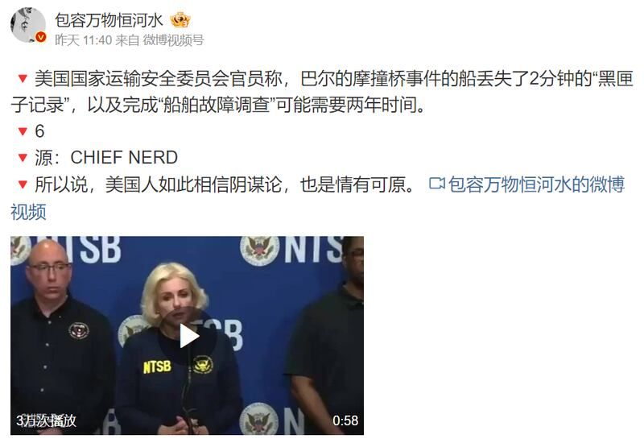
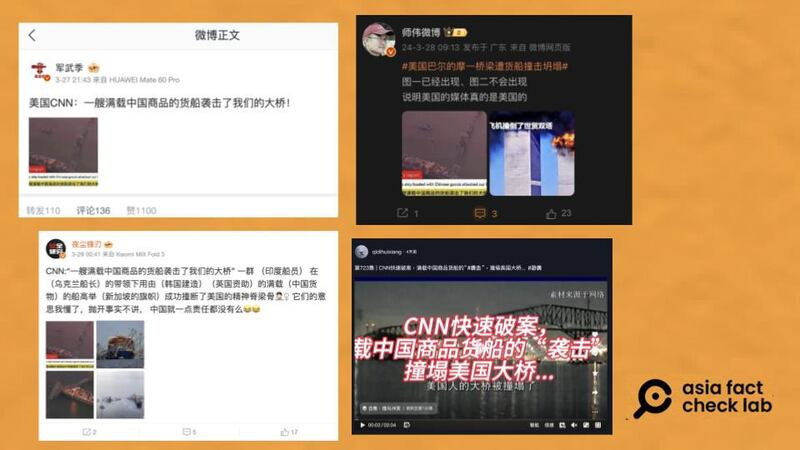
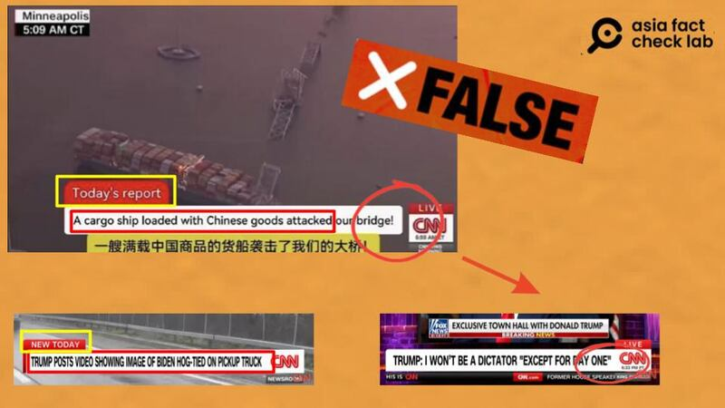
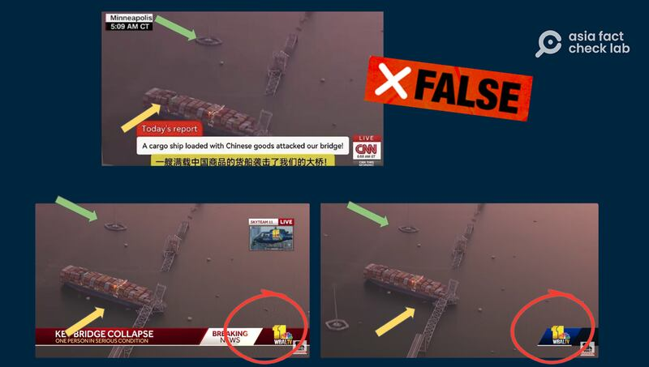
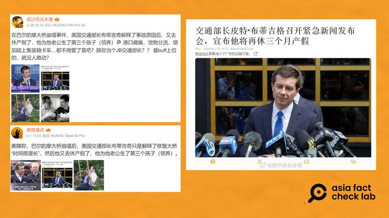

# 事實快查｜巴爾的摩撞橋事件："黑匣子"數據丟失？ CNN怪罪中國貨船？交通部長休長假？

作者：莊敬、董喆

2024.04.02 16:48 EDT

當地時間3月26日凌晨，美國馬里蘭州巴爾的摩"弗朗西斯·斯科特·基大橋"（Francis Scott Key Bridge) 被失去動力的"達利號"（Dali）貨輪撞擊橋墩後坍塌，橋上數名建築工人落水。 事故發生以來，中英文社媒平臺流傳許多與此事件相關的不實信息，亞洲事實查覈實驗室查覈了以下幾則網傳信息，另整理這段時間其他組織的查覈結果。

## 一、丟失“黑匣子”關鍵2分鐘數據？

標籤：誤導

在微博上擁有90多萬粉絲的互聯網科技博主" [包容萬物恆河水](https://m.weibo.cn/detail/5018314292332942)"4月1日發文:"美國國家運輸安全委員會官員稱,巴爾的摩撞橋事件的船丟失了2分鐘的'黑匣子'記錄 ⋯⋯"。

中國微博用戶發文，稱巴爾的摩撞橋事件的船丟失了兩分鐘的"黑匣子記錄" 。（微博截圖）

以英文關鍵字查詢,未見有主流媒體報道有黑匣子記錄丟失一事,只有 [相關報道](https://www.washingtonpost.com/video/local/ntsb-provides-preliminary-timeline-from-ships-recorder/2024/03/27/6c33d81a-2b62-45e5-8d06-7ddf0dbd3297_video.html)提及貨船的記錄器提供的數據。 以中文關鍵字查詢,則找到《大紀元》3月31日發佈的報道 [《巴爾的摩橋塌 關鍵2分鐘視頻消失》](https://www.epochtimes.com/b5/24/3/30/n14214704.htm)中受訪者、美國南卡大學艾肯商學院教授謝田說:"還有船的黑匣子也找到,黑匣子記錄航行的數據,但是有2分鐘的數據,就是撞船之前的關鍵2分鐘數據,現在是沒有找到。那這個會不會是一種故意的攻擊呢 ,這是我們不能排除的。"

經查,美國國家運輸安全委員會(NTSB) [3月27日記者會](https://edition.cnn.com/us/live-news/baltimore-key-bridge-collapse-03-27-24/h_0f42a4150bbc15e57702a4a34d2db99a)上,調查員馬賽·謬斯(Marcel Muise)說明"黑匣子"的數據。 他指出,在事發當天的半夜1點24分59秒時,航程資料記錄儀(voyage data recorder)停止記錄,到1點26分02秒恢復。 但聲音訊號則使用備源繼續記錄,沒有中斷,這段時間內音訊記錄到了操舵指令。

也就是說，雖然感測器停止1分03秒，但音訊記錄繼續作業，NTSB也有取得這段時間的數據。 所謂“丟失”“找不到”黑匣子關鍵2分鐘數據的說法，爲誤導信息。

## 二、CNN報道一艘滿載中國商品的貨船襲擊了美國大橋？

標籤：錯誤

微博軍事大V"軍武季"等帳號發文稱( [貼文1](https://archive.ph/hfb1L), [貼文2](https://archive.ph/3yPUE), [貼文3](https://archive.ph/dmepM)),"美國CNN:一艘滿載中國商品的貨船襲擊了我們的大橋",同樣的說法亦 在抖音出現,稱CNN"快速破案",是中國商品貨船撞塌美國大橋。 上述的微博貼文都附上了一張宣稱爲"CNN的新聞畫面"的截圖。

近日在微博上，有網民稱CNN報道巴爾的摩斷橋事故元兇是中國貨船。（微博截圖）

經查，這篇報道並非出自CNN。

首先，截圖中新聞字幕的標題與CNN的固定新聞畫面格式並不相符。 檢視其他CNN發佈的新聞片段，其字幕一直用全部大寫的英文字母呈現，而截圖中的字母只有每個字的字首大寫。 另外CNN的LIVE字樣是與標題連接在一起，“當日新聞”的命名應是“NEW TODAY”而非“Today’s report”。

比對網傳截圖有多處與CNN新聞畫面的格式不同（ 微博、CNN Youtube頻道截圖）

此外，這張“新聞畫面”左上角標籤顯示“Minneapolis”，即明尼蘇達州的明尼阿波利斯市。但撞橋事故發生在相隔一千多公里的馬里蘭州巴爾的摩。

進一步以圖反搜截圖的撞船畫面，我們找到了中國影音平臺bilibili有同一視角的影片，透過該影片右下角的logo，推測原始檔案出自於巴爾的摩地方新聞臺WBAL-TV，我們在WBAL-TV 的YouTube頻道找到了兩則影片，都出現了同一視角的畫面。

網傳截圖新聞畫面出自巴爾的摩地方新聞臺（微博、WBAL-TV Youtube頻道截圖）

因此根據上述線索，我們可以得知這張截圖運用了WBAL-TV的新聞畫面，併疊加造假的CNN標題。

法新社稍早也對所謂"CNN報道"進行了 [查覈](https://factcheck.afp.com/doc.afp.com.34MR9KP),他們取得CNN的回應,表示這是一張捏造的圖片,畫面並非CNN使用的橫幅、字體,也不是CNN的報道內容。

## 三、大橋坍塌後 美國運輸部長休三個月長假？

標籤：錯誤

幾位微博"大V"用戶近日 [發文](https://weibo.com/2624755655/O77Hiq8M8?refer_flag=1001030103_),稱在大橋坍塌事件後,美國交通部長(應爲運輸部長)布蒂吉格(Pete Buttigieg)"又去休產假了"。 並附上一則看起來像是新聞報道的截圖,標題寫着"交通部長皮特·布蒂吉格召開緊急新聞發佈會,宣佈他將再休三個月產假。截圖上的文章發佈日期爲 2024年3月26日,來源爲"BabylonBee.com"。

網民引用諷刺網站的文章，宣稱美國運輸部長在大橋坍塌事件後，將休三個月長假。 （微博截圖）

經查,"巴比倫蜜蜂"(The Babylon Bee) [自我介紹](https://babylonbee.com/about)爲一個諷刺笑話網站,其口號爲"可以信賴的假新聞"。 亞洲事實查覈實驗室查詢美國運輸部網站,並未看到有關部長即將休長假的公告,美國主流媒體近期也沒有相關報道。

## 更多：與塌橋事件相關的其他信息亂象

亞洲事實查覈實驗室還注意到,中英文社媒上還流傳一段視頻稱布蒂吉格借巴爾的摩大橋談種族問題,意在批評他過度政治正確。經 [路透事實查覈部門](https://www.reuters.com/fact-check/buttigieg-racist-highway-clip-shared-after-baltimore-bridge-collapse-is-2021-2024-03-28/)、 [臺灣事實查覈中心](https://tfc-taiwan.org.tw/articles/10425)等機構分析,該視頻是挪用2021年布蒂吉格在記者會針對基礎設施的發言視頻,與今年3月發生的巴爾的摩塌橋事件無關。

大橋坍塌事故後,有許多中國社媒用戶搬運源自英文社媒的不實資訊,質疑事故中船員的身份。 例如有網民宣稱"達利號"的船長來自烏克蘭,並附上一個海事工作資料庫網站"BalticShipping.com"的截圖爲證。 美聯社已經發布 [查覈報告](https://apnews.com/article/fact-check-dali-captain-ukrainian-baltimore-bridge-601539523278)指出,資料顯示該烏克蘭籍船長只是在2016年短暫擔任過"達利號"的船長,任期約五個月。而根據航運公司Synergy所述,事發時"達利 號"上有22名印度籍船員,2名美國籍引水人。

另有中國網民轉發X平臺(原推特)帳號" [Foxford Comics](https://twitter.com/FoxfordComics/status/1772715802766008692)"發佈的一則短視頻,聲稱這是撞橋時船內的錄像和錄音。 但這則短視頻搭配的畫面爲諷刺漫畫,音訊則是幾位男子以印度口音罵髒話,內容並不符合相關單位所述撞船前的 [情況](https://apnews.com/article/baltimore-key-bridge-collapse-03-27-2024-6a95340e5daeff6551fc999d23feb278)。 據 [報道](https://timesofindia.indiatimes.com/world/us/baltimore-bridge-collapse-dali-indian-crew-racist-cartoon-biden/articleshow/108893713.cms),這則種族主義漫畫已引起關注,並遭到譴責。

*亞洲事實查覈實驗室（Asia Fact Check Lab）針對當今複雜媒體環境以及新興傳播生態而成立。我們本於新聞專業主義，提供專業查覈報告及與信息環境相關的傳播觀察、深度報道，幫助讀者對公共議題獲得多元而全面的認識。讀者若對任何媒體及社交軟件傳播的信息有疑問，歡迎以電郵afcl@rfa.org寄給亞洲事實查覈實驗室，由我們爲您查證覈實。*

*亞洲事實查覈實驗室在X、臉書、IG開張了,歡迎讀者追蹤、分享、轉發。X這邊請進:中文*  [*@asiafactcheckcn*](https://twitter.com/asiafactcheckcn)  *;英文:*  [*@AFCL\_eng*](https://twitter.com/AFCL_eng)  *、*  [*FB在這裏*](https://www.facebook.com/asiafactchecklabcn)  *、*  [*IG也別忘了*](https://www.instagram.com/asiafactchecklab/)  *。*

[Original Source](https://www.rfa.org/mandarin/shishi-hecha/hc-04022024163827.html)